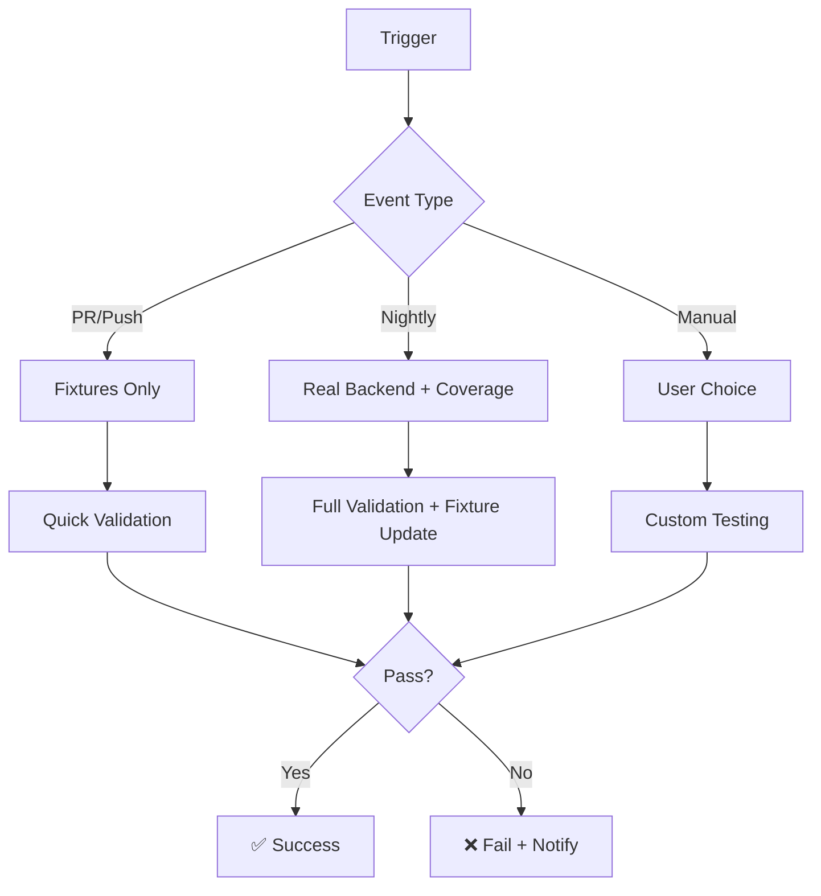

# Integration Tests – Backend & Fixtures

Este documento explica cómo ejecutar y mantener los tests de integración backend en Roastr.AI, tanto en modo real (staging) como en modo fixtures offline.

## 📋 Tabla de Contenidos

1. [Overview](#overview)
2. [Entornos Soportados](#entornos-soportados)
3. [Configuración de Variables de Entorno](#configuración-de-variables-de-entorno)
4. [Comandos Disponibles](#comandos-disponibles)
5. [Fallback Inteligente](#fallback-inteligente)
6. [CI/CD](#cicd)
7. [Mantenimiento de Fixtures](#mantenimiento-de-fixtures)
8. [Estructura de Archivos](#estructura-de-archivos)
9. [Troubleshooting](#troubleshooting)
10. [Contacto](#contacto)

## 1. Overview

Los tests de integración backend validan la funcionalidad completa del **Social Networks Panel** y otros módulos críticos conectándose directamente con el backend de staging o usando fixtures offline para pruebas rápidas y reproducibles.

### Características Principales

- ✅ **Dual compatibility**: Modo backend real vs fixtures offline
- 🔄 **Fallback inteligente**: Cambio automático a fixtures si el backend falla
- 🏗️ **CI/CD integrado**: Ejecución automática en PRs (fixtures) y nightly (real backend)
- 📊 **Cobertura de código**: Reportes detallados de coverage
- 🛡️ **Validación de schemas**: Verificación de contratos de API
- 💾 **Auto-actualización**: Fixtures se pueden regenerar desde staging

## 2. Entornos Soportados

### Backend Real (Staging)
- **Propósito**: Valida integraciones con APIs reales del backend de staging
- **Ventajas**: Prueba el flujo completo, detecta cambios de API
- **Desventajas**: Más lento, requiere conectividad, puede ser inestable
- **Uso**: Ideal para tests nightly y validación pre-deploy

### Fixtures Offline  
- **Propósito**: Usa datos guardados para pruebas rápidas y reproducibles
- **Ventajas**: Rápido, determinístico, sin dependencias externas
- **Desventajas**: Puede desactualizarse, no detecta cambios de API reales
- **Uso**: Ideal para PRs, desarrollo local y CI rápido

## 3. Configuración de Variables de Entorno

### Crear .env.test.real

```bash
# URL base del backend de staging
API_BASE_URL=https://staging.roastr.ai/api

# Supabase (staging)
SUPABASE_URL=https://staging-roastr.supabase.co
SUPABASE_ANON_KEY=eyJhbGciOiJIUzI1NiIsInR5cCI...
SUPABASE_SERVICE_ROLE_KEY=eyJhbGciOiJIUzI1NiIsInR5cCI... # Solo para tests backend

# Auth de pruebas
TEST_USER_EMAIL=testuser@roastr-staging.example.com
TEST_USER_PASSWORD=TestPassword123!

# Configuración de mock mode
ENABLE_MOCK_MODE=false
USE_BACKEND_FIXTURES=false
FALLBACK_TO_FIXTURES_ON_ERROR=true
```

### Variables de Configuración Adicionales

```bash
# Test configuration
TEST_TIMEOUT=30000
TEST_RETRY_ATTEMPTS=3
INTEGRATION_TEST_DEBUG=true

# Fallback configuration  
FALLBACK_TIMEOUT=5000
AUTO_UPDATE_FIXTURES=false

# CI/CD configuration
CI_INTEGRATION_MODE=staging
CI_SKIP_SLOW_TESTS=false
```

### ⚠️ Seguridad

- **Nunca expongas `SERVICE_ROLE_KEY` en frontend** - Solo se usa en tests backend
- Usa credenciales de staging/test, nunca de producción
- Las API keys deben ser de sandbox cuando estén disponibles

## 4. Comandos Disponibles

### Tests de Integración

```bash
# Ejecutar contra backend real (staging)
npm run test:integration-backend

# Ejecutar contra fixtures offline  
npm run test:integration-backend:fixtures

# Ejecutar con cobertura
npm run test:integration-backend:coverage

# Modo watch para desarrollo
npm run test:integration-backend:watch

# CI mode (automático en GitHub Actions)
npm run test:integration-backend:ci
```

### Gestión de Fixtures

```bash
# Regenerar todos los fixtures desde staging
npm run fixtures:update:all

# Validar integridad de fixtures
npm run fixtures:validate

# Ver ayuda de actualización de fixtures
node tests/integration/backend/utils/update-backend-fixtures.js --help

# Dry run (ver qué se actualizaría sin cambios)
node tests/integration/backend/utils/update-backend-fixtures.js --dry-run
```

### Ejemplos de Uso

```bash
# Desarrollo local - usar fixtures para velocidad
npm run test:integration-backend:fixtures

# Pre-deploy - validar contra staging real
npm run test:integration-backend

# Verificar cobertura antes de PR
npm run test:integration-backend:coverage

# Regenerar fixtures después de cambios en staging
npm run fixtures:update:all
```

## 5. Fallback Inteligente

El sistema implementa un mecanismo de fallback inteligente que garantiza que los tests siempre puedan ejecutarse:

### Flujo de Fallback

1. **Intento Inicial**: Conectar con el backend real (si está configurado)
2. **Health Check**: Verificar `/api/health` con timeout de 5s
3. **Fallback Automático**: Si falla, cambiar a fixtures automáticamente  
4. **Último Recurso**: Si fixtures fallan, intentar fixture de emergencia

### Configuración del Fallback

```bash
# Habilitar/deshabilitar fallback (default: habilitado)
FALLBACK_TO_FIXTURES_ON_ERROR=true

# Timeout para health check (default: 5000ms)  
FALLBACK_TIMEOUT=5000

# Debug de fallback
INTEGRATION_TEST_DEBUG=true
```

### Logs de Fallback

```
🔍 Checking backend health at https://staging.roastr.ai/api/health...
⚠️  Backend not accessible: Health check timeout after 5000ms  
🔄 Fallback enabled - switching to fixture mode
📁 Loaded fixture: accounts.json
```

## 6. CI/CD

### GitHub Actions Workflow

El workflow `integration-tests.yml` ejecuta tests de integración con diferentes estrategias según el contexto:

#### PRs y Pushes Regulares
- **Modo**: Solo fixtures  
- **Velocidad**: Rápido (~2-5 minutos)
- **Propósito**: Validar cambios no rompen funcionalidad básica

#### Nightly (Diario 2:00 AM UTC)
- **Modo**: Backend real + fixtures
- **Cobertura**: Habilitada
- **Propósito**: Validar staging backend, actualizar fixtures

#### Manual (workflow_dispatch)
- **Modo**: Configurable (fixtures/real/both)
- **Cobertura**: Opcional
- **Propósito**: Testing ad-hoc, troubleshooting

### Configuración de Secrets

En GitHub, configura estos secrets para tests contra backend real:

```
STAGING_API_BASE_URL=https://staging.roastr.ai/api
STAGING_SUPABASE_URL=https://...
STAGING_SUPABASE_ANON_KEY=eyJ...
STAGING_SUPABASE_SERVICE_ROLE_KEY=eyJ...  
STAGING_TEST_USER_EMAIL=testuser@...
STAGING_TEST_USER_PASSWORD=TestPassword123!
```

### Umbrales de Cobertura

Los tests fallan si la cobertura baja de:
- **Branches**: 70%
- **Functions**: 75%
- **Lines**: 75%
- **Statements**: 75%

### Estrategia de CI



## 7. Mantenimiento de Fixtures

### Ubicación y Estructura

```
tests/integration/backend/fixtures/
├── accounts.json          # Cuentas de redes sociales
├── roasts.json           # Lista de roasts generados
├── settings.json         # Configuraciones de redes sociales  
├── shield.json           # Elementos interceptados por Shield
├── update-summary.json   # Reporte de última actualización
└── validation-report.json # Reporte de validación
```

### Formato de Fixtures

Todos los fixtures incluyen metadata para trazabilidad:

```json
{
  "success": true,
  "data": {
    "accounts": [...],
    "networks": [...]
  },
  "timestamp": "2024-01-15T10:30:00Z",
  "_fixtureMetadata": {
    "generatedAt": "2024-01-15T10:30:00Z",
    "source": "staging_backend", 
    "apiBaseUrl": "https://staging.roastr.ai/api",
    "version": "1.0.0",
    "checksum": "a1b2c3d4"
  }
}
```

### Regeneración de Fixtures

#### Manual
```bash
# Regenerar todos
npm run fixtures:update:all

# Ver qué se actualizaría  
npm run fixtures:update:all -- --dry-run
```

#### Automática (Nightly CI)
- Se ejecuta diariamente a las 2 AM UTC
- Actualiza fixtures desde staging backend
- Commit automático con `[skip ci]` (opcional)

### Validación de Fixtures

```bash
# Validar integridad
npm run fixtures:validate

# Checks incluidos:
# ✅ Formato JSON válido
# ✅ Schema compliance  
# ✅ Integridad de checksum
# ✅ Freshness (< 30 días)
# ✅ Calidad de datos
```

### Versionado de Fixtures

Los fixtures incluyen checksums para detectar cambios:

```bash
# El checksum se actualiza automáticamente
# Si el checksum no coincide, indica corrupción de datos
❌ accounts.json: Checksum mismatch - data may be corrupted
   Details: Expected a1b2c3d4, got e5f6g7h8
```

## 8. Estructura de Archivos

```
tests/integration/backend/
├── fixtures/                    # Datos fixtures
│   ├── accounts.json
│   ├── roasts.json  
│   ├── settings.json
│   └── shield.json
├── setup/                       # Configuración de tests
│   ├── envSetup.js             # Variables de entorno
│   ├── integrationSetup.js     # Setup global de Jest
│   ├── globalSetup.js          # Setup inicial
│   └── globalTeardown.js       # Cleanup final  
├── social/                      # Tests del Social Panel
│   ├── auth-and-loading.test.js
│   ├── roasts.test.js
│   ├── settings.test.js
│   └── shield.test.js
├── utils/                       # Utilidades
│   ├── backendTestUtils.js     # Funciones helper principales
│   ├── update-backend-fixtures.js  # Script actualización  
│   └── validate-fixtures.js    # Script validación
├── reports/                     # Reportes generados (gitignored)
├── temp/                        # Archivos temporales (gitignored)
└── jest.config.js              # Configuración Jest específica
```

### Archivos de Configuración

- **`.env.test.real`**: Credenciales staging backend
- **`jest.config.js`**: Configuración Jest para integration tests
- **`package.json`**: Scripts npm para ejecutar tests

## 9. Troubleshooting

### Problemas Comunes

#### ❌ "Backend not accessible" 
```
⚠️  Backend not accessible: Health check timeout after 5000ms
```

**Solución**:
1. Verificar que `API_BASE_URL` esté correcto en `.env.test.real`
2. Comprobar conectividad: `curl https://staging.roastr.ai/api/health`
3. Usar fixtures mientras se resuelve: `npm run test:integration-backend:fixtures`

#### ❌ "Authentication failed"
```  
❌ Authentication failed: 401 Unauthorized
```

**Solución**:
1. Verificar `TEST_USER_EMAIL` y `TEST_USER_PASSWORD`
2. Confirmar que el usuario existe en staging  
3. Revisar logs del backend de staging

#### ❌ "Fixture not found"
```
⚠️  Failed to load fixture accounts.json: ENOENT
```

**Solución**:
1. Regenerar fixtures: `npm run fixtures:update:all`
2. O usar fixtures mínimos de CI (ver workflow)

#### ❌ "Checksum mismatch"
```
❌ accounts.json: Checksum validation failed
```

**Solución**:
1. Regenerar fixture corrupto: `npm run fixtures:update:all`
2. O eliminar el archivo y regenerar

#### ❌ "Schema validation failed"
```
❌ settings.json: Schema issue: Missing data field: availableOptions  
```

**Solución**:
1. Actualizar fixture: `npm run fixtures:update:all`
2. O actualizar schema en `validateResponseSchema()`

### Debugging

#### Logs Detallados
```bash
# Habilitar logs detallados
INTEGRATION_TEST_DEBUG=true npm run test:integration-backend:fixtures
```

#### Inspeccionar Fixtures
```bash
# Validar fixtures
npm run fixtures:validate

# Ver metadata de fixture
node -e "console.log(JSON.parse(require('fs').readFileSync('tests/integration/backend/fixtures/accounts.json'))._fixtureMetadata)"
```

#### Test Individual
```bash
# Ejecutar solo un test específico
npx jest --config=tests/integration/backend/jest.config.js --testPathPattern=auth-and-loading
```

### Logs de Ejemplo

#### Ejecución Exitosa (Fixtures)
```
🔧 Setting up backend integration tests
📁 Use Backend Fixtures: true  
🎭 Mock Mode: false
📁 Loaded fixture: accounts.json
📁 Loaded fixture: roasts.json
✅ Backend Integration Tests completed successfully
```

#### Ejecución Exitosa (Real Backend)  
```
🔧 Setting up backend integration tests
📡 API URL: https://staging.roastr.ai/api
🔍 Checking backend health at https://staging.roastr.ai/api/health...
✅ Backend is accessible at https://staging.roastr.ai/api
🔑 Authenticated test user: testuser@roastr-staging.example.com
📡 Fetched real data for: accounts.json
✅ Backend Integration Tests completed successfully
```

#### Ejecución con Fallback
```
🔧 Setting up backend integration tests  
📡 API URL: https://staging.roastr.ai/api
🔍 Checking backend health at https://staging.roastr.ai/api/health...
⚠️  Backend not accessible: Health check timeout after 5000ms
🔄 Fallback enabled - switching to fixture mode  
📁 Loaded fixture: accounts.json
✅ Backend Integration Tests completed successfully
```

## 10. Contacto

### En caso de fallos persistentes

1. **Revisar logs completos** de la ejecución en GitHub Actions
2. **Verificar estado del backend** de staging
3. **Notificar al equipo backend** con el log completo si es un problema de staging
4. **Crear issue** en GitHub si es un problema de configuración de tests

### Información Útil para Reports

Al reportar problemas, incluir:
- ✅ Comando ejecutado
- ✅ Logs completos (con `INTEGRATION_TEST_DEBUG=true`)
- ✅ Variables de entorno (sin credenciales)  
- ✅ Versión de Node.js y npm
- ✅ Estado del backend de staging (si aplica)

### Links Útiles

- **Staging Backend**: https://staging.roastr.ai/api
- **GitHub Actions**: [.github/workflows/integration-tests.yml](.github/workflows/integration-tests.yml)
- **Tests Source**: [tests/integration/backend/](tests/integration/backend/)
- **CLAUDE.md**: [Documentación principal](CLAUDE.md)

---

## ✅ Verificación Final

Para confirmar que todo está funcionando correctamente:

```bash
# 1. Validar fixtures  
npm run fixtures:validate

# 2. Ejecutar tests con fixtures
npm run test:integration-backend:fixtures  

# 3. (Opcional) Ejecutar contra backend real
npm run test:integration-backend

# 4. Verificar cobertura
npm run test:integration-backend:coverage
```

Si todos los comandos anteriores pasan sin errores, ¡el sistema está correctamente configurado! 🎉

---

*Documentación actualizada: $(date +"%Y-%m-%d")*