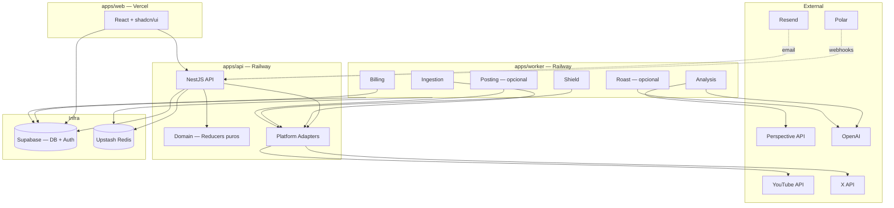
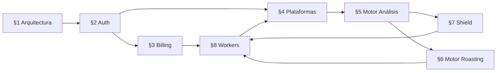

# 1. Arquitectura General del Sistema (v3)

*(Versión actualizada para Shield-first, NestJS, BullMQ)*

La arquitectura de Roastr v3 está diseñada para ser **modular, limpia, segura y escalable**:

- Backend hexagonal con NestJS
- Frontend modular con React
- Workers asíncronos con BullMQ + Redis
- Supabase como capa de persistencia y auth
- Polar como único sistema de billing
- Resend para email transaccional
- SSOT como fuente única de configuración

---

## 1.1 Estructura del proyecto

Roastr v3 es un **monorepo** con tres paquetes:

```
roastr-ai/
├── apps/
│   ├── api/                    # Backend NestJS
│   ├── web/                    # Frontend React
│   └── worker/                 # Worker process (BullMQ)
├── packages/
│   └── shared/                 # Tipos, contratos, schemas
├── docs/                       # Especificaciones (esta documentación)
├── supabase/
│   └── migrations/             # SQL migrations
├── docker-compose.yml
├── turbo.json                  # Monorepo tooling (Turborepo)
└── PRODUCT.md
```

---

## 1.2 Backend — `apps/api`

NestJS con arquitectura hexagonal estricta:

```
apps/api/src/
├── modules/
│   ├── auth/                   # Guards, strategies, decorators
│   ├── ingestion/              # FetchComments service + controller
│   ├── analysis/               # Motor de Análisis (§5)
│   ├── shield/                 # Shield service (§7)
│   ├── roast/                  # Motor de Roasting — opcional (§6)
│   ├── posting/                # SocialPosting — opcional
│   ├── billing/                # Polar webhooks + usage tracking (§3)
│   ├── accounts/               # Gestión de cuentas sociales (§4)
│   ├── persona/                # Roastr Persona CRUD
│   └── health/                 # Health checks
├── platforms/
│   ├── platform.port.ts        # Interfaz común (§4.1)
│   ├── youtube/                # YouTube adapter
│   └── x/                      # X adapter
├── domain/
│   ├── analysis-reducer.ts     # Reducer puro (§5.C.8)
│   ├── persona-matcher.ts      # Match de keywords
│   ├── threshold-router.ts     # Routing por umbrales
│   └── billing-reducer.ts      # State machine de billing (§3.5)
├── shared/
│   ├── config/                 # SSOT loader, env validation
│   ├── logging/                # Structured JSON logger
│   ├── queue/                  # BullMQ config y producers
│   └── guards/                 # Supabase JWT guard, Roles guard
└── main.ts
```

### Reglas hexagonales

**Dominio (`domain/`):**

- Reducers puros, sin IO, sin HTTP, sin DB
- Solo reciben datos pre-procesados y devuelven decisiones
- 100% testeable con unit tests

**Modules (`modules/`):**

- Cada módulo encapsula un bounded context
- Controllers manejan HTTP (validación + serialización)
- Services coordinan lógica (cargar datos → ejecutar dominio → persistir)
- Processors manejan jobs de BullMQ

**Platforms (`platforms/`):**

- Cada plataforma implementa `PlatformAdapter` (§4.1)
- El dominio nunca conoce detalles de plataforma, solo interfaces

**Prohibiciones en el dominio:**

- No llamadas HTTP
- No acceso directo a DB
- No lógica de NestJS (decorators, DI)
- No lógica de workers
- No imports de adaptadores externos

---

## 1.3 Frontend — `apps/web`

React 19 + Vite + TypeScript estricto:

```
apps/web/src/
├── components/
│   ├── ui/                     # shadcn/ui primitives
│   ├── auth/                   # Login, Register, Onboarding
│   ├── dashboard/              # Widgets, stats
│   ├── accounts/               # Conexión de redes sociales
│   ├── shield/                 # Shield feed, logs
│   ├── roast/                  # Roast review (si módulo activo)
│   ├── persona/                # Configuración de Persona
│   ├── billing/                # Plan, upgrade, usage
│   └── settings/               # Preferencias de usuario
├── hooks/                      # React Query hooks, auth hooks
├── lib/
│   ├── api.ts                  # API client (fetch wrapper)
│   ├── supabase-client.ts      # Supabase init
│   └── utils.ts
├── routes/                     # React Router config
├── types/                      # Frontend-specific types
└── index.css                   # Tailwind + theme variables
```

### Stack frontend

- **React 19** + TypeScript estricto
- **Vite** como bundler
- **shadcn/ui** + Tailwind CSS para UI
- **React Query (TanStack Query)** para data fetching y cache
- **React Router** para navegación
- **next-themes** para tema claro/oscuro/sistema
- Totalmente responsive (mobile-first)

### Capas

| Capa | Ubicación | Responsabilidad |
|---|---|---|
| UI | `components/` | Presentación pura, shadcn/ui |
| Application | `hooks/`, `routes/` | React Query, navegación, estado |
| Infrastructure | `lib/` | API client, Supabase, error handling |
| Domain | `types/` | Tipos, validaciones puras |

El frontend consume:

- API del backend (NestJS) para todo el negocio
- Supabase Auth directamente para login/signup

---

## 1.4 Shared — `packages/shared`

```
packages/shared/src/
├── types/
│   ├── analysis.ts             # AnalysisResult, NormalizedComment, etc.
│   ├── shield.ts               # ShieldLog, ShieldActionJob, etc.
│   ├── billing.ts              # BillingState, Plan, etc.
│   ├── accounts.ts             # Account, PlatformCapabilities, etc.
│   └── persona.ts              # PersonaProfile, etc.
├── schemas/
│   └── validation.ts           # Zod schemas compartidos
└── constants/
    └── plans.ts                # Límites por plan (mirror de SSOT)
```

Reglas:

- Solo tipos, schemas y constantes
- Zero lógica de negocio
- Zero IO
- Importable por `api`, `web` y `worker`

---

## 1.5 Workers — `apps/worker`

Proceso separado que ejecuta los processors de BullMQ:

```
apps/worker/src/
├── processors/
│   ├── ingestion.processor.ts
│   ├── analysis.processor.ts
│   ├── shield.processor.ts
│   ├── roast.processor.ts      # opcional
│   ├── corrective.processor.ts # opcional
│   ├── posting.processor.ts    # opcional
│   ├── billing.processor.ts
│   └── maintenance.processor.ts
├── shared/                     # Reutiliza config de apps/api
└── main.ts                     # Inicia todos los processors
```

Ver §8 para detalle completo de cada worker.

Características:

- Cada processor = un caso de uso
- Idempotentes
- Retries con backoff exponencial
- DLQ sin datos sensibles (GDPR)
- Tenant-aware (userId + accountId siempre)
- Configuración desde SSOT

---

## 1.6 Supabase

Roastr usa Supabase para:

| Funcionalidad | Uso |
|---|---|
| **Auth** | Signup, login, JWT, refresh tokens, magic links |
| **Database** | PostgreSQL con RLS para multi-tenancy |
| **Realtime** | Futuro: notificaciones in-app (Phase 2) |
| **Storage** | No usado en MVP |

### Tablas principales

| Tabla | Sección |
|---|---|
| `profiles` | §2 — Perfil, rol, onboarding, persona |
| `accounts` | §4 — Cuentas de redes sociales conectadas |
| `subscriptions_usage` | §3 — Billing state, límites, uso |
| `shield_logs` | §7 — Logs de acciones del Shield |
| `offenders` | §5 — Strike history por ofensor |
| `roast_candidates` | §6 — Roasts generados (si módulo activo) |
| `feature_flags` | §11 — Feature flags del sistema |
| `admin_settings` | §1.10 — SSOT key-value store |

Todas las tablas tienen **RLS activado**. Los usuarios solo acceden a sus propios datos.

---

## 1.7 Integraciones MVP

| Servicio | Uso | Sección |
|---|---|---|
| **YouTube** | OAuth2, comentarios, hide/report/block/reply | §4 |
| **X (Twitter)** | OAuth2 PKCE, menciones, hide/block, reply (Enterprise) | §4 |
| **Polar** | Billing: checkout, suscripciones, webhooks | §3 |
| **Perspective API** | Análisis de toxicidad (capa principal, gratis) | §5 |
| **OpenAI (GPT-4o-mini)** | Fallback de toxicidad + generación de roasts | §5, §6 |
| **Resend** | Email transaccional (confirmación, alertas) | — |
| **Upstash Redis** | BullMQ queues en producción | §8 |

---

## 1.8 Infraestructura de deploy

| Componente | Plataforma | Notas |
|---|---|---|
| Frontend (`apps/web`) | **Vercel** | Auto-deploy desde main. Preview en PRs. |
| Backend (`apps/api`) | **Railway** | Dockerfile. Auto-deploy. |
| Workers (`apps/worker`) | **Railway** | Mismo proyecto, servicio separado. |
| Redis | **Upstash** | Serverless Redis para BullMQ. |
| Database + Auth | **Supabase** | Managed PostgreSQL + Auth. |
| Billing | **Polar** | SaaS externo. |
| Email | **Resend** | SaaS externo. |

### Environments

| Environment | Frontend | Backend | Branch |
|---|---|---|---|
| Production | `roastr.ai` | Railway production | `main` |
| Staging | `staging.roastr.ai` | Railway staging | `staging` |
| Local | `localhost:5173` | `localhost:3000` | cualquiera |

---

## 1.9 SSOT (Single Source of Truth)

Todos los valores críticos del sistema se leen desde una única fuente de verdad, nunca hardcoded:

### Valores gestionados por SSOT

| Categoría | Valores | Sección |
|---|---|---|
| Planes | Límites (análisis, roasts, cuentas), precios, trials | §3 |
| Shield | Thresholds (τ_low, τ_shield, τ_critical), aggressiveness default | §7 |
| Análisis | Pesos Persona, factores reincidencia, N_DENSIDAD | §5 |
| Roasting | Tonos, modelos LLM, prompts, límites de longitud | §6 |
| Ingestión | Cadencias por plan | §4 |
| Feature flags | Todas las flags | §11 |
| Legal | Disclaimers IA, retention policies GDPR | §12 |

### Storage

```sql
CREATE TABLE admin_settings (
  key         TEXT PRIMARY KEY,
  value       JSONB NOT NULL,
  updated_by  UUID REFERENCES auth.users(id),
  updated_at  TIMESTAMPTZ NOT NULL DEFAULT now()
);

-- Solo admins/superadmins pueden modificar
ALTER TABLE admin_settings ENABLE ROW LEVEL SECURITY;
CREATE POLICY settings_admin_read ON admin_settings
  FOR SELECT USING (true);  -- Readable by all (backend reads via service role)
CREATE POLICY settings_admin_write ON admin_settings
  FOR ALL USING (
    EXISTS (SELECT 1 FROM profiles WHERE id = auth.uid() AND role IN ('admin', 'superadmin'))
  );
```

### Acceso

- Backend lee SSOT via service role (sin RLS restriction para reads)
- Workers cachean SSOT con TTL de 5 minutos
- Admin Panel (Phase 2) permite editar SSOT sin PRs ni deploys
- Hasta tener Admin Panel: editar directamente en Supabase Dashboard

---

## 1.10 Decisiones arquitectónicas

| Decisión | Justificación |
|---|---|
| NestJS (no Express puro) | Módulos, DI, guards, decorators. Estructura para escalar. |
| Hexagonal estricta | Dominio testeable, adaptadores intercambiables. |
| BullMQ + Redis (no cron jobs) | Jobs fiables, retries, DLQ, concurrencia controlada. |
| Supabase (no Postgres propio) | Auth integrado, RLS, managed, dashboard gratis. |
| Polar (no Stripe) | Más simple para SaaS, mejor DX, sin overhead de Stripe. |
| Monorepo con Turborepo | Shared types, builds incrementales, un solo repo. |
| No plan Free | Cada usuario cuesta dinero (API calls, análisis). Sin free-riders. |
| No Admin Panel en MVP | Gestión via Supabase Dashboard. Admin Panel es Phase 2. |
| Shield-first | Shield funciona sin Roasts. Roasting es módulo opcional. |
| Solo YouTube + X en MVP | Meta platforms requieren entidad legal. Bluesky/Twitch en Phase 2. |

---

## 1.11 Diagrama de arquitectura



---

## 1.12 Dependencias entre secciones



| Sección | Depende de |
|---|---|
| §2 Auth | §1 |
| §3 Billing | §2 |
| §4 Plataformas | §2, §3 |
| §5 Motor Análisis | §4 |
| §6 Motor Roasting | §5 (opcional) |
| §7 Shield | §5, §4 |
| §8 Workers | §3, §4, §5, §7 |
