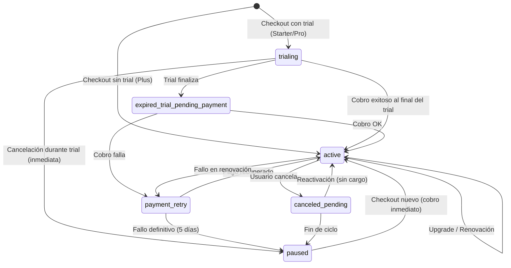

# 3. Sistema de Billing (Polar) — v3

*(Versión actualizada para arquitectura Shield-first)*

Roastr v3 usa **Polar** como única plataforma de billing: checkout, cobros, renovación, trials, cancelaciones y webhooks.

No hay Stripe. No hay plan Free. Todos los ingresos y estados vienen exclusivamente de Polar.

---

## 3.1 Planes

### Starter — €5/mes

- **Trial:** 30 días
- **Límites / mes:**
  - 1.000 análisis
  - 5 roasts (si módulo activo)
  - 1 cuenta por plataforma (YouTube + X = 2 max)
- **Incluye:** Shield completo, tonos estándar, Roastr Persona
- **No incluye:** tono personal, sponsors

### Pro — €15/mes

- **Trial:** 7 días
- **Límites / mes:**
  - 10.000 análisis
  - 1.000 roasts (si módulo activo)
  - 2 cuentas por plataforma (YouTube + X = 4 max)
- **Incluye:** Shield completo, tono personal, multi-cuenta, Roastr Persona
- **No incluye:** sponsors

### Plus — €50/mes

- **Sin trial** (pago inmediato)
- **Límites / mes:**
  - 100.000 análisis
  - 5.000 roasts (si módulo activo)
  - 2 cuentas por plataforma (YouTube + X = 4 max)
- **Incluye:** todo Pro + Sponsors (Phase 2) + prioridad en colas

> **Shield-first:** Todos los planes incluyen Shield completo. Los roasts son una feature adicional. Si el módulo de Roasting no está activo, los créditos de roast no se consumen.

---

## 3.2 Trial

### Trial por plan

| Plan | Trial | Duración |
|---|---|---|
| Starter | Sí | 30 días |
| Pro | Sí | 7 días |
| Plus | No | — |

### Inicio del trial

1. El usuario elige plan durante onboarding.
2. Se exige **método de pago válido** (checkout Polar).
3. Trial comienza inmediatamente.
4. Se crea suscripción en estado `trialing`.
5. Límites del plan activos desde el minuto 0.

### Cancelación del trial

> **Si cancela durante el trial → el trial se corta de inmediato.**

- El usuario pierde acceso al instante.
- La cuenta pasa a `paused`.
- No se cobra nada.
- Workers se detienen.

### Fin del trial

- Cobro OK → `active`
- Cobro falla → período de recobro (5 días) → si no se resuelve → `paused`

---

## 3.3 Checkout y cambios de plan

### Checkout inicial

1. Polar genera URL de checkout.
2. Tras pago/validación de método:
   - Si tiene trial → estado `trialing`
   - Si es Plus → estado `active` inmediatamente

### Upgrade

**Starter → Pro:**

- Si está en trial Starter → sale del trial, pasa a `active` Pro con cobro inmediato.
- Si está activo → upgrade inmediato. Polar gestiona prorrateo.
- Límites actualizados al momento.

**Pro → Plus:**

- Sin trial.
- Pago inmediato.
- Límites de Plus activados al instante.

### Downgrade

- En trial → inmediato (nuevos límites aplican ya).
- En active → programado para siguiente ciclo (`current_period_end`).
- Sponsors se desactivan si baja desde Plus (Phase 2).

---

## 3.4 Cancelación

### Durante trial

- Cancelación inmediata.
- Sin servicio desde el instante.
- Estado → `paused`.
- No se cobra.

### Durante ciclo pagado

**Mientras el ciclo está activo:**

El usuario mantiene servicio hasta `current_period_end`:

- Shield sigue
- Roasts siguen (si módulo activo)
- Ingestión sigue
- Workers siguen
- Límites siguen aplicando

La suscripción queda como `canceled_pending`.

**Al llegar `current_period_end`:**

- Suscripción → `paused`
- Todo Roastr desactivado: Shield OFF, Roasts OFF, ingestión OFF, workers OFF

### Reactivación

**Caso A — Antes del fin de ciclo:**

- No se cobra.
- El ciclo continúa.
- Límites NO se reinician.
- Estado vuelve a `active`.

**Caso B — Después del fin de ciclo:**

- Checkout nuevo.
- Cobro inmediato.
- Nuevo ciclo con límites reseteados.
- Estado → `active`.

---

## 3.5 State Machine de Suscripciones

Máquina de estados determinista que modela la evolución de una suscripción:

### Estados

#### trialing

Trial activo. Acceso completo al plan. Upgrades posibles sin nuevo trial.

#### expired_trial_pending_payment

Trial finalizado, esperando primer cobro de Polar.
- Cobro OK → `active`
- Cobro fallido → `payment_retry`

#### payment_retry

Período de recobro (hasta 5 días, gestionado por Polar).
- Usuario mantiene acceso normal.
- Banners de "Actualiza método de pago".
- Pago recuperado → `active`
- Fallo definitivo → `paused`

#### active

Suscripción activa y pagada. Todo funcional.
- Cancelación → `canceled_pending`
- Fallo en renovación → `payment_retry`
- Upgrade → `active` (nuevos límites)

#### canceled_pending

Usuario canceló pero pagó el mes actual. Servicio activo hasta `current_period_end`.
- Reactivación antes de fin de ciclo → `active` (sin cargo)
- Fin de ciclo → `paused`

#### paused

Sin servicio. Todo OFF. Panel accesible para reactivar.
- Checkout nuevo → `active` (cobro inmediato + nuevo ciclo)

### Diagrama



---

## 3.6 Webhooks (Polar)

Todos los webhooks son **idempotentes**. El backend los procesa via un reducer de estado:

```typescript
function billingReducer(
  currentState: BillingState,
  event: PolarWebhookEvent
): BillingState
```

### Mapeo de webhooks

| Polar Webhook | Transición |
|---|---|
| `subscription_created` | → `trialing` o → `active` (según plan) |
| `subscription_active` | → `active` |
| `subscription_canceled` | → `canceled_pending` |
| `invoice_payment_failed` | → `payment_retry` |
| `invoice_payment_succeeded` | → `active` + reset de límites |
| `subscription_updated` | Upgrade/downgrade aplicado |

### Webhook handler (NestJS)

```typescript
@Controller('webhooks')
export class PolarWebhookController {
  @Post('polar')
  async handleWebhook(@Body() body: PolarWebhookPayload, @Headers() headers) {
    // 1. Verificar firma del webhook
    // 2. Extraer evento y datos
    // 3. Ejecutar billingReducer(currentState, event)
    // 4. Persistir nuevo estado
    // 5. Emitir eventos internos (account pause, worker stop, etc.)
  }
}
```

---

## 3.7 Créditos y límites

### Tabla de uso

```sql
CREATE TABLE subscriptions_usage (
  id                UUID PRIMARY KEY DEFAULT gen_random_uuid(),
  user_id           UUID NOT NULL REFERENCES auth.users(id),
  plan              TEXT NOT NULL CHECK (plan IN ('starter', 'pro', 'plus')),
  billing_state     TEXT NOT NULL DEFAULT 'trialing'
                    CHECK (billing_state IN (
                      'trialing', 'expired_trial_pending_payment',
                      'payment_retry', 'active', 'canceled_pending', 'paused'
                    )),

  -- Límites del plan (copiados al crear/cambiar suscripción)
  analysis_limit    INTEGER NOT NULL,
  roasts_limit      INTEGER NOT NULL,

  -- Uso del ciclo actual
  analysis_used     INTEGER NOT NULL DEFAULT 0,
  roasts_used       INTEGER NOT NULL DEFAULT 0,

  -- Metadata de Polar
  polar_subscription_id  TEXT,
  current_period_start   TIMESTAMPTZ,
  current_period_end     TIMESTAMPTZ,
  trial_end              TIMESTAMPTZ,

  created_at        TIMESTAMPTZ NOT NULL DEFAULT now(),
  updated_at        TIMESTAMPTZ NOT NULL DEFAULT now()
);

ALTER TABLE subscriptions_usage ENABLE ROW LEVEL SECURITY;
CREATE POLICY usage_owner ON subscriptions_usage
  FOR ALL USING (auth.uid() = user_id);
```

### Computed fields (queries)

```sql
analysis_remaining = analysis_limit - analysis_used
roasts_remaining = roasts_limit - roasts_used
```

### Reset de límites

Al inicio de cada ciclo (webhook `invoice_payment_succeeded`):

```sql
UPDATE subscriptions_usage
SET analysis_used = 0, roasts_used = 0,
    current_period_start = NEW.current_period_start,
    current_period_end = NEW.current_period_end,
    updated_at = now()
WHERE polar_subscription_id = NEW.subscription_id;
```

---

## 3.8 Edge Cases

### A) Análisis agotados (0 remaining)

- Ingestión OFF, Shield OFF, Roasts OFF
- Workers no procesan nuevas ingestiones
- UI sigue mostrando historial y métricas
- Usuario puede: upgrade, cambiar tarjeta, ver historial

### B) Roasts agotados (0 remaining)

- Shield **sigue funcionando** mientras haya análisis
- No se generan roasts ni correctivas
- Badge "Límite de roasts alcanzado" en UI

### C) Upgrade durante trial Starter → Pro

- Sale del trial inmediatamente
- Pasa a `active` Pro con cobro inmediato
- Límites de Pro activos al instante

### D) Intento de trial en Plus

→ Error 400: "Plus no incluye periodo de prueba."

### E) Tarjeta caducada / rechazada

- `invoice_payment_failed` → `payment_retry`
- Emails de aviso (gestionados por Polar)
- Reintentos durante 5 días
- Si no se resuelve → `paused`

### F) Pausa manual por usuario

- Workers se detienen
- Shield OFF, Roasts OFF, ingestión OFF
- Reactivable desde Billing en cualquier momento

### G) Reactivación después de cancelación

- Pago inmediato (checkout nuevo)
- Nuevo ciclo con límites reseteados

---

## 3.9 Dependencias

- **Polar:** Única plataforma de billing. Checkout, cobros, webhooks, prorrateos.
- **Auth (§2):** El `user_id` vincula suscripción con usuario autenticado.
- **Workers (§8):** `BillingUpdate` worker incrementa contadores. Workers se detienen cuando `billing_state = 'paused'`.
- **Platform Adapters (§4):** Cuentas conectadas se pausan cuando billing se pausa.
- **Shield (§7):** Se desactiva cuando `analysis_remaining = 0` o `billing_state = 'paused'`.
