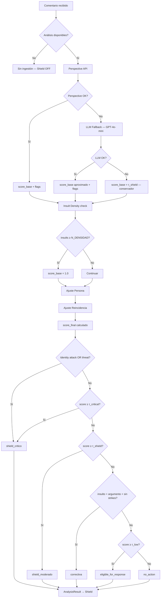
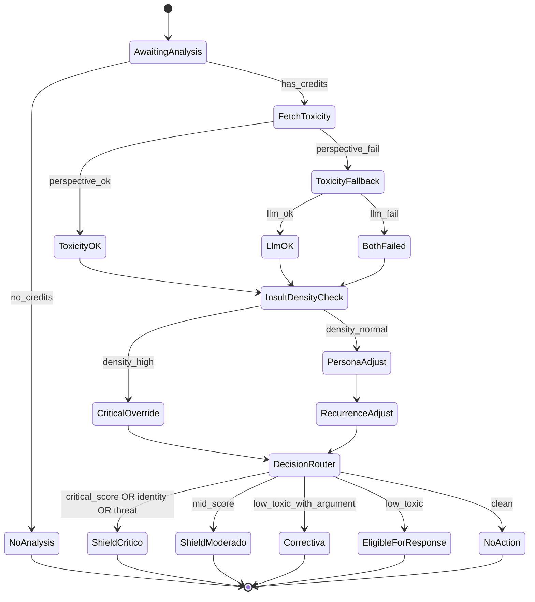

# 5. Motor de Análisis (v3)

*(Versión actualizada para arquitectura Shield-first)*

El Motor de Análisis determina qué hacer con cada **comentario de texto** que llega a una cuenta protegida. Produce una **decisión determinista** junto con metadata enriquecida que el Shield y otros módulos downstream consumen.

Es un sistema:

- **Determinista y auditable** — mismo input = mismo output, siempre
- **Barato de ejecutar** — Perspective API (gratis) como capa principal
- **Seguro contra prompt injection** — nunca pasa texto sin sanitizar a un LLM
- **Personalizable** — mediante Roastr Persona

---

## 5.1 Entrada de comentarios

Los comentarios llegan desde los workers de ingestión (cuando hay análisis disponibles):

```typescript
type NormalizedComment = {
  id: string;
  platform: Platform;
  accountId: string;
  userId: string;
  authorId: string;
  text: string;
  timestamp: string;
  metadata: Record<string, any>;
};

type Platform =
  | "youtube"
  | "instagram"
  | "tiktok"
  | "facebook"
  | "x"
  | "twitch"
  | "reddit"
  | "discord"
  | "bluesky"
  | "linkedin";
```

### Alcance

Roastr **solo analiza texto**:

- Comentarios en **contenido propio** (posts del usuario)
- Menciones directas usando @handle

Fuera del MVP:

- Imágenes, vídeos, audios
- Menciones sin @ (búsqueda proactiva)

---

## 5.2 Pre-condición: créditos de análisis

Roastr funciona **igual que un coche con gasolina**:

- **Si el usuario tiene análisis disponibles** → ingestion ON → pipeline completo ON
- **Si el usuario NO tiene análisis** → ingestion OFF → nada se ejecuta

### Cuando `analysis_remaining = 0`:

- No se hace ingestión
- No se llama a Perspective
- No actúa el Shield
- No hay Roasts
- No corre ningún worker de análisis para ese usuario

La UI solo muestra:

- Aviso "Se han agotado los análisis"
- Opciones de upgrade
- Datos históricos existentes

> **Nota:** A nivel del reducer, si por algún error llega un comentario sin créditos, devuelve `"no_action"` como defensa en profundidad.

---

## 5.3 Toxicidad — Perspective API + LLM Fallback

### Capa 1: Perspective API (principal)

Gratis, soporta la mayoría de idiomas relevantes.

Salida:

```
score_base ∈ [0, 1]
flags_perspective = {
  has_identity_attack,
  has_threat,
  has_insult,
  ...
}
```

### Capa 2: LLM Fallback (GPT-4o-mini)

Se activa **solo** si Perspective falla o no soporta el idioma.

Produce:

```
toxicity_level: low | medium | high | critical
has_identity_attack: boolean
has_threat: boolean
insults_count: number
has_initial_insult_with_argument: boolean
```

Mapeo a score numérico:

```
low      → 0.20
medium   → 0.45
high     → 0.75
critical → 0.95
```

### Fallback total: ambos fallan

Si Perspective Y el LLM fallback fallan:

```
score_base = τ_shield   // conservador: asume Shield Moderado
flags = vacíos
```

Se registra un log de error severo. El principio es **precaución**: ante incertidumbre, proteger al usuario.

---

## 5.4 Insult Density (safety net)

Conteo aproximado de insultos (classifier + heurística):

```
if (insults_count >= N_DENSIDAD)    // N_DENSIDAD = 3 por defecto
    score_base = 1.0                // fuerza Shield Crítico
```

---

## 5.5 Ajuste por Roastr Persona

El Roastr Persona tiene 3 campos (máx. 200 caracteres cada uno):

- **Identidades que me definen**
- **Líneas rojas**
- **Lo que me da igual**

Se procesan como listas de keywords cifradas (AES-256-GCM). El matching se realiza en memoria; las keywords nunca se persisten en texto plano fuera del perfil cifrado.

> **Nota:** La mecánica completa de matching, cifrado y almacenamiento se define en §6 (Roastr Persona).

### Pesos (SSOT)

```
linea_roja: 1.15
identidad:  1.10
tolerancia: 0.95   // solo aplica si score_base < τ_shield
```

### Regla de tolerancias

> Las tolerancias solo reducen el score si **aún no estamos en zona de Shield**.
> Una tolerancia **nunca** puede bajar un comentario de Shield Crítico a algo más benigno.

Aplicación:

```
score_persona = score_base * persona_factor
```

Donde `persona_factor` es el producto de los pesos que apliquen (pueden combinarse).

---

## 5.6 Reincidencia (Strike System — ventana 90 días)

Cada ofensor tiene:

```typescript
type OffenderProfile = {
  strikeLevel: 0 | 1 | 2 | "critical";
  lastStrike: string | null;   // ISO timestamp
};
```

Escalada:

- **Strike 0** → sin historial
- **Strike 1** → insulto inicial + argumento válido (Respuesta Correctiva)
- **Strike 2** → reincidencia dentro de 90 días
- **Critical** → reincidencia con insultos fuertes / amenazas / identity attack

Factores de reincidencia (SSOT):

```
none:     1.00
strike1:  1.10
strike2:  1.25
critical: 1.50
```

Regla: si `strike_level ≥ 2` Y hay insultos fuertes → override a Shield Crítico.

---

## 5.7 Score final

```
score_final = min(score_persona * recurrence_factor, 1.0)
```

---

## 5.8 Árbol de decisión

Prioridad fija (se evalúa en este orden, la primera condición que se cumple gana):

### 1. Shield Crítico (máxima prioridad)

Se activa si:

- `has_identity_attack = true`
- `has_threat = true`
- `score_final ≥ τ_critical`
- `insults_count ≥ N_DENSIDAD`
- `strike_level ≥ 2` + insultos fuertes

→ Decisión: `"shield_critico"`

### 2. Shield Moderado

Si:

```
τ_shield ≤ score_final < τ_critical
```

→ Decisión: `"shield_moderado"`

### 3. Zona Correctiva (Strike 1)

Condición (TODAS deben cumplirse):

```
score_final < τ_shield
AND score_final ≥ τ_low
AND has_initial_insult_with_argument = true
AND offender.strikeLevel = 0
```

→ Decisión: `"correctiva"`

> **Nota:** El Motor solo emite la decisión. Es el Shield quien verifica si la plataforma soporta replies y decide entre publicar la respuesta correctiva o registrar un `strike1_silent` (ver §7.4.4).

### 4. Eligible for Response

Si:

```
τ_low ≤ score_final < τ_shield
```

→ Decisión: `"eligible_for_response"`

> El comentario tiene toxicidad leve-moderada. El módulo de Roasting (si está activo) puede generar una respuesta. Si Roasting no está activo, el comentario simplemente pasa sin acción de moderación.

### 5. No Action

Si:

```
score_final < τ_low
AND NOT has_identity_attack
AND NOT has_threat
```

→ Decisión: `"no_action"`

---

## 5.9 Salida enriquecida del Motor

El Motor no devuelve solo una decisión string. Devuelve un objeto completo que el Shield y otros módulos consumen:

```typescript
type AnalysisResult = {
  decision: AnalysisDecision;
  severity_score: number;
  flags: {
    has_identity_attack: boolean;
    has_threat: boolean;
    has_insult_with_argument: boolean;
    matched_red_lines: string[];
    insult_density: number;
  };
  adjustments: {
    persona_applied: boolean;
    persona_factor: number;
    recurrence_factor: number;
    aggressiveness_applied: number;
  };
  score_source: "perspective" | "llm_fallback" | "both_failed";
};

type AnalysisDecision =
  | "no_action"
  | "correctiva"
  | "eligible_for_response"
  | "shield_moderado"
  | "shield_critico";
```

Este resultado permite al Shield:

- Elegir acciones basándose en `flags` (no solo en la decisión)
- Logear `severity_score` y `matched_red_lines` en shield_logs
- Saber si hubo fallback (`score_source`) para métricas de calidad
- Auditar exactamente qué ajustes se aplicaron

---

## 5.10 Edge Cases

### 5.10.1 Language fallback

Sin detección de idioma adicional. Flujo: Perspective → LLM fallback si Perspective falla.

### 5.10.2 Ediciones en X

Roast/response retrasado 30 min en X. Shield actúa inmediatamente.

### 5.10.3 Brigading — Phase 2

Marcado automático + shield más agresivo + alerta en dashboard.
(Ver §7.8.6 para detalles de implementación futura.)

### 5.10.4 Sin análisis = sin ingestión

Roastr se detiene totalmente para ese usuario. El Motor no se invoca.

### 5.10.5 Tono personal

El tono del usuario (Flanders/Balanceado/Canalla) solo afecta al Motor de Roasting, **nunca** al Motor de Análisis ni al Shield.

### 5.10.6 Cancelaciones durante delay de 30 min

Roasts pendientes en X se cancelan si la cuenta se pausa/cancela.

### 5.10.7 Comentarios muy cortos (< 5 caracteres)

→ `"no_action"` — insuficiente contenido para analizar toxicidad.

### 5.10.8 Comentarios duplicados del mismo ofensor

→ Se analizan normalmente. El strike system se encarga de la escalada.

---

## 5.C Contratos Formales

### 5.C.1 Entrada al Motor

```typescript
type NormalizedComment = {
  id: string;
  platform: Platform;
  accountId: string;
  userId: string;
  authorId: string;
  text: string;
  timestamp: string;
  metadata: Record<string, any>;
};

type UserAnalysisContext = {
  remainingAnalysis: number;
  persona: PersonaProfile | null;
  offender: OffenderProfile | null;
  thresholds: Thresholds;
  weights: Weights;
};
```

### 5.C.2 Roastr Persona Normalizada

```typescript
type PersonaProfile = {
  identidades: string[];     // keywords normalizadas (descifradas en memoria)
  lineasRojas: string[];     // keywords normalizadas (descifradas en memoria)
  tolerancias: string[];     // keywords normalizadas (descifradas en memoria)
};
```

> Mecánica de cifrado, storage y matching definida en §6 (Roastr Persona).

### 5.C.3 Ofensor (Reincidencia)

```typescript
type OffenderProfile = {
  strikeLevel: 0 | 1 | 2 | "critical";
  lastStrike: string | null;
};
```

### 5.C.4 Thresholds (SSOT)

```typescript
type Thresholds = {
  low: number;        // τ_low
  shield: number;     // τ_shield
  critical: number;   // τ_critical
};
```

### 5.C.5 Pesos Persona / Reincidencia (SSOT)

```typescript
type Weights = {
  lineaRoja: number;      // 1.15 default
  identidad: number;      // 1.10 default
  tolerancia: number;     // 0.95 default
  strike1: number;        // 1.10
  strike2: number;        // 1.25
  critical: number;       // 1.50
};
```

### 5.C.6 Salida del Motor

```typescript
type AnalysisResult = {
  decision: AnalysisDecision;
  severity_score: number;
  flags: {
    has_identity_attack: boolean;
    has_threat: boolean;
    has_insult_with_argument: boolean;
    matched_red_lines: string[];
    insult_density: number;
  };
  adjustments: {
    persona_applied: boolean;
    persona_factor: number;
    recurrence_factor: number;
    aggressiveness_applied: number;
  };
  score_source: "perspective" | "llm_fallback" | "both_failed";
};
```

---

## 5.C.7 API del Motor (hexagonal)

```typescript
interface AnalysisEngine {
  analyze(
    comment: NormalizedComment,
    ctx: UserAnalysisContext
  ): Promise<AnalysisResult>;
}
```

---

## 5.C.8 Reducer Puro (sin IO)

El core del Motor se implementa como un **reducer determinista**:

```typescript
function analysisReducer(input: {
  scoreBase: number | null;
  personaMatches: {
    matchesLineaRoja: boolean;
    matchesIdentidad: boolean;
    matchesTolerancia: boolean;
    matchedRedLines: string[];
  };
  offender: OffenderProfile | null;
  thresholds: Thresholds;
  weights: Weights;
  remainingAnalysis: number;
  insultDensity: number;
  hasIdentityAttack: boolean;
  hasThreat: boolean;
  hasInsultWithArgument: boolean;
}): AnalysisResult
```

El reducer NO recibe texto. Recibe scores y flags pre-calculados. Esto garantiza que es puro y determinista.

---

## 5.C.9 Reglas deterministas del Reducer

### 0) Precondición — créditos (defensa en profundidad)

```
if (remainingAnalysis <= 0)
    return { decision: "no_action", severity_score: 0, ... }
```

> En producción: si no hay análisis, no hay ingestión. Esta regla es solo defensa en profundidad.

### 1) Si score base es null → ambos proveedores fallaron

```
if (scoreBase === null)
    scoreBase = thresholds.shield    // conservador: asume zona Shield
```

### 2) Insult Density override

```
if (insultDensity >= N_DENSIDAD)
    scoreBase = 1.0                  // fuerza Shield Crítico
```

### 3) Ajuste por Persona

```
let adjusted = scoreBase

if (personaMatches.matchesLineaRoja)
    adjusted *= weights.lineaRoja

if (personaMatches.matchesIdentidad)
    adjusted *= weights.identidad

if (personaMatches.matchesTolerancia && adjusted < thresholds.shield)
    adjusted *= weights.tolerancia
```

### 4) Ajuste por Reincidencia

```
switch (offender.strikeLevel) {
  case 1:  adjusted *= weights.strike1;   break;
  case 2:  adjusted *= weights.strike2;   break;
  case "critical": adjusted *= weights.critical; break;
}
```

### 5) Score final

```
score_final = min(adjusted, 1.0)
```

### 6) Overrides duros (máxima prioridad)

```
if (hasIdentityAttack) return "shield_critico"
if (hasThreat)         return "shield_critico"
```

### 7) Threshold routing

```
if (score_final >= thresholds.critical)  → "shield_critico"
if (score_final >= thresholds.shield)    → "shield_moderado"

if (score_final >= thresholds.low
    && hasInsultWithArgument
    && offender.strikeLevel === 0)        → "correctiva"

if (score_final >= thresholds.low)        → "eligible_for_response"

→ "no_action"
```

---

## 5.C.10 Responsabilidades por Capa (Hexagonal)

### Dominio (pure — sin IO, sin HTTP, sin DB)

- `analysisReducer` — decisión determinista
- `PersonaMatcher` — match de keywords contra texto
- `RecurrenceCalculator` — cálculo de factor de reincidencia
- `ThresholdRouter` — routing por umbrales
- `CorrectiveHeuristic` — detección de insulto + argumento válido

### Adaptadores (infra)

- `PerspectiveClient` — Perspective API
- `LlmFallbackClassifier` — GPT-4o-mini para fallback de toxicidad
- `OffenderRepository` — Supabase (strikes, historial)
- `PersonaRepository` — Supabase (perfil cifrado)

### Aplicación (services)

- `CommentAnalysisService`:
  1. Llama a Perspective (o fallback LLM)
  2. Extrae matches de Persona (descifra en memoria)
  3. Carga offender profile
  4. Ejecuta reducer
  5. Devuelve `AnalysisResult`
  6. Despacha al Shield

---

## 5.C.11 Reglas de Seguridad

- **Nunca** pasar texto de usuario sin sanitizar a un modelo grande.
- **Nunca** incluir Roastr Persona (keywords descifradas) en prompts.
- **Nunca** permitir override del Motor desde el frontend.
- El reducer es **siempre determinista** (sin fechas, sin random, sin IO).
- Las keywords de Persona se descifran **solo en memoria** y nunca se persisten en texto plano fuera del perfil cifrado.
- Los logs del Motor **nunca** incluyen el texto del comentario (GDPR).

---

## 5.C.12 Tests Unitarios Requeridos

| # | Test | Input | Expected |
|---|---|---|---|
| 1 | Persona línea roja aumenta score | `score_base: 0.5, matchesLineaRoja: true` | `severity_score > 0.5` |
| 2 | Tolerancias reducen score | `score_base: 0.3, matchesTolerancia: true` | `severity_score < 0.3` |
| 3 | Tolerancias NO reducen en zona Shield | `score_base: 0.7, matchesTolerancia: true` | `severity_score = 0.7` |
| 4 | Reincidencia escala a crítico | `strike_level: 2, score_base: 0.6` | `decision: "shield_critico"` |
| 5 | Identity attack fuerza crítico | `hasIdentityAttack: true, score_base: 0.1` | `decision: "shield_critico"` |
| 6 | Amenaza fuerza crítico | `hasThreat: true, score_base: 0.1` | `decision: "shield_critico"` |
| 7 | Correctiva solo con insulto + argumento + sin strikes | `hasInsultWithArgument: true, strikeLevel: 0` | `decision: "correctiva"` |
| 8 | Eligible for response en zona baja | `score en [τ_low, τ_shield)` | `decision: "eligible_for_response"` |
| 9 | Score bajo → no action | `score_base: 0.05` | `decision: "no_action"` |
| 10 | Perspective fallback → conservador | `scoreBase: null` | `severity_score = τ_shield` |
| 11 | Insult density alta → crítico | `insultDensity: 5` | `decision: "shield_critico"` |
| 12 | Sin créditos → no action | `remainingAnalysis: 0` | `decision: "no_action"` |

---

## 5.11 Dependencias

- **Perspective API:** Capa principal de toxicidad. Gratis, multilingüe.
- **OpenAI (GPT-4o-mini):** Fallback cuando Perspective falla. Barato, usado solo para clasificación.
- **Roastr Persona (§6):** Provee keywords cifradas para ajustar sensibilidad.
- **SSOT:** Define thresholds (τ_low, τ_shield, τ_critical), pesos y N_DENSIDAD.
- **Shield (§7):** Consume el `AnalysisResult` para ejecutar acciones de moderación.
- **Platform Adapters (§4):** No directamente — el Motor no necesita saber de plataformas. El Shield se encarga.

---

## 5.12 Diagramas

### Flowchart — Pipeline completo



### State Machine


