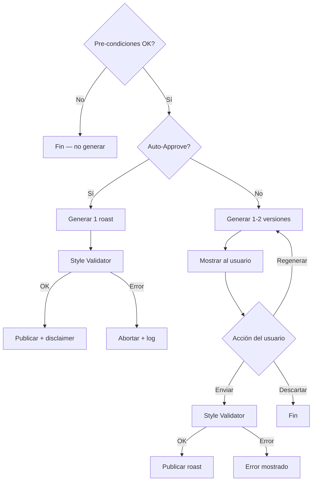
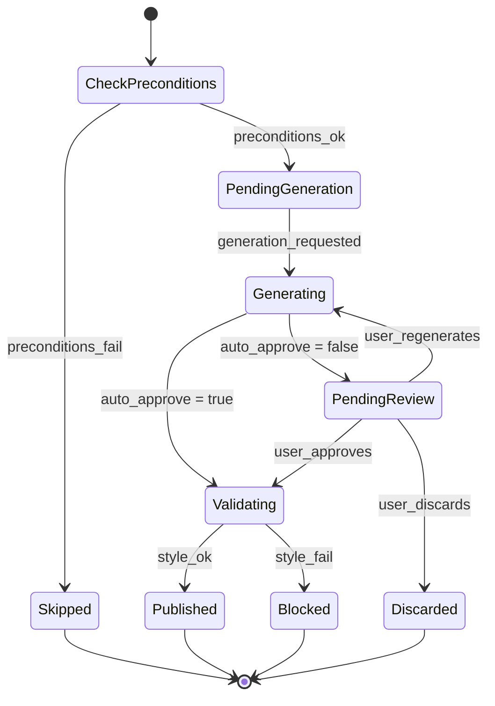

# 6. Motor de Roasting (v3)

*(Versión actualizada para arquitectura Shield-first)*

> **Este módulo es OPCIONAL.** El Shield (§7) funciona al 100% sin él. El Motor de Roasting se activa como feature adicional para plataformas que soportan respuestas automatizadas.

El Motor de Roasting genera respuestas inteligentes y seguras cuando un comentario es marcado como `eligible_for_response` por el Motor de Análisis (§5).

Principios:

1. **Seguridad** — Nunca cruza líneas rojas, no insulta, respeta reglas de plataforma y legislación.
2. **Consistencia** — Misma calidad en todos los tonos y plataformas.
3. **Auditoría** — Cada decisión, score y acción son trazables.

---

## 6.1 Pre-condiciones

Para que el Motor de Roasting se active, TODAS deben cumplirse:

- El comentario fue clasificado como `eligible_for_response` por el Motor de Análisis
- El usuario tiene `roasts_remaining > 0`
- La plataforma soporta replies (`capabilities.canReply = true`) — ver §7.9
- El módulo de Roasting está habilitado (feature flag `roasting_enabled`)

Si alguna pre-condición falla → el comentario se ignora sin acción. El Shield ya actuó si era necesario.

---

## 6.2 Flujos

### 6.2.1 Manual Review (auto-approve OFF)

1. Worker genera **1 o 2 versiones** según SSOT (`multi_version_enabled`).
2. Versiones se muestran al usuario en la UI.
3. El usuario puede:
   - **Enviar** → Style Validator → publicar
   - **Regenerar** → consume 1 crédito de roast
   - **Descartar** → fin
4. Si Style Validator rechaza → error mostrado, crédito ya consumido.

### 6.2.2 Auto-Approve ON

1. Se genera 1 roast.
2. Style Validator valida.
3. Si OK → publicación automática con **disclaimer IA** (obligatorio en regiones DSA/AI Act).
4. Si falla → abortar + log. No se publica.

### 6.2.3 Respuesta Correctiva (Strike 1)

> **Nota:** Este flujo NO es un roast. Es un mensaje correctivo gestionado por el Shield (§7.4.4). Se documenta aquí porque usa la infraestructura de generación y publicación del Motor de Roasting.

- Usa **tono Roastr Correctivo** (institucional fijo), NO el tono del usuario.
- Incluye disclaimer IA.
- Consume 1 crédito de **análisis** (no de roast).
- Solo se ejecuta si `capabilities.canReply = true`.

---

## 6.3 Tonos

Todos los tonos se definen en SSOT (`admin_settings`), editables desde Admin Panel (Phase 2) o Supabase Dashboard.

### 6.3.1 Flanders

- Amable, simpático, diminutivos
- Humor blanco, nunca agresivo
- Ejemplo: "¡Ay vecinillo, qué comentario más traviesillo te salió hoy!"

### 6.3.2 Balanceado (default)

- Tono estándar Roastr
- Sarcasmo suave, elegante
- Sin insultos ni ataques

### 6.3.3 Canalla

- Humor más afilado, ironía directa
- Límites estrictos de seguridad
- No se permiten degradaciones ni ataques personales

### 6.3.4 Personal (Solo Pro/Plus)

Tono completo generado rule-based (sin embeddings ni análisis psicológicos):

- Basado en: longitud típica, sarcasmo, emojis, expresiones, formalidad
- Cifrado (AES-256-GCM), no visible para otros
- Badge "Beta" en UI
- No se puede borrar (solo desactivar seleccionando otro tono)

### 6.3.5 NSFW — Phase 2

> **MVP: No implementar.**

Requiere: opt-in explícito, check legal, disclaimers especiales, modelo dedicado.

---

## 6.4 Arquitectura del Prompt (Bloques A/B/C)

El prompt se construye con tres bloques para maximizar cache hits:

### Block A — Global (cache 24h)

- Reglas de seguridad
- Reglas de humor seguro
- Anti-inyección de prompts
- Restricciones por plataforma
- Normativa IA/DSA

### Block B — Usuario/Cuenta (cache 24h)

- Tono elegido
- Tono personal (si aplica)
- Preferencias del usuario
- Idioma
- Modelo LLM asignado
- Disclaimers por región

### Block C — Dinámico (sin caché)

- Comentario original (sanitizado)
- Contexto del hilo (si disponible)
- Reincidencia del ofensor
- Metadata de plataforma

**Seguridad:** El texto del comentario NUNCA se incluye en los bloques cacheados. Las keywords de Persona NUNCA se incluyen en prompts.

---

## 6.5 Style Validator (Rule-Based, sin IA)

Valida el roast generado **antes** de publicar. Sin IA, solo reglas:

### Checks

1. Insultos directos → RECHAZADO
2. Ataques identitarios → RECHAZADO
3. Contenido explícito/sexual → RECHAZADO
4. Spam:
   - 200+ caracteres repetidos → RECHAZADO
   - 50+ emojis seguidos → RECHAZADO
   - 200+ "ja" seguidos → RECHAZADO
5. Longitud > límite de plataforma → RECHAZADO
6. Lenguaje incoherente con tono (excepto Tono Personal Beta) → RECHAZADO
7. Falsos disclaimers → RECHAZADO
8. Mensajes vacíos → RECHAZADO

### Resultado

- Pasa → OK, proceder a publicación
- Falla → error claro con motivo
- **El crédito ya consumido no se devuelve** (la generación ocurrió)

---

## 6.6 Limitaciones por plataforma

Configurables vía SSOT:

### YouTube

- Sin límite estricto de caracteres (recomendado < 500)
- Cuota diaria: depende del proyecto (10K units/día)
- Delay 2-3s entre respuestas
- Refresh tokens caducan → reconexión automática

### X (Twitter)

- Máx 280 caracteres
- Delay obligatorio 10-15s entre respuestas
- Ventana de edición → autopost retrasado 30 min
- Anti-bot: máx 4 respuestas/hora al mismo usuario
- **Reply solo disponible con tier Enterprise** ($42K+/año)
  - Sin Enterprise: el comentario queda como `eligible_for_response` pero no se publica roast
  - Con Enterprise: flujo normal

---

## 6.7 Entidades del dominio

```typescript
interface RoastGenerationRequest {
  commentId: string;
  accountId: string;
  userId: string;
  tone: "flanders" | "balanceado" | "canalla" | "personal";
  styleProfileId?: string;
  autoApprove: boolean;
  analysisScoreFinal: number;
}

interface RoastCandidate {
  id: string;
  requestId: string;
  text: string;
  tone: string;
  disclaimersApplied: string[];
  blockedByStyleValidator: boolean;
  blockReason?: string;
  createdAt: string;
}

interface Roast {
  id: string;
  candidateId: string;
  finalText: string;
  publishedAt: string | null;
  platformMessageId: string | null;
  status: "pending_review" | "approved" | "published" | "discarded" | "blocked";
}

interface UserStyleProfile {
  ticsLinguisticos: string[];
  emojisPreferidos: string[];
  formalidad: number;     // 0-1
  sarcasmo: number;       // 0-1
  longitudMedia: number;  // caracteres
}
```

### Schema SQL

```sql
CREATE TABLE roast_candidates (
  id                        UUID PRIMARY KEY DEFAULT gen_random_uuid(),
  user_id                   UUID NOT NULL REFERENCES auth.users(id),
  account_id                UUID NOT NULL REFERENCES accounts(id),
  comment_id                TEXT NOT NULL,
  tone                      TEXT NOT NULL,
  status                    TEXT NOT NULL DEFAULT 'pending_review'
                            CHECK (status IN (
                              'pending_review', 'approved', 'published',
                              'discarded', 'blocked'
                            )),
  blocked_reason            TEXT,
  disclaimers_applied       TEXT[],
  platform_message_id       TEXT,
  published_at              TIMESTAMPTZ,
  analysis_score             FLOAT NOT NULL,
  created_at                TIMESTAMPTZ NOT NULL DEFAULT now()
);

ALTER TABLE roast_candidates ENABLE ROW LEVEL SECURITY;
CREATE POLICY roast_owner ON roast_candidates
  FOR ALL USING (auth.uid() = user_id);
```

> **GDPR:** El `text` del roast NO se almacena en la tabla. Solo metadata. El texto existe temporalmente en memoria durante generación y se envía a la plataforma. Después se descarta.

---

## 6.8 Edge Cases

1. **Edición del comentario original (X):** autopost se retrasa 30 min. Shield actúa inmediatamente.
2. **Edición manual del roast con insultos:** Style Validator rechaza.
3. **Spam detectado en roast generado:** Style Validator rechaza.
4. **Tono personal produce resultados irregulares:** fallback a tono Balanceado.
5. **Cambio de tono mientras hay roast pendiente:** usa el tono de la generación original.
6. **Error de API al publicar:** 3 retries + backoff → DLQ.
7. **Mensaje demasiado largo:** rechazado por Style Validator antes de intentar publicar.
8. **Roasts = 0:** no se genera roasting. Shield sigue funcionando.
9. **Análisis = 0:** no hay roasting ni shield ni ingestión.
10. **Cuenta pausada/billing paused:** workers OFF.
11. **Plataforma no soporta reply:** comentario marcado como `eligible_for_response` pero no se genera roast. Log `roast_skipped_no_reply`.

---

## 6.9 Disclaimers

### Regla legal

- Contenido generado automáticamente (auto-approve ON) → **disclaimer IA obligatorio**
- Contenido revisado manualmente por el usuario → se puede omitir

### Disclaimers por defecto (pool en SSOT)

- "Publicado automáticamente con ayuda de IA"
- "Generado automáticamente por IA"

Ampliable en SSOT sin deploy.

---

## 6.10 Consumo de créditos

| Acción | Tipo | Crédito |
|---|---|---|
| Roast generado | roast | 1 |
| Roast regenerado | roast | 1 |
| Respuesta correctiva | analysis | 1 |
| Validación de estilo | — | 0 |
| Publicación | — | 0 |
| Descarte | — | 0 |

---

## 6.11 Diagramas

### Flujo del Motor de Roasting



### State Machine



---

## 6.12 Dependencias

- **Motor de Análisis (§5):** Provee la decisión `eligible_for_response` que activa el Roasting.
- **Platform Adapters (§4):** `capabilities.canReply` determina si se puede publicar. El adapter ejecuta `replyToComment()`.
- **Shield (§7):** Si el Shield actuó (moderado/crítico), NO hay roast. Solo `eligible_for_response` puede generar roast.
- **Billing (§3):** `roasts_remaining` determina si hay créditos. Cada generación consume 1.
- **Workers (§8):** `GenerateRoast` y `SocialPosting` processors.
- **SSOT:** Tonos, modelos LLM, prompts, límites de longitud, `multi_version_enabled`, disclaimers.
- **OpenAI:** LLM para generación de roasts (modelo configurable por tono en SSOT).
