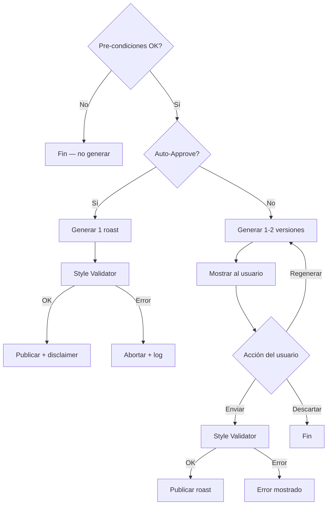
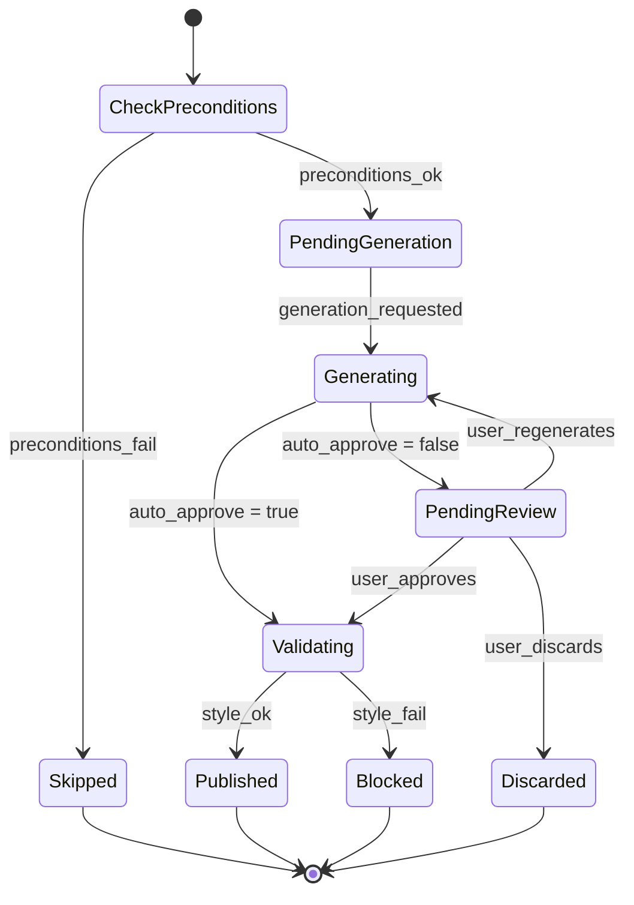

# 6. Motor de Roasting (v3) — Phase 2

*(No se implementa en MVP. Se desarrollará post-lanzamiento de Shield.)*

> **PHASE 2:** Este módulo se construirá después de que el producto core (Shield) esté en producción y tenga tracción. Se habilitará via feature flag `roasting_enabled` por usuario, primero para testers internos. Los límites de roasts por plan se ajustarán según la cuota de X API (ver nota al final).
>
> El Shield (§7) funciona al 100% sin este módulo.

El Motor de Roasting genera respuestas inteligentes y seguras cuando un comentario es marcado como `eligible_for_response` por el Motor de Análisis (§5).

Principios:

1. **Seguridad** — Nunca cruza líneas rojas, no insulta, respeta reglas de plataforma y legislación.
2. **Consistencia** — Misma calidad en todos los tonos y plataformas.
3. **Auditoría** — Cada decisión, score y acción son trazables.

---

## 6.1 Pre-condiciones

Para que el Motor de Roasting se active, TODAS deben cumplirse:

- El comentario fue clasificado como `eligible_for_response` por el Motor de Análisis
- El usuario tiene `roasts_remaining > 0`
- La plataforma soporta replies (`capabilities.canReply = true`) — ver §7.9
- El módulo de Roasting está habilitado (feature flag `roasting_enabled`)

Si alguna pre-condición falla → el comentario se ignora sin acción. El Shield ya actuó si era necesario.

---

## 6.2 Flujos

### 6.2.1 Manual Review (auto-approve OFF)

1. Worker genera **1 o 2 versiones** según SSOT (`multi_version_enabled`).
2. Versiones se muestran al usuario en la UI.
3. El usuario puede:
   - **Enviar** → Style Validator → publicar
   - **Regenerar** → consume 1 crédito de roast
   - **Descartar** → fin
4. Si Style Validator rechaza → error mostrado, crédito ya consumido.

### 6.2.2 Auto-Approve ON

1. Se genera 1 roast.
2. Style Validator valida.
3. Si OK → publicación automática con **disclaimer IA** (obligatorio en regiones DSA/AI Act).
4. Si falla → abortar + log. No se publica.

### 6.2.3 Respuesta Correctiva (Strike 1)

> **Nota:** Este flujo NO es un roast. Es un mensaje correctivo gestionado por el Shield (§7.4.4). Se documenta aquí porque usa la infraestructura de generación y publicación del Motor de Roasting.

- Usa **tono Roastr Correctivo** (institucional fijo), NO el tono del usuario.
- Incluye disclaimer IA.
- Consume 1 crédito de **análisis** (no de roast).
- Solo se ejecuta si `capabilities.canReply = true`.

---

## 6.3 Tonos

Todos los tonos se definen en SSOT (`admin_settings`), editables desde Admin Panel (Phase 2) o Supabase Dashboard.

### 6.3.1 Flanders

- Amable, simpático, diminutivos
- Humor blanco, nunca agresivo
- Ejemplo: "¡Ay vecinillo, qué comentario más traviesillo te salió hoy!"

### 6.3.2 Balanceado (default)

- Tono estándar Roastr
- Sarcasmo suave, elegante
- Sin insultos ni ataques

### 6.3.3 Canalla

- Humor más afilado, ironía directa
- Límites estrictos de seguridad
- No se permiten degradaciones ni ataques personales

### 6.3.4 Personal (Solo Pro/Plus)

Tono completo generado rule-based (sin embeddings ni análisis psicológicos):

- Basado en: longitud típica, sarcasmo, emojis, expresiones, formalidad
- Cifrado (AES-256-GCM), no visible para otros
- Badge "Beta" en UI
- No se puede borrar (solo desactivar seleccionando otro tono)

### 6.3.5 NSFW — Phase 2

> **MVP: No implementar.**

Requiere: opt-in explícito, check legal, disclaimers especiales, modelo dedicado.

---

## 6.4 Arquitectura del Prompt (Bloques A/B/C)

El prompt se construye con tres bloques para maximizar cache hits:

### Block A — Global (cache 24h)

- Reglas de seguridad
- Reglas de humor seguro
- Anti-inyección de prompts
- Restricciones por plataforma
- Normativa IA/DSA

### Block B — Usuario/Cuenta (cache 24h)

- Tono elegido
- Tono personal (si aplica)
- Preferencias del usuario
- Idioma
- Modelo LLM asignado
- Disclaimers por región

### Block C — Dinámico (sin caché)

- Comentario original (sanitizado)
- Contexto del hilo (si disponible)
- Reincidencia del ofensor
- Metadata de plataforma

**Seguridad:** El texto del comentario NUNCA se incluye en los bloques cacheados. Las keywords de Persona NUNCA se incluyen en prompts.

---

## 6.5 Style Validator (Rule-Based, sin IA)

Valida el roast generado **antes** de publicar. Sin IA, solo reglas:

### Checks

1. Insultos directos → RECHAZADO
2. Ataques identitarios → RECHAZADO
3. Contenido explícito/sexual → RECHAZADO
4. Spam:
   - 200+ caracteres repetidos → RECHAZADO
   - 50+ emojis seguidos → RECHAZADO
   - 200+ "ja" seguidos → RECHAZADO
5. Longitud > límite de plataforma → RECHAZADO
6. Lenguaje incoherente con tono (excepto Tono Personal Beta) → RECHAZADO
7. Falsos disclaimers → RECHAZADO
8. Mensajes vacíos → RECHAZADO

### Resultado

- Pasa → OK, proceder a publicación
- Falla → error claro con motivo
- **El crédito ya consumido no se devuelve** (la generación ocurrió)

---

## 6.6 Limitaciones por plataforma

Configurables vía SSOT:

### YouTube

- Sin límite estricto de caracteres (recomendado < 500)
- Cuota diaria: depende del proyecto (10K units/día)
- Delay 2-3s entre respuestas
- Refresh tokens caducan → reconexión automática

### X (Twitter)

- Máx 280 caracteres
- Delay obligatorio 10-15s entre respuestas
- Ventana de edición → autopost retrasado 30 min
- Anti-bot: máx 4 respuestas/hora al mismo usuario
- **Reply solo disponible con tier Enterprise** ($42K+/año)
  - Sin Enterprise: el comentario queda como `eligible_for_response` pero no se publica roast
  - Con Enterprise: flujo normal
  - Ver §6.13 para la verificación oficial (2026-07-12) de esta restricción y su alcance exacto

---

## 6.7 Entidades del dominio

```typescript
interface RoastGenerationRequest {
  commentId: string;
  accountId: string;
  userId: string;
  tone: "flanders" | "balanceado" | "canalla" | "personal";
  styleProfileId?: string;
  autoApprove: boolean;
  analysisScoreFinal: number;
}

interface RoastCandidate {
  id: string;
  requestId: string;
  text: string;
  tone: string;
  disclaimersApplied: string[];
  blockedByStyleValidator: boolean;
  blockReason?: string;
  createdAt: string;
}

interface Roast {
  id: string;
  candidateId: string;
  finalText: string;
  publishedAt: string | null;
  platformMessageId: string | null;
  status: "pending_review" | "approved" | "published" | "discarded" | "blocked";
}

interface UserStyleProfile {
  ticsLinguisticos: string[];
  emojisPreferidos: string[];
  formalidad: number;     // 0-1
  sarcasmo: number;       // 0-1
  longitudMedia: number;  // caracteres
}
```

### Schema SQL

```sql
CREATE TABLE roast_candidates (
  id                        UUID PRIMARY KEY DEFAULT gen_random_uuid(),
  user_id                   UUID NOT NULL REFERENCES auth.users(id),
  account_id                UUID NOT NULL REFERENCES accounts(id),
  comment_id                TEXT NOT NULL,
  tone                      TEXT NOT NULL,
  status                    TEXT NOT NULL DEFAULT 'pending_review'
                            CHECK (status IN (
                              'pending_review', 'approved', 'published',
                              'discarded', 'blocked'
                            )),
  blocked_reason            TEXT,
  disclaimers_applied       TEXT[],
  platform_message_id       TEXT,
  published_at              TIMESTAMPTZ,
  analysis_score             FLOAT NOT NULL,
  created_at                TIMESTAMPTZ NOT NULL DEFAULT now()
);

ALTER TABLE roast_candidates ENABLE ROW LEVEL SECURITY;
CREATE POLICY roast_owner ON roast_candidates
  FOR ALL USING (auth.uid() = user_id);
```

> **GDPR:** El `text` del roast NO se almacena en la tabla. Solo metadata. El texto existe temporalmente en memoria durante generación y se envía a la plataforma. Después se descarta.

---

## 6.8 Edge Cases

1. **Edición del comentario original (X):** autopost se retrasa 30 min. Shield actúa inmediatamente.
2. **Edición manual del roast con insultos:** Style Validator rechaza.
3. **Spam detectado en roast generado:** Style Validator rechaza.
4. **Tono personal produce resultados irregulares:** fallback a tono Balanceado.
5. **Cambio de tono mientras hay roast pendiente:** usa el tono de la generación original.
6. **Error de API al publicar:** 3 retries + backoff → DLQ.
7. **Mensaje demasiado largo:** rechazado por Style Validator antes de intentar publicar.
8. **Roasts = 0:** no se genera roasting. Shield sigue funcionando.
9. **Análisis = 0:** no hay roasting ni shield ni ingestión.
10. **Cuenta pausada/billing paused:** workers OFF.
11. **Plataforma no soporta reply:** comentario marcado como `eligible_for_response` pero no se genera roast. Log `roast_skipped_no_reply`.

---

## 6.9 Disclaimers

### Regla legal

- Contenido generado automáticamente (auto-approve ON) → **disclaimer IA obligatorio**
- Contenido revisado manualmente por el usuario → se puede omitir

### Disclaimers por defecto (pool en SSOT)

- "Publicado automáticamente con ayuda de IA"
- "Generado automáticamente por IA"

Ampliable en SSOT sin deploy.

---

## 6.10 Consumo de créditos

| Acción | Tipo | Crédito |
|---|---|---|
| Roast generado | roast | 1 |
| Roast regenerado | roast | 1 |
| Respuesta correctiva | analysis | 1 |
| Validación de estilo | — | 0 |
| Publicación | — | 0 |
| Descarte | — | 0 |

---

## 6.11 Diagramas

### Flujo del Motor de Roasting



### State Machine



---

## 6.12 Dependencias

- **Motor de Análisis (§5):** Provee la decisión `eligible_for_response` que activa el Roasting.
- **Platform Adapters (§4):** `capabilities.canReply` determina si se puede publicar. El adapter ejecuta `replyToComment()`.
- **Shield (§7):** Si el Shield actuó (moderado/crítico), NO hay roast. Solo `eligible_for_response` puede generar roast.
- **Billing (§3):** `roasts_remaining` determina si hay créditos. Cada generación consume 1.
- **Workers (§8):** `GenerateRoast` y `SocialPosting` processors.
- **SSOT:** Tonos, modelos LLM, prompts, límites de longitud, `multi_version_enabled`, disclaimers.
- **OpenAI:** LLM para generación de roasts (modelo configurable por tono en SSOT).

---

## 6.13 Disparo automático desde el Motor de Análisis (implementación actual — YouTube)

> Actualizado 2026-07-11 (auditoría ROA-P2). Esta sección documenta la arquitectura real ya implementada/decidida, que difiere del diseño aspiracional de §6.1–§6.13 (p. ej. no existe un processor `GenerateRoast` en el worker; la generación vive en `apps/api/src/modules/roast/*` vía `RoastPipelineService`, con feature flags, auto-approve y estilo ya implementados y testeados).

### Decisión de producto

Roast automático: **solo YouTube**. Para X no se dispara generación automática (restricción de la API de X a respuestas programáticas salvo mención/cita del autor, o tier Enterprise ~$42k/mes — evaluándose aparte). El bloqueo/ocultado de comentarios en X vía Shield no se ve afectado, sigue funcionando igual.

### Verificación oficial de la restricción de reply en X (2026-07-12, ROA-P2/ROA-T38)

La auditoría del 2026-07-11 documentó esta restricción como hallazgo pero sin verificarla contra fuente oficial. Esta tarea intentó esa verificación con el siguiente resultado:

**Confirmado (con reserva metodológica, ver abajo):** vía `WebSearch` se localizó un anuncio atribuido a la cuenta oficial `@XDevelopers` (`x.com/XDevelopers/status/2026084506822730185`, según snippets de búsqueda) cuyo texto citado es: *"To help address automated reply spam, programmatic replies via POST /2/tweets are now restricted for X API. You can only reply if the original author @ mentions you or quotes your post. [...] Applies to Free, Basic, Pro, Pay-Per-Use."* Esto:
- Confirma la mecánica general (reply automático bloqueado salvo que el autor original mencione/cite la cuenta).
- **Corrige un matiz del hallazgo original:** la exención NO es solo "tier Enterprise" — según este anuncio la restricción aplica a Free, Basic, Pro y Pay-Per-Use por igual, y quedan fuera (exentos) Enterprise **y "Public Utility"** (categoría de acceso no mencionada hasta ahora en nuestra documentación). No se pudo confirmar el coste exacto de ~$42K/año para Enterprise contra una fuente de precios oficial en esta sesión (la cifra proviene de docs/04, no de una tarifa publicada verificada aquí).

**NO confirmado — limitación de esta verificación:** `WebFetch` fue bloqueado (HTTP 402/403) en todas las páginas oficiales candidatas (`docs.x.com/developer-guidelines`, `developer.x.com/en/support/x-api/policy`, `help.x.com/en/rules-and-policies/x-automation`, el hilo `devcommunity.x.com/t/policy-clarification-automated-replies-and-mentions/94444`, y el propio tweet de `@XDevelopers`). Solo se pudo leer **resúmenes/snippets generados por WebSearch**, no el texto primario completo de docs.x.com/developer.x.com. Por tanto:
- La cita anterior está verificada solo de forma indirecta (snippet de buscador que referencia el tweet), no leyendo la fuente primaria directamente.
- **La pregunta específica de esta tarea — si un comentario tóxico que ya es estructuralmente una respuesta al post del usuario conectado cuenta como que "el autor te menciona/cita" a efectos de la excepción — NO pudo resolverse.** Un blog de terceros (fireply.ai, no fuente oficial) afirma que la excepción de mención/cita aplica quien es el autor del tweet que se quiere responder, y que responder a **tus propios** posts no requiere la excepción — pero ese es un caso distinto (auto-respuesta a tu propio post), no el de Roastr (responder a un comentario ajeno que a su vez ya es reply a tu post). No se encontró clarificación oficial de X sobre si el reply-threading en sí (el hecho de que el comentario tóxico sea reply a tu post) genera o no una mención/entity `@usuario` computable para la excepción.

**Conclusión:** la decisión de producto (no auto-roast en X salvo Enterprise) se mantiene como correcta a nivel general, pero **queda pendiente de confirmación manual por el equipo** (con acceso autenticado a devcommunity.x.com/developer.x.com, o contacto directo con soporte de X) el matiz concreto que condicionaría si Roastr podría cualificar para la excepción sin ser Enterprise. Recomendación: no cambiar la decisión de producto hasta obtener esa confirmación directa.

### Disparo

`apps/worker/src/processors/analysis.ts` ya enqueua a la cola `shield` cuando `analysisReducer` decide `shield_moderado`/`shield_critico` (ver `getShieldQueue()`). Se añade una rama simétrica: cuando `result.decision` es `eligible_for_response` o `correctiva` **y** `platform === "youtube"`, se dispara la generación automática de un roast.

### Arquitectura: llamada HTTP interna a `apps/api`, NO una cola/processor nuevo en el worker

Se evaluaron dos opciones:

1. **Nueva cola BullMQ `roast` + processor en el worker**, reimplementando la lógica de `RoastPipelineService` allí (siguiendo el mismo patrón que `shield`).
2. **Llamada HTTP interna del worker a un endpoint nuevo en `apps/api`** que reutiliza `RoastPipelineService.generate()` tal cual.

**Se elige la opción 2.** Razón: `RoastPipelineService.generate()` depende de servicios con estado y lógica de negocio no triviales que ya viven y están testeados en `apps/api` — `FeatureFlagService` (cache SSOT), `AutoApproveService`, `DisclaimerService`, `StyleValidatorService`, `LlmService` (vía `ConfigService`) — y persiste `roast_candidates` respetando la invariante GDPR (nunca guardar el texto generado). Reimplementar todo esto en `apps/worker` duplicaría lógica de negocio crítica entre dos runtimes, exactamente el tipo de duplicación que esta misma auditoría marca como problema a eliminar (ver limpieza de `analysis.controller.ts`/`perspective-api.service.ts`). La cola `shield` es distinta: el `shield` processor ejecuta acciones de moderación (ocultar/bloquear vía adapter de plataforma) que no dependen de esos servicios de `apps/api`, por eso ahí sí tiene sentido resolverlo enteramente en el worker.

### Contrato del endpoint interno (a implementar en ROA-T20)

- `POST /internal/roast/auto-generate` en `apps/api` (nuevo controller o método en `RoastController`), autenticado por secreto compartido (`X-Internal-Secret` vs. `INTERNAL_API_SECRET`), **no** por JWT de usuario ni `SubscriptionGuard` (el worker no tiene sesión de usuario).
- Body: `{ userId, commentId, commentText, severityScore, platform: "youtube", accountId, tone }`.
- Internamente reutiliza `RoastPipelineService.generate()` sin cambios.
- Debe replicar la comprobación de `SubscriptionGuard` (billing_state en `ACTIVE_STATES`) antes de generar, ya que este endpoint no pasa por el guard HTTP normal.
- **Dependencia con ROA-T32** (cuota de roasts aún no implementada — `roasts_limit`/`roasts_used`): hasta que esa tarea aterrice, el endpoint no debe bloquear por cuota de roast (no existe aún), solo por `billing_state`. Cuando ROA-T32 implemente la cuota, este endpoint debe consumirla de la misma forma atómica que `tryConsumeAnalysisSlot` hace para análisis.

### Tono de la cuenta

`accounts.tone` ya existe en el schema (`supabase/migrations/00001_initial_schema.sql`, default `'balanceado'`). El worker ya hace un `SELECT` a `accounts` en `analysis.ts` para leer `shield_aggressiveness` — se añade `tone` a esa misma query, sin queries adicionales.

### Camino manual (`RoastGenerateModal`) — retirado

`RoastGenerateModal.tsx` era huérfano: ningún componente lo renderizaba, y `RoastReviewList`'s prop `onGenerateNew` nunca se pasaba desde `dashboard.tsx`. Se decidió **eliminarlo** (ROA-T21) en vez de conectarlo, porque:

- Para YouTube el flujo ya es 100% automático (§6.13 arriba).
- Para X no hay ni habrá generación automática por ahora, pero tampoco existe en la UI un selector de "qué comentario concreto roastear manualmente" — el modal esperaba `commentId`/`commentText`/`severityScore` ya resueltos, y no hay ninguna pantalla que liste comentarios individuales para elegir uno. Conectarlo habría requerido construir esa pantalla desde cero, fuera del alcance de un "repair".

El endpoint `POST /roast/generate` (manual, autenticado por JWT de usuario) se mantiene en `apps/api` sin cambios — sigue testeado y disponible si en el futuro se construye un flujo de selección de comentario que lo necesite.

---

## 6.14 Nota sobre cuota de X API y límites de roasts

Los posts de X consumen una cuota **a nivel de app** (toda la app Roastr, no por usuario):

| Tier X API | Posts/mes | Coste |
|---|---|---|
| Free | 500 | $0 |
| Basic | 3,000 | $200/mo |
| Pro | 300,000 | $5,000/mo |

Esto significa que los límites de roasts por plan deben calcularse en función del número de usuarios activos y el tier de X API contratado. YouTube no tiene esta restricción (cuota por proyecto, mucho más generosa).

**Cuando se lance Roasting, los límites propuestos son:**

| Plan | Roasts/mes (estimado) | Sujeto a ajuste |
|---|---|---|
| Starter | 5 | Sí |
| Pro | 50 | Sí |
| Plus | 200 | Sí |

Estos números asumen X API Basic ($200/mo) y ~50 usuarios activos. Se revisarán según datos reales de uso y crecimiento.

**Nota: esto es un coste de X distinto del coste de ingestión (lectura de menciones).** El tier de X API de esta tabla (Free/Basic/Pro) cubre la cuota de **publicación** de posts (los roasts que Roastr publica en X). La **lectura** de menciones vía `/2/users/{id}/mentions` que alimenta la ingestión (§4.6 de `docs/04-conexion-redes-sociales.md`) es un coste variable aparte, bajo el modelo "Owned Reads" ($0.001/recurso leído desde abril 2026) — modelado en **§4.6.3 de docs/04-conexion-redes-sociales.md**, con una estimación de $288–$864/mes por cuenta de X conectada según plan (Starter/Pro/Plus), no verificada contra facturación real.
