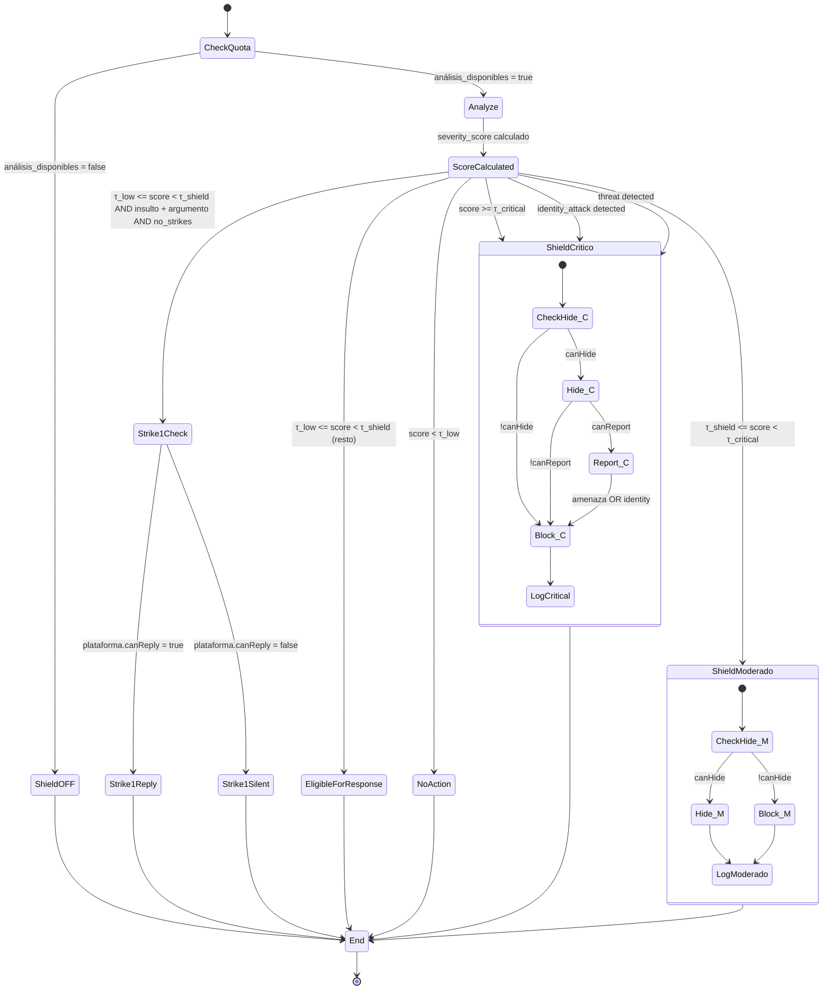

# 7. SHIELD — Sistema de Protección Antitrolls (v3)

*(Versión actualizada para arquitectura Shield-first)*

El Shield es el sistema central de Roastr. Se encarga de **proteger al usuario** eliminando, ocultando o bloqueando comentarios ofensivos, agresivos o peligrosos antes de que afecten su experiencia en redes sociales.

Opera después del Motor de Análisis. **No genera texto ni respuestas por sí mismo.** La única excepción es el flujo de Respuesta Correctiva (Strike 1), que solo se ejecuta en plataformas que soportan respuestas automatizadas.

El Shield es **completamente funcional sin el Motor de Roasting**. El Roasting es un módulo opcional que actúa sobre comentarios que el Shield marca como `eligible_for_response`.

---

## 7.1 Flujo general del Shield

Para cada comentario recibido:

1. El **Motor de Análisis** calcula:
   - Toxicidad base (Perspective API + LLM)
   - Ajuste por Roastr Persona
   - Factor de reincidencia (solo Strike 1 → Strike 2)
   - Resultado final: **severity_score**

2. El Shield compara ese severity_score con los thresholds definidos en SSOT:
   - **τ_low** — umbral inferior (comentario levemente ofensivo)
   - **τ_shield** — umbral de moderación
   - **τ_critical** — umbral crítico

3. El Shield consulta las **capacidades de la plataforma** (ver §7.9) para determinar qué acciones son posibles.

4. Con esa información decide una de cinco acciones:

| Zona de severity_score | Acción | Requiere Roast Module |
|---|---|---|
| `< τ_low` | Publicación normal (no action) | No |
| `τ_low ≤ score < τ_shield` + insulto + argumento + sin strikes | Respuesta Correctiva (Strike 1) | No (*) |
| `τ_low ≤ score < τ_shield` (resto de casos) | Marcar como `eligible_for_response` | Sí (opcional) |
| `τ_shield ≤ score < τ_critical` | Shield Moderado | No |
| `score ≥ τ_critical` o amenaza/identidad | Shield Crítico | No |

(*) Strike 1 solo publica respuesta si la plataforma soporta replies automatizados. Si no, registra el strike internamente sin publicar.

5. Registra un **shield_log** (sin texto del comentario).

**Principio clave:** El Shield funciona al 100% sin que el módulo de Roasting exista. Los comentarios marcados como `eligible_for_response` simplemente se ignoran si Roasting no está activo o la plataforma no lo soporta.

---

## 7.2 Niveles del Shield

El Shield aplica **dos niveles reales** de protección:

### 7.2.1 Shield Moderado

Se aplica cuando:

- `τ_shield ≤ severity_score < τ_critical`
- Hay insultos leves o contenido ofensivo generalista
- No hay amenazas
- No hay ataques directos a identidad
- No hay línea roja personal severa
- O hay Strike 2 (reincidencia dentro de 90 días)

**Acciones:**

- Ocultar comentario (si la plataforma lo permite, ver §7.9)
- Registrar strike de escalado (si viene de Strike 1 → Strike 2)
- En reincidencia → considerar reporte

No hay roast en este nivel.

### 7.2.2 Shield Crítico

Se aplica cuando:

- `severity_score ≥ τ_critical`
- O se detecta:
  - Amenaza ("te voy a…")
  - Ataque explícito a identidad
  - Slurs graves
  - Línea roja severa
- O reincidencia agravada (Strike 2 + contenido más ofensivo)

**Acciones:**

- Ocultar siempre (si la plataforma lo permite)
- Reportar (cuando corresponda y la plataforma lo soporte)
- Bloquear (si la red lo soporta y hay amenaza / identity attack)
- No genera ningún roast
- No contabiliza strikes (esto no es aviso, es acción directa)

---

## 7.3 Activación por Roastr Persona

El Roastr Persona define tres componentes:

- **Lo que me define** → identidades del usuario
- **Lo que no tolero** → líneas rojas
- **Lo que me da igual** → tolerancias

### Reglas vinculantes del Shield:

**Línea Roja → Escalada directa**

Si el comentario coincide con una línea roja:
- Toxicidad baja → Shield Moderado
- Toxicidad media → Shield Crítico
- Toxicidad alta → Shield Crítico

*(independientemente del score de Perspective/LLM)*

**Identidades → Más sensibilidad**

Baja ligeramente los thresholds del Shield.

*(Implementado en el Motor de Análisis — no se duplica aquí.)*

**Tolerancias → Menos sensibilidad**

Reduce el severity_score con límites absolutos:

- Puede convertir un `eligible_for_response` en publicación normal
- Puede convertir un Shield Moderado en `eligible_for_response`
- **Nunca** convierte un Crítico en nada más benigno

---

## 7.4 Acciones del Shield

### 7.4.1 Ocultar (Hide)

- Acción primaria en Shield Moderado y Crítico.
- Si la plataforma NO lo permite → fallback a **bloquear** (ver §7.9).
- Si la API falla (403 / 429 / 500):
  - Retry con backoff exponencial
  - Segundo intento
  - Fallback a bloquear
  - Registro de error severo

### 7.4.2 Reportar (Report)

Aplicable en:

- Amenazas
- Ataques de identidad
- Casos severos de reincidencia

Payload incluye:

- Link al comentario
- Categoría oficial de reporte
- Historial reducido (si permitido por la API)

Si la plataforma no soporta report o la API rechaza → fallback a **ocultar + bloquear**.

### 7.4.3 Bloquear (Block)

Se aplica en:

- Amenazas directas
- Ataques a identidad
- Shield Crítico en plataformas que no permiten ocultar
- Errores múltiples al intentar ocultar o reportar

Una vez bloqueado → el shield_log refleja la acción.

### 7.4.4 Respuesta Correctiva (Strike 1)

**Prerequisitos (TODOS deben cumplirse):**

- Hay insulto inicial + argumento válido
- No cruza thresholds de Shield (`severity_score < τ_shield`)
- El ofensor NO tiene strikes previos
- El usuario tiene análisis disponibles
- **La plataforma soporta respuestas automatizadas** (ver §7.9)

**Si la plataforma soporta replies:**

- Publica un mensaje con **Corrective Tone** (tono institucional fijo, no Flanders/Balanceado/Canalla)
- Incluye disclaimer IA
- Consume 1 crédito de análisis
- Se asigna Strike 1

**Mensaje (estructura contractual):**

> "Apreciamos el debate sin insultos. Para mantener la conversación en buen tono, aplicamos un sistema de avisos. Este es tu Strike 1. Puedes seguir conversando con respeto. — Roastr.ai"

**Si la plataforma NO soporta replies:**

- Se asigna Strike 1 internamente
- Se registra en shield_log con `action_taken: 'strike1_silent'`
- No se publica nada
- El strike sigue contando para escaladas futuras (Strike 2 → Shield Moderado)

### 7.4.5 Ignorar (Shield OFF)

Si el usuario **no tiene análisis disponibles** (límite de plan agotado):

- No hay ingestión
- No hay Shield
- No hay Roasts
- No llegan comentarios nuevos a procesar
- La UI solo muestra: historial previo, métricas, cuentas conectadas, billing

El Shield queda totalmente OFF hasta próximo ciclo de facturación.

---

## 7.5 Configuración por cuenta (aggressiveness)

Cada cuenta conectada tiene:

```
shield_aggressiveness: 0.90 | 0.95 | 0.98 | 1.00
default = 0.95
```

Aplicación:

```
effective_score = severity_score * aggressiveness
```

- `0.90` → más permisivo (deja pasar más)
- `1.00` → más estricto (actúa antes)

Editable desde el Panel de Usuario (por cuenta) y desde Admin Panel (global override).

---

## 7.6 Shield Logs

Sin almacenar texto del comentario (GDPR compliant):

```
shield_logs:
  id                    UUID
  user_id               UUID
  account_id            UUID
  platform              TEXT        # 'youtube' | 'instagram' | 'tiktok' | 'x' | ...
  comment_id            TEXT        # ID externo del comentario en la plataforma
  offender_id           TEXT        # ID externo del ofensor en la plataforma
  action_taken          TEXT        # 'none' | 'hide' | 'report' | 'block' | 'strike1' | 'strike1_silent'
  severity_score        FLOAT
  matched_red_line      TEXT NULL   # línea roja que matcheó (si aplica)
  using_aggressiveness  FLOAT
  platform_fallback     BOOLEAN     # true si la acción fue un fallback por limitación de plataforma
  created_at            TIMESTAMPTZ
```

Uso:

- Auditoría
- Métricas del dashboard
- Panel de administración
- Debugging
- Detección de patrones (brigading futuro)

---

## 7.7 Auto-Approve no afecta al Shield

Auto-approve controla SOLO la publicación de roasts.

No altera:

- Cuándo actúa el Shield
- Qué acción toma
- Los thresholds

Si Shield actúa → **no puede haber roast** aunque auto-approve esté ON.

---

## 7.8 Edge Cases

### 7.8.1 La plataforma no permite ocultar comentarios

→ Fallback: bloqueo + log con `platform_fallback: true`

### 7.8.2 Ofensor borra comentario antes de análisis

→ Strike parcial registrado
→ Si es repetido → marcado como "evasivo" → más sensibilidad futura

### 7.8.3 APIs que piden contexto extra para reportar

→ Enlace + categoría + historial permitido
→ Si falla → fallback a ocultar/bloquear

### 7.8.4 Sarcasmo que toca línea roja

→ Shield Moderado por defecto
→ Manual review si Feature Flag `FF_MANUAL_REVIEW` está ON

### 7.8.5 Diferencias por idioma

→ Thresholds dinámicos por idioma (gestionado en Motor de Análisis)
→ Si idioma no soportado → nivel base conservador

### 7.8.6 Brigading (ataque coordinado) — Phase 2

> **MVP: No implementar.** Marcar para Phase 2.

Cuando se implemente:
→ Shield pasa a `aggressiveness = 1.00` automáticamente
→ Alerta al usuario
→ Registro global
→ Detección basada en: volumen anómalo + múltiples ofensores nuevos + ventana temporal corta

### 7.8.7 Límite de análisis agotado

→ Shield OFF
→ Comentarios nuevos no se procesan
→ Log del evento
→ Notificación al usuario (email + in-app)

### 7.8.8 Comentario ambiguo

→ Shield Moderado por defecto (principio de precaución)

### 7.8.9 Edición posterior del comentario

Si el comentario se edita **después** de la acción del Shield:
- No se reevalúa automáticamente
- No se modifica la acción previa
- Log adicional si la API notifica el cambio

### 7.8.10 Plataformas sin API de reportar

→ Ocultar + bloquear
→ No reportar
→ Log con `platform_fallback: true`

### 7.8.11 Sponsors (plan Plus) — Phase 2

> **MVP: No implementar.** Marcar para Phase 2.

Cuando se implemente:
- Shield aplica las mismas reglas a ataques dirigidos a sponsors del usuario
- No se generan strikes contra sponsors
- Se actúa con Shield Moderado/Crítico según el caso
- Requiere que el usuario vincule cuentas de sponsors

---

## 7.9 Capacidades por Plataforma (Platform Action Matrix)

El Shield debe consultar esta matriz antes de ejecutar cualquier acción. Si una acción no está soportada, usa el fallback definido.

| Plataforma | Hide | Report | Block | Reply (Strike 1) | Notas |
|---|---|---|---|---|---|
| YouTube | ✅ | ✅ | ✅ (ban de canal) | ✅ | API completa. Acceso via OAuth2. |
| Instagram | ✅ | ❌ | ✅ | ❌ | Solo Business/Creator accounts via Graph API. No soporta report ni reply automatizado. |
| TikTok | ✅ | ❌ | ✅ | ❌ | Content Posting API limitada. Hide = filter comments. |
| Facebook | ✅ | ❌ | ✅ (ban de página) | ✅ | Solo Pages via Graph API. Report no disponible via API. |
| X (Twitter) | ✅ (hide reply) | ❌ | ✅ | ⚠️ Solo Enterprise | Free/Basic: solo hide+block. Enterprise ($42K+/año): reply + full access. |
| Twitch | ✅ | ❌ | ✅ (ban/timeout) | ✅ (chat) | Moderación via IRC/EventSub. Reply es mensaje en chat. |
| Reddit | ✅ (remove) | ✅ | ✅ | ✅ | Solo como moderador del subreddit. |
| Discord | ✅ (delete) | ❌ | ✅ (kick/ban) | ✅ | Requiere bot con permisos. |
| Bluesky | ✅ (mute thread) | ✅ (moderation report) | ✅ (block) | ✅ | AT Protocol abierto. API completa. |
| LinkedIn | ❌ | ❌ | ❌ | ❌ | API no expone moderación de comentarios. Solo lectura via Organization API. |

**Fallback chain por defecto:**

```
hide → block → log_only
report → hide + block → log_only
reply → strike1_silent → log_only
```

**Implementación:** Cada platform adapter expone un objeto `capabilities` que el Shield consulta en runtime:

```typescript
interface PlatformCapabilities {
  canHide: boolean;
  canReport: boolean;
  canBlock: boolean;
  canReply: boolean;
  rateLimits: {
    requestsPerMinute: number;
    dailyQuota: number | null;
  };
}
```

---

## 7.10 Diagrama de Flujo — Versión v3



---

## 7.11 Dependencias

- **Motor de Análisis (§5):** Provee el `severity_score` y metadata (categorías, idioma, red lines matched).
- **Roastr Persona (§6):** Define líneas rojas, identidades y tolerancias que modifican el comportamiento del Shield.
- **Platform Adapters (§4):** Exponen `PlatformCapabilities` y ejecutan las acciones reales (hide/report/block/reply).
- **Motor de Roasting (§6):** Módulo opcional. Consume comentarios marcados como `eligible_for_response`. No es necesario para que el Shield funcione.
- **SSOT:** Define los valores de τ_low, τ_shield, τ_critical y los defaults de aggressiveness.
