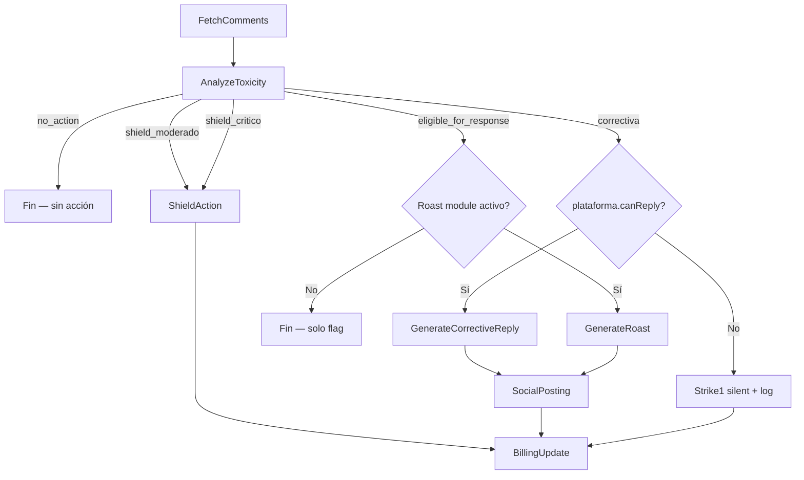
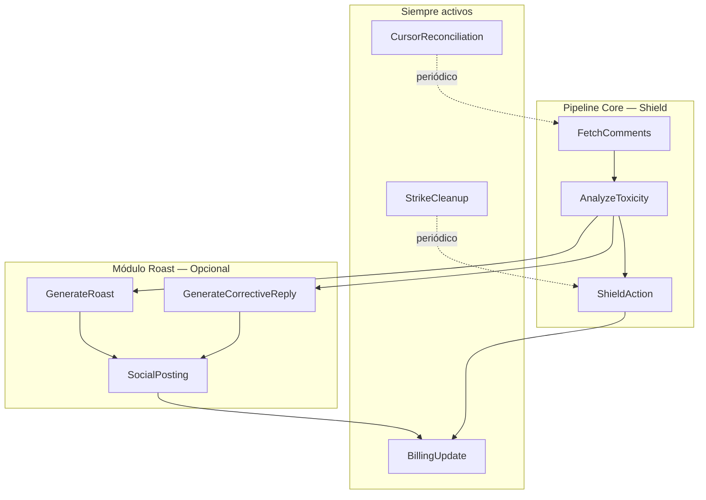

# 8. Workers del Sistema (v3)

*(Versión actualizada para arquitectura Shield-first, BullMQ + Redis, NestJS)*

## 8.1 Descripción general

Los workers ejecutan toda la lógica que **no depende de una request HTTP**:

- Ingestión de comentarios
- Análisis de toxicidad
- Ejecución de acciones del Shield
- Generación de roasts / respuestas correctivas (módulo opcional)
- Publicación en redes (módulo opcional)
- Actualización de contadores de billing
- Mantenimiento periódico (cursores, strikes)

Son **adaptadores secundarios** dentro de la arquitectura hexagonal con NestJS:

```
src/
├── modules/
│   ├── ingestion/
│   │   ├── ingestion.module.ts
│   │   ├── ingestion.processor.ts      # FetchComments
│   │   └── ingestion.service.ts
│   ├── analysis/
│   │   ├── analysis.module.ts
│   │   ├── analysis.processor.ts       # AnalyzeToxicity
│   │   └── analysis.service.ts
│   ├── shield/
│   │   ├── shield.module.ts
│   │   ├── shield.processor.ts         # ShieldAction
│   │   └── shield.service.ts
│   ├── roast/                           # Módulo opcional
│   │   ├── roast.module.ts
│   │   ├── roast.processor.ts          # GenerateRoast
│   │   ├── corrective.processor.ts     # GenerateCorrectiveReply
│   │   └── roast.service.ts
│   ├── posting/                         # Módulo opcional
│   │   ├── posting.module.ts
│   │   └── posting.processor.ts        # SocialPosting
│   ├── billing/
│   │   ├── billing.module.ts
│   │   └── billing.processor.ts        # BillingUpdate
│   └── maintenance/
│       ├── maintenance.module.ts
│       ├── cursor.processor.ts         # CursorReconciliation
│       └── strike-cleanup.processor.ts # StrikeCleanup
├── platforms/
│   ├── platform.port.ts
│   ├── youtube/
│   └── x/
└── shared/
    ├── queue/
    │   └── queue.config.ts             # BullMQ config
    └── logging/
        └── structured-logger.ts
```

### Reglas generales

- **Una única responsabilidad** por worker (processor).
- Reciben **payloads explícitos** desde colas BullMQ.
- Llaman a **servicios de dominio**, no a rutas HTTP internas.
- Usan **retries con backoff** exponencial y DLQ tras 5 intentos.
- Registran **logs JSON estructurados** (sin texto de usuario, GDPR).
- Son **tenant-aware**: siempre incluyen `userId` + `accountId`.
- Cargan configuración desde **SSOT**, nunca constantes hardcoded.

### Infraestructura de colas

```typescript
// BullMQ queues
const QUEUES = {
  INGESTION:   'ingestion',
  ANALYSIS:    'analysis',
  SHIELD:      'shield',
  ROAST:       'roast',        // opcional
  CORRECTIVE:  'corrective',   // opcional
  POSTING:     'posting',      // opcional
  BILLING:     'billing',
  MAINTENANCE: 'maintenance',
} as const;
```

Todas las colas corren sobre **Redis** (Upstash Redis para producción, Redis local para desarrollo).

---

## 8.2 Pipeline por comentario

### 8.2.1 Pipeline Shield (core — siempre activo)



**Principio clave:** El pipeline FetchComments → AnalyzeToxicity → ShieldAction funciona al 100% sin los módulos de Roast ni Posting. Estos son extensiones opcionales.

### 8.2.2 Pipeline completo (con Roast activo)



---

## 8.3 Workers — Detalle

### 8.3.1 FetchComments (Ingestion)

**Responsabilidad:** Traer comentarios nuevos de YouTube/X para una cuenta y encolar su análisis.

**Queue:** `ingestion`

**Input:**

```typescript
interface FetchCommentsJob {
  userId: string;
  accountId: string;
  platform: "youtube" | "x";
  cursor: string | null;
}
```

**Cadencia (BullMQ repeatable jobs):**

| Plan | Intervalo |
|---|---|
| Starter | cada 15 min |
| Pro | cada 10 min |
| Plus | cada 5 min |

**Pre-condiciones (TODAS deben cumplirse):**

- `account.status = 'active'`
- `account.integration_health != 'frozen'`
- `user.analysis_remaining > 0`

Si no se cumplen → el job no hace llamadas a la API, registra `skip_reason` y termina.

**Pipeline:**

1. Leer cursor de la cuenta (`ingestion_cursor`).
2. Llamar al platform adapter: `adapter.fetchComments(cursor, accountId)`.
3. Normalizar resultados a `NormalizedComment` (ver §5.1).
4. Sanitizar texto (normalizar encoding, limpiar caracteres de control, truncar a 5000 chars).
5. Encolar cada comentario en la cola `analysis`.
6. Actualizar `ingestion_cursor` y `last_successful_ingestion`.
7. Reset `consecutive_errors = 0` en éxito.

**El texto del comentario solo existe en memoria dentro del job. No se persiste en ningún storage.**

---

### 8.3.2 AnalyzeToxicity (Analysis)

**Responsabilidad:** Evaluar cada comentario y producir un `AnalysisResult` (ver §5.9) que determina el flujo downstream.

**Queue:** `analysis`

**Input:**

```typescript
interface AnalyzeToxicityJob {
  commentId: string;
  userId: string;
  accountId: string;
  platform: "youtube" | "x";
  text: string;
  authorId: string;
  timestamp: string;
}
```

> Este worker solo recibe comentarios que ya pasaron la pre-condición de tener análisis disponibles.

**Pipeline:**

1. Llamar a **Perspective API** → `score_base` + flags.
2. Si Perspective falla → retry → si sigue fallando → **LLM fallback (GPT-4o-mini)**.
3. Si ambos fallan → `score_base = τ_shield` (conservador, ver §5.3).
4. Calcular **insult density** (heurística + classifier).
5. Cargar **Roastr Persona** del usuario (descifrar en memoria).
6. Ejecutar **PersonaMatcher** → `persona_matches`.
7. Cargar **OffenderProfile** (strikes del autor en 90 días).
8. Ejecutar **analysisReducer** (§5.C.8) → `AnalysisResult`.
9. Despachar según `decision`:

| Decision | Acción |
|---|---|
| `shield_critico` | Encolar en `shield` con severity `"critical"` |
| `shield_moderado` | Encolar en `shield` con severity `"moderate"` |
| `correctiva` | Encolar en `corrective` (si módulo Roast activo) o registrar `strike1_silent` |
| `eligible_for_response` | Encolar en `roast` (si módulo Roast activo) o fin |
| `no_action` | Log estadístico → fin |

10. Encolar `billing` con `type: "analysis"` (1 crédito consumido).

**Errores:**

- Perspective inestable (N fallos seguidos) → alert en logs + Sentry `perspective_unstable`.
- Ambos proveedores fallan → comentario procesado con score conservador, log de severidad alta.

---

### 8.3.3 ShieldAction

**Responsabilidad:** Ejecutar la decisión del Shield en la plataforma (ocultar, reportar, bloquear, gestionar strikes).

**Queue:** `shield`

**Input:**

```typescript
interface ShieldActionJob {
  commentId: string;
  userId: string;
  accountId: string;
  platform: "youtube" | "x";
  severity: "moderate" | "critical";
  offenderId: string;
  analysisResult: {
    severity_score: number;
    flags: {
      has_identity_attack: boolean;
      has_threat: boolean;
      matched_red_lines: string[];
    };
    aggressiveness: number;
  };
}
```

**Reglas:**

1. El worker **nunca publica contenido**, solo ejecuta moderación.
2. **No guarda texto del comentario** en ningún log (GDPR).
3. Consulta `platform.capabilities` antes de ejecutar cada acción.

**Pipeline — Shield Moderado:**

1. Intentar **ocultar** (`adapter.hideComment`).
2. Si la plataforma no soporta hide → **bloquear** (`adapter.blockUser`).
3. Si el ofensor tiene Strike 1 → escalar a Strike 2.
4. Si Strike 2 + reincidencia → considerar report (si `canReport`).
5. Registrar `shield_log` (ver §7.6).

**Pipeline — Shield Crítico:**

1. **Ocultar** (si `canHide`).
2. **Reportar** (si `canReport` + amenaza/identity attack).
3. **Bloquear** (si `canBlock` + amenaza/identity attack).
4. Registrar `shield_log` con `action_taken` y `platform_fallback` si hubo fallback.

**Fallback chain:**

```
hide → block → log_only
report → hide + block → log_only
```

Si todas las acciones fallan → retry con backoff → DLQ (sin texto).

---

### 8.3.4 GenerateRoast (Módulo opcional)

> **Este worker solo existe si el módulo de Roasting está activo.** El Shield funciona sin él.

**Responsabilidad:** Generar roast(s) para un comentario marcado como `eligible_for_response`.

**Queue:** `roast`

**Input:**

```typescript
interface GenerateRoastJob {
  commentId: string;
  userId: string;
  accountId: string;
  platform: "youtube" | "x";
  text: string;
  tone: "flanders" | "balanceado" | "canalla" | "personal";
  styleProfileId?: string;
  autoApprove: boolean;
}
```

**Pipeline:**

1. Verificar que la plataforma soporta replies (`capabilities.canReply`). Si no → fin con log.
2. Cargar configuración desde SSOT (modelo LLM, variantes, límites de longitud).
3. Construir prompt (bloques A/B/C del Motor de Roasting §6).
4. Llamar al LLM.
5. Validar longitud y contenido (Style Validator).
6. Guardar `RoastCandidate` en DB.
7. Si `autoApprove = true` y roast válido → encolar en `posting`.
8. Si `autoApprove = false` → marcar como `pending_user_review` en UI.
9. Encolar `billing` con `type: "roast"` (1 crédito consumido).

---

### 8.3.5 GenerateCorrectiveReply (Módulo opcional)

> **Este worker solo existe si el módulo de Roasting está activo.** Si no está activo, el AnalyzeToxicity registra `strike1_silent` directamente.

**Responsabilidad:** Generar una respuesta correctiva (Strike 1).

**Queue:** `corrective`

**Input:**

```typescript
interface GenerateCorrectiveJob {
  commentId: string;
  userId: string;
  accountId: string;
  platform: "youtube" | "x";
  text: string;
}
```

**Pre-condición:** `platform.capabilities.canReply = true` (verificado por AnalyzeToxicity antes de encolar).

**Pipeline:**

1. Cargar prompt de "Respuesta Correctiva" desde SSOT (tono institucional fijo).
2. Llamar al LLM.
3. Validar: no puede ser humorístico, no puede ridiculizar.
4. Guardar `CorrectiveReply`.
5. Si `autoApprove = true` → encolar en `posting`.
6. Si `autoApprove = false` → `pending_user_review` en UI.
7. Registrar Strike 1 del ofensor.
8. Encolar `billing` con `type: "analysis"` (consume crédito de análisis, no de roast).

---

### 8.3.6 SocialPosting (Módulo opcional)

> **Este worker solo existe si el módulo de Roasting está activo.**

**Responsabilidad:** Publicar texto (roast o correctiva) en la plataforma.

**Queue:** `posting`

**Input:**

```typescript
interface SocialPostingJob {
  userId: string;
  accountId: string;
  platform: "youtube" | "x";
  text: string;
  parentCommentRef: string;
  type: "roast" | "corrective";
}
```

**Reglas:**

1. Verificar `platform.capabilities.canReply` (defensa en profundidad).
2. **No almacenar texto publicado** en logs (GDPR).
3. Añadir **disclaimer IA** cuando `autoApprove = true` y región bajo DSA / AI Act.
4. Aplicar **smart delay** por cuenta para evitar patrones tipo bot.
5. En X: si el comentario está dentro de la ventana de edición (30 min) → retrasar autopost. Shield actúa inmediatamente.
6. Guardar solo: `posted_message_id`, `timestamp`, `platform`. No el texto.

**Errores:**

- 429 / 503 → retry con backoff → DLQ sin texto ni prompts.
- `canReply = false` detectado en runtime → descartar silenciosamente + log `post_discarded_no_reply`.

---

### 8.3.7 BillingUpdate

**Responsabilidad:** Actualizar contadores de uso.

**Queue:** `billing`

**Input:**

```typescript
interface BillingUpdateJob {
  userId: string;
  accountId: string;
  type: "analysis" | "roast";
}
```

**Eventos que consumen créditos:**

| Evento | Tipo | Crédito |
|---|---|---|
| Análisis completado | `analysis` | 1 análisis |
| Roast generado | `roast` | 1 roast |
| Roast regenerado | `roast` | 1 roast |
| Respuesta correctiva publicada | `analysis` | 1 análisis |

**Pipeline:**

1. Incrementar contador en `subscriptions_usage` (`analysis_used` o `roasts_used`).
2. Si límite agotado:
   - `analysis_exhausted` → emitir evento para que FetchComments deje de encolar.
   - `roasts_exhausted` → emitir evento para que GenerateRoast no encole posting.
3. Reset al inicio de cada ciclo de billing (webhook de Polar).

---

### 8.3.8 CursorReconciliation (Maintenance)

**Responsabilidad:** Mantener cursores de ingestión sanos.

**Queue:** `maintenance` (job periódico, 1x/día)

**Pipeline:**

1. Revisar `last_successful_ingestion` de cada cuenta activa.
2. Si detecta:
   - Demasiados errores seguidos (`consecutive_errors > 10`)
   - Cursor muy antiguo (> 7 días sin fetch exitoso)
   - → Reset parcial del cursor a un punto seguro
   - → O marcar cuenta como `inactive` temporalmente
3. Nunca borra datos, solo reajusta puntos de lectura.

---

### 8.3.9 StrikeCleanup (Maintenance)

**Responsabilidad:** Limpiar strikes expirados (ventana de 90 días).

**Queue:** `maintenance` (job periódico, 1x/día)

**Pipeline:**

1. Buscar strikes con `created_at < now() - 90 days`.
2. Archivar o borrar esos registros.
3. Reset `strike_level` del ofensor si todos sus strikes expiraron.

---

## 8.4 Retries, Backoff y Dead Letter Queue

**Política general (configurada en BullMQ):**

```typescript
const DEFAULT_JOB_OPTIONS: JobsOptions = {
  attempts: 5,
  backoff: {
    type: 'exponential',
    delay: 60_000,  // 1min base → 2min → 4min → 8min → 16min
  },
  removeOnComplete: true,
  removeOnFail: false,  // mantener en DLQ para revisión
};
```

| Intento | Delay | Acción |
|---|---|---|
| 1 | Inmediato | Ejecución normal |
| 2 | 1 min | Retry |
| 3 | 2 min | Retry con backoff |
| 4 | 4 min | Retry con backoff |
| 5 | 8 min | DLQ |

### Dead Letter Queue

Jobs que fallan 5 veces se mueven a DLQ para revisión manual.

**Payload en DLQ (sanitizado):**

```typescript
interface DlqEntry {
  jobType: string;
  userId: string;
  accountId: string;
  platform: string;
  attemptCount: number;
  finalErrorCode: string;
  failedAt: string;
  // NUNCA: text, prompts, roast content, comment text
}
```

**Reglas GDPR para DLQ:**

- No `comment.text`, no `roast.text`, no prompts, no contenido de IA
- Solo IDs, timestamps, metadatos técnicos, hashes, tipo de acción

---

## 8.5 Logs y Telemetría

Todos los logs son **JSON estructurado**, GDPR compliant:

```typescript
interface WorkerLog {
  timestamp: string;
  worker: string;
  userId: string;
  accountId: string;
  platform: string;
  jobId: string;
  durationMs: number;
  success: boolean;
  errorCode?: string;
  retryCount: number;
  // NUNCA: text, prompts, roast content
}
```

**Telemetría agregada permitida:**

- Comentarios ingeridos (por cuenta, por plataforma)
- Análisis completados
- Acciones Shield ejecutadas (por severidad)
- Roasts generados / publicados (si módulo activo)
- Jobs en DLQ por worker
- Errores por proveedor (Perspective, LLM, YouTube API, X API)
- Latencia media por worker

**Prohibido en logs:**

- Texto de comentarios
- Contenido de roasts/correctivas
- Prompts o respuestas de IA
- Tokens OAuth
- Keywords de Persona descifradas

Si se detecta intento de logear contenido sensible → bloqueo automático + log `log_blocked_sensitive_content`.

---

## 8.6 Tenancy y SSOT

### Tenancy

1. Todo payload incluye `userId` + `accountId`.
2. Todas las queries a DB filtran por `userId` (RLS en Supabase).
3. Ningún worker puede tocar datos de otro usuario/cuenta.

### SSOT

Los workers **nunca** definen valores críticos en código:

| Configuración | Fuente |
|---|---|
| Thresholds de Shield (τ_low, τ_shield, τ_critical) | SSOT (admin_settings) |
| Límites de plan (análisis, roasts, cuentas) | SSOT + Polar webhooks |
| Cadencias de ingestión | SSOT por plan |
| Modelos LLM por tono | SSOT |
| Pesos de Persona/Reincidencia | SSOT |
| Platform capabilities | Platform adapter (runtime) |

Configuraciones se cachean temporalmente (TTL 5 min) pero siempre provienen de SSOT.

---

## 8.7 Dependencias

- **BullMQ + Redis:** Sistema de colas. Upstash Redis en producción.
- **Platform Adapters (§4):** FetchComments y ShieldAction llaman a los adapters de YouTube/X.
- **Motor de Análisis (§5):** AnalyzeToxicity ejecuta el reducer y sus dependencias.
- **Shield (§7):** ShieldAction implementa las reglas del Shield consultando capabilities.
- **Billing (§3):** BillingUpdate sincroniza contadores. Polar webhooks resetean ciclos.
- **Supabase:** Storage de cuentas, strikes, logs, configuración.
- **Perspective API + OpenAI:** Usados por AnalyzeToxicity (análisis de toxicidad).
