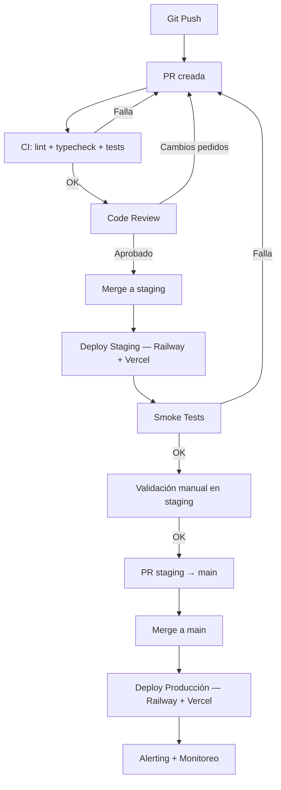

# 14. Infraestructura (v3)

*(Versión actualizada para Railway + Vercel + Supabase + Upstash)*

---

## 14.1 Principios

1. **Aislamiento total** entre staging y producción.
2. **Deploys reproducibles, auditables y reversibles.**
3. **Observabilidad obligatoria.**
4. **Toda configuración visible y declarada** — nada hardcoded.

---

## 14.2 Plataformas de deploy

| Componente | Staging | Producción |
|---|---|---|
| Frontend | Vercel Preview (branch `staging`) | Vercel Production (branch `main`) |
| Backend API | Railway (servicio `api-staging`) | Railway (servicio `api-prod`) |
| Workers | Railway (servicio `worker-staging`) | Railway (servicio `worker-prod`) |
| Redis | Upstash (instancia staging) | Upstash (instancia prod) |
| Database | Supabase (proyecto staging) | Supabase (proyecto prod) |
| Billing | Polar (test mode) | Polar (live mode) |

**Nada se comparte entre staging y producción:** ni DB, ni Redis, ni colas, ni tokens OAuth, ni API keys.

---

## 14.3 CI/CD Pipeline

```
Git push →
PR creada →
CI: lint + typecheck + unit + integration + E2E →
Code review (humano) →
Merge a staging →
Deploy automático a Staging →
Smoke tests →
Promoción manual → merge a main →
Deploy automático a Producción →
Alerting + monitoreo
```

### Reglas

- Nada entra en `staging` sin: lint, typecheck, Vitest, integration tests, Playwright E2E.
- Staging se despliega automáticamente al merge.
- **Producción se despliega automáticamente al merge a `main`**, pero el merge a `main` requiere aprobación humana.
- Cada deploy queda registrado (Railway deploy logs + Vercel deploy logs).

### Smoke tests (post-deploy staging)

```
GET /health          → 200
GET /health/db       → 200 (Supabase connection)
GET /health/redis    → 200 (Upstash connection)
GET /health/workers  → 200 (BullMQ queues responsive)
```

---

## 14.4 Branching strategy

```
main          → producción (auto-deploy Vercel + Railway)
staging       → staging (auto-deploy Vercel preview + Railway staging)
feature/*     → PRs → merge a staging
fix/*         → PRs → merge a staging
```

Flujo:

1. Desarrollar en `feature/xxx` o `fix/xxx`
2. PR contra `staging`
3. CI pasa + code review → merge a `staging`
4. Validar en staging
5. PR de `staging` contra `main` → merge → producción

---

## 14.5 Base de datos — Supabase

Dos proyectos completamente separados:

### Staging

- Mismas migraciones que prod
- Mismo RLS
- Datos ficticios / seeds controlados
- Auditoría opcional

### Producción

- Datos reales
- Auditoría obligatoria
- Sin seeds ni réplicas de staging

### Regla

> Toda migración pasa por staging primero. Nunca se aplica una migración directamente a prod.

```bash
# Desarrollo local
npx supabase migration new add_shield_logs
npx supabase db push  # aplica a local

# Staging
npx supabase db push --project-ref $STAGING_REF

# Producción (después de validar en staging)
npx supabase db push --project-ref $PROD_REF
```

---

## 14.6 Workers y colas — BullMQ + Upstash Redis

### Aislamiento de colas

Cada entorno tiene sus propias colas con prefijo:

```
stg:ingestion
stg:analysis
stg:shield
stg:roast
stg:posting
stg:billing
stg:maintenance

prod:ingestion
prod:analysis
prod:shield
prod:roast
prod:posting
prod:billing
prod:maintenance
```

### Configuración

```typescript
const QUEUE_PREFIX = process.env.QUEUE_PREFIX || 'dev';

new Queue(`${QUEUE_PREFIX}:ingestion`, { connection: redisConfig });
```

### Regla

> Ningún worker puede consumir una cola que no sea de su entorno.

Validado via `QUEUE_PREFIX` en env vars + health check que verifica prefijo al arrancar.

---

## 14.7 Variables de entorno

Cada entorno tiene su propio set completo. No se comparten claves entre staging y producción.

### Variables requeridas

```bash
# Supabase
SUPABASE_URL=
SUPABASE_ANON_KEY=
SUPABASE_SERVICE_ROLE_KEY=

# Redis (Upstash)
REDIS_URL=

# Queue
QUEUE_PREFIX=stg|prod

# OAuth — YouTube
YOUTUBE_CLIENT_ID=
YOUTUBE_CLIENT_SECRET=
YOUTUBE_REDIRECT_URI=

# OAuth — X
X_CLIENT_ID=
X_CLIENT_SECRET=
X_REDIRECT_URI=

# AI
OPENAI_API_KEY=
PERSPECTIVE_API_KEY=

# Billing
POLAR_WEBHOOK_SECRET=

# Email
RESEND_API_KEY=

# App
NODE_ENV=staging|production
API_URL=
FRONTEND_URL=
```

**Nunca hardcodear valores.** Todo via env vars cargadas por NestJS `ConfigModule`.

---

## 14.8 Observabilidad

### Logs estructurados (JSON)

```typescript
interface StructuredLog {
  timestamp: string;
  env: "staging" | "production";
  service: "api" | "worker";
  module: string;
  userId?: string;
  accountId?: string;
  action: string;
  durationMs?: number;
  success: boolean;
  errorCode?: string;
}
```

### Destinos

| Servicio | Destino |
|---|---|
| Backend API | Railway logs (built-in) + opcional Axiom/Logtail |
| Workers | Railway logs (servicio separado) |
| Frontend | Sentry (errores client-side) |

### Métricas clave

- Request latency (p50, p95, p99)
- Error rate (5xx / total)
- Worker job completion rate
- DLQ size por queue
- BullMQ queue depth (jobs waiting)

---

## 14.9 Alertas

| Severidad | Trigger | Acción |
|---|---|---|
| **Alta** | Workers caídos, Perspective API down, 500s > 1% en 10min, billing webhook fails | Notificación inmediata |
| **Media** | Ingestión intermitente, backoff excesivo, DLQ > 20 jobs, rate limit 429s frecuentes | Notificación + investigar |
| **Baja** | Errores UI menores, login fallidos, DLQ < 5 | Log + revisar en next sprint |

### Error budget

| Tipo | Límite | Consecuencia |
|---|---|---|
| 5xx en backend | > 1% en 10 min | Bloqueo de deploy a prod |
| E2E fails en staging | > 3 consecutivos | Bloqueo de deploy |
| DLQ size | > 20 jobs | Alerta alta |
| Rate limit 429s | > 5 en 5 min | Alerta media + throttle |

---

## 14.10 Backups

### Supabase

| Entorno | Retención |
|---|---|
| Staging | 7 días |
| Producción | 30 días (point-in-time recovery) |

### Se incluyen

- profiles, accounts, subscriptions_usage
- shield_logs, offenders, roast_candidates
- admin_settings (SSOT), feature_flags
- admin_logs

### No se incluyen

- Tokens OAuth caducados (se regeneran)
- Logs de workers > 30 días
- DLQ jobs procesados

### Restauración

1. Pausar workers (`QUEUE_PREFIX` → desconectar)
2. Restaurar snapshot de Supabase
3. Verificar migraciones y RLS
4. Smoke tests
5. Reactivar workers

Simulacro de restauración cada 90 días.

---

## 14.11 Rate Limits

### Internos (backend API)

- API general: 60 req/min por usuario
- Auth endpoints: 5 req/15min por IP (ver §2)
- Webhook endpoint: no rate limit (verificación por firma)

### Externos

| Servicio | Límite |
|---|---|
| YouTube Data API | 10,000 units/día por proyecto |
| X API (Free) | 1,500 reads/month, 500 posts/month |
| X API (Basic) | 10,000 reads/month, 3,000 posts/month |
| Perspective API | 1,000 req/100s (gratis) |
| OpenAI (GPT-4o-mini) | Según tier contratado |

---

## 14.12 Seguridad de infra

- Supabase RLS activo en todas las tablas
- Service Role Key solo en backend/workers (nunca en frontend)
- Env vars cifradas en Railway y Vercel
- HTTPS obligatorio en todos los endpoints
- CORS configurado para solo permitir `FRONTEND_URL`
- Webhook signatures verificadas (Polar)

---

## 14.13 Diagrama del pipeline



---

## 14.14 Dependencias

- **Railway:** Backend API + Workers. Dockerized deploys.
- **Vercel:** Frontend. Auto-deploy desde GitHub.
- **Supabase:** 2 proyectos (staging + prod). DB + Auth + RLS.
- **Upstash Redis:** 2 instancias (staging + prod). BullMQ queues.
- **Sentry:** Error tracking frontend.
- **Polar:** Billing webhooks (test mode en staging, live en prod).
