# Agent/Subagent Inventory - Roastr AI

**Last Updated:** 2025-10-19
**Maintained by:** Orchestrator

---

## 🎯 Agent Classification

Agents are classified into 3 categories:

1. **Claude Code Built-in Agents** - Provided by Claude Code framework (Task tool)
2. **Domain Role Agents** - Logical roles referenced in GDD nodes (conceptual, not implemented)
3. **Guardian System** - Custom governance automation (implemented script)

---

## 1️⃣ Claude Code Built-in Agents

These agents are invoked via the `Task` tool and run autonomously.

### 1.1 general-purpose

- **Name:** general-purpose
- **Path(s):** Built-in Claude Code agent (no file path)
- **Purpose:**
  - General-purpose research for complex questions
  - Multi-step task execution
  - Code search when uncertain of exact location
- **Triggers:**
  - Complex tasks requiring multiple search attempts
  - Open-ended research questions
  - When keyword/file location is uncertain
- **Inputs/Outputs:**
  - Input: Task description, thoroughness level
  - Output: Research findings, recommendations, file locations
- **Tools/Context:**
  - Access to all tools: Read, Edit, Glob, Grep, Bash, Write
- **Risks/Guardrails:**
  - ❌ DO NOT use for simple file reads (use Read tool directly)
  - ❌ DO NOT use for specific class searches (use Glob directly)
  - ❌ DO NOT use for 2-3 file searches (use Read directly)
- **Status:** ✅ **implemented** (Claude Code framework)

---

### 1.2 Explore

- **Name:** Explore
- **Path(s):** Built-in Claude Code agent (no file path)
- **Purpose:**
  - Fast codebase exploration
  - Pattern-based file finding (e.g., `src/components/**/*.tsx`)
  - Keyword searches across codebase
  - Answering "how does X work?" questions
- **Triggers:**
  - User asks "Where are errors from the client handled?"
  - User asks "What is the codebase structure?"
  - Exploring unfamiliar codebase areas
  - Questions NOT needle queries for specific file/class/function
- **Inputs/Outputs:**
  - Input: Thoroughness level (quick/medium/very thorough), search criteria
  - Output: File patterns, code locations, architecture insights
- **Tools/Context:**
  - Glob, Grep, Read, Bash
- **Risks/Guardrails:**
  - ❌ DO NOT use for needle queries (specific file/class)
  - ✅ MUST specify thoroughness level: quick, medium, very thorough
- **Status:** ✅ **implemented** (Claude Code framework)

---

### 1.3 Test Engineer

- **Name:** Test Engineer
- **Path(s):** Built-in Claude Code agent (no file path)
- **Purpose:**
  - Create comprehensive test suites
  - Generate E2E tests with Playwright
  - Produce visual evidence (screenshots, reports)
  - Validate test coverage
- **Triggers:**
  - After changes in `src/` files
  - After design docs changes
  - When new features are implemented
  - Label: `test:unit`, `test:integration`, `test:e2e`
  - Explicitly mentioned in CLAUDE.md: "Invocar Test Engineer tras cambios en src/"
- **Inputs/Outputs:**
  - Input: Source code changes, design specs
  - Output: Test files, coverage reports, visual evidence in `docs/test-evidence/`
- **Tools/Context:**
  - Playwright MCP (for E2E visual tests)
  - Jest (for unit/integration tests)
  - All file tools (Read, Write, Edit)
- **Risks/Guardrails:**
  - ❌ NEVER commit code without tests
  - ❌ NEVER skip visual evidence for frontend changes
  - ✅ MUST coordinate with Orchestrator before closing if tests missing
- **Status:** ✅ **implemented** (Claude Code framework)

---

### 1.4 Task Assessor

- **Name:** Task Assessor
- **Path(s):** Built-in Claude Code agent (no file path)
- **Purpose:**
  - Assess task state before implementation
  - Recommend action: CREATE | FIX | ENHANCE | CLOSE
  - Generate assessment reports in `docs/assessment/<issue>.md`
- **Triggers:**
  - Tasks with ≥3 acceptance criteria
  - P0/P1 critical issues
  - Complex features, integrations, refactors
  - **NOT triggered for:** simple docs, config, small fixes (≤2 AC)
- **Inputs/Outputs:**
  - Input: Issue number, labels, description
  - Output: `docs/assessment/<issue>.md` with recommendation
- **Tools/Context:**
  - Read, Grep, Glob (for code exploration)
  - Access to codebase and test results
- **Risks/Guardrails:**
  - ❌ DO NOT invoke for simple tasks (≤2 AC)
  - ✅ MUST read `docs/patterns/coderabbit-lessons.md` first
  - ✅ Assessment must include "Estado Actual" section
- **Status:** ✅ **implemented** (Claude Code framework)

---

### 1.5 Front-end Dev

- **Name:** Front-end Dev
- **Path(s):** Built-in Claude Code agent (no file path)
- **Purpose:**
  - Implement UI components
  - Frontend logic and state management
  - User experience implementation
- **Triggers:**
  - Label: `area:frontend`, `ui`, `component`
  - Issues related to UI implementation (e.g., Issue #419 - Manual approval UI)
- **Inputs/Outputs:**
  - Input: Design specs, UI requirements
  - Output: React components, CSS, frontend tests
- **Tools/Context:**
  - All file tools
  - Playwright MCP for visual testing
- **Risks/Guardrails:**
  - ❌ NEVER skip visual evidence (screenshots + `docs/ui-review.md`)
  - ✅ MUST use Playwright MCP for validation
  - ✅ MUST capture multiple viewports
- **Status:** ✅ **implemented** (Claude Code framework)

---

### 1.6 UI Designer

- **Name:** UI Designer
- **Path(s):** Built-in Claude Code agent (no file path)
- **Purpose:**
  - Design UI/UX specifications
  - Create wireframes and mockups
  - Define design patterns
- **Triggers:**
  - Design-related tasks
  - New feature UI planning
- **Inputs/Outputs:**
  - Input: Feature requirements
  - Output: Design specs, mockups
- **Tools/Context:**
  - Documentation tools
- **Risks/Guardrails:**
  - ❌ DO NOT implement without approval
  - ✅ MUST align with existing design system
- **Status:** ✅ **implemented** (Claude Code framework)

---

### 1.7 statusline-setup

- **Name:** statusline-setup
- **Path(s):** Built-in Claude Code agent (no file path)
- **Purpose:**
  - Configure Claude Code status line settings
- **Triggers:**
  - User requests status line configuration
- **Inputs/Outputs:**
  - Input: Configuration preferences
  - Output: Updated status line settings
- **Tools/Context:**
  - Read, Edit
- **Risks/Guardrails:**
  - N/A
- **Status:** ✅ **implemented** (Claude Code framework)

---

### 1.8 output-style-setup

- **Name:** output-style-setup
- **Path(s):** Built-in Claude Code agent (no file path)
- **Purpose:**
  - Create Claude Code output style configurations
- **Triggers:**
  - User requests output style customization
- **Inputs/Outputs:**
  - Input: Style preferences
  - Output: Output style configuration
- **Tools/Context:**
  - Read, Write, Edit, Glob, Grep
- **Risks/Guardrails:**
  - N/A
- **Status:** ✅ **implemented** (Claude Code framework)

---

### 1.9 Whimsy Injector

- **Name:** Whimsy Injector
- **Path(s):** Built-in Claude Code agent (no file path)
- **Purpose:**
  - (Purpose not documented in Claude Code)
- **Triggers:**
  - Unknown
- **Inputs/Outputs:**
  - Unknown
- **Tools/Context:**
  - Unknown
- **Risks/Guardrails:**
  - Unknown
- **Status:** ✅ **implemented** (Claude Code framework, undocumented)

---

## 2️⃣ Domain Role Agents (Conceptual)

These are logical roles referenced in GDD nodes (`docs/nodes/*.md`). They are **not implemented agents** but rather **roles** that the Orchestrator or human developers fulfill.

### 2.1 Orchestrator

- **Name:** Orchestrator
- **Path(s):** Conceptual role (no file path)
- **Purpose:**
  - Coordinate all subagents and tasks
  - Maintain `spec.md` and GDD nodes
  - Execute planning and implementation workflows
  - Manage GDD node "Agentes Relevantes" sections
- **Triggers:**
  - Every issue and PR
  - All planning phases (FASE 0, FASE 2)
  - GDD validation and health scoring
- **Inputs/Outputs:**
  - Input: Issues, PRs, user requests
  - Output: Plans, implementations, documentation updates
- **Tools/Context:**
  - All GDD scripts (`validate-gdd-runtime.js`, `score-gdd-health.js`, etc.)
  - All Claude Code tools
  - Invokes other agents via Task tool
- **Risks/Guardrails:**
  - ❌ NEVER skip planning mode
  - ❌ NEVER load entire `spec.md` (use resolved nodes only)
  - ❌ NEVER continue without assessment (FASE 0)
  - ✅ MUST update "Agentes Relevantes" after invoking agents
  - ✅ MUST validate GDD before commit
- **Status:** 🎯 **documented** (role fulfilled by Claude/human)

**Referenced in nodes:**
- cost-control.md
- billing.md
- queue-system.md
- roast.md
- shield.md
- observability.md

---

### 2.2 Documentation Agent

- **Name:** Documentation Agent
- **Path(s):** Conceptual role (no file path)
- **Purpose:**
  - Maintain GDD node documentation
  - Ensure `spec.md` synchronization
  - Update documentation after code changes
- **Triggers:**
  - Code changes in related files
  - GDD drift detected
  - Documentation updates needed
- **Inputs/Outputs:**
  - Input: Code changes, drift reports
  - Output: Updated `docs/nodes/*.md`, `spec.md`
- **Tools/Context:**
  - Read, Write, Edit
  - GDD validation scripts
- **Risks/Guardrails:**
  - ❌ NEVER manually modify `**Coverage:**` values
  - ✅ MUST use `Coverage Source: auto`
  - ✅ MUST validate after edits
- **Status:** 📚 **documented** (role fulfilled by Orchestrator)

**Referenced in nodes:** All 14 GDD nodes

---

### 2.3 Backend Developer (Back-end Dev Agent)

- **Name:** Backend Developer / Back-end Dev Agent
- **Path(s):** Conceptual role (no file path)
- **Purpose:**
  - Implement backend services and APIs
  - Create workers, services, middleware
  - Database schema and migrations
- **Triggers:**
  - Label: `area:backend`, `area:api`
  - Changes in `src/services/`, `src/workers/`, `src/routes/`
- **Inputs/Outputs:**
  - Input: Feature specs, API requirements
  - Output: Node.js services, tests, documentation
- **Tools/Context:**
  - All development tools
  - Database access (Supabase)
  - API integrations
- **Risks/Guardrails:**
  - ❌ NEVER commit without tests
  - ❌ NEVER hardcode credentials
  - ✅ MUST follow multi-tenant patterns
  - ✅ MUST update GDD nodes
- **Status:** 🎯 **documented** (role fulfilled by Claude/human)

**Referenced in nodes:** All 14 GDD nodes (most common agent)

---

### 2.4 Security Engineer

- **Name:** Security Engineer
- **Path(s):** Conceptual role (no file path)
- **Purpose:**
  - Security audits and reviews
  - Encryption implementation
  - Authentication and authorization
  - RLS policy validation
- **Triggers:**
  - Label: `security`, `encryption`, `auth`
  - Changes in security-sensitive code
  - Guardian CRITICAL violations
- **Inputs/Outputs:**
  - Input: Code changes, security requirements
  - Output: Security reviews, encryption implementations, RLS policies
- **Tools/Context:**
  - Security scanning tools
  - Database access for RLS
- **Risks/Guardrails:**
  - ❌ NEVER skip security reviews for auth changes
  - ❌ NEVER expose credentials in logs/docs
  - ✅ MUST validate encryption keys (never change after deployment)
- **Status:** 🎯 **documented** (role fulfilled by Claude/human)

**Referenced in nodes:**
- multi-tenant.md
- shield.md

---

### 2.5 Database Admin

- **Name:** Database Admin
- **Path(s):** Conceptual role (no file path)
- **Purpose:**
  - Schema design and migrations
  - RLS policy creation
  - Performance optimization
  - pgvector extension management
- **Triggers:**
  - Label: `database`, `schema`, `migration`
  - Changes in `database/` directory
- **Inputs/Outputs:**
  - Input: Schema requirements
  - Output: SQL migrations, RLS policies, indexes
- **Tools/Context:**
  - Supabase CLI
  - PostgreSQL
- **Risks/Guardrails:**
  - ❌ NEVER run destructive migrations in production without backup
  - ❌ NEVER skip RLS validation
  - ✅ MUST test migrations in dev first
- **Status:** 🎯 **documented** (role fulfilled by human)

**Referenced in nodes:**
- multi-tenant.md

---

### 2.6 Test Engineer (Role)

**Note:** This is distinct from the Claude Code "Test Engineer" agent. This refers to the conceptual role.

- **Name:** Test Engineer (Role)
- **Path(s):** Conceptual role (no file path)
- **Purpose:**
  - Create and maintain test suites
  - Ensure coverage targets
  - E2E test implementation
  - Visual evidence generation
- **Triggers:**
  - All code changes
  - Coverage drops
  - CI/CD failures
- **Inputs/Outputs:**
  - Input: Code changes
  - Output: Test files, coverage reports, evidence
- **Tools/Context:**
  - Jest, Playwright
  - Coverage tools
- **Risks/Guardrails:**
  - ❌ NEVER allow 0 tests for new code
  - ✅ MUST achieve coverage targets
  - ✅ MUST generate visual evidence for frontend
- **Status:** 🎯 **documented** (role fulfilled by Claude Code Test Engineer agent)

**Referenced in nodes:** All 14 GDD nodes

---

### 2.7 Product Owner

- **Name:** Product Owner
- **Path(s):** Conceptual role (no file path)
- **Purpose:**
  - Review CRITICAL Guardian violations
  - Approve pricing/quota changes
  - Define product requirements
- **Triggers:**
  - Guardian CRITICAL violations (pricing, quotas, auth)
  - Major product changes
- **Inputs/Outputs:**
  - Input: Guardian reports, product proposals
  - Output: Approval/rejection decisions
- **Tools/Context:**
  - Guardian reports
  - GitHub issues
- **Risks/Guardrails:**
  - ❌ NEVER skip approval for CRITICAL violations
  - ✅ MUST review all Guardian cases in `docs/guardian/cases/`
- **Status:** 🎯 **documented** (role fulfilled by human - Emilio)

**Referenced in nodes:**
- guardian.md

---

### 2.8 Billing Specialist

- **Name:** Billing Specialist
- **Path(s):** Conceptual role (no file path)
- **Purpose:**
  - Implement billing logic
  - Integrate payment gateways (Polar)
  - Manage subscription tiers
- **Triggers:**
  - Label: `area:billing`, `payment`
  - Changes in `src/services/costControl.js`, billing routes
- **Inputs/Outputs:**
  - Input: Pricing model, payment requirements
  - Output: Billing service, payment integrations
- **Tools/Context:**
  - Polar API
  - Stripe (future)
- **Risks/Guardrails:**
  - ❌ NEVER skip payment validation
  - ❌ NEVER log sensitive payment data
  - ✅ MUST test in sandbox mode first
- **Status:** 🎯 **documented** (role fulfilled by Backend Developer)

**Referenced in nodes:**
- cost-control.md
- billing.md

---

### 2.9 API Specialist

- **Name:** API Specialist
- **Path(s):** Conceptual role (no file path)
- **Purpose:**
  - Design and implement API endpoints
  - API documentation (OpenAPI/Swagger)
  - Rate limiting and versioning
- **Triggers:**
  - Label: `area:api`
  - New API endpoints
  - Changes in `src/routes/`
- **Inputs/Outputs:**
  - Input: API requirements
  - Output: Express routes, API docs, tests
- **Tools/Context:**
  - Express.js
  - OpenAPI tools
- **Risks/Guardrails:**
  - ❌ NEVER skip JWT validation
  - ❌ NEVER expose internal errors to clients
  - ✅ MUST implement rate limiting
- **Status:** 🎯 **documented** (role fulfilled by Backend Developer)

**Referenced in nodes:**
- social-platforms.md

---

### 2.10 Integration Specialist

- **Name:** Integration Specialist
- **Path(s):** Conceptual role (no file path)
- **Purpose:**
  - Implement platform integrations (Twitter, YouTube, etc.)
  - OAuth flows
  - API client wrappers
  - Follow Integration Workflow from CLAUDE.md
- **Triggers:**
  - Label: `area:social`, `integration`
  - Changes in `src/integrations/`
  - New platform support
- **Inputs/Outputs:**
  - Input: Platform API docs, auth requirements
  - Output: Service files (`<platform>Service.js`), tests, documentation
- **Tools/Context:**
  - Platform APIs (Twitter, YouTube, Instagram, etc.)
  - OAuth libraries
- **Risks/Guardrails:**
  - ❌ NEVER duplicate service files (check for existing first)
  - ❌ NEVER include credentials in docs
  - ✅ MUST follow naming convention: `<platform>Service.js`
  - ✅ MUST update `docs/INTEGRATIONS.md` and `docs/nodes/social-platforms.md`
  - ✅ MUST register in `FetchCommentsWorker.js`
- **Status:** 🎯 **documented** (role fulfilled by Backend Developer)

**Referenced in nodes:**
- social-platforms.md
- platform-constraints.md

---

### 2.11 Performance Monitor

- **Name:** Performance Monitor
- **Path(s):** Conceptual role (no file path)
- **Purpose:**
  - Monitor system performance
  - Optimize slow queries
  - Queue performance tuning
  - Identify bottlenecks
- **Triggers:**
  - Label: `performance`, `optimization`
  - Performance degradation detected
  - Queue delays
- **Inputs/Outputs:**
  - Input: Performance metrics, logs
  - Output: Optimization recommendations, code improvements
- **Tools/Context:**
  - Observability tools (Datadog, CloudWatch)
  - Database query analyzers
- **Risks/Guardrails:**
  - ❌ NEVER optimize prematurely
  - ✅ MUST measure before and after
  - ✅ MUST maintain test coverage
- **Status:** 🎯 **documented** (role fulfilled by Backend Developer)

**Referenced in nodes:**
- queue-system.md

---

### 2.12 UX Designer

- **Name:** UX Designer
- **Path(s):** Conceptual role (no file path)
- **Purpose:**
  - Design user experiences
  - Define user flows
  - Create interaction patterns
- **Triggers:**
  - Label: `ux`, `design`
  - New user-facing features
- **Inputs/Outputs:**
  - Input: User requirements
  - Output: UX specs, user flows, wireframes
- **Tools/Context:**
  - Design tools (Figma, etc.)
- **Risks/Guardrails:**
  - ✅ MUST validate with users
  - ✅ MUST follow accessibility standards
- **Status:** 🎯 **documented** (role fulfilled by human/UI Designer agent)

**Referenced in nodes:**
- tone.md
- persona.md

---

### 2.13 Data Analyst

- **Name:** Data Analyst
- **Path(s):** Conceptual role (no file path)
- **Purpose:**
  - Analyze usage metrics
  - Create dashboards
  - Generate insights
- **Triggers:**
  - Label: `area:analytics`
  - Analytics feature changes
- **Inputs/Outputs:**
  - Input: Raw usage data
  - Output: Reports, dashboards, insights
- **Tools/Context:**
  - Analytics platforms
  - SQL for data queries
- **Risks/Guardrails:**
  - ❌ NEVER expose PII in reports
  - ✅ MUST anonymize data
- **Status:** 🎯 **documented** (role fulfilled by human)

**Referenced in nodes:**
- analytics.md

---

### 2.14 ML Engineer

- **Name:** ML Engineer
- **Path(s):** Conceptual role (no file path)
- **Purpose:**
  - Implement ML models
  - Model training and fine-tuning
  - Inference optimization
- **Triggers:**
  - Label: `ml`, `ai`
  - Changes in trainer system
- **Inputs/Outputs:**
  - Input: Training data, model requirements
  - Output: Trained models, inference code
- **Tools/Context:**
  - OpenAI API
  - Model training frameworks
- **Risks/Guardrails:**
  - ❌ NEVER train on sensitive user data without consent
  - ✅ MUST validate model outputs
- **Status:** 🎯 **documented** (role fulfilled by Backend Developer)

**Referenced in nodes:**
- trainer.md

---

### 2.15 Data Scientist

- **Name:** Data Scientist
- **Path(s):** Conceptual role (no file path)
- **Purpose:**
  - Experiment with ML approaches
  - Feature engineering
  - Model evaluation
- **Triggers:**
  - Label: `ml`, `research`
  - Trainer improvements
- **Inputs/Outputs:**
  - Input: Dataset, research questions
  - Output: Experiments, model evaluations
- **Tools/Context:**
  - Jupyter notebooks
  - ML libraries
- **Risks/Guardrails:**
  - ✅ MUST document experiments
  - ✅ MUST track metrics
- **Status:** 🎯 **documented** (role fulfilled by human)

**Referenced in nodes:**
- trainer.md

---

### 2.16 Product Manager

- **Name:** Product Manager
- **Path(s):** Conceptual role (no file path)
- **Purpose:**
  - Define product roadmap
  - Prioritize features
  - Define plan tiers and features
- **Triggers:**
  - Label: `product`, `roadmap`
  - Plan feature changes
- **Inputs/Outputs:**
  - Input: User feedback, market research
  - Output: Product specs, priorities
- **Tools/Context:**
  - Product management tools
- **Risks/Guardrails:**
  - ✅ MUST validate with users
  - ✅ MUST align with business model
- **Status:** 🎯 **documented** (role fulfilled by human - Emilio)

**Referenced in nodes:**
- plan-features.md

---

## 3️⃣ Guardian System (Implemented)

Guardian is a custom governance automation system for GDD.

### 3.1 Guardian Agent (Script)

- **Name:** Guardian Agent
- **Path(s):**
  - `scripts/guardian-gdd.js` - Main Guardian script
  - `scripts/collect-diff.js` - Diff collection utility
  - `docs/guardian/` - Guardian reports and cases
- **Purpose:**
  - Automated monitoring of sensitive changes (pricing, quotas, auth, docs)
  - Classify changes by severity (CRITICAL, MAJOR, MINOR, INFO)
  - Enforce approval workflows (CRITICAL requires Product Owner approval)
  - Detect deduplication and rollback issues
  - Auto-cleanup of duplicate GitHub issues
- **Triggers:**
  - Policy: Runs on all PRs via CI/CD (`.github/workflows/gdd-guardian.yml`)
  - Command: `node scripts/guardian-gdd.js --full`
  - CI mode: `node scripts/guardian-gdd.js --ci`
- **Inputs/Outputs:**
  - Input: Git diff, GDD nodes, product policies
  - Output:
    - Guardian report (`docs/guardian/guardian-report.md`)
    - Case files (`docs/guardian/cases/*.json`)
    - Audit log (`docs/guardian/audit-log.md`)
    - Exit code: 0 (no violations), 1 (warnings), 2 (critical violations)
- **Tools/Context:**
  - Git (for diff analysis)
  - GDD validation scripts
  - GitHub API (for issue management)
  - Product policies (pricing, quotas, auth)
- **Risks/Guardrails:**
  - ❌ NEVER bypass CRITICAL violations without Product Owner approval
  - ❌ NEVER merge PRs with exit code 2
  - ✅ MUST review all cases in `docs/guardian/cases/`
  - ✅ MUST document approval in PR comments
- **Status:** ✅ **implemented** (Issue #423, GDD Phase 16)

**Referenced in nodes:**
- guardian.md

**Detection Rules:**
```javascript
// CRITICAL (Product Owner approval required)
- Pricing changes (plan costs, tier mappings)
- Quota changes (API limits, rate limits)
- Authentication policies (JWT, RLS)
- Billing logic (charge calculations)

// MAJOR (Orchestrator review)
- Documentation changes (GDD nodes, spec.md)
- Test coverage drops
- Configuration changes

// MINOR (Informational)
- Code refactoring
- Dependency updates

// INFO
- Documentation improvements
- Test additions
```

---

## 📊 Agent Statistics

### By Status

- ✅ **Implemented:** 10 agents (9 Claude Code + 1 Guardian)
- 🎯 **Documented (Conceptual Roles):** 16 agents
- 📚 **Total Unique Agents:** 26

### By Category

- **Claude Code Built-in:** 9 agents
- **Domain Roles:** 16 agents
- **Custom Scripts:** 1 agent (Guardian)

### Most Referenced Agents (in GDD Nodes)

1. **Documentation Agent** - 14 nodes
2. **Backend Developer** - 14 nodes
3. **Test Engineer** - 14 nodes
4. **Orchestrator** - 7 nodes
5. **Security Engineer** - 2 nodes

---

## 🔄 Agent Invocation Workflow

### FASE 0: Assessment

```mermaid
graph LR
    A[Issue] --> B{Complexity?}
    B -->|≤2 AC| C[Orchestrator inline assessment]
    B -->|≥3 AC| D[Task Assessor Agent]
    D --> E[docs/assessment/*.md]
    E --> F[Recommendation: CREATE/FIX/ENHANCE/CLOSE]
```



### FASE 1: Planning


### FASE 2: Implementation


### FASE 3: Validation


---

## 🎯 Context Loading Strategy

When an issue is assigned, the Orchestrator follows this workflow:

1. **Fetch issue metadata:** `gh issue view <number> --json labels,title,body`
2. **Map labels → nodes:** Use label mapping table (CLAUDE.md lines 561-577)
3. **Resolve dependencies:** `node scripts/resolve-graph.js <nodes>`
4. **Load ONLY resolved nodes** (NOT entire spec.md)
5. **Identify required agents** based on:
   - Issue labels (e.g., `area:backend` → Backend Developer)
   - File changes (e.g., `src/services/` → Backend Developer)
   - Task complexity (≥3 AC → Task Assessor)
6. **Invoke agents via Task tool** (for Claude Code agents)
7. **Update "Agentes Relevantes"** in affected nodes
8. **Validate before commit:** `node scripts/resolve-graph.js --validate`

---

## 📚 Related Documentation

- **Main Guide:** `CLAUDE.md` (Orchestration rules, agent triggers)
- **GDD Activation:** `docs/GDD-ACTIVATION-GUIDE.md` (Context loading, node resolution)
- **Guardian Docs:** `docs/nodes/guardian.md` (Guardian policies and workflows)
- **Assessment Guide:** `docs/assessment/README.md` (Task Assessor outputs)
- **Integration Workflow:** `CLAUDE.md` lines 383-456 (Integration Specialist checklist)
- **Quality Standards:** `docs/QUALITY-STANDARDS.md` (Pre-Flight Checklist)

---

## ✅ Maintenance

This inventory should be updated when:

- [ ] New Claude Code agents are added
- [ ] New domain roles are identified in GDD nodes
- [ ] Agent responsibilities change
- [ ] New custom scripts/agents are implemented
- [ ] Agent triggers or policies are modified

**Last audit:** 2025-10-19

---

**Generated by:** Orchestrator
**Review status:** ✅ Complete
