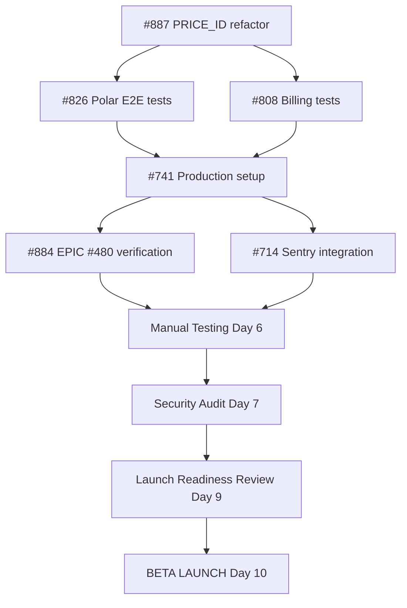

# Launch Timeline - Critical Path to Production
**Date:** 2025-11-19
**Target Launch:** 2025-12-03 (2 weeks from now)

---

## WEEK 1: BLOCKERS & SETUP (Nov 19-25)

### Day 1 (Tue Nov 19) - Payment Tests Foundation
```
[CRITICAL] #887 - PRICE_ID → PRODUCT_ID refactor
├─ Status: PR #888 in review
├─ Owner: Backend Dev
├─ Time: 2-3h
├─ Deliverable: Merged to main
└─ Blocks: #808, #826

[CRITICAL] #826 - Fix Polar E2E Tests (START)
├─ Status: 6/7 tests failing
├─ Owner: Test Engineer
├─ Time: 4-6h (Day 1-2)
├─ Dependencies: #887 merged
└─ Deliverable: 7/7 tests passing
```

### Day 2 (Wed Nov 20) - Payment Tests Completion
```
[CRITICAL] #826 - Fix Polar E2E Tests (COMPLETE)
├─ Morning: Finish remaining test fixes
├─ Afternoon: Validation & smoke tests
└─ Deliverable: All E2E tests green

[CRITICAL] #808 - Billing Tests Migration (START)
├─ Status: Tests using Stripe mocks
├─ Owner: Test Engineer
├─ Time: 6-8h (Day 2-3)
├─ Dependencies: #887 merged
└─ Deliverable: All billing tests using Polar
```

### Day 3 (Thu Nov 21) - Production Environment Setup
```
[CRITICAL] #808 - Billing Tests Migration (COMPLETE)
├─ Morning: Finish test migration
├─ Afternoon: Validation
└─ Deliverable: 100% Polar test coverage

[CRITICAL] #741 - Production Setup (START - Part 1: Supabase)
├─ Task 1: Create Supabase production project
├─ Task 2: Configure SUPABASE_URL, ANON_KEY, SERVICE_ROLE_KEY
├─ Task 3: Deploy schema (database/schema.sql)
├─ Task 4: Validate RLS policies
├─ Owner: DevOps + Backend Dev
├─ Time: 4-6h
└─ Deliverable: Production database ready
```

### Day 4 (Fri Nov 22) - Production Environment + Polar
```
[CRITICAL] #741 - Production Setup (Part 2: Polar)
├─ Task 1: Configure POLAR_ACCESS_TOKEN (production)
├─ Task 2: Configure POLAR_WEBHOOK_SECRET
├─ Task 3: Configure POLAR_*_PRODUCT_ID (real price IDs)
├─ Task 4: Register webhook URL in Polar dashboard
├─ Task 5: Validate webhook delivery
├─ Owner: Backend Dev
├─ Time: 4-6h
└─ Deliverable: Polar production configured

[CRITICAL] #741 - Production Setup (Part 3: Test Database)
├─ Task 1: Create Supabase test project
├─ Task 2: Configure TEST_SUPABASE_* env vars
├─ Task 3: Deploy schema to test DB
├─ Task 4: Add credentials to GitHub Secrets
├─ Owner: DevOps
├─ Time: 2-3h
└─ Deliverable: Test database ready (enables #719, #639)
```

### Day 5 (Sat Nov 23) - Validation & Testing
```
[HIGH] #884 - EPIC #480 Final Verification
├─ Task 1: Run full test suite
├─ Task 2: Document failure count
├─ Task 3: Verify <10 failing suites goal
├─ Task 4: Update EPIC #480 issue
├─ Owner: Test Engineer
├─ Time: 1-2h
└─ Deliverable: Test stability confirmed

[MEDIUM] #714 - Basic Sentry Integration
├─ Task 1: Create Sentry account
├─ Task 2: Install @sentry/node
├─ Task 3: Configure SENTRY_DSN
├─ Task 4: Add error tracking to critical paths
├─ Owner: Backend Dev
├─ Time: 3-4h
└─ Deliverable: Basic error monitoring active
```

---

## WEEKEND BUFFER (Nov 23-24)

### Optional Work (if team available)
```
[HIGH] #719 - Real Test Database for Roast API
├─ Status: 4/8 integration tests failing
├─ Owner: Test Engineer
├─ Time: 8-16h (can be done in weekend or deferred)
├─ Dependencies: Test database from #741
├─ Priority: HIGH but not launch blocker
└─ Alternative: Manual testing acceptable for launch

[OPTIONAL] #653 - Shield Phase 2 Refactor
├─ Status: Phase 1 complete, Phase 2 deferred
├─ Owner: Backend Dev
├─ Time: 8-12h
├─ Priority: MEDIUM (can defer to post-launch)
└─ Decision: Defer unless time permits
```

---

## WEEK 2: VALIDATION & LAUNCH (Nov 25 - Dec 3)

### Day 6 (Mon Nov 25) - Manual Testing
```
[TESTING] Payment Flow End-to-End
├─ Test 1: New user signup
├─ Test 2: Select Starter plan → Polar checkout
├─ Test 3: Complete payment (real card)
├─ Test 4: Verify webhook delivery
├─ Test 5: Verify plan activation
├─ Test 6: Upgrade to Pro plan
├─ Test 7: Downgrade to Starter
├─ Test 8: Cancel subscription
├─ Owner: QA + Product Owner
├─ Time: 2-3h
└─ Deliverable: Payment flow validated

[TESTING] Core Functionality
├─ Test 1: Generate roast for toxic comment (Twitter)
├─ Test 2: Shield blocks high-risk content
├─ Test 3: Queue processes jobs
├─ Test 4: Cost control enforces plan limits
├─ Test 5: Multi-tenant isolation (RLS)
├─ Owner: QA
├─ Time: 1-2h
└─ Deliverable: Core features validated
```

### Day 7 (Tue Nov 26) - Security Audit
```
[SECURITY] Pre-Launch Security Checklist
├─ Check 1: RLS policies (no bypass)
├─ Check 2: API keys not exposed
├─ Check 3: Webhook signatures validated
├─ Check 4: Rate limiting configured
├─ Check 5: GDPR compliance
├─ Check 6: User data encryption
├─ Owner: Security/Backend Dev
├─ Time: 2-3h
└─ Deliverable: Security audit complete

[DEVOPS] Smoke Tests in Production
├─ Test 1: API health check
├─ Test 2: Database connectivity
├─ Test 3: Polar webhook endpoint
├─ Test 4: Sentry error reporting
├─ Test 5: Redis/queue connectivity
├─ Owner: DevOps
├─ Time: 1h
└─ Deliverable: All systems green
```

### Day 8 (Wed Nov 27) - Documentation & Preparation
```
[DOCS] User Documentation
├─ Task 1: User onboarding flow
├─ Task 2: Platform limitations (3 platforms at launch)
├─ Task 3: Pricing page review
├─ Task 4: FAQ updates
├─ Owner: Product Owner
├─ Time: 2-3h
└─ Deliverable: Docs ready for users

[LEGAL] Compliance Review
├─ Task 1: Terms of Service
├─ Task 2: Privacy Policy
├─ Task 3: GDPR compliance
├─ Task 4: Cookie policy
├─ Owner: Legal/Product Owner
├─ Time: 1-2h
└─ Deliverable: Legal docs reviewed
```

### Day 9 (Thu Nov 28) - Pre-Launch Final Checks
```
[FINAL] Launch Readiness Review
├─ Checklist 1: Payment system ✓
├─ Checklist 2: Core functionality ✓
├─ Checklist 3: Platform integrations ✓ (3/9)
├─ Checklist 4: Production environment ✓
├─ Checklist 5: Security & compliance ✓
├─ Checklist 6: Documentation & support ✓
├─ Owner: Product Owner + Team
├─ Time: 1-2h
└─ Decision: GO/NO-GO for launch

[DEVOPS] Deployment Preparation
├─ Task 1: Production deploy checklist
├─ Task 2: Rollback plan prepared
├─ Task 3: Monitoring dashboards configured
├─ Task 4: Alert escalation paths defined
├─ Owner: DevOps
├─ Time: 2h
└─ Deliverable: Ready to deploy
```

### Day 10 (Fri Nov 29) - BETA LAUNCH 🚀
```
[LAUNCH] Deploy to Production
├─ 09:00 - Deploy to production
├─ 09:30 - Verify deployment (smoke tests)
├─ 10:00 - Enable monitoring (Sentry, logs)
├─ 10:30 - Invite first beta users (3-5 users)
├─ Owner: DevOps + Backend Dev
└─ Deliverable: System live in production

[MONITORING] Launch Day Monitoring
├─ Monitor 1: Sentry errors (real-time)
├─ Monitor 2: Payment webhooks (Polar dashboard)
├─ Monitor 3: User signups
├─ Monitor 4: Roast generation success rate
├─ Monitor 5: Platform integrations (Twitter, YouTube, Discord)
├─ Owner: On-call team
├─ Time: Full day
└─ Deliverable: Issues identified and triaged
```

### Days 11-14 (Nov 30 - Dec 3) - Beta Monitoring & Iteration
```
[BETA] Limited Beta Phase
├─ Users: 3-5 beta testers
├─ Focus: Payment flow, roast quality, platform integrations
├─ Monitoring: Daily Sentry review, user feedback
├─ Iteration: Quick fixes for critical issues
├─ Decision: Expand beta or fix blockers
└─ Deliverable: Beta feedback report

[POST-LAUNCH] Prepare Post-Launch Backlog
├─ Sprint 1 planning (#719, #714, #827)
├─ Sprint 2 planning (#683, #598, #415)
├─ Sprint 3 planning (security, cleanup)
├─ Owner: Product Owner + Team
└─ Deliverable: Post-launch roadmap
```

---

## CRITICAL DEPENDENCIES



---

## RISK MITIGATION

### High Risk Items
1. **Polar E2E tests still failing after #826**
   - Mitigation: Manual payment testing on Day 6
   - Fallback: Defer launch 1 week, investigate deeper

2. **Production webhook registration fails**
   - Mitigation: Test webhook locally first
   - Fallback: Use Polar dashboard manual testing mode

3. **Security audit finds RLS bypass**
   - Mitigation: Immediate fix, delay launch
   - Fallback: Deploy fix + re-audit (1-2 days)

4. **Sentry integration issues**
   - Mitigation: Basic console logging acceptable
   - Fallback: Deploy without Sentry, add post-launch

### Medium Risk Items
5. **Test database setup (#741) takes longer than expected**
   - Mitigation: Use local Supabase for testing
   - Fallback: Defer #719 to post-launch

6. **Only 3 platforms working (Twitter, YouTube, Discord)**
   - Mitigation: Document limitations clearly
   - Fallback: This is acceptable for beta launch

---

## SUCCESS METRICS

### Day 10 (Launch Day)
- ✅ Zero critical errors in Sentry (first 4 hours)
- ✅ First beta user completes payment
- ✅ First beta user generates roast
- ✅ All platform integrations responding (3/3)

### Week 1 Post-Launch
- ✅ 3-5 beta users onboarded
- ✅ 5+ successful payments processed
- ✅ 20+ roasts generated
- ✅ Zero data breaches or RLS bypasses
- ✅ Sentry error rate <5% of total requests

### Week 2 Post-Launch
- ✅ Beta feedback collected
- ✅ Critical issues resolved
- ✅ Decision: Expand beta or iterate
- ✅ Post-launch Sprint 1 started

---

## RESOURCE ALLOCATION

### Required Team (Week 1)
- **Backend Dev** - 30-40h (payment tests, production setup, Sentry)
- **Test Engineer** - 20-30h (#826, #808, #884)
- **DevOps** - 10-15h (#741 infrastructure, deployment prep)
- **Product Owner** - 5-10h (testing, documentation, decisions)

### Required Team (Week 2)
- **QA** - 8-12h (manual testing, smoke tests)
- **Backend Dev** - 5-10h (support, bug fixes)
- **DevOps** - 5-8h (deployment, monitoring)
- **Product Owner** - 10-15h (launch coordination, user onboarding)
- **On-call** - 16-24h (launch day monitoring)

---

## DECISION GATES

### Gate 1 (Day 5) - Blockers Complete?
- ✅ All 8 blockers resolved
- ✅ Production environment configured
- ✅ Tests stable (<10 failing suites)
- **Decision:** Proceed to Week 2 testing

### Gate 2 (Day 9) - Launch Ready?
- ✅ Manual testing passed
- ✅ Security audit clean
- ✅ Documentation complete
- **Decision:** GO/NO-GO for launch

### Gate 3 (Day 12) - Expand Beta?
- ✅ Beta users successful
- ✅ No critical issues
- ✅ Payment flow validated
- **Decision:** Expand beta or iterate

---

## BACKUP PLAN (If Critical Blocker Found)

### Scenario: Payment flow broken in production
1. **Immediate:** Rollback deployment
2. **Investigation:** Root cause analysis (2-4h)
3. **Fix:** Deploy patch or defer launch
4. **Re-test:** Full payment flow testing
5. **Re-launch:** When fix validated

### Scenario: RLS bypass discovered
1. **Immediate:** Block affected endpoints
2. **Fix:** Deploy RLS policy fix
3. **Audit:** Review all RLS policies
4. **Validation:** Security re-audit
5. **Re-launch:** When vulnerability closed

---

**Last Updated:** 2025-11-19
**Version:** 1.0
**Status:** DRAFT - Pending team review
