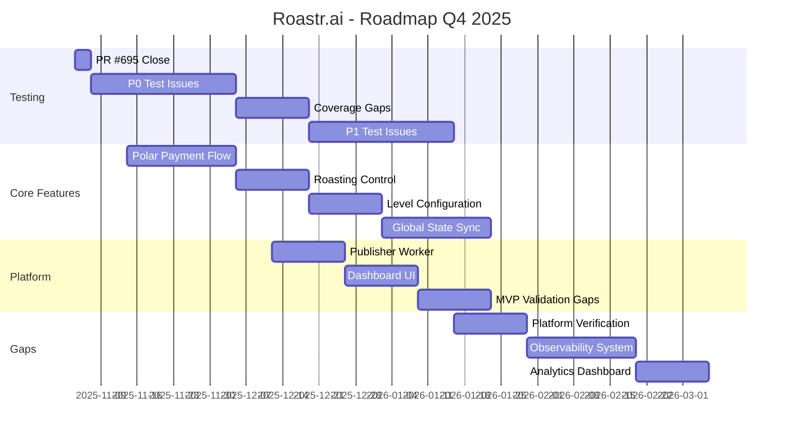

# Análisis de Trabajo Pendiente - Roastr.ai

**Fecha:** 2025-11-03
**Generado por:** Orchestrator Agent
**Contexto:** Evaluación completa de trabajo pendiente vs. issues en GitHub

---

## 📊 Resumen Ejecutivo

| Categoría                      | Issues Abiertas       | Estimación Total | Prioridad  |
| ------------------------------ | --------------------- | ---------------- | ---------- |
| **Testing**                    | 24 issues             | ~8-12 semanas    | 🔴 CRÍTICO |
| **Construcción de Plataforma** | 20 issues             | ~12-16 semanas   | 🟡 ALTA    |
| **Post-MVP / Trainer**         | 15 issues             | ~20-24 semanas   | 🟢 BAJA    |
| **Trabajo No Registrado**      | ~8 gaps identificados | ~4-6 semanas     | 🟡 MEDIA   |
| **Tech Debt / Refactors**      | 11 issues             | ~6-8 semanas     | 🟢 BAJA    |

**Total Issues Abiertas:** 78 issues
**Estimación Total:** ~50-66 semanas de trabajo (sin paralelización)

---

## 🧪 1. TRABAJO DE TESTING (24 Issues)

### 1.1 EPIC #480: Test Suite Stabilization

**Estado Actual:** En progreso (PR #695 activa)

**Prioridad P0 (CRÍTICO - 7 issues):**

| Issue | Descripción                                        | Estimación | Estado |
| ----- | -------------------------------------------------- | ---------- | ------ |
| #639  | Fix Database Security Test Suite                   | 3-5 días   | Open   |
| #638  | Fix OAuth Integration Test Suite                   | 3-5 días   | Open   |
| #482  | Shield Test Suite - Stability & UI Integration     | 5-7 días   | Open   |
| #483  | Roast Generation Test Suite                        | 5-7 días   | Open   |
| #484  | Multi-Tenant & Billing Test Suite                  | 5-7 días   | Open   |
| #488  | Flow Validation: Multi-Tenant RLS Isolation        | 3-4 días   | Open   |
| #489  | Flow Validation: Billing & Plan Limits Enforcement | 3-4 días   | Open   |

**Prioridad P1 (ALTA - 4 issues):**

| Issue | Descripción                                    | Estimación | Estado |
| ----- | ---------------------------------------------- | ---------- | ------ |
| #642  | Fix Tier Validation Service Tests              | 2-3 días   | Open   |
| #641  | Fix Integration Routes Test Suite              | 3-4 días   | Open   |
| #644  | Fix Worker Test Suite                          | 4-5 días   | Open   |
| #643  | Fix Frontend/UI Test Suite                     | 5-6 días   | Open   |
| #485  | Unit Test Suite - Routes, Middleware, Services | 5-7 días   | Open   |

**Prioridad P2 (MEDIA - 2 issues):**

| Issue | Descripción                         | Estimación | Estado |
| ----- | ----------------------------------- | ---------- | ------ |
| #646  | Audit and Fix Remaining Test Suites | 3-4 días   | Open   |
| #645  | Fix CLI Test Suite                  | 2-3 días   | Open   |

**Bugs y Coverage (5 issues):**

| Issue | Descripción                                     | Estimación                         | Estado         |
| ----- | ----------------------------------------------- | ---------------------------------- | -------------- |
| #698  | Fix 4 failing roast integration tests           | 1-2 días (decisión arquitectónica) | Open (PR #695) |
| #633  | Pre-existing Shield test failures               | TBD                                | Open           |
| #583  | Update RLS Integration Tests for Current Schema | 2-3 días                           | Open           |
| #442  | Validación Tests Integración Ingestor           | 2-3 días                           | Assigned       |

**Coverage Issues (#500-505 - 6 issues):**

| Issue | Node         | Current | Target | Estimación |
| ----- | ------------ | ------- | ------ | ---------- |
| #500  | cost-control | 3%      | 60%    | 3-4 días   |
| #501  | analytics    | 49%     | 65%    | 2-3 días   |
| #502  | billing      | 58%     | 65%    | 2-3 días   |
| #503  | shield       | 66%     | 75%    | 2-3 días   |
| #504  | multi-tenant | 0%      | 40%    | 3-4 días   |
| #505  | trainer      | 0%      | 50%    | 3-4 días   |

### 1.2 Estado de PR #695

**PR #695 - Test Investigation & Fixes:**

- ✅ Issue #680: Mock isolation pattern implementado
- ✅ Issue #697: Mock factory & helper preservation arreglado
- 🟡 Issue #698: 1/4 tests arreglados, decisión arquitectónica requerida

**Decisión Pendiente (Product Owner):**

1. ⭐ Usar real test database (1-2 días) ← RECOMENDADO
2. Aceptar 4 failing integration tests como known issue
3. Diferir refactor arquitectónico

### 1.3 Estimación Total Testing

**Tiempo estimado sin paralelización:** ~8-12 semanas
**Tiempo estimado con paralelización (2-3 devs):** ~4-6 semanas
**Criticidad:** 🔴 ALTA - Bloquea confianza en producción

---

## 🏗️ 2. CONSTRUCCIÓN DE PLATAFORMA (20 Issues)

### 2.1 Features Core Pendientes

**Payment & Billing (3 issues):**

| Issue | Descripción                                            | Estimación  | Labels                           |
| ----- | ------------------------------------------------------ | ----------- | -------------------------------- |
| #594  | Payment Flow con Polar (migración desde Stripe)        | 2-3 semanas | `enhancement`, `high-priority`   |
| #596  | Roasting Control (Enable/Disable con Worker Sync)      | 1-2 semanas | `enhancement`, `medium-priority` |
| #597  | Level Configuration (Roast Levels 1-5 + Shield Levels) | 1-2 semanas | `enhancement`, `medium-priority` |

**Global State & Sync (1 issue):**

| Issue | Descripción                                                 | Estimación  | Labels                        |
| ----- | ----------------------------------------------------------- | ----------- | ----------------------------- |
| #598  | Global State Synchronization (Frontend ↔ Backend ↔ Polar) | 2-3 semanas | `enhancement`, `architecture` |

**Frontend/UI (1 issue):**

| Issue | Descripción                                      | Estimación  | Labels     |
| ----- | ------------------------------------------------ | ----------- | ---------- |
| #683  | Nuevo diseño de dashboard (HTML + CSS + JS base) | 1-2 semanas | Sin labels |

### 2.2 Integraciones y Workers

**Publisher & Workers (2 issues):**

| Issue | Descripción                                          | Estimación  | Labels                 |
| ----- | ---------------------------------------------------- | ----------- | ---------------------- |
| #456  | PublisherWorker - Publicación directa e idempotencia | 1-2 semanas | `bug`, `high-priority` |
| #415  | Complete Platform Integration & Tone Analysis        | 2-3 semanas | `enhancement`          |

### 2.3 MVP Validation Gaps

**MVP Gaps (1 issue):**

| Issue | Descripción                                         | Estimación  | Labels                            |
| ----- | --------------------------------------------------- | ----------- | --------------------------------- |
| #588  | Implement MVP validation gap closures (G1, G6, G10) | 1-2 semanas | `enhancement`, `good first issue` |

### 2.4 Documentación

**Documentación (1 issue):**

| Issue | Descripción                                       | Estimación | Labels          |
| ----- | ------------------------------------------------- | ---------- | --------------- |
| #649  | Documentar integración Persona + Roast Generation | 2-3 días   | `documentation` |

### 2.5 Post-MVP Features (15 issues)

**Trainer System (10 issues):**

Issues #300-309: Sistema completo de entrenamiento con ART, RQC, collectors de engagement, etc.

**Estimación:** ~15-20 semanas
**Prioridad:** 🟢 BAJA (Post-MVP)

**Modo NSFW y Bot Interactions (2 issues):**

| Issue | Descripción                     | Estimación  |
| ----- | ------------------------------- | ----------- |
| #311  | Modo NSFW en Roasts             | 1-2 semanas |
| #324  | Manejo Interacciones entre Bots | 1-2 semanas |

**GDPR Export y Entrenamiento (1 issue):**

| Issue | Descripción                                  | Estimación  |
| ----- | -------------------------------------------- | ----------- |
| #325  | Weekly Export + GDPR Anonymization (80 días) | 2-3 semanas |

**RQC Microservice (1 issue):**

| Issue | Descripción                            | Estimación  |
| ----- | -------------------------------------- | ----------- |
| #312  | Microservicio RQC con jueces virtuales | 3-4 semanas |

### 2.6 Estimación Total Construcción

**Features Core:** ~8-12 semanas
**Post-MVP/Trainer:** ~20-24 semanas
**Total:** ~28-36 semanas (sin paralelización)

**Criticidad:**

- Core features: 🟡 ALTA
- Post-MVP: 🟢 BAJA (puede diferirse)

---

## 🔍 3. TRABAJO NO REGISTRADO COMO ISSUES (8 Gaps Identificados)

### 3.1 Gaps Identificados en GDD Nodes vs. Código

**Análisis realizado:**

- 13 nodos GDD documentados (~11,183 líneas)
- 216 archivos .js en `src/`
- 35 routes, 15 integraciones
- 331 archivos de tests

**Gaps identificados:**

#### 3.1.1 Social Platforms - Integraciones Incompletas

**Documentadas pero no verificadas:**

- Twitter/X, YouTube, Instagram, Facebook, Discord, Twitch, Reddit, TikTok, Bluesky (9 plataformas)

**Estado:** Issue #490 menciona scripts de verificación, pero no hay issues específicas para cada plataforma.

**Estimación:** 1-2 días por plataforma × 9 = ~2-3 semanas

#### 3.1.2 Queue System - Worker Monitoring

**Gap:** Nodo `queue-system.md` menciona monitoreo avanzado y retry logic, pero no hay issues para:

- Dashboard de monitoreo de workers
- Sistema de alertas de workers fallidos
- Retry strategy tuning

**Estimación:** ~1 semana

#### 3.1.3 Observability - Telemetría Completa

**Gap:** Nodo `observability.md` existe, pero no hay issues para:

- Integración completa con Sentry (Issue #379 menciona Shield, pero no sistema completo)
- Métricas de performance
- Dashboard de observabilidad

**Estimación:** ~2-3 semanas

#### 3.1.4 Analytics - Feature Completo

**Gap:** Coverage 49% (Issue #501 aumenta a 65%), pero falta implementación completa:

- Analytics dashboard (mencionado en nodo pero sin issue)
- Exportación de datos de analytics
- Integración con Polar para billing analytics

**Estimación:** ~2-3 semanas

#### 3.1.5 Guardian - GDD Guardian Script

**Gap:** Nodo `guardian.md` documentado, pero:

- Script `guardian-gdd.js` existe
- No hay tests para Guardian
- No hay documentación de uso

**Estimación:** ~3-4 días

#### 3.1.6 Tone System - Testing

**Gap:** Nodo `tone.md` documentado (8,794 líneas), pero:

- No hay tests específicos para tone mapping
- No hay validación de humor types

**Estimación:** ~1 semana

#### 3.1.7 Platform Constraints - Validación

**Gap:** Nodo `platform-constraints.md` existe, pero:

- No hay tests de validación por plataforma
- No hay verificación de character limits

**Estimación:** ~3-4 días

#### 3.1.8 GDD Phase 17.1 - Cron Monitoring

**Gap:** Issue #541 existe pero sin progress

- Cron-based Auto-Health and Drift Monitoring
- Estado: Open, sin asignación

**Estimación:** ~1 semana (ya tiene issue)

### 3.2 Estimación Total Trabajo No Registrado

**Total:** ~6-8 semanas de trabajo
**Criticidad:** 🟡 MEDIA - Necesario para MVP completo

---

## 📈 4. DISTRIBUCIÓN DE TRABAJO

### 4.1 Por Prioridad

```
P0 (CRÍTICO): 7 issues     (~5-7 semanas)
P1 (ALTA):    9 issues     (~6-8 semanas)
P2 (MEDIA):   2 issues     (~1-2 semanas)
Post-MVP:     15 issues    (~20-24 semanas)
Sin prioridad: 37 issues   (~12-18 semanas)
Trabajo no registrado:     (~6-8 semanas)
```

### 4.2 Por Área

```
Testing:                24 issues + 6 coverage + PR #695
Construcción Plataforma: 8 issues core + 15 post-MVP
Documentación:          2 issues
Tech Debt:              11 issues
GDD:                    2 issues
Trabajo No Registrado:  8 gaps identificados
```

### 4.3 Por Estado

```
Open:             70 issues
Assigned (Eibon7): 4 issues (#649, #588, #442, #456, #415, #379, #396)
In Progress:       PR #695 (issues #680, #697, #698)
```

---

## 🎯 5. RECOMENDACIONES

### 5.1 Priorización Sugerida

**FASE 1 (Inmediata - 4-6 semanas):**

1. ✅ Cerrar PR #695 (decisión arquitectónica #698)
2. 🔴 Resolver P0 test issues (#639, #638, #482, #483, #484, #488, #489)
3. 🟡 Completar coverage gaps (#500-505)

**FASE 2 (Corto plazo - 4-6 semanas):**

1. 🔴 Resolver P1 test issues (#642, #641, #644, #643, #485)
2. 🟡 Features core (#594 Polar, #596 Roasting Control, #597 Level Config)

**FASE 3 (Medio plazo - 6-8 semanas):**

1. 🟡 Global State Sync (#598)
2. 🟡 Publisher Worker (#456)
3. 🟡 Dashboard UI (#683)
4. 🟡 Resolver gaps no registrados (integraciones, observability, analytics)

**FASE 4 (Largo plazo - 20-24 semanas):**

1. 🟢 Post-MVP features (Trainer system #300-309)
2. 🟢 Tech debt cleanup
3. 🟢 Refactors arquitectónicos

### 5.2 Creación de Issues Faltantes

**Sugerencia:** Crear issues para los 8 gaps identificados en sección 3:

- [ ] Issue: Social Platform Integration Verification (9 plataformas)
- [ ] Issue: Worker Monitoring Dashboard
- [ ] Issue: Observability System Integration (Sentry + Metrics)
- [ ] Issue: Analytics Dashboard & Export
- [ ] Issue: Guardian Script Testing & Documentation
- [ ] Issue: Tone System Testing
- [ ] Issue: Platform Constraints Validation
- [ ] Issue #541: GDD Phase 17.1 (ya existe, priorizar)

### 5.3 Paralelización

**Con 2-3 developers trabajando en paralelo:**

- Testing (P0/P1): ~6-8 semanas → **3-4 semanas**
- Features core: ~8-12 semanas → **4-6 semanas**
- Gaps no registrados: ~6-8 semanas → **3-4 semanas**

**Total con paralelización:** ~10-14 semanas hasta MVP completo

---

## 📊 6. MÉTRICAS ACTUALES

### 6.1 Codebase

```
Archivos fuente:      216 .js files
Routes:               35 routes
Integraciones:        15 integration files
Tests:                331 test files
GDD Nodes:            13 nodes (~11,183 lines)
GDD Health Score:     98.8/100 🟢
Coverage Threshold:   93% (temporary until 2025-10-31)
```

### 6.2 Issues

```
Total Open Issues:    78 issues
Assigned Issues:      7 issues (@Eibon7)
In Progress (PR):     1 PR (#695)
Unassigned:           70 issues
```

### 6.3 Test Status (PR #695)

```
Roast Integration:    4/8 passing (50%)
Overall Coverage:     Variable por nodo (3%-86%)
Target Coverage:      80-95% per node
```

---

## 🚨 7. RIESGOS Y BLOCKERS

### 7.1 Blockers Críticos

1. **Issue #698 - Decisión Arquitectónica:**
   - Bloquea completar PR #695
   - Decisión: ¿Test database o aceptar failing tests?
   - Impacto: Bloquea merge de test improvements

2. **Coverage Gaps (#500-505):**
   - 6 nodos con coverage <80%
   - GDD health threshold temporal (93 vs 95)
   - Impacto: Bloquea restore a threshold 95

3. **Test Suite Stability (EPIC #480):**
   - 24 issues de tests failing/flaky
   - Impacto: Reduce confianza en producción
   - Riesgo: Bugs no detectados

### 7.2 Riesgos Técnicos

1. **Deuda Técnica Acumulada:**
   - 11 issues de refactors/tech debt
   - Riesgo: Dificulta nuevos features
   - Mitigación: Planificar sprints de refactor

2. **Integraciones No Verificadas:**
   - 9 plataformas sociales sin verificación
   - Riesgo: Fallos en producción
   - Mitigación: Scripts de verificación (#490)

3. **Observability Incompleta:**
   - Sin telemetría completa
   - Riesgo: Dificulta debugging producción
   - Mitigación: Priorizar observability gaps

---

## 📅 8. ROADMAP SUGERIDO



**Milestone 1 (Nov 2025):** Testing P0 + PR #695 complete
**Milestone 2 (Dec 2025):** Testing P1 + Core Features
**Milestone 3 (Jan 2026):** Platform completion + Gaps
**Milestone 4 (Feb 2026):** MVP completo con observability

---

## 🎓 9. CONCLUSIONES

### 9.1 Trabajo de Testing

**Volumen:** 24 issues + 6 coverage + PR #695
**Estimación:** ~8-12 semanas
**Estado:** 🟡 En progreso (PR #695), mayoría pendiente
**Criticidad:** 🔴 ALTA - Bloquea confianza en producción

### 9.2 Construcción de Plataforma

**Volumen:** 8 issues core + 15 post-MVP
**Estimación:** ~12-16 semanas core, ~20-24 semanas post-MVP
**Estado:** 🟡 Features core parcialmente asignadas, post-MVP sin priorizar
**Criticidad:** 🟡 MEDIA (core), 🟢 BAJA (post-MVP)

### 9.3 Trabajo No Registrado

**Volumen:** ~8 gaps identificados
**Estimación:** ~6-8 semanas
**Estado:** 🔴 No tiene issues, necesita registro
**Criticidad:** 🟡 MEDIA - Necesario para MVP completo

### 9.4 Resumen Final

**Total trabajo pendiente:** ~50-66 semanas sin paralelización
**Con paralelización (2-3 devs):** ~20-30 semanas hasta MVP completo
**Issues sin registrar:** ~8 gaps críticos identificados

**Acción requerida:**

1. Decidir #698 (arquitectónica) → Desbloquea PR #695
2. Crear 8 issues para gaps identificados
3. Priorizar EPIC #480 (testing) como P0
4. Planificar roadmap Q4 2025 - Q1 2026

---

**Generado:** 2025-11-03
**Autor:** Orchestrator Agent
**Revisión:** Product Owner / Tech Lead
