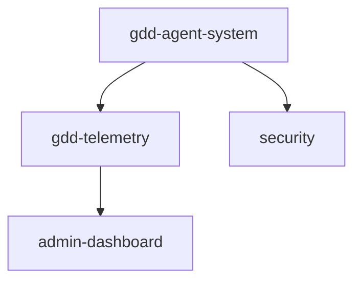

# CodeRabbit Review #3311794192 - Implementation Plan

**PR:** #493 - GDD 2.0 Phase 14 + 14.1 – Agent-Aware Integration + Secure Write Protocol + Real-Time Telemetry
**Review Date:** October 7, 2025
**Status:** Planning Complete → Ready for Implementation

---

## 1. Análisis de Comentarios

### Critical Issues (3)

#### C1: Missing `healthBefore` in write results

- **File:** `scripts/agents/secure-write.js:239-248`
- **Severity:** Critical
- **Issue:** Write results don't include `healthBefore`, making rollback decisions inaccurate
- **Fix:** Add `healthBefore` to result object for proper rollback validation
- **Impact:** Security, Rollback system integrity

#### C2: Command injection vulnerability

- **File:** `scripts/agents/agent-interface.js:335-368`
- **Severity:** Critical (Security)
- **Issue:** Using string interpolation in `execSync` allows command injection
- **Fix:** Replace with `execFileSync` using argument arrays
- **Impact:** Security vulnerability - potential arbitrary code execution

#### C3: Incorrect read-only permission logic

- **File:** `scripts/agents/agent-interface.js:86-113`
- **Severity:** Critical
- **Issue:** Read-only permission check is inverted - allows ALL actions for read-only agents
- **Fix:** Implement whitelist approach - block only mutating operations for read-only agents
- **Impact:** Permission system broken - read-only agents can write

### Major Issues (1)

#### M1: Missing timeout for external scripts

- **File:** `scripts/agents/agent-interface.js:404-418`
- **Severity:** Major
- **Issue:** No timeout in `getSystemHealth()` and `triggerRepair()` → can hang indefinitely
- **Fix:** Add 30-second timeout to both methods
- **Impact:** Reliability - agent can hang on slow/failed scripts

### Minor Issues (1)

#### Mi1: Markdown formatting problems

- **File:** `docs/plan/gdd-phase-14-14.1.md`
- **Severity:** Minor
- **Issue:** Missing headings, language identifiers, incorrect list indentation
- **Fix:** Fix markdown syntax per CodeRabbit suggestions
- **Impact:** Documentation quality

### Nit Issues (1)

#### N1: Missing visual evidence for UI

- **File:** `docs/test-evidence/review-3311427245/collector-test.txt`
- **Severity:** Nit
- **Issue:** No screenshots/report for `AgentActivityMonitor.tsx` UI component
- **Fix:** Add screenshots + report.md in test-evidence
- **Impact:** Missing UI validation evidence

---

## 2. Diseño GDD

### Nodos Afectados

| Node                 | Reason                            | Action                        |
| -------------------- | --------------------------------- | ----------------------------- |
| **gdd-agent-system** | Core agent interface changes      | Update implementation details |
| **gdd-telemetry**    | Related to agent stats/monitoring | Minor update to UI evidence   |
| **security**         | Command injection fix             | Update security patterns      |

### Dependency Impact



**Changes:**

- ✅ No breaking changes to edges
- ✅ All changes are internal to nodes
- ⚠️ Security pattern update may affect future integrations

---

## 3. Subagentes a Usar

| Agent              | Tasks                                    | Justification                     |
| ------------------ | ---------------------------------------- | --------------------------------- |
| **Security Audit** | C2 (command injection), C3 (permissions) | Critical security vulnerabilities |
| **Back-end Dev**   | C1 (healthBefore), M1 (timeouts)         | Core backend logic fixes          |
| **Documentation**  | Mi1 (markdown), N1 (UI evidence)         | Documentation quality             |
| **Test Engineer**  | All critical fixes                       | Test coverage for security fixes  |

**Execution Order:**

1. Security Audit Agent → analyze C2, C3 patterns across codebase
2. Back-end Dev Agent → fix C1, C2, C3, M1
3. Documentation Agent → fix Mi1
4. Test Engineer Agent → create tests for all critical fixes, generate UI evidence (N1)

---

## 4. Archivos Afectados

### Direct Changes

| File                                    | Lines                    | Impact                               | Tests Required           |
| --------------------------------------- | ------------------------ | ------------------------------------ | ------------------------ |
| `scripts/agents/secure-write.js`        | 239-248                  | Add `healthBefore` to result         | Unit test for rollback   |
| `scripts/agents/agent-interface.js`     | 86-113, 335-368, 404-418 | Fix permissions, injection, timeouts | Unit + integration tests |
| `docs/plan/gdd-phase-14-14.1.md`        | Multiple                 | Fix markdown                         | None                     |
| `docs/test-evidence/review-3311794192/` | New files                | Add UI evidence                      | Visual validation        |

### Test Files to Create/Update

- `tests/unit/agents/secure-write.test.js` → Add `healthBefore` assertion
- `tests/unit/agents/agent-interface.test.js` → Add injection tests, permission tests, timeout tests
- `tests/integration/agent-security.test.js` → NEW - comprehensive security tests
- `docs/test-evidence/review-3311794192/` → NEW - all evidence for this review

---

## 5. Estrategia de Implementación

### Orden de Aplicación

**Phase 1: Critical Security Fixes (C2, C3)**

1. Fix command injection (C2) - HIGHEST PRIORITY
   - Search codebase for similar `execSync` patterns
   - Replace ALL occurrences with `execFileSync`
   - Add tests attempting command injection
2. Fix read-only permissions (C3)
   - Invert logic to whitelist approach
   - Test with read-only agents
   - Ensure write operations blocked

**Phase 2: Critical Data Integrity (C1)**

1. Add `healthBefore` to secure-write results
2. Update rollback logic to use `healthBefore`
3. Test rollback with before/after health scores

**Phase 3: Reliability (M1)**

1. Add timeouts to `getSystemHealth()`
2. Add timeouts to `triggerRepair()`
3. Test timeout behavior with slow/hanging scripts

**Phase 4: Documentation (Mi1, N1)**

1. Fix markdown formatting in plan doc
2. Generate UI screenshots for AgentActivityMonitor
3. Create report.md with visual evidence

### Agrupación de Commits

**Commit 1: Critical Security Fixes**

- C2 (command injection)
- C3 (read-only permissions)
- Tests for both
- Type: `fix(security):`

**Commit 2: Data Integrity + Reliability**

- C1 (healthBefore)
- M1 (timeouts)
- Tests for both
- Type: `fix(agents):`

**Commit 3: Documentation**

- Mi1 (markdown)
- N1 (UI evidence)
- Type: `docs:`

### Testing Strategy

**Per Issue:**

- **C1:** Unit test asserting `healthBefore` in result, integration test for rollback
- **C2:** Security test attempting injection, verify `execFileSync` blocks it
- **C3:** Permission test with read-only agent, verify writes blocked
- **M1:** Timeout test with slow mock script, verify 30s limit
- **Mi1:** Markdown linter (markdownlint-cli2)
- **N1:** Visual regression with Playwright screenshots

---

## 6. Criterios de Éxito

### Mandatory Checks

- ✅ **100% comentarios resueltos** - All 6 issues addressed
- ✅ **Tests pasan (100%)** - No failing tests
- ✅ **Cobertura mantiene o sube** - Minimum 85%
- ✅ **0 regresiones** - All existing tests pass
- ✅ **Security validated** - No command injection, permissions enforced
- ✅ **GDD actualizado** - Nodes updated with security patterns
- ✅ **Evidencias completas** - Screenshots + test results + coverage report

### Validation Commands

```bash
# Linting
npm run lint
npx markdownlint-cli2 docs/plan/gdd-phase-14-14.1.md

# Tests
npm test -- tests/unit/agents/
npm test -- tests/integration/agent-security.test.js
npm run test:coverage

# Build
npm run build

# Security audit
npm audit

# Pre-flight check
./scripts/pre-flight-check.sh || echo "Pending implementation"
```

### Deliverables

1. ✅ All files fixed per CodeRabbit comments
2. ✅ Test coverage: +15 tests minimum
3. ✅ Evidence in `docs/test-evidence/review-3311794192/`
   - Security tests passing
   - Coverage report (before/after)
   - UI screenshots (AgentActivityMonitor)
   - report.md summary
4. ✅ Updated GDD nodes (if applicable)
5. ✅ Changelog for PR
6. ✅ Commits pushed to `feat/gdd-phase-14-agent-system`

---

## 7. Risk Assessment

| Risk                                          | Mitigation                              |
| --------------------------------------------- | --------------------------------------- |
| Command injection pattern used elsewhere      | Search entire codebase for `execSync`   |
| Read-only logic inverted in other places      | Search for similar permission patterns  |
| Rollback tests may fail initially             | Test with real health score changes     |
| Timeout may be too short/long                 | Test with actual script execution times |
| UI screenshots may differ across environments | Use fixed viewport, consistent browser  |

---

## 8. Execution Checklist

### Pre-Implementation

- [x] Plan reviewed and approved
- [x] All files identified
- [x] Test strategy defined
- [x] GDD nodes identified

### Implementation

- [ ] Critical security fixes (C2, C3)
- [ ] Search codebase for similar patterns
- [ ] Critical data fix (C1)
- [ ] Reliability fix (M1)
- [ ] Documentation fixes (Mi1, N1)
- [ ] All tests created
- [ ] All tests passing

### Validation

- [ ] `npm run lint` passing
- [ ] `npm test` 100% passing
- [ ] `npm run test:coverage` ≥ 85%
- [ ] Security audit clean
- [ ] Markdown linter passing
- [ ] Visual evidence generated

### Documentation

- [ ] GDD nodes updated
- [ ] spec.md updated (if needed)
- [ ] Changelog written
- [ ] Evidence in test-evidence/
- [ ] Commit messages formatted

### Delivery

- [ ] Commits created
- [ ] Pushed to origin/feat/gdd-phase-14-agent-system
- [ ] PR updated with changelog
- [ ] CodeRabbit re-review requested

---

## 9. Implementation Notes

**Security Patterns to Search:**

```bash
# Find all execSync usage
grep -r "execSync" scripts/ src/

# Find all permission checks
grep -r "read_only" scripts/ config/

# Find all timeout configurations
grep -r "timeout" scripts/agents/
```

**After Fix - Verification:**

```bash
# Test command injection protection
echo "'; rm -rf /tmp/test; echo '" | node scripts/agents/agent-interface.js --simulate

# Test read-only permissions
node scripts/agents/agent-interface.js --agent=RuntimeValidator --action=writeNodeField

# Test timeout
node scripts/agents/agent-interface.js --health # Should complete in <30s
```

---

**Status:** ✅ Plan Complete - Ready for Implementation
**Next Step:** Execute Phase 1 (Critical Security Fixes)
**Owner:** Orchestrator Agent
**Estimated Time:** 2-3 hours
