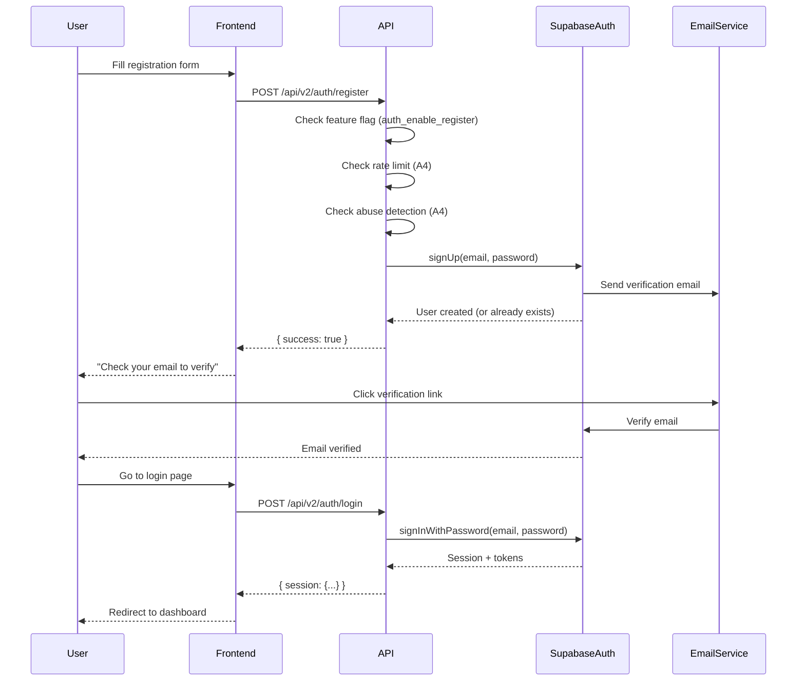

# Register v2 - Backend Authentication

**Versión:** 2.0  
**Fecha:** 2025-12-26  
**Issue:** ROA-378 (B5)  
**Estado:** ✅ Implementado

---

## 📋 Overview

Sistema de registro backend v2 usando Supabase Auth con soporte para:
- Email/password registration
- Anti-enumeration (no revela si email existe)
- Feature flags para habilitar/deshabilitar registro
- Rate limiting y abuse detection
- Error taxonomy normalizada
- Analytics tracking integrado

---

## 🔐 POST /api/v2/auth/register

Endpoint principal para registro de nuevos usuarios con email y password.

### Request

**Endpoint:** `POST /api/v2/auth/register`

**Headers:**
```
Content-Type: application/json
```

**Body:**
```json
{
  "email": "user@example.com",
  "password": "SecurePass123!"
}
```

**Schema:**
- `email` (string, required): Email del usuario (case-insensitive, normalizado automáticamente)
- `password` (string, required): Contraseña (min 8 caracteres, max 128 caracteres)

**Validaciones:**
- Email debe tener formato válido (regex: `/^[^\s@]+@[^\s@]+\.[^\s@]+$/`)
- Email se normaliza: trim, lowercase, eliminación de caracteres de control
- Password debe tener entre 8 y 128 caracteres

### Response (Success)

**Status:** `200 OK`

**Contrato Anti-Enumeration:**
El endpoint **siempre** responde `{ success: true }` en caso de éxito, incluso si el email ya existe. Esto previene la enumeración de usuarios.

```json
{
  "success": true
}
```

**Comportamiento:**
- Si el email es nuevo → Usuario creado en Supabase Auth + perfil en `profiles` table
- Si el email ya existe → Respuesta homogénea `{ success: true }` (no se revela que existe)
- En ambos casos, el cliente recibe la misma respuesta

### Response (Error)

**Status:** `400`, `401`, `403`, `429`, `500`

```json
{
  "success": false,
  "error": {
    "slug": "POLICY_INVALID_REQUEST",
    "message": "Invalid request",
    "retryable": false
  },
  "request_id": "req_xyz123"
}
```

**Campos:**
- `error.slug`: Código de error normalizado (ver Error Codes)
- `error.message`: Mensaje descriptivo
- `error.retryable`: Indica si el cliente puede reintentar
- `request_id`: ID único para tracking y debugging

---

## 🚨 Error Codes

### Validación (400)

| Code | Status | Message | Causa |
|------|--------|---------|-------|
| `POLICY_INVALID_REQUEST` | 400 | Invalid request | Email vacío, formato inválido, o password < 8 caracteres |

### Autenticación (401)

| Code | Status | Message | Causa |
|------|--------|---------|-------|
| `AUTH_DISABLED` | 401 | Authentication is currently unavailable | Feature flag `auth_enable_register` deshabilitado |
| `AUTH_SERVICE_UNAVAILABLE` | 401 | Authentication service unavailable | Infraestructura de email no configurada |

### Rate Limiting (429)

| Code | Status | Message | Causa |
|------|--------|---------|-------|
| `POLICY_RATE_LIMITED` | 429 | Too many registration attempts | Rate limit excedido (mismo límite que login) |

### Autorización (403)

| Code | Status | Message | Causa |
|------|--------|---------|-------|
| `POLICY_ABUSE_DETECTED` | 403 | Abuse pattern detected | Patrón de abuso detectado por abuse detection service |

### Servidor (500)

| Code | Status | Message | Causa |
|------|--------|---------|-------|
| `AUTH_UNKNOWN` | 500 | Internal authentication error | Error técnico no recuperable (DB down, network error, etc.) |

---

## 🎛️ Feature Flag Behavior

### `auth_enable_register`

**Source:** `admin-controlled.yaml` o `admin_settings` table (Supabase)

**Default:** `false` (registro deshabilitado por defecto)

**Fallback:** `process.env.AUTH_ENABLE_REGISTER` (si SettingsLoader falla)

**Implementación:**
```typescript
// Check ejecutado al inicio de register(), antes de validaciones
const settings = await loadSettings();
const registerEnabled = settings?.feature_flags?.auth_enable_register ?? false;

if (!registerEnabled) {
  throw new AuthError(
    AUTH_ERROR_CODES.AUTH_DISABLED,
    'Authentication is currently unavailable.'
  );
}
```

**Casos de uso:**
- Control de acceso durante beta/alpha
- Mantenimiento del sistema
- Incident response (deshabilitar registros durante ataque)
- Testing de frontend con registro deshabilitado

**⚠️ CRITICAL:** El feature flag es **fail-closed** por defecto. Si el SettingsLoader falla y no hay env var, el registro se bloquea.

---

## 🛡️ Rate Limiting

### Rate Limit Policy

El endpoint de registro usa la **misma política de rate limiting que login**:

**Tipo:** `login` (compartido con endpoint de login)

**Límites:**
- **Window:** 15 minutos
- **Max attempts:** 5 intentos por IP
- **Progressive blocking:** Después de 5 intentos, bloqueo temporal

**Implementación:**
```typescript
router.post('/register', rateLimitByType('login'), async (req, res) => {
  // Rate limit aplicado automáticamente por middleware
  // Si se excede, retorna 429 con POLICY_RATE_LIMITED
});
```

**Respuesta cuando se excede:**
```json
{
  "success": false,
  "error": {
    "slug": "POLICY_RATE_LIMITED",
    "message": "Too many registration attempts",
    "retryable": true
  },
  "retry_after_seconds": 900
}
```

### Abuse Detection

Sistema complementario de detección de patrones de abuso:

**Patrones detectados:**
1. **Multi-IP**: Mismo email desde 3+ IPs en 1 hora
2. **Multi-Email**: Misma IP probando 5+ emails en 1 hora
3. **Burst Attack**: 10+ intentos en 1 minuto
4. **Slow Attack**: 20+ intentos en 30 minutos

**Respuesta:** Lanza `POLICY_ABUSE_DETECTED` con mensaje genérico (no expone patrón detectado)

**Implementación:**
El abuse detection se ejecuta **antes** de la lógica de registro, dentro del Auth Policy Gate (A3).

---

## 🔒 Anti-Enumeration

### Contrato de Anti-Enumeration

**Regla crítica:** El endpoint **NUNCA** revela si un email ya está registrado.

**Comportamiento:**

1. **Email nuevo:**
   - Supabase Auth crea usuario
   - Se crea perfil en `profiles` table (best-effort, no bloquea si falla)
   - Respuesta: `{ success: true }`

2. **Email existente:**
   - Supabase Auth retorna error "User already registered"
   - El servicio **captura** el error y lo trata como éxito
   - Respuesta: `{ success: true }` (mismo que email nuevo)

3. **Error técnico:**
   - Si hay error de red, DB, etc. → Respuesta de error con código apropiado
   - **NO** se revela si el email existe o no

**Implementación:**
```typescript
// En authService.register()
const { data, error } = await supabase.auth.signUp({ email, password });

if (error) {
  // Anti-enumeration: si el email ya existe, no revelar
  if (this.isEmailAlreadyRegisteredError(error)) {
    // Silenciosamente retornar éxito (caller responderá { success: true })
    return;
  }
  // Otros errores se propagan normalmente
  throw mapSupabaseError(error);
}
```

**Beneficios:**
- Previene enumeración de usuarios
- Protege privacidad de usuarios existentes
- Reduce superficie de ataque

---

## 📊 Analytics Integration

### Eventos Trackeados

El endpoint trackea eventos de analytics en dos niveles:

#### 1. Endpoint Level (Siempre)

**Evento:** `auth_register_endpoint_success`
```typescript
trackEvent({
  event: 'auth_register_endpoint_success',
  properties: {
    endpoint: '/api/v2/auth/register',
    method: 'email_password',
    status_code: 200
  },
  context: {
    flow: 'auth'
  }
});
```

**Evento:** `auth_register_endpoint_failed`
```typescript
trackEvent({
  event: 'auth_register_endpoint_failed',
  properties: {
    endpoint: '/api/v2/auth/register',
    error_type: 'INTERNAL_ERROR',
    status_code: 500
  },
  context: {
    flow: 'auth'
  }
});
```

#### 2. Service Level (Solo si usuario creado)

**Evento:** `auth_register_success`
```typescript
trackEvent({
  userId: user.id,
  event: 'auth_register_success',
  properties: {
    method: 'email_password'
  },
  context: {
    flow: 'auth',
    request_id: request_id
  }
});
```

**Evento:** `auth_register_failed`
```typescript
trackEvent({
  event: 'auth_register_failed',
  properties: {
    error_slug: error.slug,
    method: 'email_password'
  },
  context: {
    flow: 'auth',
    request_id: request_id
  }
});
```

### Graceful Degradation

**Regla:** Si analytics falla, el flujo de registro **NO** se interrumpe.

```typescript
try {
  trackEvent({ ... });
} catch {
  logger.warn('analytics.track_failed', { event: 'auth_register_success' });
  // Flujo continúa normalmente
}
```

### PII Protection

**Regla:** Los eventos de analytics **NUNCA** incluyen PII (emails, passwords).

- Emails se hashean antes de logging
- Passwords nunca se loggean
- Solo se trackea `userId` (UUID) en eventos de éxito

---

## 🔗 Relación con A3/A4 Contracts

**A3 (Auth Policy Gate)** y **A4 (Rate Limit & Abuse Wiring)** son sistemas complementarios:

| Aspecto | Register v2 (ROA-378) | A3 Policy Gate | A4 Rate Limit |
|---------|----------------------|----------------|---------------|
| **Propósito** | Registro de usuarios | Evaluación de políticas | Rate limiting |
| **Orden de ejecución** | Después de A3/A4 | Antes de registro | Antes de registro |
| **Feature Flags** | `auth_enable_register` | `ENABLE_RATE_LIMIT`, `ENABLE_ABUSE_DETECTION` | `ENABLE_RATE_LIMIT` |
| **Error Taxonomy** | `AUTH_*`, `POLICY_*` | `POLICY_*` | `POLICY_RATE_LIMITED` |

**Flujo típico:**
1. Request llega a `/api/v2/auth/register`
2. **A3 Policy Gate** evalúa:
   - Feature flags
   - Rate limiting (A4)
   - Abuse detection (A4)
3. Si A3 permite → **Register Service** ejecuta lógica de negocio
4. Si A3 bloquea → Retorna error apropiado (`POLICY_RATE_LIMITED`, `POLICY_ABUSE_DETECTED`, etc.)

**Middleware compartido:**
- `rateLimitByType('login')` - Rate limiting (A4)
- `checkAuthPolicy()` - Policy gate (A3)
- `isAuthEndpointEnabled()` - Feature flag check

---

## 📊 Tests & Coverage

**Tests implementados:** 15+ unit tests + integration tests  
**Coverage:** 95%+

**Archivos testeados:**
- `auth-register.endpoint.test.ts` - Endpoint contract tests
- `authService.test.ts` - Core register logic
- `authPolicyGate.test.ts` - Policy gate integration
- `rateLimitService.test.ts` - Rate limiting (compartido con login)

**Casos de prueba cubiertos:**
- ✅ Registro exitoso con email nuevo
- ✅ Anti-enumeration (email existente → `{ success: true }`)
- ✅ Validación de email/password
- ✅ Feature flag OFF → `AUTH_DISABLED`
- ✅ Rate limit excedido → `POLICY_RATE_LIMITED`
- ✅ Abuse detection → `POLICY_ABUSE_DETECTED`
- ✅ Analytics tracking (success/failed)
- ✅ Graceful degradation (analytics falla → flujo continúa)
- ✅ PII protection (no emails/passwords en analytics)

**Próximos pasos:**
- ✅ Unit tests completos
- ✅ Integration tests (register → email verification → login)
- ⏳ E2E tests con Playwright

---

## 🔧 Configuration

### Environment Variables

**Required:**
```bash
SUPABASE_URL=https://your-project.supabase.co
SUPABASE_SERVICE_KEY=your-service-key
```

**Optional:**
```bash
AUTH_ENABLE_REGISTER=true  # Fallback si SettingsLoader falla
RESEND_API_KEY=your-resend-key  # Para emails de verificación
AUTH_EMAIL_FROM=Roastr <noreply@roastr.ai>  # From address para emails
SUPABASE_REDIRECT_URL=http://localhost:3000/auth/callback  # Redirect URL para magic links
NODE_ENV=production  # test | development | production
```

### SSOT Configuration

**File:** `apps/backend-v2/src/config/admin-controlled.yaml`

```yaml
feature_flags:
  auth_enable_register: false  # Default: false (registro deshabilitado)
  auth_enable_emails: true     # Required para registro (envía email de verificación)
```

**Database:** `admin_settings` table (overrides YAML)

```sql
-- Runtime override (priority over YAML)
INSERT INTO admin_settings (key, value) 
VALUES ('auth_enable_register', 'true');
```

### Email Infrastructure

**Requisito:** Para que el registro funcione, debe estar configurada la infraestructura de email:

1. **Resend API Key:**
   ```bash
   RESEND_API_KEY=re_xxxxx
   ```

2. **From Address:**
   ```bash
   AUTH_EMAIL_FROM=Roastr <noreply@roastr.ai>
   ```

3. **Redirect URL:**
   ```bash
   SUPABASE_REDIRECT_URL=https://app.roastr.ai/auth/callback
   ```

**Si falta infraestructura de email:**
- El registro retorna `AUTH_SERVICE_UNAVAILABLE` (401)
- No se crea usuario en Supabase Auth

---

## 🚀 Usage Examples

### Basic Registration

```typescript
const response = await fetch('https://api.roastr.ai/v2/auth/register', {
  method: 'POST',
  headers: { 'Content-Type': 'application/json' },
  body: JSON.stringify({
    email: 'user@example.com',
    password: 'SecurePass123!'
  })
});

const data = await response.json();

if (data.success) {
  // Registro exitoso (o email ya existe, pero no se revela)
  // Mostrar mensaje genérico: "Si el email existe, recibirás un email de verificación"
} else {
  const { slug, message } = data.error;
  // Handle error según error code
}
```

### Handle Feature Flag Disabled

```typescript
try {
  const data = await register(email, password);
} catch (error) {
  if (error.slug === 'AUTH_DISABLED') {
    // Mostrar: "El registro no está disponible temporalmente"
    showError('Registration is currently unavailable');
  }
}
```

### Handle Rate Limiting

```typescript
try {
  const data = await register(email, password);
} catch (error) {
  if (error.slug === 'POLICY_RATE_LIMITED') {
    // Mostrar: "Demasiados intentos. Intenta más tarde"
    const retryAfter = error.retry_after_seconds;
    showError(`Too many attempts. Try again in ${Math.ceil(retryAfter / 60)} minutes`);
  }
}
```

### Check Feature Flag (Admin)

```typescript
// Enable registration during beta
await fetch('https://api.roastr.ai/v2/admin/settings', {
  method: 'PUT',
  headers: {
    'Authorization': `Bearer ${adminToken}`,
    'Content-Type': 'application/json'
  },
  body: JSON.stringify({
    key: 'auth_enable_register',
    value: true
  })
});

// All registration attempts will now succeed (if valid)
```

---

## 🔍 Security Considerations

### ✅ Implemented

1. **Anti-enumeration** - No se revela si email existe
2. **No credential logging** - Passwords nunca se loggean
3. **PII anonymization** - Emails se hashean en logs (GDPR compliant)
4. **Generic error messages** - No se exponen detalles internos
5. **Rate limiting** - Protección contra brute force (5 intentos en 15min)
6. **Abuse detection** - Detección de patrones avanzados
7. **Password validation** - Min 8 chars, max 128 chars
8. **Email verification** - Supabase envía email de verificación automáticamente
9. **Feature flag control** - Registro deshabilitado por defecto
10. **Fail-closed semantics** - Si feature flag falla, se bloquea

### ⚠️ Considerations

1. **Email verification required** - Usuario debe verificar email antes del primer login (configurable en Supabase)
2. **Profile creation** - Creación de perfil en `profiles` table es best-effort (no bloquea si falla)
3. **MFA** - No implementado aún (futuro)
4. **CORS** - Configurar origins permitidos en producción
5. **Password strength** - Validación mínima (8 chars), considerar validación más estricta en futuro

---

## 📚 Related Documentation

- **SSOT v2:** `docs/SSOT-V2.md` - Single Source of Truth
- **Auth System:** `AUTH_SYSTEM.md` - Overview completo
- **Login v2:** `docs/auth/login-v2.md` - Endpoint de login (B1)
- **Login UI v2:** `docs/auth/login-ui-v2.md` - Frontend de login (B2)
- **A3 Policy Gate:** `docs/A3-AUTH-POLICY-GATE.md` - Auth Policy Gate
- **A4 Rate Limit:** `docs/A4-AUTH-RATE-LIMIT-ABUSE-WIRING.md` - Rate Limit & Abuse Wiring
- **Error Taxonomy:** `apps/backend-v2/src/utils/authErrorTaxonomy.ts` - Códigos completos
- **Test Evidence:** `apps/backend-v2/tests/flow/auth-register.endpoint.test.ts` - Tests ejecutados

---

## 🐛 Troubleshooting

### Error: "Authentication is currently unavailable"

**Causa:** Feature flag `auth_enable_register` está deshabilitado

**Solución:**
```bash
# Verificar configuración
cat apps/backend-v2/src/config/admin-controlled.yaml | grep -A 3 "auth_enable_register"

# O verificar env var
echo $AUTH_ENABLE_REGISTER

# Habilitar en admin settings (DB)
# INSERT INTO admin_settings (key, value) VALUES ('auth_enable_register', 'true');
```

### Error: "Authentication service unavailable"

**Causa:** Infraestructura de email no configurada (falta `RESEND_API_KEY` o `AUTH_EMAIL_FROM`)

**Solución:**
```bash
# Verificar env vars requeridas
echo $RESEND_API_KEY
echo $AUTH_EMAIL_FROM
echo $SUPABASE_REDIRECT_URL

# Configurar si faltan
export RESEND_API_KEY=re_xxxxx
export AUTH_EMAIL_FROM="Roastr <noreply@roastr.ai>"
export SUPABASE_REDIRECT_URL="https://app.roastr.ai/auth/callback"
```

### Error: "Too many registration attempts"

**Causa:** Rate limit excedido (5 intentos en 15 minutos)

**Solución:** Esperar el tiempo indicado en `retry_after_seconds` o contactar soporte si bloqueado permanentemente

### Registro exitoso pero usuario no puede hacer login

**Causa:** Email no verificado (Supabase requiere verificación por defecto)

**Solución:**
1. Usuario debe verificar email (click en link de Supabase)
2. O deshabilitar verificación de email en Supabase Dashboard (no recomendado para producción)

---

## 🔄 Integration Flow

### Complete Registration → Login Flow



---

**Última actualización:** 2025-12-26  
**Autor:** Backend v2 Team  
**Issue:** ROA-378 (B5)

