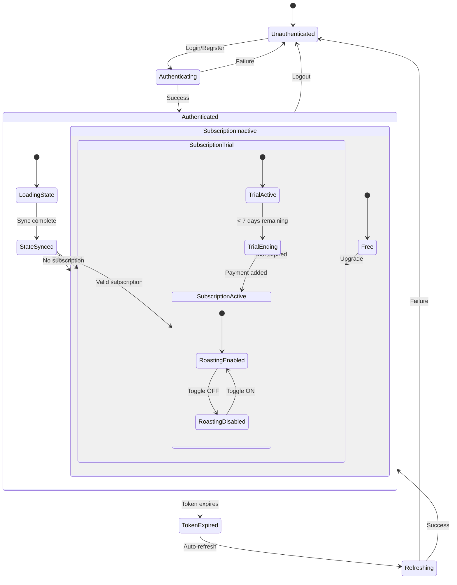
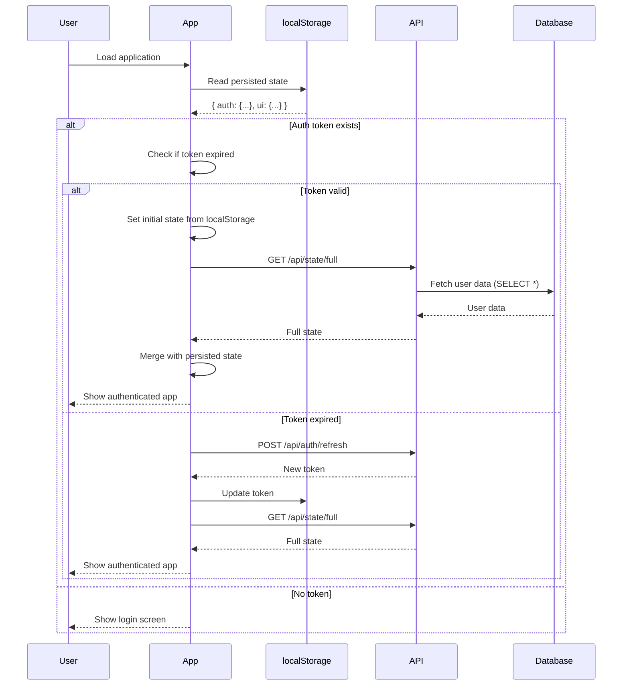

# Flow: Global State Management & Synchronization

**Created:** 2025-10-19
**Status:** Documented (Not Implemented)
**Related Nodes:** All system nodes
**Implementation:** 0% Complete (Conceptual design)

---

## Overview

The Global State Management system defines the complete state schema for the Roastr application, including authentication, subscription, persona, roasting configuration, and usage tracking. It establishes synchronization mechanisms between frontend, backend, and external services (Polar, Supabase) to ensure consistent state across all components.

---

## Complete State Schema

### TypeScript Definition

```typescript
interface GlobalUserState {
  // ========== AUTHENTICATION ==========
  auth: {
    userId: string;
    email: string;
    name: string;
    token: string;
    refreshToken: string;
    expiresAt: Date;
    isAuthenticated: boolean;
  };

  // ========== SUBSCRIPTION ==========
  subscription: {
    plan: 'free' | 'starter' | 'pro' | 'plus';
    status: 'active' | 'trial' | 'past_due' | 'canceled';
    trial_days_remaining: number | null;
    current_period_end: Date;
    polar_subscription_id: string | null;
    polar_customer_id: string | null;
  };

  // ========== PERSONA ==========
  persona: {
    identity: string | null; // Lo que me define
    intolerance: string | null; // Lo que no tolero
    tolerance: string | null; // Lo que me da igual (Pro+ only)
    embeddings_generated_at: Date | null;
    embeddings_model: string | null;
  };

  // ========== ROASTING CONFIGURATION ==========
  roasting: {
    enabled: boolean;
    roast_level: 1 | 2 | 3 | 4 | 5;
    shield_level: 'tolerante' | 'balanceado' | 'estricto';
  };

  // ========== USAGE TRACKING ==========
  usage: {
    monthly_roasts_used: number;
    monthly_roasts_limit: number;
    remaining_roasts: number;
    reset_date: Date; // Next billing cycle start
  };

  // ========== ORGANIZATION (MULTI-TENANT) ==========
  organization: {
    id: string;
    name: string;
    slug: string;
    role: 'owner' | 'admin' | 'member';
  };

  // ========== UI STATE (NON-PERSISTENT) ==========
  ui: {
    theme: 'light' | 'dark' | 'auto';
    language: 'es' | 'en';
    notifications_enabled: boolean;
    sidebar_collapsed: boolean;
  };

  // ========== SYNC METADATA ==========
  _meta: {
    lastSyncedAt: Date;
    version: number; // Optimistic locking version
    conflictResolution: 'pending' | 'resolved' | 'none';
  };
}
```

---

## State Diagram



---

## State Sources

### Single Source of Truth: Database (Supabase)

```
Database (Supabase PostgreSQL)
    ↓
Backend API (Node.js + Express)
    ↓
Frontend State Management (React Context / Zustand)
    ↓
UI Components
```

### External Sources

```
Polar (Subscription state)
    ↓ webhooks
Backend updates Database
    ↓
Frontend polls or WebSocket sync
```

---

## Data Flow Diagram

```mermaid
flowchart TD
    subgraph Frontend
        UI[UI Components]
        State[Global State Store]
        LocalStorage[localStorage]
    end

    subgraph Backend
        API[Express API]
        Workers[Background Workers]
    end

    subgraph Database
        Supabase[(Supabase PostgreSQL)]
    end

    subgraph External
        Polar[Polar Payments]
        OpenAI[OpenAI API]
    end

    UI -->|User actions| State
    State -->|Optimistic updates| UI
    State <-->|Persist auth| LocalStorage

    State -->|API calls| API
    API -->|Response| State

    API <-->|CRUD operations| Supabase
    Workers -->|Background updates| Supabase

    Polar -->|Webhooks| API
    API -->|Subscribe/Cancel| Polar

    API -->|Generate embeddings| OpenAI
    OpenAI -->|Embedding vectors| API

    Supabase -.->|RLS filtering| API
    State -.->|Polling (30s)| API
    State -.->|WebSocket| API
```

---

## Synchronization Mechanisms

### 1. Real-Time Sync (WebSocket)

**Use Case:** Critical state changes (roasting toggle, subscription status)

**Protocol:** Socket.IO or native WebSockets

**Flow:**
```
User A disables roasting on Device 1
    ↓
POST /api/roasting/toggle { enabled: false }
    ↓
Backend updates database
    ↓
Backend publishes to Redis channel "user:{userId}:roasting"
    ↓
WebSocket server broadcasts to all user's connections
    ↓
Device 2 receives message and updates UI in real-time
```

**Implementation:**
```javascript
// Server-side (Socket.IO)
io.on('connection', (socket) => {
  const userId = socket.handshake.auth.userId;

  // Join user-specific room
  socket.join(`user:${userId}`);

  // Listen to Redis pub/sub
  redis.subscribe(`user:${userId}:*`, (message) => {
    io.to(`user:${userId}`).emit('state_update', JSON.parse(message));
  });
});

// Client-side
socket.on('state_update', ({ type, data }) => {
  switch (type) {
    case 'roasting_toggle':
      updateGlobalState({ roasting: { enabled: data.enabled } });
      break;
    case 'subscription_update':
      updateGlobalState({ subscription: data });
      break;
  }
});
```

---

### 2. Polling (Fallback)

**Use Case:** Non-WebSocket clients, periodic sync

**Frequency:** Every 30 seconds for non-critical data

**Flow:**
```
setInterval(() => {
  fetch('/api/state/sync')
    .then(response => response.json())
    .then(data => updateGlobalState(data));
}, 30000);
```

**Optimized Polling:** Only fetch changed data
```javascript
const lastSyncedAt = globalState._meta.lastSyncedAt;

fetch(`/api/state/sync?since=${lastSyncedAt.toISOString()}`)
  .then(response => response.json())
  .then(changes => {
    if (changes.length > 0) {
      applyChanges(changes);
    }
  });
```

---

### 3. Optimistic Updates

**Use Case:** Immediate UI feedback while waiting for server confirmation

**Pattern:**
```javascript
async function toggleRoasting(enabled) {
  // 1. Optimistic update (instant UI change)
  updateGlobalState({
    roasting: { enabled },
    _meta: { version: globalState._meta.version + 1 }
  });

  try {
    // 2. Send to server
    const response = await fetch('/api/roasting/toggle', {
      method: 'POST',
      body: JSON.stringify({ enabled })
    });

    if (!response.ok) {
      // 3. Revert on error
      updateGlobalState({
        roasting: { enabled: !enabled },
        _meta: { version: globalState._meta.version - 1 }
      });

      showToast('Error updating setting', 'error');
    }
  } catch (error) {
    // Revert on network error
    updateGlobalState({ roasting: { enabled: !enabled } });
  }
}
```

---

### 4. Conflict Resolution

**Strategy:** Last Write Wins (LWW) with version tracking

**Scenario:** User edits persona on Device A and Device B simultaneously

**Flow:**
```
Device A: Update identity at 12:00:00 (version 5)
Device B: Update identity at 12:00:01 (version 5)
    ↓
Backend receives Device A update → version becomes 6
Backend receives Device B update → detects version mismatch (5 ≠ 6)
    ↓
Backend returns 409 Conflict
    ↓
Device B receives conflict response
Device B fetches latest version (6) from server
Device B shows user: "Another device updated this field. Merge changes?"
    ↓
User chooses:
  - "Use mine" → Force update with version 6 → version becomes 7
  - "Use server" → Discard local changes, use version 6
  - "Merge" → Show diff UI, let user merge manually
```

**Implementation:**
```javascript
// Backend
router.put('/api/persona/identity', async (req, res) => {
  const { text, version } = req.body;
  const userId = req.user.id;

  // Get current version from database
  const { data: user } = await supabase
    .from('users')
    .select('persona_version')
    .eq('id', userId)
    .single();

  if (user.persona_version !== version) {
    // Conflict detected
    return res.status(409).json({
      error: 'Conflict: Another device updated this field',
      code: 'E_CONFLICT',
      server_version: user.persona_version,
      client_version: version
    });
  }

  // Update with new version
  await supabase
    .from('users')
    .update({
      lo_que_me_define_encrypted: encrypt(text),
      persona_version: version + 1
    })
    .eq('id', userId);

  res.json({ success: true, version: version + 1 });
});
```

---

## State Persistence

### localStorage (Browser)

**Stored:**
- `auth.token`
- `auth.refreshToken`
- `auth.expiresAt`
- `ui.theme`
- `ui.language`
- `ui.sidebar_collapsed`

**Not Stored (sensitive or temporary):**
- `persona.*` (encrypted, fetch from server)
- `subscription.*` (fetch from server)
- `usage.*` (dynamic, fetch from server)

**Implementation:**
```javascript
// Save to localStorage
function persistState(state) {
  const persistable = {
    auth: {
      token: state.auth.token,
      refreshToken: state.auth.refreshToken,
      expiresAt: state.auth.expiresAt
    },
    ui: state.ui
  };

  localStorage.setItem('roastr_state', JSON.stringify(persistable));
}

// Load from localStorage
function loadPersistedState() {
  const stored = localStorage.getItem('roastr_state');
  if (!stored) return null;

  try {
    return JSON.parse(stored);
  } catch (error) {
    console.error('Failed to parse persisted state', error);
    localStorage.removeItem('roastr_state');
    return null;
  }
}
```

---

### Database (Supabase)

**Stored:**
- All user data (auth, subscription, persona, roasting config)
- Usage tracking (monthly_usage table)
- Organization membership (organization_members table)

**Advantages:**
- Single source of truth
- RLS for security
- Atomic transactions
- Audit trail

---

### Redis Cache (Backend)

**Stored:**
- Frequently accessed data (plan limits, feature flags)
- Session data (alternative to JWT)
- Real-time state for workers (roasting_enabled cache)

**TTL:** 5-15 minutes (invalidate on update)

**Implementation:**
```javascript
// Cache user plan
async function getUserPlan(userId) {
  const cacheKey = `user:${userId}:plan`;
  const cached = await redis.get(cacheKey);

  if (cached) {
    return JSON.parse(cached);
  }

  // Fetch from database
  const { data: user } = await supabase
    .from('users')
    .select('plan')
    .eq('id', userId)
    .single();

  // Cache for 10 minutes
  await redis.setex(cacheKey, 600, JSON.stringify(user.plan));

  return user.plan;
}
```

---

## State Initialization Flow

### On Application Load



---

## Frontend State Management

### Option 1: React Context + useReducer

```jsx
// GlobalStateContext.jsx
const initialState = {
  auth: { isAuthenticated: false, userId: null, ... },
  subscription: { plan: 'free', status: 'active', ... },
  persona: { identity: null, intolerance: null, tolerance: null },
  roasting: { enabled: true, roast_level: 3, shield_level: 'balanceado' },
  usage: { monthly_roasts_used: 0, monthly_roasts_limit: 100, ... },
  organization: { id: null, name: null, ... },
  ui: { theme: 'auto', language: 'es', ... },
  _meta: { lastSyncedAt: null, version: 0, conflictResolution: 'none' }
};

function stateReducer(state, action) {
  switch (action.type) {
    case 'SET_AUTH':
      return { ...state, auth: { ...state.auth, ...action.payload } };
    case 'SET_SUBSCRIPTION':
      return { ...state, subscription: { ...state.subscription, ...action.payload } };
    case 'TOGGLE_ROASTING':
      return { ...state, roasting: { ...state.roasting, enabled: action.payload } };
    case 'UPDATE_USAGE':
      return { ...state, usage: { ...state.usage, ...action.payload } };
    case 'SYNC_FULL_STATE':
      return { ...state, ...action.payload, _meta: { lastSyncedAt: new Date(), version: state._meta.version + 1 } };
    default:
      return state;
  }
}

export const GlobalStateProvider = ({ children }) => {
  const [state, dispatch] = useReducer(stateReducer, initialState);

  // Load persisted state on mount
  useEffect(() => {
    const persisted = loadPersistedState();
    if (persisted) {
      dispatch({ type: 'SYNC_FULL_STATE', payload: persisted });
    }
  }, []);

  // Persist on state change
  useEffect(() => {
    persistState(state);
  }, [state]);

  // WebSocket sync
  useEffect(() => {
    const socket = io(`wss://${window.location.host}`);

    socket.on('state_update', ({ type, data }) => {
      dispatch({ type, payload: data });
    });

    return () => socket.disconnect();
  }, []);

  return (
    <GlobalStateContext.Provider value={{ state, dispatch }}>
      {children}
    </GlobalStateContext.Provider>
  );
};
```

---

### Option 2: Zustand (Simpler)

```javascript
// store/globalState.js
import create from 'zustand';
import { persist } from 'zustand/middleware';

const useGlobalState = create(
  persist(
    (set, get) => ({
      // State
      auth: { isAuthenticated: false, ... },
      subscription: { plan: 'free', ... },
      persona: { identity: null, ... },
      roasting: { enabled: true, ... },
      usage: { monthly_roasts_used: 0, ... },

      // Actions
      setAuth: (auth) => set({ auth: { ...get().auth, ...auth } }),
      setSubscription: (subscription) => set({ subscription: { ...get().subscription, ...subscription } }),
      toggleRoasting: (enabled) => set({ roasting: { ...get().roasting, enabled } }),
      updateUsage: (usage) => set({ usage: { ...get().usage, ...usage } }),
      syncFullState: (state) => set(state),

      // Async actions
      fetchFullState: async () => {
        const response = await fetch('/api/state/full');
        const data = await response.json();
        set(data);
      }
    }),
    {
      name: 'roastr-state', // localStorage key
      partialize: (state) => ({
        auth: { token: state.auth.token, refreshToken: state.auth.refreshToken },
        ui: state.ui
      })
    }
  )
);

export default useGlobalState;
```

---

## API Endpoints

### GET `/api/state/full`

**Description:** Get complete user state

**Authentication:** Required (JWT)

**Response (200 OK):**
```json
{
  "success": true,
  "data": {
    "auth": { ... },
    "subscription": { ... },
    "persona": { ... },
    "roasting": { ... },
    "usage": { ... },
    "organization": { ... }
  }
}
```

---

### GET `/api/state/sync?since=<timestamp>`

**Description:** Get state changes since timestamp (optimized polling)

**Authentication:** Required (JWT)

**Query Parameters:**
- `since` - ISO timestamp of last sync

**Response (200 OK - No Changes):**
```json
{
  "success": true,
  "changes": [],
  "lastSyncedAt": "2025-10-19T12:00:00Z"
}
```

**Response (200 OK - With Changes):**
```json
{
  "success": true,
  "changes": [
    {
      "field": "roasting.enabled",
      "value": false,
      "updated_at": "2025-10-19T12:05:00Z"
    },
    {
      "field": "usage.monthly_roasts_used",
      "value": 46,
      "updated_at": "2025-10-19T12:06:00Z"
    }
  ],
  "lastSyncedAt": "2025-10-19T12:06:00Z"
}
```

---

## Current Gaps

### Not Implemented

1. **WebSocket Server** - Real-time sync infrastructure
2. **State Sync API Endpoints** - `/api/state/full`, `/api/state/sync`
3. **Frontend State Management** - No global state store (Context or Zustand)
4. **Conflict Resolution UI** - Manual merge interface
5. **Redis Caching Layer** - Backend state caching

### Needs Design

1. **Offline Support** - Queue mutations when offline, sync when online
2. **State Versioning** - Schema migration strategy for state updates
3. **Performance Optimization** - Debounce/throttle polling, optimize WebSocket messages

---

## Next Steps

1. **Choose Frontend State Library** (Priority: P0)
   - Evaluate React Context vs Zustand vs Redux
   - Decision: Zustand (simpler, good performance)

2. **Implement WebSocket Server** (Priority: P1)
   - Set up Socket.IO or native WebSockets
   - Implement user rooms for broadcasting
   - Connect to Redis pub/sub

3. **Create State Sync API** (Priority: P1)
   - Implement `GET /api/state/full`
   - Implement `GET /api/state/sync?since=<timestamp>`
   - Add change tracking to database

4. **Build Frontend State Store** (Priority: P1)
   - Implement global state with Zustand
   - Add persistence to localStorage
   - Add WebSocket sync

5. **Implement Conflict Resolution** (Priority: P2)
   - Add version tracking to database
   - Implement 409 Conflict handling
   - Build merge UI

6. **Add Redis Caching** (Priority: P2)
   - Cache frequently accessed data
   - Implement cache invalidation
   - Monitor cache hit rate

---

**Last Updated:** 2025-10-19
**Maintained By:** Frontend Developer, Backend Developer, Documentation Agent
**Related Issues:** Global state management implementation (to be created)
**Related PRs:** None yet
