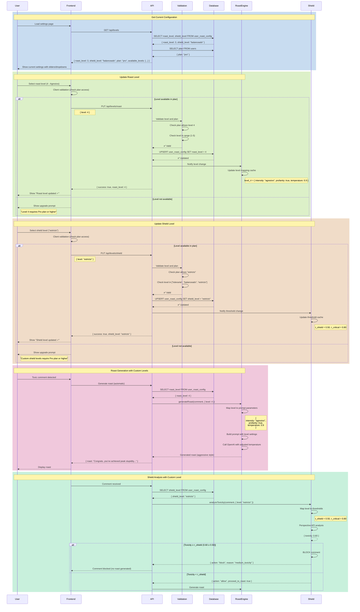

# Flow: Level Configuration (Roast + Shield)

**Created:** 2025-10-19
**Status:** Conceptually Defined (Not Implemented)
**Related Nodes:** `roast`, `guardian`, `plan-features`
**Implementation:** 20% Complete (Concept exists, service layer missing)

---

## Overview

The Level Configuration flow allows users to customize the intensity of roast responses and the sensitivity of Shield content moderation. Users can adjust two independent levels based on their plan tier, enabling fine-tuned control over the system's behavior.

**Key Capabilities:**
- **Roast Intensity:** 5 levels from gentle wit to savage burns
- **Shield Sensitivity:** 3 levels controlling automatic blocking thresholds
- **Plan-Based Access:** Higher plans unlock more customization options
- **Real-Time Updates:** Changes apply immediately to future roasts
- **Persistent Settings:** Saved to database and synced across devices

---

## Two-Level System

### 1. Roast Level (Intensity)

**Purpose:** Controls how aggressive and explicit roasts are

**Levels (1-5):**

| Level | Name | Description | Tone | Profanity | Example |
|-------|------|-------------|------|-----------|---------|
| **1** | Suave | Gentle wit with subtle irony | Polite, understated | ❌ No | "I appreciate your enthusiasm, though perhaps a bit misplaced" |
| **2** | Neutral | Balanced sarcasm with humor | Balanced | ❌ No | "That's certainly... an opinion. Thanks for sharing!" |
| **3** | Moderado | Direct sarcasm with bite | Direct, sarcastic | ✅ Mild | "Wow, you really thought this through, didn't you?" |
| **4** | Agresivo | Unfiltered and sharp | Cutting, no filters | ✅ Yes | "Congrats, you've achieved peak stupidity. That takes skill." |
| **5** | Caústico | Maximum brutality | Savage, brutal | ✅ Strong | "I'd explain why you're wrong, but I don't have crayons" |

**Plan Access:**
- Free: Level 3 (fixed, no customization)
- Starter: Levels 1, 3, 5
- Pro: All levels (1-5)
- Plus: All levels + custom temperature control

---

### 2. Shield Level (Sensitivity)

**Purpose:** Controls automatic blocking threshold for toxic content

**Levels (3 options):**

| Level | Name | Description | τ_shield | τ_critical | Blocking Behavior |
|-------|------|-------------|----------|------------|-------------------|
| **Tolerante** | Tolerant | Only blocks severe violations | 0.85 | 0.95 | Blocks only critical threats/severe toxicity |
| **Balanceado** | Balanced | Blocks high toxicity (default) | 0.70 | 0.90 | Blocks high and critical toxicity |
| **Estricto** | Strict | Blocks medium+ toxicity | 0.50 | 0.80 | Blocks medium, high, and critical toxicity |

**τ_shield:** Toxicity threshold for Shield action (0-1 scale)
**τ_critical:** Threshold for immediate critical escalation

**Plan Access:**
- Free: Balanceado (fixed, no customization)
- Starter: Balanceado only
- Pro: All 3 levels
- Plus: All 3 levels + custom thresholds

---

## Flow Diagram



---

## Plan-Based Access Control

### Roast Level Access

| Plan | Available Levels | Customization |
|------|------------------|---------------|
| **Free** | Level 3 only | ❌ Fixed (no customization) |
| **Starter** | Levels 1, 3, 5 | ✅ Choose from 3 options |
| **Pro** | Levels 1-5 | ✅ Full control |
| **Plus** | Levels 1-5 + custom | ✅ Full control + temperature tuning |

### Shield Level Access

| Plan | Available Levels | Customization |
|------|------------------|---------------|
| **Free** | Balanceado only | ❌ Fixed (τ_shield = 0.70) |
| **Starter** | Balanceado only | ❌ Fixed |
| **Pro** | All 3 levels | ✅ Choose sensitivity |
| **Plus** | All 3 + custom | ✅ Custom τ_shield thresholds |

---

## API Endpoints

### GET `/api/levels`

**Description:** Get current roast and shield levels for authenticated user

**Authentication:** Required (JWT)

**Response (200 OK):**
```json
{
  "success": true,
  "data": {
    "roast_level": 3,
    "shield_level": "balanceado",
    "plan": "pro",
    "available_levels": {
      "roast": [1, 2, 3, 4, 5],
      "shield": ["tolerante", "balanceado", "estricto"]
    },
    "level_definitions": {
      "roast": {
        "1": { "name": "Suave", "description": "Gentle wit with subtle irony" },
        "2": { "name": "Neutral", "description": "Balanced sarcasm with humor" },
        "3": { "name": "Moderado", "description": "Direct sarcasm with bite" },
        "4": { "name": "Agresivo", "description": "Unfiltered and sharp" },
        "5": { "name": "Caústico", "description": "Maximum brutality" }
      },
      "shield": {
        "tolerante": { "name": "Tolerante", "threshold": 0.85 },
        "balanceado": { "name": "Balanceado", "threshold": 0.70 },
        "estricto": { "name": "Estricto", "threshold": 0.50 }
      }
    }
  }
}
```

---

### PUT `/api/levels/roast`

**Description:** Update user's roast intensity level

**Authentication:** Required (JWT)

**Request:**
```json
{
  "level": 4  // 1-5
}
```

**Response (200 OK):**
```json
{
  "success": true,
  "data": {
    "roast_level": 4,
    "level_name": "Agresivo",
    "updated_at": "2025-10-19T12:00:00Z"
  }
}
```

**Errors:**
- `400 Bad Request` - Invalid level (not 1-5)
- `403 Forbidden` - Level not available in user's plan
- `500 Internal Server Error` - Database error

---

### PUT `/api/levels/shield`

**Description:** Update user's shield sensitivity level

**Authentication:** Required (JWT)

**Request:**
```json
{
  "level": "estricto"  // "tolerante", "balanceado", "estricto"
}
```

**Response (200 OK):**
```json
{
  "success": true,
  "data": {
    "shield_level": "estricto",
    "threshold": 0.50,
    "updated_at": "2025-10-19T12:00:00Z"
  }
}
```

**Errors:**
- `400 Bad Request` - Invalid level
- `403 Forbidden` - Level not available in user's plan
- `500 Internal Server Error` - Database error

---

## Database Schema

### Table: `user_roast_config`

```sql
CREATE TABLE user_roast_config (
  id UUID PRIMARY KEY DEFAULT uuid_generate_v4(),
  user_id UUID UNIQUE REFERENCES users(id) ON DELETE CASCADE,

  -- Roast intensity (1-5)
  roast_level INTEGER NOT NULL DEFAULT 3,

  -- Shield sensitivity
  shield_level VARCHAR(20) NOT NULL DEFAULT 'balanceado',

  -- Timestamps
  created_at TIMESTAMPTZ DEFAULT NOW(),
  updated_at TIMESTAMPTZ DEFAULT NOW(),

  -- Constraints
  CONSTRAINT user_roast_config_roast_level_check
    CHECK (roast_level BETWEEN 1 AND 5),

  CONSTRAINT user_roast_config_shield_level_check
    CHECK (shield_level IN ('tolerante', 'balanceado', 'estricto'))
);

-- Indexes
CREATE INDEX idx_user_roast_config_user ON user_roast_config(user_id);
CREATE INDEX idx_user_roast_config_roast_level ON user_roast_config(roast_level);
CREATE INDEX idx_user_roast_config_shield_level ON user_roast_config(shield_level);

-- Default value trigger (create default config on user creation)
CREATE OR REPLACE FUNCTION create_default_roast_config()
RETURNS TRIGGER AS $$
BEGIN
  INSERT INTO user_roast_config (user_id, roast_level, shield_level)
  VALUES (NEW.id, 3, 'balanceado')
  ON CONFLICT (user_id) DO NOTHING;
  RETURN NEW;
END;
$$ LANGUAGE plpgsql;

CREATE TRIGGER create_default_roast_config_trigger
  AFTER INSERT ON users
  FOR EACH ROW EXECUTE FUNCTION create_default_roast_config();
```

---

## Service Implementation

### Level Config Service

```javascript
// src/services/levelConfigService.js
class LevelConfigService {
  constructor() {
    this.roastLevelMapping = {
      1: { intensity: 'suave', profanity: false, temperature: 0.6 },
      2: { intensity: 'neutral', profanity: false, temperature: 0.7 },
      3: { intensity: 'moderado', profanity: true, temperature: 0.8 },
      4: { intensity: 'agresivo', profanity: true, temperature: 0.9 },
      5: { intensity: 'caústico', profanity: true, temperature: 1.0 }
    };

    this.shieldLevelMapping = {
      'tolerante': { tau_shield: 0.85, tau_critical: 0.95 },
      'balanceado': { tau_shield: 0.70, tau_critical: 0.90 },
      'estricto': { tau_shield: 0.50, tau_critical: 0.80 }
    };

    this.planAccessMatrix = {
      roast: {
        free: [3],
        starter: [1, 3, 5],
        pro: [1, 2, 3, 4, 5],
        plus: [1, 2, 3, 4, 5]
      },
      shield: {
        free: ['balanceado'],
        starter: ['balanceado'],
        pro: ['tolerante', 'balanceado', 'estricto'],
        plus: ['tolerante', 'balanceado', 'estricto']
      }
    };
  }

  validateRoastLevel(level, plan) {
    const allowedLevels = this.planAccessMatrix.roast[plan];
    if (!allowedLevels.includes(level)) {
      throw new Error(`Roast level ${level} not available in ${plan} plan`);
    }
    return true;
  }

  validateShieldLevel(level, plan) {
    const allowedLevels = this.planAccessMatrix.shield[plan];
    if (!allowedLevels.includes(level)) {
      throw new Error(`Shield level "${level}" not available in ${plan} plan`);
    }
    return true;
  }

  async getConfig(userId) {
    const { data: config } = await supabase
      .from('user_roast_config')
      .select('roast_level, shield_level')
      .eq('user_id', userId)
      .single();

    if (!config) {
      // Return default
      return { roast_level: 3, shield_level: 'balanceado' };
    }

    return config;
  }

  async setRoastLevel(userId, level, plan) {
    this.validateRoastLevel(level, plan);

    const { error } = await supabase
      .from('user_roast_config')
      .upsert({
        user_id: userId,
        roast_level: level,
        updated_at: new Date().toISOString()
      }, { onConflict: 'user_id' });

    if (error) throw error;

    return { roast_level: level };
  }

  async setShieldLevel(userId, level, plan) {
    this.validateShieldLevel(level, plan);

    const { error } = await supabase
      .from('user_roast_config')
      .upsert({
        user_id: userId,
        shield_level: level,
        updated_at: new Date().toISOString()
      }, { onConflict: 'user_id' });

    if (error) throw error;

    return { shield_level: level };
  }

  getRoastLevelParams(level) {
    return this.roastLevelMapping[level] || this.roastLevelMapping[3];
  }

  getShieldLevelParams(level) {
    return this.shieldLevelMapping[level] || this.shieldLevelMapping['balanceado'];
  }
}

module.exports = new LevelConfigService();
```

---

## Integration with Roast Engine

### Apply Roast Level to Prompt

```javascript
// src/services/roastEngine.js
const levelConfigService = require('./levelConfigService');

class RoastEngine {
  async generateRoast(comment, options = {}) {
    const { userId } = options;

    // Get user's roast level
    const { roast_level } = await levelConfigService.getConfig(userId);

    // Map level to parameters
    const levelParams = levelConfigService.getRoastLevelParams(roast_level);

    // Build prompt with level-specific tone
    const prompt = this.buildPrompt({
      comment,
      intensity: levelParams.intensity,
      allowProfanity: levelParams.profanity
    });

    // Generate roast with adjusted temperature
    const response = await openai.chat.completions.create({
      model: 'gpt-4o',
      messages: [{ role: 'user', content: prompt }],
      temperature: levelParams.temperature,
      max_tokens: 150
    });

    return response.choices[0].message.content;
  }

  buildPrompt({ comment, intensity, allowProfanity }) {
    const intensityInstructions = {
      suave: 'Responde con ironía sutil y humor ligero. Mantén un tono cortés.',
      neutral: 'Responde con sarcasmo balanceado. No seas demasiado agresivo.',
      moderado: 'Responde con sarcasmo directo y algo picante. Puedes usar palabrotas ocasionales.',
      agresivo: 'Responde sin filtros, muy directo y cortante. Las palabrotas están permitidas.',
      caústico: 'Responde con máxima brutalidad y humor negro. Sin límites.'
    };

    const profanityNote = allowProfanity
      ? 'Puedes usar palabrotas si es apropiado.'
      : 'NO uses palabrotas.';

    return `
      Tu tarea es generar una respuesta sarcástica e ingeniosa al siguiente comentario.

      TONO: ${intensityInstructions[intensity]}
      ${profanityNote}

      COMENTARIO ORIGINAL: "${comment}"

      Genera una respuesta cortante y memorable.
    `.trim();
  }
}
```

---

## Integration with Shield

### Apply Shield Level to Thresholds

```javascript
// src/services/shieldService.js
const levelConfigService = require('./levelConfigService');

class ShieldService {
  async analyzeToxicity(comment, userId) {
    // Get user's shield level
    const { shield_level } = await levelConfigService.getConfig(userId);

    // Map level to thresholds
    const { tau_shield, tau_critical } = levelConfigService.getShieldLevelParams(shield_level);

    // Analyze with Perspective API
    const toxicityScore = await this.perspectiveAnalysis(comment);

    // Apply custom thresholds
    if (toxicityScore >= tau_critical) {
      return {
        action: 'block',
        severity: 'critical',
        score: toxicityScore,
        threshold: tau_critical
      };
    }

    if (toxicityScore >= tau_shield) {
      return {
        action: 'block',
        severity: 'high',
        score: toxicityScore,
        threshold: tau_shield
      };
    }

    return {
      action: 'allow',
      severity: 'low',
      score: toxicityScore,
      proceed_to_roast: true
    };
  }
}
```

---

## Frontend Implementation

### Level Configuration UI

```jsx
// components/LevelConfiguration.jsx
function LevelConfiguration({ userPlan }) {
  const [roastLevel, setRoastLevel] = useState(3);
  const [shieldLevel, setShieldLevel] = useState('balanceado');
  const [availableLevels, setAvailableLevels] = useState({});

  useEffect(() => {
    fetchCurrentLevels();
  }, []);

  const fetchCurrentLevels = async () => {
    const response = await fetch('/api/levels', {
      headers: { 'Authorization': `Bearer ${getToken()}` }
    });
    const data = await response.json();

    setRoastLevel(data.data.roast_level);
    setShieldLevel(data.data.shield_level);
    setAvailableLevels(data.data.available_levels);
  };

  const handleRoastLevelChange = async (newLevel) => {
    if (!availableLevels.roast.includes(newLevel)) {
      showUpgradePrompt();
      return;
    }

    setRoastLevel(newLevel); // Optimistic update

    const response = await fetch('/api/levels/roast', {
      method: 'PUT',
      headers: {
        'Content-Type': 'application/json',
        'Authorization': `Bearer ${getToken()}`
      },
      body: JSON.stringify({ level: newLevel })
    });

    if (response.ok) {
      showToast('Roast level updated ✓');
    } else {
      setRoastLevel(roastLevel); // Revert on error
      showToast('Error updating level', 'error');
    }
  };

  const handleShieldLevelChange = async (newLevel) => {
    if (!availableLevels.shield.includes(newLevel)) {
      showUpgradePrompt();
      return;
    }

    setShieldLevel(newLevel);

    const response = await fetch('/api/levels/shield', {
      method: 'PUT',
      headers: {
        'Content-Type': 'application/json',
        'Authorization': `Bearer ${getToken()}`
      },
      body: JSON.stringify({ level: newLevel })
    });

    if (response.ok) {
      showToast('Shield level updated ✓');
    } else {
      setShieldLevel(shieldLevel);
      showToast('Error updating level', 'error');
    }
  };

  return (
    <div className="level-configuration">
      <div className="roast-level">
        <h3>Roast Intensity</h3>
        <LevelSlider
          min={1}
          max={5}
          value={roastLevel}
          onChange={handleRoastLevelChange}
          availableLevels={availableLevels.roast}
          labels={['Suave', 'Neutral', 'Moderado', 'Agresivo', 'Caústico']}
        />
        <p className="help-text">
          {getLevelDescription(roastLevel)}
        </p>
      </div>

      <div className="shield-level">
        <h3>Shield Sensitivity</h3>
        <LevelSelector
          options={['tolerante', 'balanceado', 'estricto']}
          selected={shieldLevel}
          onChange={handleShieldLevelChange}
          availableOptions={availableLevels.shield}
          labels={{
            tolerante: 'Tolerant (blocks only severe)',
            balanceado: 'Balanced (default)',
            estricto: 'Strict (blocks medium+)'
          }}
        />
      </div>
    </div>
  );
}
```

---

## Testing

### Unit Tests

```javascript
// tests/unit/services/levelConfigService.test.js
describe('Level Config Service', () => {
  test('validates roast level within plan limits', () => {
    expect(() => levelConfigService.validateRoastLevel(1, 'free')).toThrow();
    expect(() => levelConfigService.validateRoastLevel(3, 'free')).not.toThrow();
    expect(() => levelConfigService.validateRoastLevel(4, 'starter')).toThrow();
    expect(() => levelConfigService.validateRoastLevel(4, 'pro')).not.toThrow();
  });

  test('maps roast level to correct parameters', () => {
    const params = levelConfigService.getRoastLevelParams(5);

    expect(params.intensity).toBe('caústico');
    expect(params.profanity).toBe(true);
    expect(params.temperature).toBe(1.0);
  });

  test('maps shield level to correct thresholds', () => {
    const params = levelConfigService.getShieldLevelParams('estricto');

    expect(params.tau_shield).toBe(0.50);
    expect(params.tau_critical).toBe(0.80);
  });
});
```

---

### Integration Tests

```javascript
// tests/integration/level-configuration.test.js
describe('Level Configuration Integration', () => {
  test('updates roast level and applies to generation', async () => {
    // Set roast level to 5 (Caústico)
    await request(app)
      .put('/api/levels/roast')
      .set('Authorization', `Bearer ${proUser.token}`)
      .send({ level: 5 });

    // Generate roast
    const roast = await roastEngine.generateRoast({
      comment: 'You are stupid',
      userId: proUser.id
    });

    // Verify roast uses aggressive tone
    expect(roast).toMatch(/(brutal|savage|caústico)/i);
    // Should allow profanity at level 5
    expect(roast.toLowerCase()).toMatch(/(idiota|estúpid|mierda)/);
  });

  test('blocks plan-restricted levels', async () => {
    const response = await request(app)
      .put('/api/levels/roast')
      .set('Authorization', `Bearer ${starterUser.token}`)
      .send({ level: 4 }); // Level 4 not available in Starter

    expect(response.status).toBe(403);
    expect(response.body.error).toMatch(/not available/i);
  });
});
```

---

## Current Gaps

### Not Implemented

1. **Level Config Service** (`src/services/levelConfigService.js`) - Missing
2. **API Endpoints** (`/api/levels/*`) - Missing
3. **Database Migration** (`add_roast_config.sql`) - Missing
4. **Integration with Roast Engine** - Missing
5. **Integration with Shield** - Missing
6. **Frontend UI Components** - Missing

### Needs Enhancement

1. **Plus Plan Custom Thresholds** - Allow Plus users to set custom τ_shield values
2. **A/B Testing** - Test effectiveness of different levels
3. **Analytics** - Track which levels are most popular
4. **Level Recommendations** - Suggest optimal level based on user behavior

---

## Next Steps

1. **Implement Level Config Service** (Priority: P1)
   - Create `src/services/levelConfigService.js`
   - Implement validation and mapping logic
   - Add caching for performance

2. **Create Database Schema** (Priority: P1)
   - Create migration `add_roast_config.sql`
   - Add default value trigger
   - Test UPSERT logic

3. **Create API Endpoints** (Priority: P1)
   - Implement GET `/api/levels`
   - Implement PUT `/api/levels/roast`
   - Implement PUT `/api/levels/shield`

4. **Integrate with Roast Engine** (Priority: P1)
   - Read level from database
   - Map level to prompt parameters
   - Apply temperature adjustment

5. **Integrate with Shield** (Priority: P1)
   - Read shield level from database
   - Apply custom thresholds
   - Test blocking behavior

6. **Frontend UI** (Priority: P2)
   - Build level sliders/selectors
   - Add plan-based restrictions
   - Implement real-time preview

---

**Last Updated:** 2025-10-19
**Maintained By:** Backend Developer, UX Designer, Documentation Agent
**Related Issues:** Level configuration implementation (to be created)
**Related PRs:** None yet
