# Flow: Payment & Subscription (Polar Integration)

**Created:** 2025-10-19
**Status:** Planned (Not Implemented)
**Related Nodes:** `billing`, `cost-control`, `multi-tenant`
**Implementation:** 30% Complete (Stripe exists, Polar migration pending)

---

## Overview

The Payment & Subscription flow manages user subscriptions through Polar (Merchant of Record). It handles checkout, webhook processing, trial periods, plan upgrades/downgrades, and synchronization with Supabase for plan limits enforcement.

**Current State:** System uses Stripe in code, but business model references Polar. Migration to Polar is pending.

**Why Polar:**
- **Merchant of Record (MoR):** Simplifies EU VAT + US sales tax compliance
- **Modern API:** Better developer experience than Stripe
- **Unified Billing:** Subscriptions + one-time purchases in single platform
- **Trial Management:** Built-in trial period handling

---

## Flow Diagram

```mermaid
sequenceDiagram
    participant User
    participant Frontend
    participant API
    participant Polar
    participant Supabase
    participant Workers

    %% Checkout Flow
    rect rgb(200, 220, 240)
        Note over User,Workers: Checkout Flow (New Subscription)
        User->>Frontend: Click "Upgrade to Pro"
        Frontend->>API: POST /api/billing/polar/checkout
        Note right of Frontend: { plan: "pro" }
        API->>Polar: Create checkout session
        Note right of API: Polar.checkout.create({ <br/> plan: "pro", <br/> trial_days: 30, <br/> success_url, cancel_url <br/>})
        Polar-->>API: Checkout URL
        API-->>Frontend: { checkoutUrl }
        Frontend-->>User: Redirect to Polar Checkout
        User->>Polar: Complete payment
        Polar->>Polar: Process payment
        Polar->>API: Webhook: checkout.completed
        API->>API: Verify webhook signature
        API->>Supabase: INSERT INTO polar_subscriptions
        Note right of API: { <br/> user_id, <br/> polar_subscription_id, <br/> plan: "pro", <br/> status: "trial", <br/> trial_end_date: NOW() + 30 days <br/>}
        API->>Supabase: UPDATE users SET plan = 'pro'
        API->>Supabase: Track webhook event (idempotency)
        API->>Workers: Notify plan change
        Workers->>Workers: Update plan limits in memory
        API-->>Polar: 200 OK { received: true }
        Polar->>User: Redirect to success_url
        User->>Frontend: Redirected to /billing/success
        Frontend->>Frontend: Show success message
    end

    %% Trial Period
    rect rgb(220, 240, 200)
        Note over User,Workers: Trial Period (30 Days)
        loop Every day
            API->>Supabase: SELECT trial subscriptions expiring soon
            alt Trial ends in 7 days
                API->>User: Email: "Your trial ends in 7 days"
            else Trial ends today
                API->>User: Email: "Your trial has ended"
                API->>Polar: Check subscription status
                alt No payment method
                    Polar-->>API: Status: trial_ended
                    API->>Supabase: UPDATE subscription status = 'canceled'
                    API->>Supabase: UPDATE users SET plan = 'free'
                    API->>User: Email: "Downgraded to Free"
                    API->>Workers: Notify plan change (free)
                else Payment method added
                    Polar-->>API: Status: active
                    API->>Supabase: UPDATE subscription status = 'active'
                    API->>User: Email: "Subscription activated"
                end
            end
        end
    end

    %% Subscription Update (Upgrade/Downgrade)
    rect rgb(240, 220, 200)
        Note over User,Workers: Plan Change (Upgrade/Downgrade)
        User->>Frontend: Change plan (Pro → Plus)
        Frontend->>API: POST /api/billing/polar/update
        Note right of Frontend: { newPlan: "plus" }
        API->>Polar: Update subscription
        Note right of API: Polar.subscriptions.update({ <br/> subscription_id, <br/> plan: "plus" <br/>})
        Polar-->>API: Updated subscription
        API->>Supabase: UPDATE polar_subscriptions SET plan = 'plus'
        API->>Supabase: UPDATE users SET plan = 'plus'
        API->>Workers: Notify plan change
        API-->>Frontend: { success: true }
        Frontend-->>User: Show "Plan updated to Plus"

        Note over Polar,API: Webhook sent async
        Polar->>API: Webhook: subscription.updated
        API->>API: Verify signature + check idempotency
        API->>Supabase: Sync subscription (already updated)
        API-->>Polar: 200 OK
    end

    %% Payment Failed
    rect rgb(240, 200, 220)
        Note over User,Workers: Payment Failed (Renewal)
        Polar->>Polar: Attempt to charge subscription
        Polar->>Polar: Payment declined
        Polar->>API: Webhook: payment.failed
        API->>API: Verify signature
        API->>Supabase: UPDATE subscription status = 'past_due'
        API->>User: Email: "Payment failed, please update payment method"
        API-->>Polar: 200 OK

        alt User updates payment method
            User->>Polar: Update payment method
            Polar->>Polar: Retry payment
            Polar->>API: Webhook: payment.succeeded
            API->>Supabase: UPDATE subscription status = 'active'
            API->>User: Email: "Payment successful"
            API-->>Polar: 200 OK
        else Grace period expires (7 days)
            Polar->>API: Webhook: subscription.canceled
            API->>Supabase: UPDATE subscription status = 'canceled'
            API->>Supabase: UPDATE users SET plan = 'free'
            API->>Workers: Notify plan change (free)
            API->>User: Email: "Subscription canceled, downgraded to Free"
            API-->>Polar: 200 OK
        end
    end

    %% Cancellation
    rect rgb(200, 240, 220)
        Note over User,Workers: Cancellation
        User->>Frontend: Click "Cancel subscription"
        Frontend->>Frontend: Show confirmation dialog
        User->>Frontend: Confirm cancellation
        Frontend->>API: POST /api/billing/polar/cancel
        API->>Polar: Cancel subscription
        Note right of API: Polar.subscriptions.cancel({ <br/> subscription_id, <br/> at_period_end: true <br/>})
        Polar-->>API: Canceled (effective at period end)
        API->>Supabase: UPDATE subscription status = 'canceled'
        Note right of API: Plan remains active until current_period_end
        API-->>Frontend: { success: true, effective_date }
        Frontend-->>User: "Canceled. Access until {effective_date}"

        Note over Polar,API: On period end
        Polar->>API: Webhook: subscription.ended
        API->>Supabase: UPDATE users SET plan = 'free'
        API->>Workers: Notify plan change (free)
        API->>User: Email: "Subscription ended, downgraded to Free"
        API-->>Polar: 200 OK
    end
```



---

## Subscription Plans

### Plan Tiers

| Plan | Price | Billing Cycle | Trial Period | Features |
|------|-------|---------------|--------------|----------|
| **Free** | €0/month | - | - | 100 roasts/month, 1 platform |
| **Starter** | €5/month | Monthly | 30 days | 500 roasts/month, 2 platforms, basic persona |
| **Pro** | €15/month | Monthly | 14 days | 1,000 roasts/month, 5 platforms, full persona, analytics |
| **Plus** | €50/month | Monthly | 14 days | Unlimited roasts, all platforms, custom styles, priority support |

**Note:** Enterprise plans not currently available but planned for future.

---

## Components

### API Endpoints

#### POST `/api/billing/polar/checkout`

**Description:** Creates Polar checkout session for plan subscription

**Authentication:** Required (JWT)

**Request:**
```json
{
  "plan": "starter" | "pro" | "plus",
  "return_url": "https://app.roastr.ai/billing/success" // Optional
}
```

**Response (200 OK):**
```json
{
  "success": true,
  "data": {
    "checkoutUrl": "https://checkout.polar.sh/session/cs_abc123",
    "sessionId": "cs_abc123"
  }
}
```

**Errors:**
- `400 Bad Request` - Invalid plan
- `401 Unauthorized` - Not authenticated
- `409 Conflict` - User already has active subscription
- `500 Internal Server Error` - Polar API error

---

#### POST `/api/billing/polar/webhooks`

**Description:** Receives webhooks from Polar

**Authentication:** Webhook signature verification

**Headers:**
```
Polar-Signature: t=1729347000,v1=abc123...
```

**Request Body (checkout.completed):**
```json
{
  "id": "evt_abc123",
  "type": "checkout.completed",
  "created_at": "2025-10-19T12:00:00Z",
  "data": {
    "subscription_id": "sub_xyz789",
    "customer_id": "cus_abc123",
    "plan": "pro",
    "status": "trial",
    "trial_end": "2025-11-18T12:00:00Z",
    "current_period_start": "2025-10-19T12:00:00Z",
    "current_period_end": "2025-11-19T12:00:00Z",
    "metadata": {
      "user_id": "user-uuid"
    }
  }
}
```

**Response (200 OK):**
```json
{
  "received": true,
  "processed": true,
  "idempotent": false
}
```

**Response (200 OK - Duplicate Event):**
```json
{
  "received": true,
  "processed": false,
  "idempotent": true,
  "message": "Event already processed"
}
```

---

#### GET `/api/billing/polar/subscription`

**Description:** Get current user's subscription details

**Authentication:** Required (JWT)

**Response (200 OK):**
```json
{
  "success": true,
  "data": {
    "subscription": {
      "id": "uuid",
      "polar_subscription_id": "sub_xyz789",
      "plan": "pro",
      "status": "trial",
      "trial_end_date": "2025-11-18T12:00:00Z",
      "current_period_start": "2025-10-19T12:00:00Z",
      "current_period_end": "2025-11-19T12:00:00Z",
      "cancel_at_period_end": false
    },
    "usage": {
      "monthly_roasts_used": 45,
      "monthly_roasts_limit": 1000,
      "remaining": 955
    }
  }
}
```

**Response (404 Not Found - No Active Subscription):**
```json
{
  "success": false,
  "error": "No active subscription found"
}
```

---

#### POST `/api/billing/polar/update`

**Description:** Update subscription plan (upgrade/downgrade)

**Authentication:** Required (JWT)

**Request:**
```json
{
  "newPlan": "plus"
}
```

**Response (200 OK):**
```json
{
  "success": true,
  "data": {
    "subscription": {
      "plan": "plus",
      "status": "active",
      "prorated_charge": 3500, // cents (€35.00)
      "effective_date": "2025-10-19T12:00:00Z"
    }
  }
}
```

**Errors:**
- `400 Bad Request` - Invalid plan or same as current
- `404 Not Found` - No active subscription
- `500 Internal Server Error` - Polar API error

---

#### POST `/api/billing/polar/cancel`

**Description:** Cancel subscription (effective at period end)

**Authentication:** Required (JWT)

**Request:**
```json
{
  "immediately": false // Optional: cancel immediately vs at period end
}
```

**Response (200 OK):**
```json
{
  "success": true,
  "data": {
    "status": "canceled",
    "access_until": "2025-11-19T12:00:00Z",
    "downgrade_date": "2025-11-19T12:00:00Z"
  }
}
```

---

#### POST `/api/billing/polar/portal`

**Description:** Create Polar customer portal session

**Authentication:** Required (JWT)

**Response (200 OK):**
```json
{
  "success": true,
  "data": {
    "portalUrl": "https://portal.polar.sh/session/ps_abc123"
  }
}
```

**Note:** Polar customer portal allows users to:
- Update payment method
- View invoices
- Manage subscription
- Download receipts

---

## Database Schema

### Table: `polar_subscriptions`

```sql
CREATE TABLE polar_subscriptions (
  id UUID PRIMARY KEY DEFAULT uuid_generate_v4(),
  user_id UUID REFERENCES users(id) ON DELETE CASCADE,
  polar_subscription_id VARCHAR(255) UNIQUE NOT NULL,
  polar_customer_id VARCHAR(255) NOT NULL,

  -- Subscription details
  plan VARCHAR(50) NOT NULL,
  status VARCHAR(20) NOT NULL,

  -- Trial period
  trial_end_date TIMESTAMPTZ,

  -- Billing cycle
  current_period_start TIMESTAMPTZ NOT NULL,
  current_period_end TIMESTAMPTZ NOT NULL,
  cancel_at_period_end BOOLEAN DEFAULT FALSE,

  -- Timestamps
  created_at TIMESTAMPTZ DEFAULT NOW(),
  updated_at TIMESTAMPTZ DEFAULT NOW(),

  -- Constraints
  CONSTRAINT polar_subscriptions_plan_check
    CHECK (plan IN ('free', 'starter', 'pro', 'plus')),
  CONSTRAINT polar_subscriptions_status_check
    CHECK (status IN ('trial', 'active', 'past_due', 'canceled', 'ended'))
);

-- Indexes
CREATE INDEX idx_polar_subscriptions_user ON polar_subscriptions(user_id);
CREATE INDEX idx_polar_subscriptions_polar_id ON polar_subscriptions(polar_subscription_id);
CREATE INDEX idx_polar_subscriptions_status ON polar_subscriptions(status) WHERE status = 'active' OR status = 'trial';
```

---

### Table: `polar_webhook_events`

Tracks processed webhook events for idempotency:

```sql
CREATE TABLE polar_webhook_events (
  id UUID PRIMARY KEY DEFAULT uuid_generate_v4(),
  event_id VARCHAR(255) UNIQUE NOT NULL,
  event_type VARCHAR(100) NOT NULL,
  processed_at TIMESTAMPTZ DEFAULT NOW(),
  created_at TIMESTAMPTZ DEFAULT NOW()
);

CREATE INDEX idx_polar_webhook_events_id ON polar_webhook_events(event_id);
CREATE INDEX idx_polar_webhook_events_type ON polar_webhook_events(event_type);
```

---

## Webhook Events

### Event: `checkout.completed`

**Fired when:** User completes checkout and subscription is created

**Actions:**
1. Create `polar_subscriptions` record
2. Update `users.plan`
3. Set `status = 'trial'` if trial period active
4. Track event in `polar_webhook_events` (idempotency)
5. Send welcome email with trial details
6. Notify workers of plan change

**Example Payload:**
```json
{
  "id": "evt_checkout_abc123",
  "type": "checkout.completed",
  "data": {
    "subscription_id": "sub_xyz789",
    "customer_id": "cus_abc123",
    "plan": "starter",
    "status": "trial",
    "trial_end": "2025-11-18T12:00:00Z",
    "metadata": {
      "user_id": "user-uuid"
    }
  }
}
```

---

### Event: `subscription.updated`

**Fired when:** Subscription plan or status changes

**Actions:**
1. Update `polar_subscriptions` record
2. Update `users.plan`
3. Notify workers of plan change
4. If upgrade: Send confirmation email
5. If downgrade: Schedule downgrade at period end

**Example Payload:**
```json
{
  "id": "evt_update_abc123",
  "type": "subscription.updated",
  "data": {
    "subscription_id": "sub_xyz789",
    "plan": "pro",
    "status": "active",
    "previous_plan": "starter"
  }
}
```

---

### Event: `subscription.canceled`

**Fired when:** Subscription is canceled (immediately or at period end)

**Actions:**
1. Update `polar_subscriptions.status = 'canceled'`
2. If `cancel_at_period_end = true`:
   - Keep `users.plan` until `current_period_end`
   - Schedule downgrade job
3. Else:
   - Immediately update `users.plan = 'free'`
4. Send cancellation confirmation email
5. Notify workers of plan change (if immediate)

**Example Payload:**
```json
{
  "id": "evt_cancel_abc123",
  "type": "subscription.canceled",
  "data": {
    "subscription_id": "sub_xyz789",
    "cancel_at_period_end": true,
    "current_period_end": "2025-11-19T12:00:00Z"
  }
}
```

---

### Event: `payment.succeeded`

**Fired when:** Subscription payment is successful

**Actions:**
1. Update `polar_subscriptions.status = 'active'`
2. Update `current_period_start` and `current_period_end`
3. Send payment receipt email
4. If recovering from `past_due`: Notify user of restoration

**Example Payload:**
```json
{
  "id": "evt_payment_success_abc123",
  "type": "payment.succeeded",
  "data": {
    "subscription_id": "sub_xyz789",
    "amount": 500, // cents
    "currency": "eur",
    "invoice_url": "https://polar.sh/invoices/inv_abc123"
  }
}
```

---

### Event: `payment.failed`

**Fired when:** Subscription payment fails

**Actions:**
1. Update `polar_subscriptions.status = 'past_due'`
2. Send payment failure email with retry instructions
3. Start grace period (7 days)
4. If grace period expires: Cancel subscription

**Example Payload:**
```json
{
  "id": "evt_payment_failed_abc123",
  "type": "payment.failed",
  "data": {
    "subscription_id": "sub_xyz789",
    "amount": 500,
    "currency": "eur",
    "failure_reason": "card_declined"
  }
}
```

---

## Trial Period Logic

### Trial Duration by Plan

| Plan | Trial Duration | Grace Period |
|------|----------------|--------------|
| Starter | 30 days | 3 days |
| Pro | 14 days | 3 days |
| Plus | 14 days | 3 days |

### Trial Expiration Flow

```
Trial Starts (checkout.completed)
    ↓
Set trial_end_date = NOW() + trial_duration
    ↓
Daily Job: Check expiring trials
    ↓
7 days before expiry:
  - Email: "Your trial ends in 7 days"
    ↓
1 day before expiry:
  - Email: "Your trial ends tomorrow"
    ↓
Trial Ends (trial_end_date reached):
  - Check payment method in Polar
    ↓
    If payment method exists:
      - Polar auto-charges subscription
      - Status: trial → active
      - Email: "Subscription activated"
    ↓
    If no payment method:
      - Status: trial → canceled
      - Plan: [current] → free
      - Email: "Trial ended, downgraded to Free"
      - Grace period: 3 days to add payment method
        ↓
        If payment added within 3 days:
          - Restore subscription
          - Email: "Subscription restored"
        ↓
        If no payment after 3 days:
          - Permanent downgrade to Free
```

---

## Proration Logic

### Upgrade Mid-Cycle

**Example:** User on Starter (€5/month) upgrades to Pro (€15/month) with 15 days remaining

**Calculation:**
```
Unused Starter credit: €5 × (15/30) = €2.50
Pro cost for 15 days: €15 × (15/30) = €7.50
Prorated charge: €7.50 - €2.50 = €5.00
```

**User pays:** €5.00 today
**Next billing:** €15.00 on next cycle

---

### Downgrade Mid-Cycle

**Example:** User on Pro (€15/month) downgrades to Starter (€5/month) with 15 days remaining

**Behavior:**
- **Immediate effect:** NO (downgrade scheduled for period end)
- **Access:** User keeps Pro access until `current_period_end`
- **Next billing:** €5.00 on next cycle
- **Refund:** None (pro-rata credit applied to next invoice)

**Alternative (if user requests immediate downgrade):**
```
Unused Pro credit: €15 × (15/30) = €7.50
Starter cost for 15 days: €5 × (15/30) = €2.50
Credit remaining: €7.50 - €2.50 = €5.00
```

**Credit:** €5.00 applied to next invoice

---

## Webhook Security

### Signature Verification

Polar sends webhook signature in header:

```
Polar-Signature: t=1729347000,v1=abc123...
```

**Verification Process:**
```javascript
const crypto = require('crypto');

function verifyPolarSignature(payload, signature, secret) {
  // Parse signature
  const parts = signature.split(',');
  const timestamp = parts[0].split('=')[1];
  const sig = parts[1].split('=')[1];

  // Create expected signature
  const signedPayload = `${timestamp}.${JSON.stringify(payload)}`;
  const expectedSig = crypto
    .createHmac('sha256', secret)
    .update(signedPayload)
    .digest('hex');

  // Compare (constant-time comparison)
  return crypto.timingSafeEqual(
    Buffer.from(sig),
    Buffer.from(expectedSig)
  );
}
```

**Reject if:**
- Signature missing
- Signature invalid
- Timestamp > 5 minutes old (replay attack prevention)

---

### Idempotency

Webhooks may be sent multiple times. Track processed events:

```javascript
async function processWebhook(event) {
  // Check if already processed
  const { data: existingEvent } = await supabase
    .from('polar_webhook_events')
    .select('id')
    .eq('event_id', event.id)
    .single();

  if (existingEvent) {
    return { received: true, idempotent: true };
  }

  // Process event
  await handleEvent(event);

  // Mark as processed
  await supabase.from('polar_webhook_events').insert({
    event_id: event.id,
    event_type: event.type
  });

  return { received: true, processed: true };
}
```

---

## Integration with Cost Control

### Plan Limit Enforcement

**Service:** `src/services/costControl.js`

**Flow:**
```
User generates roast
    ↓
Check monthly usage
    ↓
Get user's plan from polar_subscriptions
    ↓
Fetch plan limits:
  - Free: 100 roasts/month
  - Starter: 500 roasts/month
  - Pro: 1,000 roasts/month
  - Plus: Unlimited
    ↓
If usage < limit:
  - Allow roast generation
  - Increment usage counter
    ↓
If usage >= limit:
  - Block roast generation
  - Show upgrade prompt
```

**Code Example:**
```javascript
async function checkRoastLimit(userId) {
  // Get user's subscription
  const { data: subscription } = await supabase
    .from('polar_subscriptions')
    .select('plan')
    .eq('user_id', userId)
    .single();

  const plan = subscription?.plan || 'free';

  // Get plan limits
  const limits = {
    free: 100,
    starter: 500,
    pro: 1000,
    plus: Infinity
  };

  const limit = limits[plan];

  // Get current usage
  const { data: usage } = await supabase
    .from('monthly_usage')
    .select('total_responses')
    .eq('user_id', userId)
    .eq('month', new Date().getMonth() + 1)
    .eq('year', new Date().getFullYear())
    .single();

  const used = usage?.total_responses || 0;

  if (used >= limit) {
    throw new Error('Monthly roast limit reached. Please upgrade your plan.');
  }

  return { limit, used, remaining: limit - used };
}
```

---

## Worker Synchronization

When subscription changes, workers need to update their in-memory cache of plan limits.

**Flow:**
```
Webhook: subscription.updated
    ↓
Update database (polar_subscriptions, users)
    ↓
Publish to Redis channel: plan:updated:${userId}
    ↓
Workers subscribed to channel receive message
    ↓
Workers update local cache:
  - user_plan_cache[userId] = newPlan
  - plan_limits_cache[userId] = newLimits
```

**Implementation:**
```javascript
// src/services/workerNotificationService.js
async function notifyPlanChange(userId, newPlan) {
  await redis.publish('plan:updated', JSON.stringify({
    userId,
    plan: newPlan,
    timestamp: Date.now()
  }));
}

// src/workers/BaseWorker.js
redis.subscribe('plan:updated', (message) => {
  const { userId, plan } = JSON.parse(message);
  userPlanCache.set(userId, plan);
  logger.info('Plan cache updated', { userId, plan });
});
```

---

## Error Handling

### Polar API Errors

| Error Code | Cause | Resolution |
|------------|-------|-----------|
| `400 Bad Request` | Invalid plan or parameters | Validate input before API call |
| `401 Unauthorized` | Invalid API key | Check `POLAR_API_KEY` env var |
| `404 Not Found` | Subscription or customer not found | Verify ID exists in Polar |
| `429 Too Many Requests` | Rate limit exceeded | Retry with exponential backoff |
| `500 Internal Server Error` | Polar service issue | Retry up to 3 times, then fail gracefully |

---

### Webhook Processing Errors

**Strategy:** Always return 200 OK to Polar, even if processing fails

**Rationale:** Prevents Polar from retrying infinitely

**Implementation:**
```javascript
router.post('/api/billing/polar/webhooks', async (req, res) => {
  try {
    const event = req.body;
    const signature = req.headers['polar-signature'];

    // Verify signature
    if (!verifyPolarSignature(event, signature, POLAR_WEBHOOK_SECRET)) {
      logger.error('Invalid Polar webhook signature');
      return res.status(401).json({ error: 'Invalid signature' });
    }

    // Process event
    await processWebhook(event);

    res.json({ received: true, processed: true });
  } catch (error) {
    logger.error('Webhook processing error', { error: error.message });

    // Still return 200 to prevent retries
    res.json({ received: true, processed: false, error: error.message });
  }
});
```

**Failed events logged to monitoring for manual review.**

---

## Testing

### Unit Tests

```javascript
// tests/unit/services/polarService.test.js
describe('Polar Service', () => {
  test('creates checkout session for Pro plan', async () => {
    const session = await polarService.createCheckoutSession('user-uuid', 'pro');

    expect(session.checkoutUrl).toMatch(/^https:\/\/checkout.polar.sh\//);
    expect(session.plan).toBe('pro');
  });

  test('verifies webhook signature correctly', () => {
    const payload = { id: 'evt_test', type: 'checkout.completed' };
    const secret = 'test-secret';
    const timestamp = Math.floor(Date.now() / 1000);
    const sig = crypto.createHmac('sha256', secret)
      .update(`${timestamp}.${JSON.stringify(payload)}`)
      .digest('hex');
    const signature = `t=${timestamp},v1=${sig}`;

    const isValid = polarService.verifySignature(payload, signature, secret);
    expect(isValid).toBe(true);
  });
});
```

---

### Integration Tests

```javascript
// tests/integration/polar-integration.test.js
describe('Polar Payment Integration', () => {
  test('complete checkout flow', async () => {
    // 1. Create checkout session
    const checkoutRes = await request(app)
      .post('/api/billing/polar/checkout')
      .set('Authorization', `Bearer ${testUser.token}`)
      .send({ plan: 'starter' });

    expect(checkoutRes.status).toBe(200);
    const { checkoutUrl } = checkoutRes.body.data;

    // 2. Simulate webhook (checkout.completed)
    const webhookEvent = {
      id: 'evt_test_123',
      type: 'checkout.completed',
      data: {
        subscription_id: 'sub_test_123',
        customer_id: 'cus_test_123',
        plan: 'starter',
        status: 'trial',
        trial_end: new Date(Date.now() + 30 * 24 * 60 * 60 * 1000).toISOString()
      }
    };

    const webhookRes = await request(app)
      .post('/api/billing/polar/webhooks')
      .set('Polar-Signature', generateTestSignature(webhookEvent))
      .send(webhookEvent);

    expect(webhookRes.status).toBe(200);
    expect(webhookRes.body.processed).toBe(true);

    // 3. Verify subscription created
    const { data: subscription } = await supabase
      .from('polar_subscriptions')
      .select('*')
      .eq('polar_subscription_id', 'sub_test_123')
      .single();

    expect(subscription.plan).toBe('starter');
    expect(subscription.status).toBe('trial');

    // 4. Verify user plan updated
    const { data: user } = await supabase
      .from('users')
      .select('plan')
      .eq('id', testUser.id)
      .single();

    expect(user.plan).toBe('starter');
  });
});
```

---

## Current Gaps

### Not Implemented

1. **Polar Service** (`src/services/polarService.js`) - Missing
2. **Webhook Handlers** (`src/webhooks/polarWebhooks.js`) - Missing
3. **Database Migrations** (`database/migrations/add_polar_subscriptions.sql`) - Missing
4. **Trial Expiration Job** - Missing cron job for trial management
5. **Worker Notification** - Integration with `workerNotificationService.js` incomplete

### Needs Migration from Stripe

1. **Billing Routes** - Current `/api/billing/*` endpoints use Stripe
2. **Webhook Table** - `stripe_webhook_events` exists, need `polar_webhook_events`
3. **Environment Variables** - Need `POLAR_API_KEY`, `POLAR_WEBHOOK_SECRET`

---

## Migration Plan (Stripe → Polar)

### Phase 1: Parallel Implementation

1. ✅ Keep existing Stripe integration operational
2. ✅ Implement Polar service alongside Stripe
3. ✅ Test Polar in staging environment
4. ✅ Migrate test users to Polar

### Phase 2: Gradual Rollout

1. ✅ Feature flag: `ENABLE_POLAR_BILLING`
2. ✅ New users start with Polar
3. ✅ Existing users remain on Stripe
4. ✅ Monitor for issues

### Phase 3: Full Migration

1. ✅ Migrate existing Stripe subscriptions to Polar
2. ✅ Disable Stripe webhooks
3. ✅ Remove Stripe code (keep for reference)
4. ✅ Update documentation

### Phase 4: Cleanup

1. ✅ Remove `ENABLE_POLAR_BILLING` feature flag
2. ✅ Archive Stripe integration code
3. ✅ Remove Stripe environment variables

---

## Next Steps

1. **Implement Polar Service** (Priority: P0)
   - Create `src/services/polarService.js`
   - Implement all API methods
   - Add error handling + retry logic

2. **Create Webhook Handlers** (Priority: P0)
   - Create `src/webhooks/polarWebhooks.js`
   - Implement signature verification
   - Handle all webhook events

3. **Database Migrations** (Priority: P0)
   - Create `polar_subscriptions` table
   - Create `polar_webhook_events` table
   - Add indexes

4. **Trial Management Job** (Priority: P1)
   - Create cron job for trial expiration checks
   - Implement email notifications
   - Handle grace period logic

5. **Integration Tests** (Priority: P1)
   - Test checkout flow end-to-end
   - Test webhook processing
   - Test trial expiration

6. **Frontend Integration** (Priority: P1)
   - Update billing UI to use Polar
   - Implement checkout redirect
   - Add subscription management UI

---

**Last Updated:** 2025-10-19
**Maintained By:** Backend Developer, Documentation Agent
**Related Issues:** Migration from Stripe to Polar (to be created)
**Related PRs:** None yet
