# Flow: Roastr Persona Setup

**Created:** 2025-10-19
**Status:** Partially Implemented
**Related Nodes:** `persona`, `plan-features`, `roast`
**Implementation:** 50% Complete (Data model exists, service layer missing)

---

## Overview

The Roastr Persona Setup flow allows users to define their unique roasting personality through three core components: personal identity ("Lo que me define"), zero-tolerance boundaries ("Lo que no tolero"), and tolerance preferences ("Lo que me da igual"). The system uses encrypted storage and semantic embeddings for intelligent content matching.

---

## Three-Component System

### 1. Lo que me define (Identity Definition)

**Purpose:** Defines user's identity, humor style, and roasting personality

**Examples:**

- "Soy desarrollador sarcástico, me encanta el humor técnico"
- "Fan de los 90s, humor nostálgico y referencias retro"
- "Ironía británica, humor seco y sofisticado"

**Character Limit:** 300 characters (plaintext)
**Plan Access:** Starter+

---

### 2. Lo que no tolero (Zero-Tolerance Boundaries)

**Purpose:** Auto-blocking preferences for content user never wants to see

**Examples:**

- "Ataques a mi familia, body shaming, racismo"
- "Comentarios sobre mi discapacidad"
- "Bromas sobre tragedias o pérdidas personales"

**Character Limit:** 300 characters (plaintext)
**Plan Access:** Starter+
**Security Impact:** HIGH (affects automatic blocking)

---

### 3. Lo que me da igual (Tolerance Preferences)

**Purpose:** Reduces false positives by allowing content user considers harmless

**Examples:**

- "Humor negro, bromas de mal gusto, sarcasmo extremo"
- "Palabrotas, lenguaje vulgar"
- "Referencias a videojuegos violentos"

**Character Limit:** 300 characters (plaintext)
**Plan Access:** Pro+
**Security Impact:** MEDIUM (allows more content through)

---

## Flow Diagram

```mermaid
sequenceDiagram
    participant User
    participant Frontend
    participant API
    participant Validation
    participant Encryption
    participant OpenAI
    participant Database

    %% Setup Wizard - Step 1: Identity
    rect rgb(200, 220, 240)
        Note over User,Database: Step 1: Lo que me define (Identity)
        User->>Frontend: Open Persona Setup
        Frontend->>API: GET /api/persona/access
        API->>Database: SELECT plan FROM users
        Database-->>API: { plan: "pro" }
        API-->>Frontend: { canAccess: { identity: true, intolerance: true, tolerance: true } }

        User->>Frontend: Enter identity (300 chars)
        Frontend->>Frontend: Client-side validation (length, no HTML)
        Frontend->>API: PUT /api/persona/identity
        Note right of Frontend: { text: "Soy desarrollador..." }

        API->>Validation: Validate input
        Validation->>Validation: Check length (≤300 chars)
        Validation->>Validation: Check plan access (Starter+)
        Validation->>Validation: Sanitize input (remove HTML, SQL injection)
        Validation-->>API: ✅ Valid

        API->>Encryption: Encrypt plaintext
        Note right of Encryption: AES-256-GCM
        Encryption->>Encryption: Generate IV (16 bytes)
        Encryption->>Encryption: Encrypt text
        Encryption->>Encryption: Get auth tag
        Encryption->>Encryption: Concat: IV + tag + ciphertext
        Encryption-->>API: Base64 encoded

        API->>Database: UPDATE users SET lo_que_me_define_encrypted
        Database-->>API: ✅ Updated

        API->>OpenAI: Generate embedding (background job)
        Note right of OpenAI: text-embedding-3-small (1536 dims)
        OpenAI-->>API: Embedding vector

        API->>Database: UPDATE users SET lo_que_me_define_embedding
        Database-->>API: ✅ Updated

        API-->>Frontend: { success: true }
        Frontend-->>User: Show "Identity saved ✓"
    end

    %% Setup Wizard - Step 2: Intolerance
    rect rgb(220, 240, 200)
        Note over User,Database: Step 2: Lo que no tolero (Intolerance)
        User->>Frontend: Enter intolerance (300 chars)
        Frontend->>API: PUT /api/persona/intolerance
        Note right of Frontend: { text: "Ataques a mi familia..." }

        API->>Validation: Validate + sanitize
        Validation-->>API: ✅ Valid

        API->>Encryption: Encrypt plaintext
        Encryption-->>API: Base64 encoded

        API->>Database: UPDATE users SET lo_que_no_tolero_encrypted
        Database-->>API: ✅ Updated

        API->>OpenAI: Generate embedding (background)
        OpenAI-->>API: Embedding vector

        API->>Database: UPDATE users SET lo_que_no_tolero_embedding
        Database-->>API: ✅ Updated

        API-->>Frontend: { success: true }
        Frontend-->>User: Show "Boundaries saved ✓"
    end

    %% Setup Wizard - Step 3: Tolerance (Pro+ only)
    rect rgb(240, 220, 200)
        Note over User,Database: Step 3: Lo que me da igual (Tolerance - Pro+)
        alt User is Pro+
            User->>Frontend: Enter tolerance (300 chars)
            Frontend->>API: PUT /api/persona/tolerance
            Note right of Frontend: { text: "Humor negro..." }

            API->>Validation: Check plan (Pro+)
            alt Plan is Pro or Plus
                Validation-->>API: ✅ Authorized

                API->>Encryption: Encrypt plaintext
                Encryption-->>API: Base64 encoded

                API->>Database: UPDATE users SET lo_que_me_da_igual_encrypted
                Database-->>API: ✅ Updated

                API->>OpenAI: Generate embedding (background)
                OpenAI-->>API: Embedding vector

                API->>Database: UPDATE users SET lo_que_me_da_igual_embedding
                Database-->>API: ✅ Updated

                API-->>Frontend: { success: true }
                Frontend-->>User: Show "Preferences saved ✓"
            else Plan is Starter or Free
                Validation-->>API: ❌ Forbidden
                API-->>Frontend: { error: "Pro plan required" }
                Frontend-->>User: Show upgrade prompt
            end
        else User is Starter or Free
            Frontend->>Frontend: Hide tolerance step (Plan restriction)
            Frontend-->>User: Show "Complete!" (skip step 3)
        end
    end

    %% Retrieve Persona
    rect rgb(240, 200, 220)
        Note over User,Database: Retrieve Persona (Edit Mode)
        User->>Frontend: Click "Edit Persona"
        Frontend->>API: GET /api/persona
        API->>Database: SELECT encrypted fields FROM users
        Database-->>API: { lo_que_me_define_encrypted, ... }

        API->>Encryption: Decrypt fields
        Encryption->>Encryption: Extract IV, tag, ciphertext
        Encryption->>Encryption: Verify auth tag
        Encryption->>Encryption: Decrypt ciphertext
        Encryption-->>API: Plaintext values

        API-->>Frontend: { identity: "...", intolerance: "...", tolerance: "..." }
        Frontend-->>User: Pre-fill form with decrypted values
    end
```



---

## Plan-Based Access Control

### Feature Access by Plan

| Feature                 | Free | Starter       | Pro           | Plus                  |
| ----------------------- | ---- | ------------- | ------------- | --------------------- |
| **Lo que me define**    | ❌   | ✅            | ✅            | ✅                    |
| **Lo que no tolero**    | ❌   | ✅            | ✅            | ✅                    |
| **Lo que me da igual**  | ❌   | ❌            | ✅            | ✅                    |
| **Semantic embeddings** | ❌   | ✅ (2 fields) | ✅ (3 fields) | ✅ (3 fields)         |
| **Custom style prompt** | ❌   | ❌            | ❌            | ✅ (admin-configured) |

### Access Check Flow

```javascript
function checkPersonaAccess(plan, field) {
  const accessMatrix = {
    identity: ['starter', 'pro', 'plus'],
    intolerance: ['starter', 'pro', 'plus'],
    tolerance: ['pro', 'plus'],
    custom_style: ['plus']
  };

  return accessMatrix[field].includes(plan);
}
```

---

## API Endpoints

### GET `/api/persona/access`

**Description:** Check user's plan and persona field access

**Authentication:** Required (JWT)

**Response (200 OK):**

```json
{
  "success": true,
  "data": {
    "plan": "pro",
    "canAccess": {
      "identity": true,
      "intolerance": true,
      "tolerance": true,
      "custom_style": false
    }
  }
}
```

---

### GET `/api/persona`

**Description:** Get user's persona (decrypted)

**Authentication:** Required (JWT)

**Response (200 OK):**

```json
{
  "success": true,
  "data": {
    "identity": "Soy desarrollador sarcástico, me encanta el humor técnico",
    "intolerance": "Ataques a mi familia, body shaming, racismo",
    "tolerance": "Humor negro, bromas de mal gusto",
    "metadata": {
      "identity_created_at": "2025-10-19T12:00:00Z",
      "identity_updated_at": "2025-10-19T12:00:00Z",
      "intolerance_created_at": "2025-10-19T12:05:00Z",
      "intolerance_updated_at": "2025-10-19T12:05:00Z",
      "tolerance_created_at": "2025-10-19T12:10:00Z",
      "tolerance_updated_at": "2025-10-19T12:10:00Z",
      "embeddings_generated_at": "2025-10-19T12:15:00Z",
      "embeddings_model": "text-embedding-3-small",
      "embeddings_version": 1
    }
  }
}
```

**Response (200 OK - Empty Persona):**

```json
{
  "success": true,
  "data": {
    "identity": null,
    "intolerance": null,
    "tolerance": null,
    "metadata": {}
  }
}
```

---

### PUT `/api/persona/identity`

**Description:** Update user's identity (lo que me define)

**Authentication:** Required (JWT)

**Plan Requirement:** Starter+

**Request:**

```json
{
  "text": "Soy desarrollador sarcástico, me encanta el humor técnico"
}
```

**Response (200 OK):**

```json
{
  "success": true,
  "data": {
    "field": "identity",
    "encrypted": true,
    "embedding_generation_queued": true,
    "updated_at": "2025-10-19T12:00:00Z"
  }
}
```

**Errors:**

- `400 Bad Request` - Text exceeds 300 characters
- `403 Forbidden` - Plan doesn't allow identity field
- `500 Internal Server Error` - Encryption or database error

---

### PUT `/api/persona/intolerance`

**Description:** Update user's intolerance (lo que no tolero)

**Authentication:** Required (JWT)

**Plan Requirement:** Starter+

**Request:**

```json
{
  "text": "Ataques a mi familia, body shaming, racismo"
}
```

**Response (200 OK):**

```json
{
  "success": true,
  "data": {
    "field": "intolerance",
    "encrypted": true,
    "embedding_generation_queued": true,
    "updated_at": "2025-10-19T12:05:00Z"
  }
}
```

**Errors:**

- `400 Bad Request` - Text exceeds 300 characters
- `403 Forbidden` - Plan doesn't allow intolerance field
- `500 Internal Server Error` - Encryption or database error

---

### PUT `/api/persona/tolerance`

**Description:** Update user's tolerance (lo que me da igual)

**Authentication:** Required (JWT)

**Plan Requirement:** Pro+

**Request:**

```json
{
  "text": "Humor negro, bromas de mal gusto, sarcasmo extremo"
}
```

**Response (200 OK):**

```json
{
  "success": true,
  "data": {
    "field": "tolerance",
    "encrypted": true,
    "embedding_generation_queued": true,
    "updated_at": "2025-10-19T12:10:00Z"
  }
}
```

**Errors:**

- `400 Bad Request` - Text exceeds 300 characters
- `403 Forbidden` - Plan is not Pro or Plus
- `500 Internal Server Error` - Encryption or database error

---

### DELETE `/api/persona/:field`

**Description:** Delete specific persona field

**Authentication:** Required (JWT)

**Parameters:**

- `field` - "identity", "intolerance", or "tolerance"

**Response (200 OK):**

```json
{
  "success": true,
  "data": {
    "field": "identity",
    "deleted": true,
    "updated_at": "2025-10-19T12:30:00Z"
  }
}
```

---

## Database Schema

### Users Table (Persona Fields)

```sql
-- Identity definition
lo_que_me_define_encrypted TEXT,
lo_que_me_define_visible BOOLEAN DEFAULT FALSE,
lo_que_me_define_embedding VECTOR(1536),
lo_que_me_define_created_at TIMESTAMPTZ,
lo_que_me_define_updated_at TIMESTAMPTZ,

-- Zero-tolerance boundaries
lo_que_no_tolero_encrypted TEXT,
lo_que_no_tolero_visible BOOLEAN DEFAULT FALSE,
lo_que_no_tolero_embedding VECTOR(1536),
lo_que_no_tolero_created_at TIMESTAMPTZ,
lo_que_no_tolero_updated_at TIMESTAMPTZ,

-- Tolerance preferences
lo_que_me_da_igual_encrypted TEXT,
lo_que_me_da_igual_visible BOOLEAN DEFAULT FALSE,
lo_que_me_da_igual_embedding VECTOR(1536),
lo_que_me_da_igual_created_at TIMESTAMPTZ,
lo_que_me_da_igual_updated_at TIMESTAMPTZ,

-- Embeddings metadata
embeddings_generated_at TIMESTAMPTZ,
embeddings_model VARCHAR(100) DEFAULT 'text-embedding-3-small',
embeddings_version INTEGER DEFAULT 1,

-- Constraints
CONSTRAINT users_lo_que_me_define_encrypted_length_check
  CHECK (lo_que_me_define_encrypted IS NULL OR char_length(lo_que_me_define_encrypted) <= 500),

CONSTRAINT users_lo_que_no_tolero_encrypted_length_check
  CHECK (lo_que_no_tolero_encrypted IS NULL OR char_length(lo_que_no_tolero_encrypted) <= 500),

CONSTRAINT users_lo_que_me_da_igual_encrypted_length_check
  CHECK (lo_que_me_da_igual_encrypted IS NULL OR char_length(lo_que_me_da_igual_encrypted) <= 500)
```

**Note:** Encrypted values are ~400-500 chars for 300 char plaintext (Base64 overhead + IV + tag)

---

## Encryption Implementation

### Encryption Flow

```javascript
const crypto = require('crypto');

const ENCRYPTION_KEY = Buffer.from(process.env.PERSONA_ENCRYPTION_KEY, 'hex'); // 32 bytes for AES-256

function encryptPersonaField(plaintext) {
  // Generate random IV (initialization vector)
  const iv = crypto.randomBytes(16);

  // Create cipher
  const cipher = crypto.createCipheriv('aes-256-gcm', ENCRYPTION_KEY, iv);

  // Encrypt
  const encrypted = Buffer.concat([cipher.update(plaintext, 'utf8'), cipher.final()]);

  // Get auth tag for integrity
  const tag = cipher.getAuthTag();

  // Concat: IV (16 bytes) + tag (16 bytes) + ciphertext
  const combined = Buffer.concat([iv, tag, encrypted]);

  // Return Base64
  return combined.toString('base64');
}

function decryptPersonaField(encryptedBase64) {
  // Decode Base64
  const buffer = Buffer.from(encryptedBase64, 'base64');

  // Extract components
  const iv = buffer.slice(0, 16);
  const tag = buffer.slice(16, 32);
  const ciphertext = buffer.slice(32);

  // Create decipher
  const decipher = crypto.createDecipheriv('aes-256-gcm', ENCRYPTION_KEY, iv);
  decipher.setAuthTag(tag);

  // Decrypt
  const plaintext = decipher.update(ciphertext) + decipher.final('utf8');

  return plaintext;
}
```

### Key Management

**Environment Variable:**

```bash
# Generate key (one-time)
node -e "console.log(crypto.randomBytes(32).toString('hex'))"

# Add to .env
PERSONA_ENCRYPTION_KEY=abc123...def789
```

**Security Best Practices:**

- Store key in environment variable (never hardcode)
- Rotate key annually or after security incident
- Use separate keys for dev/staging/production
- Never commit key to version control

---

## Semantic Embeddings

### Embedding Generation

**Model:** OpenAI `text-embedding-3-small`
**Dimension:** 1536
**Use Case:** Semantic similarity matching for content blocking

```javascript
const OpenAI = require('openai');
const openai = new OpenAI({ apiKey: process.env.OPENAI_API_KEY });

async function generateEmbedding(text) {
  const response = await openai.embeddings.create({
    model: 'text-embedding-3-small',
    input: text,
    encoding_format: 'float'
  });

  return response.data[0].embedding; // Array of 1536 floats
}
```

### Background Job (Non-Blocking)

Embedding generation happens asynchronously to avoid blocking user response:

```javascript
// Immediate response to user
res.json({ success: true, embedding_generation_queued: true });

// Background job
await queueService.add('generate_persona_embedding', {
  userId,
  field: 'lo_que_me_define',
  text: plaintextValue
});
```

### Retry Logic

```javascript
async function generateEmbeddingWithRetry(text, maxRetries = 3) {
  for (let attempt = 1; attempt <= maxRetries; attempt++) {
    try {
      return await generateEmbedding(text);
    } catch (error) {
      if (attempt === maxRetries) {
        logger.error('Embedding generation failed after retries', { error });
        throw error;
      }

      const delay = 500 * attempt; // Exponential backoff
      await new Promise((resolve) => setTimeout(resolve, delay));
    }
  }
}
```

---

## Semantic Blocking Integration

### Check Comment Against Intolerance

```javascript
async function checkSemanticBlocking(userId, commentText) {
  // Get user's intolerance embedding
  const { data: user } = await supabase
    .from('users')
    .select('lo_que_no_tolero_embedding')
    .eq('id', userId)
    .single();

  if (!user?.lo_que_no_tolero_embedding) {
    return { shouldBlock: false, reason: 'no_intolerance_defined' };
  }

  // Generate embedding for comment
  const commentEmbedding = await generateEmbedding(commentText);

  // Calculate cosine similarity
  const similarity = cosineSimilarity(commentEmbedding, user.lo_que_no_tolero_embedding);

  const threshold = 0.85; // 85% similarity triggers blocking

  if (similarity >= threshold) {
    return {
      shouldBlock: true,
      reason: 'semantic_intolerance_match',
      similarity,
      threshold
    };
  }

  return { shouldBlock: false, similarity };
}

function cosineSimilarity(vecA, vecB) {
  const dotProduct = vecA.reduce((sum, a, i) => sum + a * vecB[i], 0);
  const magnitudeA = Math.sqrt(vecA.reduce((sum, a) => sum + a * a, 0));
  const magnitudeB = Math.sqrt(vecB.reduce((sum, b) => sum + b * b, 0));
  return dotProduct / (magnitudeA * magnitudeB);
}
```

### Integration with Shield

When comment matches intolerance:

```
Comment received
    ↓
Generate comment embedding
    ↓
Check similarity to user's intolerance embedding
    ↓
If similarity ≥ 0.85:
  - Block comment from processing
  - Create Shield action (auto-block)
  - Log to audit trail
  - Notify user of blocked content
```

---

## Validation Rules

### Input Validation

```javascript
function validatePersonaField(text, fieldType, userPlan) {
  const errors = [];

  // 1. Check null/empty
  if (!text || text.trim() === '') {
    errors.push('Field cannot be empty');
  }

  // 2. Check length (300 chars plaintext)
  if (text.length > 300) {
    errors.push('Text exceeds 300 character limit');
  }

  // 3. Check plan access
  if (!checkPersonaAccess(userPlan, fieldType)) {
    errors.push(`${fieldType} field requires ${getRequiredPlan(fieldType)} plan or higher`);
  }

  // 4. Sanitize HTML/JS
  const sanitized = text
    .replace(/<script[^>]*>.*?<\/script>/gi, '')
    .replace(/<[^>]+>/g, '')
    .trim();

  if (sanitized !== text) {
    errors.push('HTML/JavaScript not allowed');
  }

  // 5. Check SQL injection patterns
  const sqlPatterns = [/(\bDROP\b|\bDELETE\b|\bUPDATE\b|\bINSERT\b)/i];
  if (sqlPatterns.some((pattern) => pattern.test(text))) {
    errors.push('Invalid characters detected');
  }

  if (errors.length > 0) {
    throw new ValidationError(errors.join(', '));
  }

  return sanitized;
}

function getRequiredPlan(fieldType) {
  const planRequirements = {
    identity: 'Starter',
    intolerance: 'Starter',
    tolerance: 'Pro',
    custom_style: 'Plus'
  };
  return planRequirements[fieldType];
}
```

---

## Frontend Implementation

### Setup Wizard Component

```jsx
// components/PersonaSetupWizard.jsx
function PersonaSetupWizard({ userPlan }) {
  const [step, setStep] = useState(1);
  const [identity, setIdentity] = useState('');
  const [intolerance, setIntolerance] = useState('');
  const [tolerance, setTolerance] = useState('');

  const steps = [
    { id: 1, title: 'Lo que me define', field: 'identity', minPlan: 'starter' },
    { id: 2, title: 'Lo que no tolero', field: 'intolerance', minPlan: 'starter' },
    { id: 3, title: 'Lo que me da igual', field: 'tolerance', minPlan: 'pro' }
  ];

  const currentStep = steps[step - 1];
  const canAccessStep = checkPersonaAccess(userPlan, currentStep.field);

  const handleNext = async () => {
    if (!canAccessStep) {
      // Show upgrade prompt
      return;
    }

    // Save current step
    const fieldValue = step === 1 ? identity : step === 2 ? intolerance : tolerance;
    await savePersonaField(currentStep.field, fieldValue);

    // Move to next step
    if (step < 3) {
      setStep(step + 1);
    } else {
      // Complete wizard
      onComplete();
    }
  };

  return (
    <div className="persona-wizard">
      <h2>{currentStep.title}</h2>

      {!canAccessStep ? (
        <UpgradePrompt requiredPlan={currentStep.minPlan} />
      ) : (
        <>
          <textarea
            value={step === 1 ? identity : step === 2 ? intolerance : tolerance}
            onChange={(e) => {
              if (step === 1) setIdentity(e.target.value);
              else if (step === 2) setIntolerance(e.target.value);
              else setTolerance(e.target.value);
            }}
            maxLength={300}
            placeholder={getPlaceholder(currentStep.field)}
          />

          <CharacterCount current={fieldValue.length} max={300} />

          <button onClick={handleNext} disabled={!fieldValue.trim()}>
            {step < 3 ? 'Siguiente' : 'Completar'}
          </button>
        </>
      )}

      <StepIndicator current={step} total={3} />
    </div>
  );
}
```

---

## Error Handling

### Common Errors

| Error                         | Cause                                 | Resolution                                  |
| ----------------------------- | ------------------------------------- | ------------------------------------------- |
| `Encryption key not found`    | Missing `PERSONA_ENCRYPTION_KEY`      | Configure encryption key in environment     |
| `Embedding generation failed` | OpenAI API error                      | Retry with exponential backoff, log failure |
| `Character limit exceeded`    | Input > 300 chars                     | Truncate or reject with validation error    |
| `Plan restriction`            | Feature not available for user's plan | Upgrade prompt or feature disabled          |
| `Semantic similarity timeout` | Vector search too slow                | Index optimization, query timeout           |
| `Decryption failed`           | Corrupted ciphertext or wrong key     | Re-encrypt with current key, audit log      |

### Error Response Format

```json
{
  "success": false,
  "error": "Plan restriction: \"Lo que me da igual\" requires Pro plan or higher",
  "code": "E_PLAN_RESTRICTION",
  "details": {
    "required_plan": "pro",
    "current_plan": "starter",
    "upgrade_url": "/pricing"
  }
}
```

---

## Testing

### Unit Tests

```javascript
// tests/unit/services/personaService.test.js
describe('Persona Service', () => {
  test('encrypts and decrypts identity correctly', async () => {
    const original = 'Soy desarrollador sarcástico';
    const encrypted = encryptPersonaField(original);
    const decrypted = decryptPersonaField(encrypted);

    expect(decrypted).toBe(original);
  });

  test('rejects identity for Free plan', async () => {
    await expect(
      personaService.updateIdentity(freeUser.id, 'Test identity', 'free')
    ).rejects.toThrow('Starter plan required');
  });

  test('generates embeddings for intolerance', async () => {
    const embedding = await generateEmbedding('Ataques a mi familia');

    expect(embedding).toBeDefined();
    expect(embedding).toHaveLength(1536);
    expect(embedding[0]).toBeTypeOf('number');
  });

  test('validates character limit (300 chars)', () => {
    const longText = 'a'.repeat(301);

    expect(() => validatePersonaField(longText, 'identity', 'pro')).toThrow(
      'exceeds 300 character limit'
    );
  });
});
```

---

### Integration Tests

```javascript
// tests/integration/persona-setup.test.js
describe('Persona Setup Flow', () => {
  test('complete 3-step wizard (Pro user)', async () => {
    // Step 1: Identity
    const identityRes = await request(app)
      .put('/api/persona/identity')
      .set('Authorization', `Bearer ${proUser.token}`)
      .send({ text: 'Soy desarrollador sarcástico' });

    expect(identityRes.status).toBe(200);

    // Step 2: Intolerance
    const intoleranceRes = await request(app)
      .put('/api/persona/intolerance')
      .set('Authorization', `Bearer ${proUser.token}`)
      .send({ text: 'Ataques a mi familia' });

    expect(intoleranceRes.status).toBe(200);

    // Step 3: Tolerance (Pro+ only)
    const toleranceRes = await request(app)
      .put('/api/persona/tolerance')
      .set('Authorization', `Bearer ${proUser.token}`)
      .send({ text: 'Humor negro' });

    expect(toleranceRes.status).toBe(200);

    // Verify persona saved
    const getRes = await request(app)
      .get('/api/persona')
      .set('Authorization', `Bearer ${proUser.token}`);

    expect(getRes.body.data.identity).toBe('Soy desarrollador sarcástico');
    expect(getRes.body.data.intolerance).toBe('Ataques a mi familia');
    expect(getRes.body.data.tolerance).toBe('Humor negro');
  });

  test('blocks tolerance for Starter user', async () => {
    const res = await request(app)
      .put('/api/persona/tolerance')
      .set('Authorization', `Bearer ${starterUser.token}`)
      .send({ text: 'Humor negro' });

    expect(res.status).toBe(403);
    expect(res.body.error).toMatch(/Pro plan required/i);
  });
});
```

---

## Current Gaps

### Not Implemented

1. **Persona Service** (`src/services/personaService.js`) - Missing
2. **API Endpoints** (`/api/persona/*`) - Missing
3. **Background Job for Embeddings** - Missing worker
4. **Frontend Wizard Component** - Missing UI
5. **Semantic Blocking Integration** - Partial implementation

### Needs Enhancement

1. **Embedding Regeneration** - When model version updates
2. **Bulk Delete** - Delete all persona fields at once
3. **Import/Export** - Allow users to backup persona
4. **Visibility Settings** - Public/private persona sharing (future feature)

---

## Next Steps

1. **Implement Persona Service** (Priority: P1)
   - Create `src/services/personaService.js`
   - Implement encryption + decryption methods
   - Add validation rules

2. **Create API Endpoints** (Priority: P1)
   - Implement all CRUD endpoints
   - Add plan-based access control
   - Implement error handling

3. **Background Embedding Job** (Priority: P1)
   - Create worker for embedding generation
   - Implement retry logic
   - Add monitoring/alerting

4. **Frontend Wizard** (Priority: P2)
   - Build 3-step wizard component
   - Add character counter
   - Implement plan-based UI restrictions

5. **Integration Tests** (Priority: P2)
   - Test complete wizard flow
   - Test plan restrictions
   - Test encryption/decryption

---

## Integration with Roast Generation

### Overview

The Persona system is fully integrated with Roast Generation to personalize AI-generated roasts based on user preferences. When a roast is generated, the system:

1. Retrieves user's persona fields (identity, intolerance, tolerance)
2. Decrypts encrypted fields using `PersonaService`
3. Injects persona context into the master prompt template
4. OpenAI generates roast with user's personality style

**Implementation Status:** ✅ **100% Complete** (Issue #615)

---

### Integration Flow

```mermaid
sequenceDiagram
    participant User
    participant API
    participant RoastGenerator
    participant PersonaService
    participant PromptTemplate
    participant OpenAI
    participant Database

    User->>API: POST /api/roast/preview
    Note right of User: { text: "comentario tóxico", tone: "sarcastic" }

    API->>RoastGenerator: generateRoast(text, tone, userConfig)

    RoastGenerator->>PersonaService: getPersona(userId)
    Note right of RoastGenerator: src/services/roastGeneratorEnhanced.js:328, 475

    PersonaService->>Database: SELECT encrypted persona fields
    Database-->>PersonaService: Encrypted persona data

    PersonaService->>PersonaService: Decrypt fields (AES-256-GCM)
    PersonaService-->>RoastGenerator: { identity, intolerance, tolerance }

    RoastGenerator->>PromptTemplate: buildPrompt(comment, persona, userConfig)
    Note right of RoastGenerator: Pass persona to template

    PromptTemplate->>PromptTemplate: Format persona context
    Note right of PromptTemplate: {{persona_context}} placeholder (line 93)

    PromptTemplate->>PromptTemplate: Inject persona into prompt
    Note right of PromptTemplate: .replace('{{persona_context}}', ...) (line 473)

    PromptTemplate-->>RoastGenerator: Complete prompt with persona

    RoastGenerator->>OpenAI: Generate roast with persona-aware prompt
    OpenAI-->>RoastGenerator: Personalized roast

    RoastGenerator-->>API: { roast, metadata }
    API-->>User: Personalized roast response
```



---

### Code Implementation

#### 1. PersonaService.getPersona() Call

**File:** `src/services/roastGeneratorEnhanced.js`

```javascript
// Line 328 (generateWithAdvancedModeration)
const persona = await this.personaService.getPersona(rqcConfig.user_id);

// Line 475 (generateFallbackRoast)
const persona = await this.personaService.getPersona(rqcConfig.user_id);

// Pass persona to buildPrompt
const prompt = await this.promptTemplate.buildPrompt({
  originalComment: text,
  toxicityData,
  userConfig,
  persona // ← Persona injected here
});
```

#### 2. Prompt Template Integration

**File:** `src/services/roastPromptTemplate.js`

```javascript
// Master prompt template with persona placeholder (line 93)
this.masterPrompt = `...
🎯 CONTEXTO DEL USUARIO:
{{persona_context}}  // ← Placeholder for persona
...`;

// buildPrompt() method injects persona (line 473)
const finalPrompt = this.masterPrompt
  .replace('{{original_comment}}', sanitizedComment)
  .replace('{{comment_category}}', category)
  .replace('{{persona_context}}', sanitizedPersonaContext) // ← Injection
  .replace('{{reference_roasts}}', referenceSection)
  .replace('{{tone_guide}}', toneGuide);
```

#### 3. Persona Context Formatting

**Example persona context injected into prompt:**

```text
🎯 CONTEXTO DEL USUARIO:

📝 LO QUE ME DEFINE (Mi identidad):
"Soy desarrollador sarcástico, me encanta el humor técnico y las referencias de programación."

🚫 LO QUE NO TOLERO (Nunca incluir):
"Ataques a mi familia, body shaming, racismo, o comentarios sobre discapacidades."

✅ LO QUE ME DA IGUAL (Permitido en mis roasts):
"Humor negro, bromas de mal gusto, sarcasmo extremo, palabrotas."

🎯 IMPORTANTE: Genera el roast siguiendo el estilo de "Lo que me define" y respetando absolutamente "Lo que no tolero". Los temas de "Lo que me da igual" están permitidos y pueden usarse libremente.
```

---

### Plan-Based Persona Fields

| Plan        | Identity | Intolerance | Tolerance | Result                                    |
| ----------- | -------- | ----------- | --------- | ----------------------------------------- |
| **Free**    | ❌       | ❌          | ❌        | Generic roast (no persona)                |
| **Starter** | ✅       | ✅          | ❌        | Basic personalization (2 fields)          |
| **Pro**     | ✅       | ✅          | ✅        | **Full personalization (3 fields)**       |
| **Plus**    | ✅       | ✅          | ✅        | Full personalization + admin custom style |

**Notes:**

- Free users: Roasts generated without persona context
- Starter users: Personalization with identity + intolerance only
- Pro+ users: Full personalization with all 3 fields

---

### Example: Prompt With vs. Without Persona

#### Without Persona (Free Plan)

```text
💬 COMENTARIO ORIGINAL:
"Tu aplicación es una basura, no sirve para nada"

🎯 CONTEXTO DEL USUARIO:
(Sin información de personalidad definida - genera roast genérico)

🔥 GENERA UN ROAST:
(El modelo genera respuesta estándar sin personalización)
```

**Generated Roast (Generic):**

> "Gracias por tu detallado análisis técnico. Seguro que con tus valiosas aportaciones, la app mejorará de inmediato. 😉"

---

#### With Persona (Pro Plan)

```text
💬 COMENTARIO ORIGINAL:
"Tu aplicación es una basura, no sirve para nada"

🎯 CONTEXTO DEL USUARIO:

📝 LO QUE ME DEFINE (Mi identidad):
"Soy desarrollador sarcástico, me encanta el humor técnico y las referencias de programación."

🚫 LO QUE NO TOLERO (Nunca incluir):
"Ataques a mi familia, body shaming, racismo."

✅ LO QUE ME DA IGUAL (Permitido en mis roasts):
"Humor negro, bromas de mal gusto, sarcasmo extremo."

🔥 GENERA UN ROAST:
(El modelo genera respuesta personalizada con estilo técnico y sarcasmo)
```

**Generated Roast (Personalized):**

> "Me encanta recibir feedback de usuarios que claramente nunca han visto un `try-catch`. Tu opinión tiene el mismo peso que un `console.log()` en producción: absolutamente ninguno. 😏"

---

### Security & Privacy

**Encryption:**

- Persona fields stored encrypted at rest (AES-256-GCM)
- Decryption only happens during roast generation
- Never exposed in API responses or logs (except via authenticated `/api/persona` endpoint)

**Prompt Injection Protection:**

- Persona context is sanitized before injection (roastPromptTemplate.js:473)
- Removes `{{`, `}}`, and other template markers
- Prevents users from injecting malicious instructions

**Example protection:**

```javascript
// User tries to inject: "Lo que me define: {{ignore previous instructions}}"
const sanitizedPersonaContext = personaContext.replace(/\{\{/g, '[').replace(/\}\}/g, ']').trim();
// Result: "Lo que me define: [[ignore previous instructions]]" (harmless)
```

---

### Testing

**Integration Tests:** `tests/integration/roast-persona-integration.test.js`

Tests cover:

- ✅ Free user: No persona context injected
- ✅ Starter user: Identity + intolerance injected (2 fields)
- ✅ Pro user: All 3 fields injected (identity, intolerance, tolerance)
- ✅ Encrypted fields decrypted correctly during roast generation
- ✅ Persona context sanitized to prevent prompt injection
- ✅ Error handling when PersonaService fails (graceful fallback)

**Test Results:** All tests passing (100%)

---

### Monitoring & Observability

**Logs:**

```javascript
// When persona is loaded
logger.info('Persona retrieved for roast generation', {
  userId,
  hasIdentity: !!persona.lo_que_me_define,
  hasIntolerance: !!persona.lo_que_no_tolero,
  hasTolerance: !!persona.lo_que_me_da_igual
});

// When persona context is injected
logger.debug('Persona context injected into prompt', {
  contextLength: personaContext.length,
  plan: userConfig.plan
});
```

**Metrics tracked:**

- Roasts generated with persona (vs. without)
- Plan distribution for persona usage
- Average persona context length
- Persona retrieval latency

---

### Future Enhancements

**Planned (Not Yet Implemented):**

1. **Persona-based content filtering**
   - Use `lo_que_no_tolero` embedding for semantic comment blocking
   - Calculate cosine similarity between comment and intolerance embedding
   - Auto-block comments with ≥85% similarity

2. **Persona visibility settings**
   - Allow users to make persona public (for sharing roast styles)
   - Privacy controls for each field

3. **Persona templates**
   - Pre-defined persona templates (e.g., "Tech Sarcasm", "British Humor")
   - Quick-start wizard for new users

---

**Last Updated:** 2025-11-06
**Maintained By:** Backend Developer, UX Designer, Documentation Agent
**Related Issues:** #595 (Persona Setup), #615 (Persona-Roast Integration), #649 (Documentation)
**Related PRs:** #499, #600, #633
