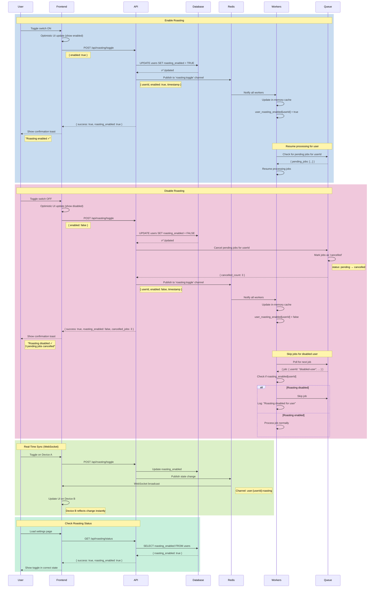

# Flow: Roasting Control (Enable/Disable)

**Created:** 2025-10-19
**Status:** Partially Implemented
**Related Nodes:** `roast`, `queue-system`, `multi-tenant`
**Implementation:** 60% Complete (Architecture exists, API endpoint missing)

---

## Overview

The Roasting Control flow allows users to enable or disable automatic roast generation with a simple toggle. When disabled, the system stops processing toxic comments for that user, preventing roast generation while preserving all configurations and preferences.

**Key Features:**

- **Real-time Toggle** - Instant enable/disable without page reload
- **Worker Synchronization** - Background workers notified of state change
- **Persistent State** - Setting saved to database
- **Queue Management** - Pending jobs cancelled when disabled
- **Graceful Degradation** - System continues for other users if one disables

---

## Flow Diagram



---

## API Endpoints

### POST `/api/roasting/toggle`

**Description:** Enable or disable roasting for authenticated user

**Authentication:** Required (JWT)

**Request:**

```json
{
  "enabled": true | false
}
```

**Response (200 OK - Enabled):**

```json
{
  "success": true,
  "data": {
    "roasting_enabled": true,
    "updated_at": "2025-10-19T12:00:00Z",
    "message": "Roasting enabled successfully"
  }
}
```

**Response (200 OK - Disabled):**

```json
{
  "success": true,
  "data": {
    "roasting_enabled": false,
    "updated_at": "2025-10-19T12:00:00Z",
    "cancelled_jobs": 3,
    "message": "Roasting disabled. 3 pending jobs cancelled."
  }
}
```

**Errors:**

- `400 Bad Request` - Missing or invalid `enabled` parameter
- `401 Unauthorized` - Not authenticated
- `500 Internal Server Error` - Database or Redis error

---

### GET `/api/roasting/status`

**Description:** Get current roasting status for authenticated user

**Authentication:** Required (JWT)

**Response (200 OK):**

```json
{
  "success": true,
  "data": {
    "roasting_enabled": true,
    "updated_at": "2025-10-19T12:00:00Z",
    "pending_jobs": 5,
    "total_roasts_generated": 142
  }
}
```

---

## Database Schema

### Users Table (Roasting Flag)

```sql
ALTER TABLE users ADD COLUMN roasting_enabled BOOLEAN DEFAULT TRUE;

-- Index for faster queries (filtered index)
CREATE INDEX idx_users_roasting_enabled
  ON users(id, roasting_enabled)
  WHERE roasting_enabled = TRUE;

-- Default value for existing users
UPDATE users SET roasting_enabled = TRUE WHERE roasting_enabled IS NULL;
```

---

## Worker Notification System

### Redis Pub/Sub

**Channel:** `roasting:toggle`

**Message Format:**

```json
{
  "userId": "user-uuid",
  "enabled": true | false,
  "timestamp": 1729347000000
}
```

### Worker Subscription

```javascript
// src/services/workerNotificationService.js
const redis = require('./redis');

class WorkerNotificationService {
  constructor() {
    this.subscriber = redis.duplicate();
    this.publisher = redis;
    this.userRoastingCache = new Map(); // In-memory cache
  }

  async subscribe() {
    await this.subscriber.subscribe('roasting:toggle');

    this.subscriber.on('message', (channel, message) => {
      if (channel === 'roasting:toggle') {
        this.handleRoastingToggle(JSON.parse(message));
      }
    });
  }

  handleRoastingToggle({ userId, enabled, timestamp }) {
    // Update in-memory cache
    this.userRoastingCache.set(userId, {
      enabled,
      updatedAt: new Date(timestamp)
    });

    logger.info('Roasting state updated', {
      userId,
      enabled,
      timestamp
    });
  }

  async notifyRoastingToggle(userId, enabled) {
    const message = JSON.stringify({
      userId,
      enabled,
      timestamp: Date.now()
    });

    await this.publisher.publish('roasting:toggle', message);
  }

  isRoastingEnabled(userId) {
    const cached = this.userRoastingCache.get(userId);
    return cached?.enabled ?? true; // Default to enabled
  }
}

module.exports = new WorkerNotificationService();
```

---

## Worker Processing Logic

### GenerateReplyWorker

```javascript
// src/workers/GenerateReplyWorker.js
const workerNotificationService = require('../services/workerNotificationService');

class GenerateReplyWorker extends BaseWorker {
  async processJob(job) {
    const { userId, commentId } = job.payload;

    // Check if roasting is enabled for user
    const isEnabled = workerNotificationService.isRoastingEnabled(userId);

    if (!isEnabled) {
      logger.info('Roasting disabled for user, skipping job', {
        userId,
        commentId,
        jobId: job.id
      });

      return {
        skipped: true,
        reason: 'roasting_disabled'
      };
    }

    // Fallback: Check database if not in cache
    const { data: user } = await supabase
      .from('users')
      .select('roasting_enabled')
      .eq('id', userId)
      .single();

    if (!user?.roasting_enabled) {
      logger.warn('Roasting disabled in DB but not in cache', {
        userId,
        commentId
      });

      // Update cache
      workerNotificationService.userRoastingCache.set(userId, {
        enabled: false,
        updatedAt: new Date()
      });

      return {
        skipped: true,
        reason: 'roasting_disabled'
      };
    }

    // Proceed with roast generation
    return await this.generateRoast(userId, commentId);
  }
}
```

---

## Queue Management

### Cancel Pending Jobs

When user disables roasting, cancel all pending jobs in queue:

```javascript
// src/services/queueService.js
async function cancelUserJobs(userId) {
  // Get all pending jobs for user
  const { data: pendingJobs } = await supabase
    .from('jobs')
    .select('id, job_type')
    .eq('user_id', userId)
    .eq('status', 'pending');

  if (pendingJobs.length === 0) {
    return { cancelled_count: 0 };
  }

  // Mark as cancelled
  const { error } = await supabase
    .from('jobs')
    .update({ status: 'cancelled', updated_at: new Date().toISOString() })
    .eq('user_id', userId)
    .eq('status', 'pending');

  if (error) {
    logger.error('Failed to cancel jobs', { userId, error });
    throw error;
  }

  logger.info('Cancelled pending jobs', {
    userId,
    count: pendingJobs.length
  });

  return { cancelled_count: pendingJobs.length };
}
```

---

## Frontend Implementation

### Toggle Switch Component

```jsx
// components/RoastingToggle.jsx
import { useState } from 'react';

function RoastingToggle({ initialState }) {
  const [enabled, setEnabled] = useState(initialState);
  const [loading, setLoading] = useState(false);

  const handleToggle = async () => {
    // Optimistic UI update
    const newState = !enabled;
    setEnabled(newState);
    setLoading(true);

    try {
      const response = await fetch('/api/roasting/toggle', {
        method: 'POST',
        headers: {
          'Content-Type': 'application/json',
          Authorization: `Bearer ${getToken()}`
        },
        body: JSON.stringify({ enabled: newState })
      });

      const data = await response.json();

      if (data.success) {
        // Show success toast
        showToast(
          newState
            ? 'Roasting enabled ✓'
            : `Roasting disabled ✓ ${data.data.cancelled_jobs || 0} jobs cancelled`
        );
      } else {
        // Revert optimistic update
        setEnabled(!newState);
        showToast('Error updating setting', 'error');
      }
    } catch (error) {
      // Revert optimistic update
      setEnabled(!newState);
      showToast('Network error', 'error');
    } finally {
      setLoading(false);
    }
  };

  return (
    <div className="roasting-toggle">
      <label>
        <span>Automatic Roasting</span>
        <input type="checkbox" checked={enabled} onChange={handleToggle} disabled={loading} />
        <span className="slider"></span>
      </label>

      <p className="help-text">
        {enabled
          ? 'Roastr will automatically respond to toxic comments'
          : 'Roast generation is paused for your account'}
      </p>
    </div>
  );
}
```

---

## Real-Time Synchronization (WebSocket)

### Server-Side WebSocket

```javascript
// src/services/websocketService.js
const WebSocket = require('ws');
const redis = require('./redis');

class WebSocketService {
  constructor(server) {
    this.wss = new WebSocket.Server({ server });
    this.userConnections = new Map(); // userId → Set of WebSocket connections

    this.setupRedisSubscription();
    this.setupWebSocketHandlers();
  }

  setupRedisSubscription() {
    const subscriber = redis.duplicate();
    subscriber.subscribe('roasting:toggle');

    subscriber.on('message', (channel, message) => {
      if (channel === 'roasting:toggle') {
        this.broadcastRoastingToggle(JSON.parse(message));
      }
    });
  }

  setupWebSocketHandlers() {
    this.wss.on('connection', (ws, req) => {
      const userId = this.getUserIdFromRequest(req);

      if (!userId) {
        ws.close(1008, 'Unauthorized');
        return;
      }

      // Add connection to user's set
      if (!this.userConnections.has(userId)) {
        this.userConnections.set(userId, new Set());
      }
      this.userConnections.get(userId).add(ws);

      ws.on('close', () => {
        // Remove connection from user's set
        const userWs = this.userConnections.get(userId);
        if (userWs) {
          userWs.delete(ws);
          if (userWs.size === 0) {
            this.userConnections.delete(userId);
          }
        }
      });
    });
  }

  broadcastRoastingToggle({ userId, enabled, timestamp }) {
    const userWs = this.userConnections.get(userId);

    if (!userWs || userWs.size === 0) {
      return; // No active connections for this user
    }

    const message = JSON.stringify({
      type: 'roasting_toggle',
      data: { enabled, timestamp }
    });

    userWs.forEach((ws) => {
      if (ws.readyState === WebSocket.OPEN) {
        ws.send(message);
      }
    });
  }

  getUserIdFromRequest(req) {
    // Extract user ID from JWT in query string or cookie
    const token = req.url.split('token=')[1] || req.headers.cookie?.match(/token=([^;]+)/)?.[1];
    if (!token) return null;

    try {
      const decoded = jwt.verify(token, process.env.JWT_SECRET);
      return decoded.sub;
    } catch (error) {
      return null;
    }
  }
}

module.exports = WebSocketService;
```

### Frontend WebSocket Client

```javascript
// public/js/websocket.js
class RoastingWebSocket {
  constructor() {
    this.ws = null;
    this.connect();
  }

  connect() {
    const token = localStorage.getItem('token');
    this.ws = new WebSocket(`wss://${window.location.host}?token=${token}`);

    this.ws.onmessage = (event) => {
      const message = JSON.parse(event.data);

      if (message.type === 'roasting_toggle') {
        this.handleRoastingToggle(message.data);
      }
    };

    this.ws.onclose = () => {
      // Reconnect after 5 seconds
      setTimeout(() => this.connect(), 5000);
    };
  }

  handleRoastingToggle({ enabled, timestamp }) {
    // Update UI on all devices
    const toggle = document.querySelector('.roasting-toggle input[type="checkbox"]');
    if (toggle) {
      toggle.checked = enabled;
    }

    // Show toast notification
    showToast(
      enabled ? 'Roasting enabled on another device' : 'Roasting disabled on another device',
      'info'
    );
  }
}

// Initialize on page load
document.addEventListener('DOMContentLoaded', () => {
  new RoastingWebSocket();
});
```

---

## Monitoring & Observability

### Metrics to Track

- **Toggle Rate:** Toggles per hour/day
- **Disabled Duration:** Average time roasting is disabled
- **Cancelled Jobs:** Jobs cancelled when disabling
- **Worker Cache Hit Rate:** % of checks using in-memory cache vs database

### Logging

```javascript
logger.info('Roasting toggled', {
  userId,
  enabled,
  timestamp,
  cancelled_jobs: cancelledCount,
  source: 'api' // or 'websocket', 'admin'
});

logger.warn('Worker cache miss', {
  userId,
  expected: cachedValue,
  actual: dbValue,
  action: 'cache_updated'
});
```

---

## Testing

### Unit Tests

```javascript
// tests/unit/services/workerNotificationService.test.js
describe('Worker Notification Service', () => {
  test('updates in-memory cache when roasting toggled', async () => {
    const userId = 'user-123';

    await workerNotificationService.notifyRoastingToggle(userId, false);

    const isEnabled = workerNotificationService.isRoastingEnabled(userId);
    expect(isEnabled).toBe(false);
  });

  test('publishes to Redis channel', async () => {
    const publishSpy = jest.spyOn(redis, 'publish');

    await workerNotificationService.notifyRoastingToggle('user-123', true);

    expect(publishSpy).toHaveBeenCalledWith(
      'roasting:toggle',
      expect.stringContaining('"userId":"user-123"')
    );
  });
});
```

---

### Integration Tests

```javascript
// tests/integration/roasting-control.test.js
describe('Roasting Control Integration', () => {
  test('disables roasting and cancels pending jobs', async () => {
    // Create pending jobs
    await createTestJob(testUser.id, 'comment-1');
    await createTestJob(testUser.id, 'comment-2');
    await createTestJob(testUser.id, 'comment-3');

    // Disable roasting
    const response = await request(app)
      .post('/api/roasting/toggle')
      .set('Authorization', `Bearer ${testUser.token}`)
      .send({ enabled: false });

    expect(response.status).toBe(200);
    expect(response.body.data.roasting_enabled).toBe(false);
    expect(response.body.data.cancelled_jobs).toBe(3);

    // Verify database updated
    const { data: user } = await supabase
      .from('users')
      .select('roasting_enabled')
      .eq('id', testUser.id)
      .single();

    expect(user.roasting_enabled).toBe(false);

    // Verify jobs cancelled
    const { data: jobs } = await supabase.from('jobs').select('status').eq('user_id', testUser.id);

    expect(jobs.every((job) => job.status === 'cancelled')).toBe(true);
  });

  test('worker skips jobs for disabled user', async () => {
    // Disable roasting
    await supabase.from('users').update({ roasting_enabled: false }).eq('id', testUser.id);

    // Create job
    const job = await createTestJob(testUser.id, 'comment-1');

    // Process job
    const worker = new GenerateReplyWorker();
    const result = await worker.processJob(job);

    expect(result.skipped).toBe(true);
    expect(result.reason).toBe('roasting_disabled');

    // Verify no roast generated
    const { data: roasts } = await supabase
      .from('responses')
      .select('*')
      .eq('user_id', testUser.id);

    expect(roasts).toHaveLength(0);
  });
});
```

---

### E2E Tests (Playwright)

```javascript
// tests/e2e/roasting-control.spec.js
test('toggle roasting on/off', async ({ page }) => {
  await page.goto('/settings');

  // Enable roasting
  await page.click('.roasting-toggle input[type="checkbox"]');
  await page.waitForSelector('text=Roasting enabled ✓');

  // Verify toggle state
  const toggleEnabled = await page.isChecked('.roasting-toggle input[type="checkbox"]');
  expect(toggleEnabled).toBe(true);

  // Disable roasting
  await page.click('.roasting-toggle input[type="checkbox"]');
  await page.waitForSelector('text=Roasting disabled ✓');

  // Verify toggle state
  const toggleDisabled = await page.isChecked('.roasting-toggle input[type="checkbox"]');
  expect(toggleDisabled).toBe(false);

  // Reload page and verify state persisted
  await page.reload();
  const toggleAfterReload = await page.isChecked('.roasting-toggle input[type="checkbox"]');
  expect(toggleAfterReload).toBe(false);
});

test('real-time sync across devices', async ({ page, context }) => {
  await page.goto('/settings');

  // Open second tab (simulating another device)
  const page2 = await context.newPage();
  await page2.goto('/settings');

  // Toggle on first device
  await page.click('.roasting-toggle input[type="checkbox"]');

  // Verify second device updates in real-time
  await page2.waitForSelector('text=Roasting enabled on another device');
  const toggle2 = await page2.isChecked('.roasting-toggle input[type="checkbox"]');
  expect(toggle2).toBe(true);
});
```

---

## Current Gaps

### Not Implemented

1. **API Endpoint** (`POST /api/roasting/toggle`) - Missing
2. **Worker Notification Service Enhancement** - Partial implementation
3. **Queue Job Cancellation** - Missing integration
4. **WebSocket Real-Time Sync** - Missing
5. **Frontend Toggle Component** - Missing

### Needs Enhancement

1. **Cache Warming** - Pre-load user roasting states on worker startup
2. **Graceful Shutdown** - Cancel in-progress jobs when disabling
3. **Audit Trail** - Log all toggle events for compliance
4. **Admin Override** - Allow admins to disable roasting for specific users

---

## Next Steps

1. **Implement API Endpoint** (Priority: P1)
   - Create `POST /api/roasting/toggle`
   - Add database update
   - Integrate with queue cancellation

2. **Enhance Worker Notification** (Priority: P1)
   - Complete `workerNotificationService.js`
   - Add Redis pub/sub
   - Implement in-memory cache

3. **Queue Integration** (Priority: P1)
   - Implement `cancelUserJobs(userId)`
   - Add job status updates
   - Test cancellation logic

4. **Frontend Toggle UI** (Priority: P2)
   - Build toggle component
   - Add optimistic UI updates
   - Implement toast notifications

5. **WebSocket Sync** (Priority: P2)
   - Implement WebSocket server
   - Build WebSocket client
   - Test real-time sync

---

**Last Updated:** 2025-10-19
**Maintained By:** Backend Developer, Front-end Dev, Documentation Agent
**Related Issues:** Roasting control API (to be created)
**Related PRs:** None yet
