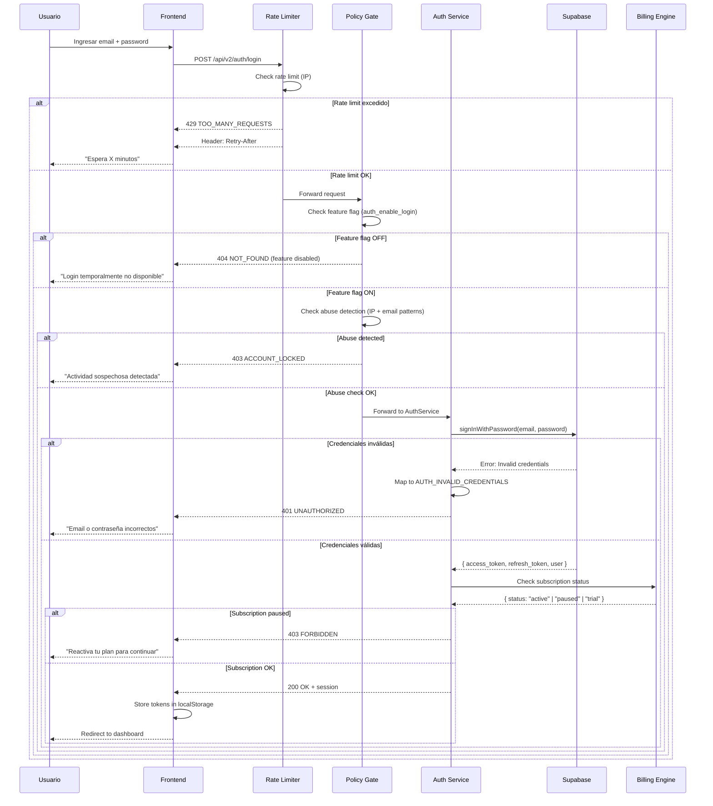
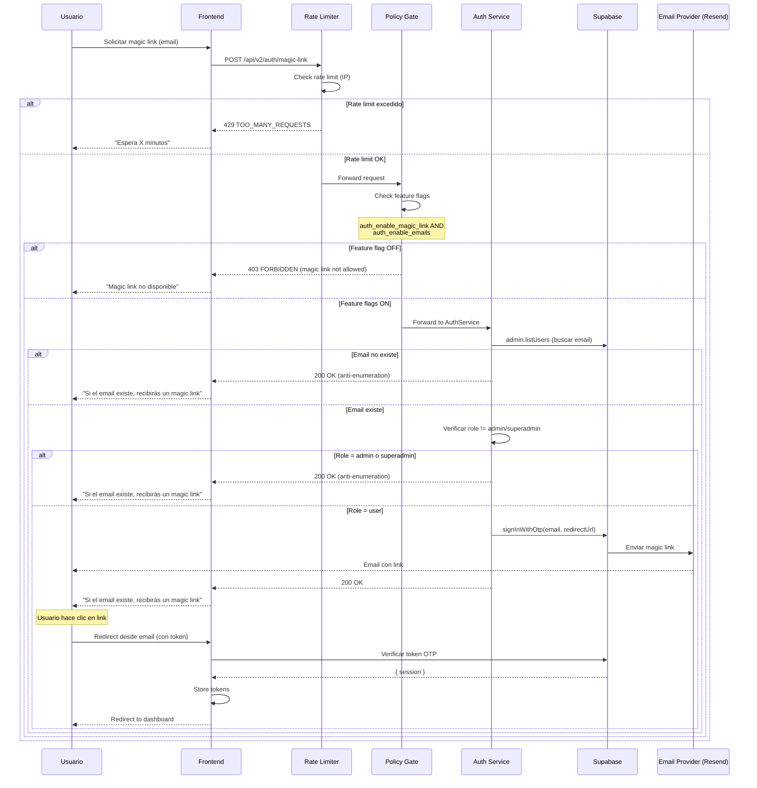
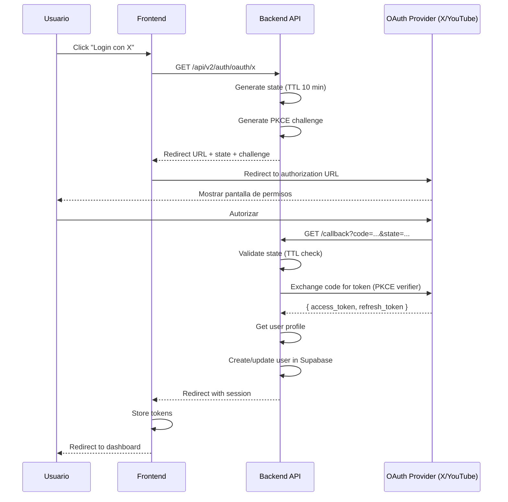

# Auth - Login Flows

**Subnodo de:** `auth`  
**Última actualización:** 2026-01-01  
**Owner:** ROA-403

---

## 📋 Propósito

Define los flujos completos de autenticación disponibles en Roastr v2:
- Password Login (email + password)
- Magic Link (passwordless)
- OAuth (preparado para X/Twitter y YouTube)

---

## 🔐 Password Login

### Endpoint

```
POST /api/v2/auth/login
```

### Request

```typescript
{
  email: string;      // Normalizado a lowercase
  password: string;   // Mínimo 8 caracteres
}
```

### Response (Success)

```typescript
{
  session: {
    access_token: string;      // JWT, válido 1h
    refresh_token: string;     // Válido 7 días
    expires_in: number;        // Segundos hasta expiración
    expires_at: number;        // Unix timestamp
    token_type: "bearer";
    user: {
      id: string;
      email: string;
      role: "user" | "admin" | "superadmin";
      email_verified: boolean;
      created_at: string;
      metadata: Record<string, any>;
    }
  },
  message: "Login successful"
}
```

### Response (Error)

```typescript
{
  success: false,
  error: {
    slug: AuthErrorSlug;     // Ej: "AUTH_INVALID_CREDENTIALS"
    retryable: boolean;
  },
  request_id: string;
}
```

### Flujo Completo



### Rate Limiting

**Configuración (SSOT v2, sección 12.4):**
- **Max attempts:** 5 intentos / 15 minutos
- **Bloqueo inicial:** 15 minutos
- **Bloqueo progresivo:**
  - 1ra infracción: 15 min
  - 2da infracción: 1 hora
  - 3ra infracción: 24 horas
  - 4ta+ infracción: Permanente (requiere intervención manual)

### Feature Flags

**Flag requerido:** `auth_enable_login` (desde `admin_settings.feature_flags`)

**Comportamiento si OFF:**
- Endpoint retorna `404 NOT_FOUND` (feature disabled)
- Log: `auth_flow_blocked` con reason `feature_disabled`
- Métricas: `auth_blocks_total{reason="feature_disabled"}`

### Observability

**Eventos logged:**
- `auth_flow_started` (contador: `auth_requests_total`)
- `auth_login_attempt` (success/failure)
- `auth_duration_seconds` (histogram)
- `auth_flow_blocked` (si rate limit o feature flag)
- `auth_blocks_total` (contador con labels: reason, policy)

**Amplitude events:**
- `auth_login_success`
- `auth_login_failed` (con `error_slug`)
- `auth_endpoint_login_success`
- `auth_endpoint_login_failed`

---

## ✉️ Magic Link (Passwordless)

### Endpoint

```
POST /api/v2/auth/magic-link
```

### Request

```typescript
{
  email: string;  // Normalizado a lowercase
}
```

### Response (Success - Anti-Enumeration)

```typescript
{
  success: true,
  message: "If this email exists, a magic link has been sent"
}
```

**⚠️ Nota:** Respuesta homogénea independientemente de si el email existe o no (prevenir user enumeration).

### Flujo Completo



### Rate Limiting

**Configuración (SSOT v2, sección 12.4):**
- **Max attempts:** 3 intentos / 1 hora
- **Bloqueo inicial:** 1 hora
- **Bloqueo progresivo:** Mismo esquema que login

### Feature Flags

**Flags requeridos:**
- `auth_enable_magic_link` (endpoint gate)
- `auth_enable_emails` (infra de emails)

**Comportamiento si OFF:**
- `auth_enable_magic_link` OFF → `403 FORBIDDEN` (AUTHZ_MAGIC_LINK_NOT_ALLOWED)
- `auth_enable_emails` OFF → Fail-closed (AUTH_EMAIL_SEND_FAILED)

### Restricciones

**❌ Magic Link NO permitido para:**
- `role=admin`
- `role=superadmin`

**Razón:** Admins deben usar password login (mayor seguridad).

**Comportamiento:** Si el email es admin, respuesta sigue siendo homogénea (anti-enumeration).

### Redirect URL

**Environment variable:** `SUPABASE_REDIRECT_URL`

**Validación:**
- **Requerida:** Variable DEBE estar configurada (no fallback)
- **Producción:** DEBE ser HTTPS (si `NODE_ENV=production`)

**Ejemplo:**
```bash
SUPABASE_REDIRECT_URL=https://app.roastr.ai/auth/callback
```

### Observability

**Eventos logged:**
- `auth_magic_link_request` (success/failure)
- `auth_email_requested` (antes de enviar)
- `auth_email_sent` (después de enviar)
- `auth_duration_seconds`

**Amplitude events:**
- `auth_email_requested` (flow: magic_link)
- `auth_email_sent` (flow: magic_link)

---

## 🔗 OAuth (X/Twitter, YouTube)

**Status:** ✅ **INFRA IMPLEMENTADA** (Providers post-MVP)

### Endpoints (Implementados - Infra Only)

```
POST /api/v2/auth/oauth/:provider
GET /api/v2/auth/oauth/:provider/callback
```

**Plataformas soportadas (enum contractual):**
- `x` (X/Twitter) - ✅ Wiring completo
- `youtube` (YouTube via Google OAuth) - ✅ Wiring completo

**Implementado:**
- ✅ Feature flag validation (`auth_enable_oauth`)
- ✅ Provider enum validation
- ✅ Error contracts (AUTH_DISABLED, OAUTH_PROVIDER_NOT_SUPPORTED)
- ✅ Tests de infraestructura

**NO implementado (post-MVP):**
- ❌ SDKs OAuth (X, Google)
- ❌ Token exchange real
- ❌ State parameter con Redis
- ❌ PKCE flow completo

**Response actual (501 Not Implemented):**
```json
{
  "success": false,
  "error": {
    "slug": "NOT_IMPLEMENTED",
    "message": "OAuth provider 'x' is supported but not implemented yet (post-MVP).",
    "provider": "x",
    "supported_providers": ["x", "youtube"]
  }
}
```

### Flujo PKCE (SSOT v2, sección 8.1)



### Configuración OAuth

**Environment variables (SSOT v2, sección 11.2):**

```bash
# X (Twitter)
X_CLIENT_ID=your-x-client-id
X_CLIENT_SECRET=your-x-client-secret

# YouTube (Google OAuth)
GOOGLE_CLIENT_ID=your-google-client-id
GOOGLE_CLIENT_SECRET=your-google-client-secret

# Redirect URL
SUPABASE_REDIRECT_URL=https://app.roastr.ai/auth/callback
```

### Scopes Requeridos

**X (Twitter) - SSOT v2, sección 8.1.2:**
- `tweet.read`
- `users.read`
- `offline.access` (para refresh token)

**YouTube (Google) - SSOT v2, sección 8.1.3:**
- `https://www.googleapis.com/auth/youtube.readonly`
- `https://www.googleapis.com/auth/userinfo.profile`
- `https://www.googleapis.com/auth/userinfo.email`

### Security

**State Parameter:**
- **TTL:** 10 minutos (prevenir replay attacks)
- **Storage:** Redis con expiración automática
- **Validación:** DEBE coincidir en callback

**PKCE:**
- **Code verifier:** Random string 43-128 caracteres
- **Code challenge:** SHA256(code_verifier), base64url encoded
- **Challenge method:** S256

### Rate Limiting

**Configuración (SSOT v2, sección 12.4):**
- **Max attempts:** 10 intentos / 15 minutos
- **Bloqueo inicial:** 15 minutos

### Implementación Pendiente

**Archivos a crear:**
1. `apps/backend-v2/src/services/oauthService.ts` - Wrapper OAuth logic
2. `apps/backend-v2/src/middleware/oauthState.ts` - State validation
3. `apps/backend-v2/src/routes/oauth.ts` - Endpoints OAuth

**Tests a crear:**
1. `apps/backend-v2/tests/unit/services/oauthService.test.ts`
2. `apps/backend-v2/tests/flow/auth-oauth.flow.test.ts`

**Prioridad:** 🟢 P2 (Post-MVP)

---

## 🔄 Common Patterns

### Anti-Enumeration

**Regla:** NUNCA revelar si un email existe o no.

**Implementación:**
- Magic link: Respuesta homogénea "If this email exists..."
- Password recovery: Respuesta homogénea "If this email exists..."
- Register: Respuesta homogénea incluso si email ya existe

**Ejemplo (authService.ts líneas 149-152):**
```typescript
if (this.isEmailAlreadyRegisteredError(error)) {
  return; // Success silencioso, no throw
}
```

### Role Validation

**Regla:** Ciertos métodos solo para `role=user`.

**Restricciones:**
- Magic link: ❌ admin, ❌ superadmin
- Password recovery: ❌ admin, ❌ superadmin
- OAuth: ✅ todos (cuando se implemente)

**Implementación (authService.ts líneas 608-615):**
```typescript
const role = user.user_metadata.role || 'user';
if (role === 'admin' || role === 'superadmin') {
  // Return same message as non-existent user (anti-enumeration)
  return {
    success: true,
    message: 'If this email exists, a magic link has been sent'
  };
}
```

### Fail-Closed

**Regla:** Si feature flag está OFF, endpoint DEBE fallar (no simular éxito).

**Implementación:**
- Login: `auth_enable_login` OFF → `404 NOT_FOUND`
- Register: `auth_enable_register` OFF → `404 NOT_FOUND`
- Magic link: `auth_enable_magic_link` OFF → `403 FORBIDDEN`
- Password recovery: `auth_enable_password_recovery` OFF → Fail-closed

**Observability:** Log `auth_flow_blocked` con reason.

---

## 📚 Referencias

- **SSOT v2 (Auth):** Sección 12.4 (Rate Limiting), 12.5 (Abuse Detection)
- **SSOT v2 (OAuth):** Sección 8.1 (Scopes, PKCE)
- **SSOT v2 (Environment):** Sección 11.2
- **Implementación:** `apps/backend-v2/src/services/authService.ts`
- **Routes:** `apps/backend-v2/src/routes/auth.ts`
- **Tests:** `apps/backend-v2/tests/flow/auth-login.flow.test.ts`

---

**Última actualización:** 2026-01-01  
**Owner:** ROA-403  
**Status:** ✅ Active (OAuth pending implementation)
