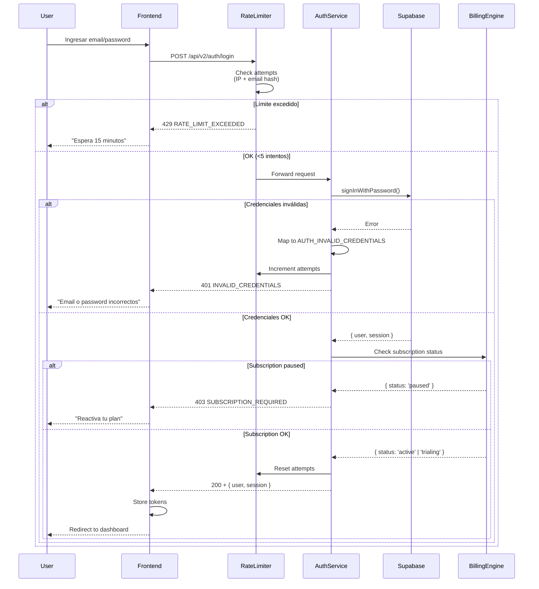
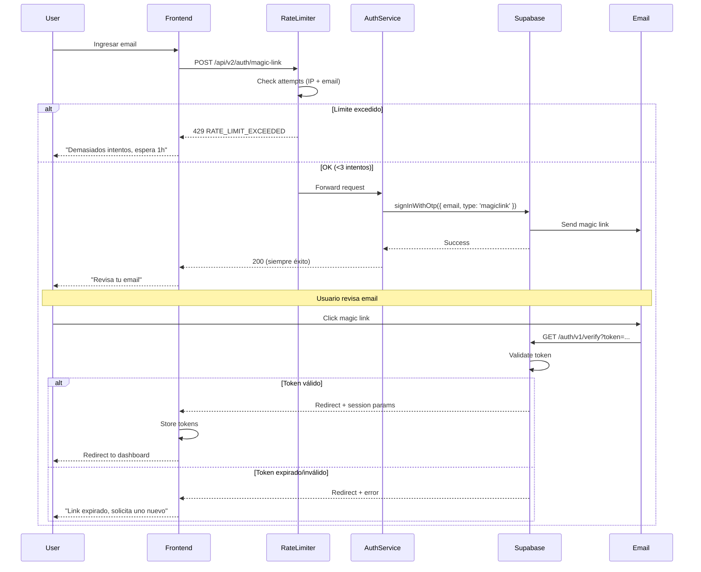
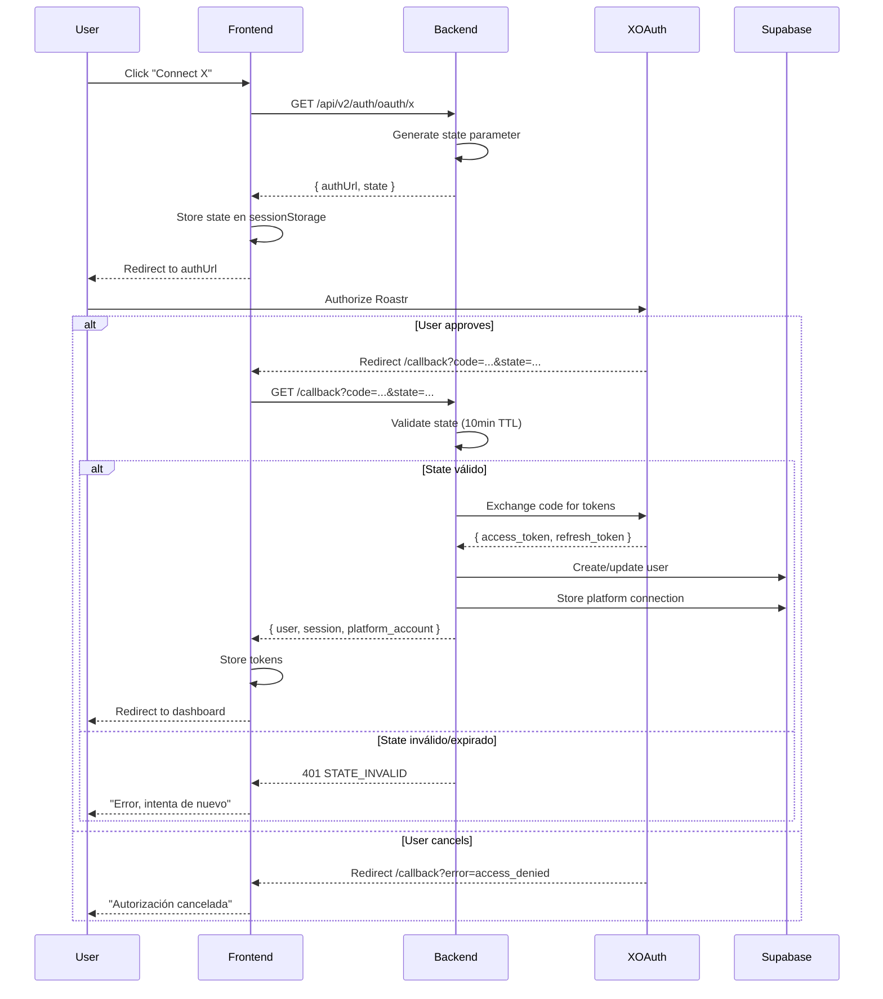

# Auth - Login Flows

**Subnodo:** `auth/login-flows`  
**Última actualización:** 2025-12-26  
**Owner:** ROA-364

---

## 📋 Propósito

Este subnodo documenta los flujos completos de autenticación soportados en Roastr v2:

1. **Password Login:** Email + password tradicional
2. **Magic Link:** Passwordless login vía email
3. **OAuth:** Autenticación con X (Twitter) y YouTube

Todos los flujos están protegidos por **rate limiting v2** (ROA-359) para prevenir brute force attacks.

---

## 🔑 1. Password Login

### Endpoint

```http
POST /api/v2/auth/login
Content-Type: application/json

{
  "email": "user@example.com",
  "password": "securePassword123"
}
```

### Request Schema

```typescript
interface PasswordLoginRequest {
  email: string;      // Valid email format
  password: string;   // Min 8 chars (enforced by Supabase)
}
```

### Response (Success)

```json
{
  "success": true,
  "data": {
    "user": {
      "id": "uuid-v4",
      "email": "user@example.com",
      "name": "John Doe",
      "plan": "starter",
      "is_admin": false
    },
    "session": {
      "access_token": "jwt-token-here",
      "refresh_token": "refresh-token-here",
      "expires_at": 1703000000,
      "expires_in": 3600
    }
  }
}
```

### Response (Error)

```json
{
  "success": false,
  "error": {
    "code": "AUTH_INVALID_CREDENTIALS",
    "message": "Invalid email or password",
    "statusCode": 401
  }
}
```

**⚠️ User Enumeration Prevention:**
- Mismo mensaje para "email no existe" y "password incorrecta"
- Timing attacks mitigados con delay constante

### Rate Limiting

**Configuración oficial** (SSOT v2, sección 12.4):

```typescript
{
  windowMs: 900000,       // 15 minutos
  maxAttempts: 5,
  blockDurationMs: 900000 // 15 minutos
}
```

**Bloqueo progresivo:**
- 1ra infracción: 15 min
- 2da infracción: 1 h
- 3ra infracción: 24 h
- 4ta+ infracción: Permanente (requiere admin)

**Response cuando bloqueado (429):**

```json
{
  "success": false,
  "error": {
    "code": "AUTH_RATE_LIMIT_EXCEEDED",
    "message": "Too many login attempts. Please try again later.",
    "statusCode": 429,
    "retryAfter": 12
  }
}
```

### Flujo Completo



### Error Codes

| Code                        | HTTP | Descripción                       |
| --------------------------- | ---- | --------------------------------- |
| `AUTH_INVALID_CREDENTIALS`  | 401  | Email o password incorrectos      |
| `AUTH_RATE_LIMIT_EXCEEDED`  | 429  | Demasiados intentos               |
| `AUTH_EMAIL_NOT_VERIFIED`   | 401  | Email no verificado (si aplica)   |
| `AUTH_ACCOUNT_LOCKED`       | 401  | Cuenta bloqueada por admin        |
| `SUBSCRIPTION_REQUIRED`     | 403  | Plan pausado, requiere reactivar  |

Ver taxonomía completa en [error-taxonomy.md](./error-taxonomy.md).

---

## ✉️ 2. Magic Link

### Endpoint (Enviar Magic Link)

```http
POST /api/v2/auth/magic-link
Content-Type: application/json

{
  "email": "user@example.com"
}
```

### Request Schema

```typescript
interface MagicLinkRequest {
  email: string;  // Valid email format
}
```

### Response (Success)

```json
{
  "success": true,
  "message": "If an account exists, we sent a magic link to your email."
}
```

**⚠️ User Enumeration Prevention:**
- Siempre responde con éxito, incluso si email no existe
- No revela si el email está registrado

### Rate Limiting

**Configuración oficial** (SSOT v2, sección 12.4):

```typescript
{
  windowMs: 3600000,      // 1 hora
  maxAttempts: 3,
  blockDurationMs: 3600000 // 1 hora
}
```

**Más restrictivo que password login:**
- Máx. 3 intentos/hora (vs 5/15min de password)
- Previene spam de emails

### Flujo Completo



### Magic Link Lifecycle

| Estado         | TTL           | Descripción                              |
| -------------- | ------------- | ---------------------------------------- |
| Generado       | -             | Token único generado por Supabase        |
| Enviado        | -             | Email despachado                         |
| Válido         | 1 hora        | Usuario puede hacer click                |
| Consumido      | -             | Token usado, no se puede reusar          |
| Expirado       | > 1 hora      | Ya no válido, solicitar nuevo            |

### Error Codes

| Code                       | HTTP | Descripción                       |
| -------------------------- | ---- | --------------------------------- |
| `AUTH_RATE_LIMIT_EXCEEDED` | 429  | Demasiados intentos (3/hora)      |
| `TOKEN_EXPIRED`            | 401  | Magic link expirado (>1h)         |
| `TOKEN_INVALID`            | 401  | Token malformado o ya usado       |

---

## 🔗 3. OAuth (X y YouTube)

### Providers Soportados

**v2 MVP** (SSOT v2, sección 8.1):

```typescript
type SupportedPlatform = 'x' | 'youtube';
```

- **X (Twitter):** Via Twitter OAuth 2.0
- **YouTube:** Via Google OAuth 2.0

### Endpoints

#### Iniciar OAuth Flow

```http
GET /api/v2/auth/oauth/:platform?redirect_uri={uri}
```

**Parámetros:**
- `platform`: `x` | `youtube`
- `redirect_uri` (opcional): URL de retorno después de auth

**Response:**
```json
{
  "success": true,
  "data": {
    "authUrl": "https://platform.com/oauth/authorize?...",
    "state": "base64url-encoded-state"
  }
}
```

#### OAuth Callback

```http
GET /api/v2/auth/oauth/:platform/callback?code={code}&state={state}
```

**Parámetros:**
- `code`: Authorization code del provider
- `state`: State parameter para validación

**Response (Success):**
```json
{
  "success": true,
  "data": {
    "user": { ...},
    "session": {
      "access_token": "...",
      "refresh_token": "..."
    },
    "platform_account": {
      "platform": "x",
      "platform_user_id": "123456",
      "username": "@username"
    }
  }
}
```

### State Parameter Security

**Generación:**

```typescript
function generateState(userId: string, platform: string): string {
  const timestamp = Date.now().toString();
  const random = crypto.randomBytes(16).toString('hex');
  const payload = `${userId}:${platform}:${timestamp}:${random}`;
  return Buffer.from(payload).toString('base64url');
}
```

**Validación:**

```typescript
function parseState(state: string): StatePayload {
  const payload = Buffer.from(state, 'base64url').toString();
  const [userId, platform, timestamp, random] = payload.split(':');
  
  const age = Date.now() - parseInt(timestamp);
  const maxAge = 10 * 60 * 1000; // 10 minutos
  
  if (age > maxAge) {
    throw new AuthError('STATE_EXPIRED', 'State parameter expired');
  }
  
  return { userId, platform, timestamp: parseInt(timestamp) };
}
```

**TTL:** 10 minutos (previene ataques de replay)

### Rate Limiting

**Configuración oficial** (SSOT v2, sección 12.4):

```typescript
{
  windowMs: 900000,       // 15 minutos
  maxAttempts: 10,
  blockDurationMs: 900000 // 15 minutos
}
```

**Más permisivo que password/magic link:**
- OAuth failures a menudo son errores UX (cancelar flow)
- 10 intentos/15min previene abuse pero permite errores legítimos

### Flujo Completo (X Example)



### Error Codes

| Code                       | HTTP | Descripción                                |
| -------------------------- | ---- | ------------------------------------------ |
| `AUTH_RATE_LIMIT_EXCEEDED` | 429  | Demasiados intentos OAuth (10/15min)       |
| `STATE_INVALID`            | 401  | State parameter inválido o malformado      |
| `STATE_EXPIRED`            | 401  | State parameter expirado (>10min)          |
| `OAUTH_CANCELLED`          | 400  | Usuario canceló autorización               |
| `OAUTH_PROVIDER_ERROR`     | 502  | Error del provider externo (X, Google)     |

### Platform-Specific Config

#### X (Twitter)

```bash
# Environment Variables (SSOT v2, sección 11.2)
X_CLIENT_ID=your-x-client-id
X_CLIENT_SECRET=your-x-client-secret
X_CALLBACK_URL=https://roastr.ai/api/v2/auth/oauth/x/callback
```

**Scopes requeridos:**
- `tweet.read` - Leer tweets y comentarios
- `tweet.write` - Publicar roasts
- `users.read` - Info de usuario

#### YouTube

```bash
# Environment Variables (SSOT v2, sección 11.2)
GOOGLE_CLIENT_ID=your-google-client-id
GOOGLE_CLIENT_SECRET=your-google-client-secret
GOOGLE_CALLBACK_URL=https://roastr.ai/api/v2/auth/oauth/youtube/callback
```

**Scopes requeridos:**
- `https://www.googleapis.com/auth/youtube.readonly` - Leer comentarios
- `https://www.googleapis.com/auth/youtube.force-ssl` - Responder comentarios

---

## 🔄 Comparación de Métodos

| Método      | Rate Limit      | TTL Token     | Use Case Principal                   |
| ----------- | --------------- | ------------- | ------------------------------------ |
| **Password**| 5 / 15min       | N/A           | Login frecuente, usuarios regulares  |
| **Magic Link** | 3 / 1h       | 1 hora        | Login ocasional, más seguro          |
| **OAuth**   | 10 / 15min      | 10min (state) | Conectar cuentas de redes sociales   |

### Recomendaciones

- **Password:** Default para usuarios frecuentes
- **Magic Link:** Recomendado para usuarios que priorizan seguridad
- **OAuth:** Solo para conectar cuentas de plataformas (no reemplaza login principal)

---

## 🛠️ Implementación

### Backend Services

```typescript
// apps/backend-v2/src/services/authService.ts
class AuthService {
  async loginWithPassword(email: string, password: string): Promise<Session>
  async sendMagicLink(email: string): Promise<void>
  async initiateOAuth(platform: 'x' | 'youtube'): Promise<OAuthUrl>
  async handleOAuthCallback(platform: string, code: string, state: string): Promise<Session>
}
```

### Middleware Stack

```typescript
// Order matters!
app.use(sessionRefreshMiddleware);     // Check token expiry
app.use(rateLimiterMiddleware);        // Enforce rate limits
app.use(authRouter);                   // Auth endpoints
```

---

## 📚 Referencias

### SSOT v2

- **Sección 8.1:** Integraciones (X, YouTube providers)
- **Sección 11.2:** Environment Variables (OAuth credentials)
- **Sección 12.4:** Rate Limiting Configuration ⭐
- **Sección 12.5:** Abuse Detection Thresholds

### Related Subnodos

- [session-management.md](./session-management.md) - Gestión de tokens JWT
- [rate-limiting.md](./rate-limiting.md) - Detalle de rate limiting v2
- [error-taxonomy.md](./error-taxonomy.md) - Códigos de error completos
- [security.md](./security.md) - Prevención de user enumeration, state validation

### Implementación

- **authErrorTaxonomy.ts:** `apps/backend-v2/src/utils/authErrorTaxonomy.ts`
- **Rate Limiter:** `apps/backend-v2/src/middleware/rateLimiter.ts` (TBD)
- **OAuth Service:** `apps/backend-v2/src/services/oauthService.ts` (TBD)

---

**Última actualización:** 2025-12-26  
**Owner:** ROA-364  
**Status:** ✅ Active

