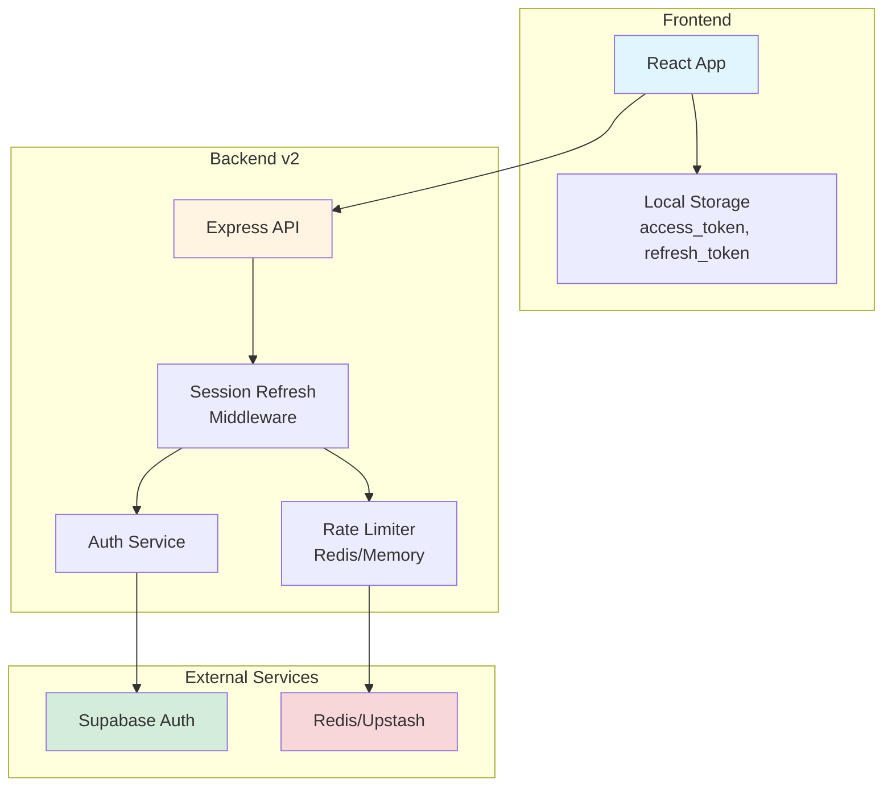
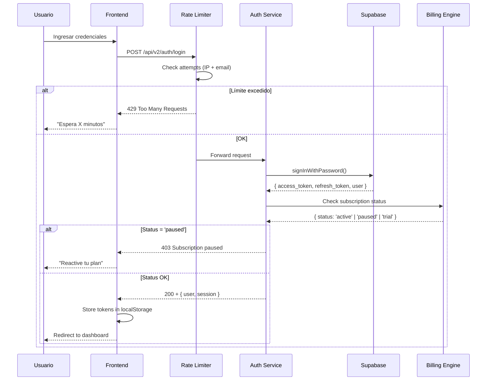

# Auth - Overview

**Nodo:** `auth`  
**Tipo:** Strong Concept (authErrorTaxonomy, rateLimitConfig)  
**Última actualización:** 2025-12-30  
**Owner:** ROA-364

---

## 📋 Propósito

El nodo `auth` define el sistema de autenticación multi-método de Roastr v2, basado en **Supabase Auth** con capas adicionales de seguridad, rate limiting y gestión de sesiones.

**Responsabilidades principales:**

1. **Autenticación multi-método:** Password, Magic Link, OAuth (X, YouTube)
2. **Gestión de sesiones:** JWT-based con refresh automático y sliding expiration
3. **Rate limiting v2:** Protección contra brute force y abuse patterns (ROA-359)
4. **Taxonomía de errores:** Sistema estructurado de códigos de error (ROA-372)
5. **Multi-tenancy:** Row Level Security (RLS) para aislamiento completo de datos

---

## 🏗️ Arquitectura



### Componentes Clave

#### 1. Frontend (React)

- **Responsabilidad:** Gestión de tokens en cliente, detección de expiración, UI de login
- **Storage:** localStorage para access_token y refresh_token
- **Refresh automático:** Escucha headers `X-New-Access-Token` en respuestas API

#### 2. Backend v2 (Express)

**Session Refresh Middleware:**
- Detecta tokens próximos a expirar (< 5 min)
- Renueva automáticamente con `refresh_token`
- Retorna nuevos tokens vía headers personalizados

**Rate Limiter:**
- Tracking de intentos por IP + email hash
- Bloqueo progresivo (15min → 1h → 24h → permanente)
- Storage: Redis (producción) / Memory (dev)

**Auth Service:**
- Wrapper sobre Supabase Auth
- Mapeo de errores a AuthError taxonomy
- Validación de estado de plan (integración con billing-engine)

#### 3. Supabase Auth

- Motor de autenticación principal
- Gestión de usuarios y sesiones
- Emisión de JWT tokens
- Row Level Security (RLS) enforcement

#### 4. Redis/Upstash

- Storage de rate limiting data
- TTL automático para limpieza
- Fallback a memoria si no disponible

---

## 🔗 Dependencias

### Depends On (Nodos que este nodo necesita)

```yaml
depends_on:
  - billing-engine  # Para verificar estado de suscripción (activo, trial, paused)
  - workers         # AccountDeletion worker (GDPR - 90 días retention)
```

**billing-engine:**
- Valida que el usuario tiene suscripción activa/trial
- Determina qué features están disponibles según plan
- Bloquea acceso si estado = `paused`

**workers:**
- `AccountDeletion` worker: Procesa eliminación GDPR-compliant
- Retención máxima: 90 días (ver SSOT v2, sección 10.1)
- Queue asíncrona para no bloquear UI

### Required By (Nodos que dependen de este nodo)

```yaml
required_by:
  - admin-dashboard    # Protege rutas admin con JWT validation
  - frontend-dashboard # Gestión de sesión usuario
  - roasting-engine    # Necesita userId para multi-tenancy
  - shield-engine      # Necesita userId para multi-tenancy
```

**Todos los servicios backend v2** que manejan datos de usuario requieren:
- `userId` del JWT token
- Validación de sesión activa
- Enforcement de RLS policies

---

## 📦 Subnodos

### [login-flows.md](./login-flows.md)

Flujos completos de autenticación:

- **Password Login:** Email + password con rate limiting
- **Magic Link:** Passwordless login vía email
- **OAuth:** X (Twitter) y YouTube

**Endpoints principales:**
- `POST /api/v2/auth/login`
- `POST /api/v2/auth/magic-link`
- `POST /api/v2/auth/register` (flags: `auth_enable_register` + `auth_enable_emails`)
- `POST /api/v2/auth/password-recovery` (flags: `auth_enable_password_recovery` + `auth_enable_emails`)
- `GET /api/v2/auth/oauth/:platform`
- `GET /api/v2/auth/oauth/:platform/callback`

### [session-management.md](./session-management.md)

Gestión de sesiones JWT:

- **Tokens:** access_token (1h) + refresh_token (7d)
- **Automatic refresh:** Middleware transparente
- **Sliding expiration:** Usuarios activos mantienen sesión
- **Revocation:** Logout y limpieza de tokens

### [rate-limiting.md](./rate-limiting.md)

Protección contra brute force (ROA-359):

- **Configuración oficial:** Desde SSOT v2 (sección 12.4)
- **Bloqueo progresivo:** 15min → 1h → 24h → permanente
- **Abuse detection:** multi-ip, multi-email, burst, slow attack
- **Feature flags:** `ENABLE_AUTH_RATE_LIMIT_V2`, `ENABLE_RATE_LIMIT`

### [error-taxonomy.md](./error-taxonomy.md)

Sistema estructurado de errores (ROA-372):

- **Categorías:** AUTH_*, AUTHZ_*, SESSION_*, TOKEN_*, ACCOUNT_*
- **Mapeo Supabase:** Conversión automática a AuthError
- **HTTP codes:** 401, 403, 404, 409 según categoría
- **User-facing messages:** Sin user enumeration

### [security.md](./security.md)

Características de seguridad:

- **JWT validation:** En todos los endpoints protegidos
- **State parameter:** OAuth con validación temporal (10 min TTL)
- **Request sanitization:** Prevención de injection
- **Error messages:** Genéricos para prevenir enumeration
- **RLS enforcement:** Database-level access control

---

## 🔐 Strong Concepts (Dueño Único)

Este nodo es el **dueño único** de los siguientes Strong Concepts:

### 1. authErrorTaxonomy

**Definición:** Sistema de códigos de error estructurados para autenticación.

**Implementación:** `apps/backend-v2/src/utils/authErrorTaxonomy.ts`

**Reglas:**
- ❌ Ningún otro nodo puede definir códigos de error de autenticación
- ✅ Otros nodos pueden **referenciar** y **usar** AuthError
- ✅ Frontend debe consumir códigos para mostrar mensajes apropiados

**Categorías principales:**
```typescript
AUTH_*       // 401 - Errores de autenticación
AUTHZ_*      // 403 - Errores de autorización
SESSION_*    // 401 - Errores de sesión
TOKEN_*      // 401 - Errores de tokens
ACCOUNT_*    // 404/409 - Errores de cuenta
```

### 2. rateLimitConfig

**Definición:** Configuración oficial de rate limiting para endpoints de autenticación.

**Fuente de verdad:** SSOT v2, sección 12.4

**Valores oficiales:**
```typescript
password:        5 attempts / 15min, block 15min
magic_link:      3 attempts / 1h,    block 1h
oauth:           10 attempts / 15min, block 15min
password_reset:  3 attempts / 1h,    block 1h
```

**Bloqueo progresivo:**
```typescript
1ra infracción: 15min
2da infracción: 1h
3ra infracción: 24h
4ta+ infracción: Permanente (requiere intervención manual)
```

**Reglas:**
- ❌ Ningún otro nodo puede definir rate limits de autenticación
- ✅ Otros nodos pueden **referenciar** estos valores
- ⚠️ Cambios solo mediante actualización de SSOT v2

---

## 🌐 Soft Concepts (Compartidos)

### session-management

**Compartido con:** frontend-dashboard, admin-dashboard

- Frontend gestiona tokens en localStorage
- Backend valida y renueva tokens
- Ambos implementan logout coordinado

### jwt-validation

**Usado por:** Todos los servicios backend v2

- Middleware compartido: `authenticateToken`
- Extracción de userId del token
- Enforcement de RLS en queries

---

## 🔄 Flujo de Autenticación (High-Level)



---

## 📊 Métricas y Observabilidad

### Logs Mínimos (Por Evento de Auth)

```typescript
{
  timestamp: ISO8601,
  event: 'login' | 'logout' | 'refresh' | 'rate_limit_block',
  userId?: string,
  ip: string,
  method: 'password' | 'magic_link' | 'oauth',
  platform?: 'x' | 'youtube',
  success: boolean,
  error_code?: AuthErrorCode,
  rate_limit_triggered: boolean,
  attempt_count: number
}
```

**⚠️ Datos sensibles NO se loguean:**
- Passwords
- Tokens completos (solo últimos 4 caracteres)
- Emails completos (solo truncado: `foo***@`)

### Health Checks

```bash
# Verificar estado de autenticación
GET /api/v2/auth/health

# Response esperado:
{
  "status": "healthy",
  "supabase": "connected",
  "redis": "connected",
  "rate_limiter": "enabled",
  "timestamp": "2025-12-26T10:30:00Z"
}
```

---

## 🛠️ Configuración

### Environment Variables

**Requeridas:**

```bash
# Supabase (SSOT v2, sección 11.2)
SUPABASE_URL=https://your-project.supabase.co
SUPABASE_SERVICE_KEY=your-service-key
SUPABASE_ANON_KEY=your-anon-key

# OAuth Providers (SSOT v2, sección 8.1)
X_CLIENT_ID=your-x-client-id
X_CLIENT_SECRET=your-x-client-secret
GOOGLE_CLIENT_ID=your-google-client-id
GOOGLE_CLIENT_SECRET=your-google-client-secret

# JWT
JWT_SECRET=your-jwt-secret

# Auth Email Infrastructure (ROA-409)
# - Supabase Auth envía emails (verification, recovery) vía SMTP configurado (Resend)
# - Backend v2 NO genera HTML de emails
RESEND_API_KEY=your-resend-api-key
AUTH_EMAIL_FROM="Roastr.ai <noreply@roastr.ai>"
AUTH_EMAIL_REPLY_TO=support@roastr.ai # opcional
SUPABASE_REDIRECT_URL=https://app.roastr.ai/auth/callback
```

**Opcionales (Feature Flags):**

```bash
# Rate Limiting v2 (ROA-359)
ENABLE_AUTH_RATE_LIMIT_V2=true
ENABLE_RATE_LIMIT=true

# Debug
DEBUG_SESSION=false
DEBUG_RATE_LIMIT=false

# Mock Mode (solo dev/test)
ENABLE_MOCK_MODE=false
```

### Feature Flags Dinámicos

Desde `admin_settings.feature_flags` (SSOT v2, sección 3):

```typescript
'autopost_enabled'              // Usuario puede auto-approve roasts
'manual_approval_enabled'       // Requiere aprobación manual
'kill_switch_autopost'          // Admin: Apaga todos los autopost

// Auth endpoint gates (ROA-406)
'auth_enable_login'
'auth_enable_register'
'auth_enable_magic_link'
'auth_enable_password_recovery'

// Auth email master switch (ROA-409)
'auth_enable_emails'
```

**Semántica (Auth emails):**
- Si `auth_enable_emails` está OFF → endpoints que requieren email deben **fail-closed** (no simular éxito).
- Eventos de observabilidad: `auth_email_blocked` con reason (sin PII).

---

## 📚 Referencias

### SSOT v2

- **Sección 2.1:** Billing v2 - Polar (estados de suscripción)
- **Sección 8.1:** Integraciones (X, YouTube) - OAuth providers
- **Sección 10.1:** GDPR Retention (90 días, AccountDeletion worker)
- **Sección 11.2:** Environment Variables (nombres contractuales)
- **Sección 12.4:** Rate Limiting Configuration (ROA-359) ⭐
- **Sección 12.5:** Abuse Detection Thresholds ⭐

### Implementación

- **authErrorTaxonomy.ts:** `apps/backend-v2/src/utils/authErrorTaxonomy.ts`
- **Auth Service:** `apps/backend-v2/src/services/authService.ts` (TBD - migración v2)
- **Session Middleware:** `apps/backend-v2/src/middleware/sessionRefresh.ts` (TBD)
- **Rate Limiter:** `apps/backend-v2/src/middleware/rateLimiter.ts` (TBD)

### Documentación Legacy (Referencia Histórica)

- `AUTH_GUIDE.md` - Guía completa v1 (NO usar para v2)
- `AUTH_SYSTEM.md` - Descripción sistema v1 (NO usar para v2)
- `AUTH.md` - Información mixta v1 (NO usar para v2)

---

## ✅ Validación

### Pre-Commit Checklist

- [ ] Todos los subnodos existen físicamente
- [ ] `system-map-v2.yaml` tiene nodo `auth` con subnodos listados
- [ ] Strong Concepts no duplicados (authErrorTaxonomy, rateLimitConfig)
- [ ] Dependencias correctas: billing-engine, workers
- [ ] Valores de rate limiting desde SSOT v2 (12.4)
- [ ] Ninguna referencia a planes legacy (free, basic, creator_plus)

### Scripts de Validación

```bash
# Validar estructura v2
node scripts/validate-v2-doc-paths.js --ci

# Validar alineación con SSOT
node scripts/validate-ssot-health.js --ci

# Validar Strong Concepts
node scripts/validate-strong-concepts.js --ci

# Validar no hay drift
node scripts/check-system-map-drift.js --ci
```

---

**Última actualización:** 2025-12-26  
**Owner:** ROA-364  
**Status:** ✅ Active

