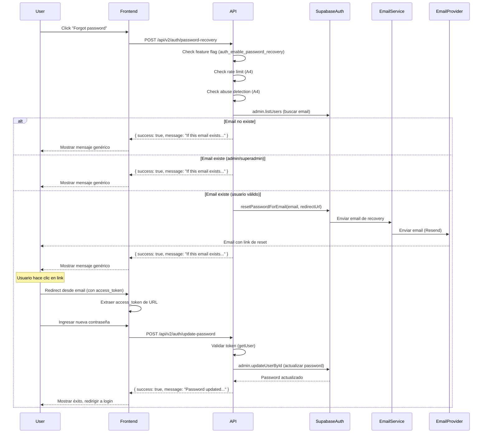

# Auth - Password Recovery

**Subnodo de:** `auth`  
**Última actualización:** 2026-01-02  
**Owner:** ROA-379 (B1)

---

## 📋 Propósito

Define los endpoints de recuperación de contraseña (`POST /api/v2/auth/password-recovery` y `POST /api/v2/auth/update-password`) con contrato anti-enumeration, feature flags, rate limiting, y seguridad de tokens.

**Responsabilidades:**

1. **Password Recovery Request:** Solicitar email de recuperación de contraseña
2. **Password Update:** Actualizar contraseña usando token de recuperación
3. **Anti-enumeration:** Los endpoints **MUST NOT** revelar si un email existe
4. **Feature flag control:** Los endpoints **MUST** verificar feature flags antes de procesar
5. **Rate limiting:** Los endpoints **MUST** aplicar rate limiting
6. **Token security:** Tokens de recuperación **MUST** ser válidos, no expirados, y de un solo uso

---

## 🔐 POST /api/v2/auth/password-recovery

### Endpoint

```
POST /api/v2/auth/password-recovery
```

### Request Contract

**Headers:**
```
Content-Type: application/json
```

**Body Schema:**
```typescript
{
  email: string;  // REQUIRED - Normalizado a lowercase automáticamente
}
```

**Validaciones (MUST):**

1. **Email validation:**
   - **MUST** ser string no vacío
   - **MUST** normalizarse: trim, lowercase
   - **MUST NOT** ser null o undefined

**Error si validación falla:**
- Status: `400 BAD_REQUEST`
- Error slug: `POLICY_INVALID_REQUEST`
- Retryable: `false`

### Response Contract (Success)

**Status:** `200 OK`

**Body:**
```typescript
{
  success: true,
  message: "If this email exists, a password recovery link has been sent"
}
```

**Anti-Enumeration Contract (CRITICAL):**

El endpoint **MUST** responder con el mismo mensaje en **TODOS** los casos de éxito, incluso si el email no existe, es admin/superadmin, o es un usuario válido. Esto previene enumeración de usuarios.

**Comportamiento:**

1. **Email no existe:**
   - No se envía email
   - Respuesta: `{ success: true, message: "If this email exists, a password recovery link has been sent" }`

2. **Email existe pero es admin/superadmin:**
   - No se envía email (password recovery no permitido para admins)
   - Respuesta: `{ success: true, message: "If this email exists, a password recovery link has been sent" }` (mismo mensaje)

3. **Email existe y es usuario válido:**
   - Se envía email de recuperación
   - Respuesta: `{ success: true, message: "If this email exists, a password recovery link has been sent" }` (mismo mensaje)

4. **Error técnico:**
   - Si hay error de red, DB, etc. → Respuesta de error con código apropiado
   - **MUST NOT** revelar si el email existe o no

### Response Contract (Error)

**Status:** `400`, `403`, `429`, `500`, `502`

**Body:**
```typescript
{
  success: false,
  error: {
    slug: AuthErrorSlug;     // Ej: "POLICY_INVALID_REQUEST"
    retryable: boolean;      // Indica si el cliente puede reintentar
  },
  request_id: string;       // ID único para tracking y debugging
}
```

---

## 🔐 POST /api/v2/auth/update-password

### Endpoint

```
POST /api/v2/auth/update-password
```

### Request Contract

**Headers:**
```
Content-Type: application/json
```

**Body Schema:**
```typescript
{
  access_token: string;  // REQUIRED - Token de recuperación del email
  password: string;      // REQUIRED - Nueva contraseña (mínimo 8 caracteres, máximo 128)
}
```

**Validaciones (MUST):**

1. **Access token validation:**
   - **MUST** ser string no vacío
   - **MUST** ser un token válido de Supabase (type=recovery)
   - **MUST NOT** estar expirado
   - **MUST NOT** ser null o undefined

2. **Password validation:**
   - **MUST** ser string
   - **MUST** tener entre 8 y 128 caracteres (inclusive)
   - **MUST NOT** exceder 128 caracteres

**Error si validación falla:**
- Status: `400 BAD_REQUEST`
- Error slug: `POLICY_INVALID_REQUEST`
- Retryable: `false`

**Error si token inválido/expirado:**
- Status: `401 UNAUTHORIZED`
- Error slug: `TOKEN_INVALID`
- Retryable: `false`

### Response Contract (Success)

**Status:** `200 OK`

**Body:**
```typescript
{
  success: true,
  message: "Password updated successfully. You can now login with your new password."
}
```

### Response Contract (Error)

**Status:** `400`, `401`, `403`, `429`, `500`

**Body:**
```typescript
{
  success: false,
  error: {
    slug: AuthErrorSlug;     // Ej: "TOKEN_INVALID"
    retryable: boolean;      // Indica si el cliente puede reintentar
  },
  request_id: string;       // ID único para tracking y debugging
}
```

---

## 🚨 Error Codes (Contractual)

### Validación (400)

| Code | Status | Message | Causa | Retryable |
|------|--------|---------|-------|-----------|
| `POLICY_INVALID_REQUEST` | 400 | Invalid request | Email vacío, password < 8 caracteres, o password > 128 caracteres, access_token faltante | false |

### Autenticación (401)

| Code | Status | Message | Causa | Retryable |
|------|--------|---------|-------|-----------|
| `TOKEN_INVALID` | 401 | Invalid or expired reset token | Token expirado, inválido, o ya usado | false |

### Autorización (403)

| Code | Status | Message | Causa | Retryable |
|------|--------|---------|-------|-----------|
| `AUTH_EMAIL_DISABLED` | 403 | Email infrastructure disabled | Feature flag `auth_enable_emails` deshabilitado | false |
| `AUTH_DISABLED` | 403 | Authentication disabled | Feature flag `auth_enable_password_recovery` deshabilitado o policy gate bloqueó | false |

### Rate Limiting (429)

| Code | Status | Message | Causa | Retryable |
|------|--------|---------|-------|-----------|
| `POLICY_RATE_LIMITED` | 429 | Too many password recovery requests | Rate limit excedido (3 intentos / 1 hora) | true |

**Headers adicionales:**
- `Retry-After: <seconds>` - Tiempo en segundos hasta que se puede reintentar

### Servidor (500, 502)

| Code | Status | Message | Causa | Retryable |
|------|--------|---------|-------|-----------|
| `AUTH_EMAIL_SEND_FAILED` | 500 | Email send failed | Error al enviar email (provider error, network error) | false |
| `AUTH_EMAIL_PROVIDER_ERROR` | 502 | Email provider error | Error del proveedor de email (Resend/SendGrid) | true |
| `AUTH_UNKNOWN` | 500 | Internal authentication error | Error técnico no recuperable (DB down, network error, etc.) | false |

---

## 🎛️ Feature Flag Behavior (Contractual)

### `auth_enable_password_recovery`

**Source:** `admin-controlled.yaml` o `admin_settings` table (Supabase)

**Default:** `true` (password recovery habilitado por defecto)

**Fallback:** `process.env.AUTH_ENABLE_PASSWORD_RECOVERY` (si SettingsLoader falla)

**Contract:**

1. El endpoint **MUST** verificar `auth_enable_password_recovery` **ANTES** de cualquier validación
2. Si `auth_enable_password_recovery === false` → **MUST** retornar `AUTH_EMAIL_DISABLED` (403)
3. Si SettingsLoader falla y no hay env var → **MUST** bloquear (fail-closed)
4. **MUST NOT** procesar password recovery si feature flag está deshabilitado

### `auth_enable_emails`

**Source:** `admin-controlled.yaml` o `admin_settings` table (Supabase)

**Default:** `true` (emails habilitados por defecto)

**Contract:**

1. El endpoint **MUST** verificar `auth_enable_emails` **ANTES** de enviar email
2. Si `auth_enable_emails === false` → **MUST** retornar `AUTH_EMAIL_DISABLED` (403)
3. **MUST NOT** enviar email si feature flag está deshabilitado
4. **MUST** fallar (fail-closed) incluso si el email no existe (no simular éxito)

**Fail-Closed Contract:**

Si la infraestructura de email está deshabilitada, el endpoint **MUST** fallar (no simular éxito), incluso si el email no existe. Esto previene que usuarios asuman que el sistema está funcionando cuando en realidad no puede enviar emails.

---

## 🛡️ Rate Limiting (Contractual)

### Rate Limit Policy

El endpoint `/password-recovery` **MUST** usar rate limiting específico para password recovery:

**Tipo:** `password_recovery`

**Límites (SSOT v2, sección 12.4):**
- **Window:** 1 hora
- **Max attempts:** 3 intentos por IP
- **Progressive blocking:**
  - 1ra infracción: 1 hora
  - 2da infracción: 24 horas
  - 3ra infracción: Permanente (requiere intervención manual)

**Contract:**

1. El endpoint **MUST** aplicar rate limiting **ANTES** de procesar password recovery
2. Si rate limit excedido → **MUST** retornar `POLICY_RATE_LIMITED` (429)
3. **MUST** incluir header `Retry-After` con segundos hasta que se puede reintentar
4. **MUST NOT** procesar password recovery si rate limit está excedido

**Respuesta cuando se excede:**
```typescript
{
  success: false,
  error: {
    slug: "POLICY_RATE_LIMITED",
    retryable: true
  },
  request_id: "req_xyz123"
}
// Header: Retry-After: 3600
```

### Rate Limiting para `/update-password`

El endpoint `/update-password` **MUST** usar el mismo tipo de rate limiting que `/password-recovery`:

**Tipo:** `password_recovery` (compartido)

**Límites:** Mismos que `/password-recovery` (3 intentos / 1 hora)

---

## 🔒 Anti-Enumeration Contract (CRITICAL)

### Reglas Contractuales

**Regla crítica:** El endpoint `/password-recovery` **MUST NOT** revelar si un email existe.

**Comportamiento contractual:**

1. **Email no existe:**
   - No se envía email
   - Respuesta: `{ success: true, message: "If this email exists, a password recovery link has been sent" }`

2. **Email existe pero es admin/superadmin:**
   - No se envía email (password recovery no permitido para admins)
   - Respuesta: `{ success: true, message: "If this email exists, a password recovery link has been sent" }` (mismo mensaje)

3. **Email existe y es usuario válido:**
   - Se envía email de recuperación
   - Respuesta: `{ success: true, message: "If this email exists, a password recovery link has been sent" }` (mismo mensaje)

4. **Error técnico:**
   - Si hay error de red, DB, etc. → Respuesta de error con código apropiado
   - **MUST NOT** revelar si el email existe o no

**Implementación:**
```typescript
// En authService.requestPasswordRecovery()
// Verificar si usuario existe
let user = null;
// ... buscar usuario ...

if (!user) {
  // No revelar si el email existe (anti-enumeration)
  return {
    success: true,
    message: 'If this email exists, a password recovery link has been sent'
  };
}

// Verificar role
const role = user.user_metadata.role || 'user';
if (role === 'admin' || role === 'superadmin') {
  // Return same message as non-existent user (anti-enumeration)
  return {
    success: true,
    message: 'If this email exists, a password recovery link has been sent'
  };
}

// Si es usuario válido, enviar email
await sendPasswordRecoveryEmailAfterPreflight(email, { request_id });

return {
  success: true,
  message: 'If this email exists, a password recovery link has been sent'
};
```

**Beneficios:**
- Previene enumeración de usuarios
- Protege privacidad de usuarios existentes
- Reduce superficie de ataque
- Protege información sobre roles de usuario

---

## 🔐 Token Security (Contractual)

### Reset Token Properties

**Source:** Tokens generados por Supabase Auth cuando se solicita password recovery

**Properties:**
- **Type:** Recovery token (type=recovery en query params)
- **Expiration:** Configurado en Supabase (por defecto: 1 hora)
- **Single-use:** Tokens **MUST** invalidarse después de uso exitoso
- **Format:** JWT token con access_token

### Token Validation Contract

El endpoint `/update-password` **MUST** validar el token antes de actualizar la contraseña:

1. **Token validation:**
   - **MUST** verificar que el token es válido usando `supabase.auth.getUser(accessToken)`
   - **MUST** verificar que el token no está expirado
   - **MUST** verificar que el usuario existe

2. **Error si token inválido:**
   - Status: `401 UNAUTHORIZED`
   - Error slug: `TOKEN_INVALID`
   - Message: "Reset token has expired. Please request a new password reset link."

3. **Password update:**
   - **MUST** usar `supabase.auth.admin.updateUserById()` para actualizar contraseña
   - **MUST** invalidar token después de uso exitoso (Supabase lo hace automáticamente)

**Implementación:**
```typescript
// En authService.updatePassword()
const { data: userData, error: userError } = await supabase.auth.getUser(accessToken);

if (userError || !userData.user) {
  const errorMessage = userError?.message?.toLowerCase() || '';
  if (errorMessage.includes('expired') || errorMessage.includes('invalid')) {
    throw new AuthError(AUTH_ERROR_CODES.TOKEN_INVALID, 'Reset token has expired. Please request a new password reset link.');
  }
  throw new AuthError(AUTH_ERROR_CODES.TOKEN_INVALID, 'Invalid or expired reset token');
}

// Actualizar contraseña
const { error: updateError } = await supabase.auth.admin.updateUserById(userData.user.id, {
  password: newPassword
});
```

---

## 🚫 Restrictions

### Password Recovery NO permitido para Admins

**❌ Password Recovery NO permitido para:**
- `role=admin`
- `role=superadmin`

**Razón:** Admins deben usar métodos de recuperación más seguros o contactar soporte.

**Comportamiento:** Si el email es admin, respuesta sigue siendo homogénea (anti-enumeration):
```typescript
{
  success: true,
  message: "If this email exists, a password recovery link has been sent"
}
```

**Nota:** No se envía email, pero la respuesta es idéntica a la de un email no existente.

---

## 🔗 Redirect URL Configuration

### Environment Variable

**Variable:** `SUPABASE_REDIRECT_URL`

**Requerida:** **MUST** estar configurada (no fallback)

**Validación:**
- **Requerida:** Variable **MUST** estar configurada
- **Producción:** Si `NODE_ENV=production`, **MUST** ser HTTPS

**Ejemplo:**
```bash
SUPABASE_REDIRECT_URL=https://app.roastr.ai/auth/reset-password
```

### Uso en Password Recovery

El link de reset en el email redirige a esta URL con el token de reset como query parameter:

```
https://app.roastr.ai/auth/reset-password?access_token=xxx&type=recovery
```

**Contract:**
- **MUST** estar configurada antes de enviar email
- Si no está configurada → **MUST** retornar `AUTH_EMAIL_SEND_FAILED` (500)

---

## 📊 Analytics Integration (Contractual)

### Eventos Trackeados

Los endpoints **MUST** trackear eventos de analytics:

#### Password Recovery Request

**Evento:** `auth_password_recovery_request`
```typescript
logPasswordRecoveryRequest(context, success, error?);
```

**Eventos de Amplitude:**
- `auth_email_requested` (flow: password_recovery)
- `auth_email_sent` (flow: password_recovery)
- `auth_email_failed` (flow: password_recovery, con error_slug)

#### Password Update

**Eventos logged:**
- `auth_password_updated` (success)
- `auth_password_update_failed` (failure con error_slug)

### Graceful Degradation Contract

**Regla:** Si analytics falla, el flujo **MUST NOT** interrumpirse.

```typescript
try {
  trackEvent({ ... });
} catch {
  logger.warn('analytics.track_failed', { event: 'auth_password_recovery_request' });
  // Flujo continúa normalmente
}
```

### PII Protection Contract

**Regla:** Los eventos de analytics **MUST NOT** incluir PII (emails, passwords).

- Emails **MUST** hashearse antes de logging (usar `truncateEmailForLog()`)
- Passwords **MUST NOT** loggearse nunca
- Solo se trackea `userId` (UUID) en eventos de éxito

---

## 👁️ Visibility Table

### User-Visible vs Internal Behavior

| Aspecto | Visible para Usuario | No Visible (Internal) |
|---------|---------------------|----------------------|
| **Request (password-recovery)** | Email (input) | Normalización de email, validaciones internas |
| **Request (update-password)** | Password (input) | Validaciones internas, token validation |
| **Response Success (password-recovery)** | `{ success: true, message }` | Si email existe o no, role del usuario, envío de email |
| **Response Success (update-password)** | `{ success: true, message }` | User ID, token invalidation, analytics |
| **Response Error** | Error slug, mensaje genérico | Detalles técnicos, stack traces, request_id (solo logs) |
| **Rate Limiting** | `POLICY_RATE_LIMITED` con `retry_after_seconds` | IP tracking, contador de intentos, progressive blocking |
| **Token Security** | `TOKEN_INVALID` (mensaje genérico) | Detalles del token, expiración, validation interna |
| **Email Sending** | Mensaje genérico de éxito | Provider usado (Resend), infraestructura de email, errores de envío |
| **Analytics** | N/A (no visible) | Eventos trackeados, userId, duración, métricas |
| **Feature Flags** | N/A (no visible directamente) | Estado de flags, configuración, fallbacks |

**Principios:**

1. **User-visible:** Solo información necesaria para que el usuario complete el flujo
2. **Internal:** Todo lo demás (analytics, logging, side-effects) es invisible
3. **Anti-enumeration:** El usuario **MUST NOT** poder determinar si un email existe o no
4. **Security:** Detalles técnicos (IPs, tokens, errors internos) **MUST NOT** exponerse

---

## 🔗 Relación con A3/A4 Contracts

**A3 (Auth Policy Gate)** y **A4 (Rate Limit & Abuse Wiring)** son sistemas complementarios:

| Aspecto | Password Recovery v2 (ROA-379) | A3 Policy Gate | A4 Rate Limit |
|---------|-------------------------------|----------------|---------------|
| **Propósito** | Password recovery de usuarios | Evaluación de políticas | Rate limiting |
| **Orden de ejecución** | Después de A3/A4 | Antes de password recovery | Antes de password recovery |
| **Feature Flags** | `auth_enable_password_recovery`, `auth_enable_emails` | `ENABLE_RATE_LIMIT`, `ENABLE_ABUSE_DETECTION` | `ENABLE_RATE_LIMIT` |
| **Error Taxonomy** | `AUTH_*`, `POLICY_*`, `TOKEN_*` | `POLICY_*` | `POLICY_RATE_LIMITED` |

**Flujo típico:**

1. Request llega a `/api/v2/auth/password-recovery`
2. **A3 Policy Gate** evalúa:
   - Feature flags (`auth_enable_password_recovery`)
   - Rate limiting (A4)
   - Abuse detection (A4)
3. Si A3 permite → **Password Recovery Service** ejecuta lógica de negocio
4. Si A3 bloquea → Retorna error apropiado (`POLICY_RATE_LIMITED`, `AUTH_DISABLED`, etc.)

**Middleware compartido:**
- `rateLimitByType('password_recovery')` - Rate limiting (A4)
- `checkAuthPolicy()` - Policy gate (A3)
- `isAuthEndpointEnabled()` - Feature flag check

---

## 📊 Tests & Coverage

**Tests implementados:** Integration tests + unit tests  
**Coverage:** High coverage en endpoints y servicios

**Archivos testeados:**
- `apps/backend-v2/tests/integration/auth/password-recovery.spec.ts` - Integration tests completos
- `apps/backend-v2/tests/unit/services/authService-passwordRecovery.privacy.test.ts` - Privacy/anti-enumeration tests
- `apps/backend-v2/tests/unit/services/authEmailService.test.ts` - Email service tests
- `apps/backend-v2/tests/flow/auth-http.endpoints.test.ts` - HTTP endpoint tests

**Casos de prueba cubiertos:**
- ✅ Password recovery request exitoso
- ✅ Anti-enumeration (email no existe, admin, usuario válido → mismo mensaje)
- ✅ Validación de email/password (edge cases)
- ✅ Feature flag OFF → `AUTH_EMAIL_DISABLED`
- ✅ Rate limit excedido → `POLICY_RATE_LIMITED`
- ✅ Token inválido/expirado → `TOKEN_INVALID`
- ✅ Password update exitoso
- ✅ Password validation (mínimo 8 caracteres, máximo 128)
- ✅ Email infrastructure disabled → Fail-closed
- ✅ Analytics tracking (success/failed)
- ✅ Graceful degradation (analytics falla → flujo continúa)
- ✅ PII protection (no emails/passwords en analytics)

**Script de prueba manual:**
- `apps/backend-v2/scripts/test-password-recovery.ts` - Script para testing manual con Supabase real

---

## 🔧 Configuration

### Environment Variables

**Required:**
```bash
SUPABASE_URL=https://your-project.supabase.co
SUPABASE_SERVICE_KEY=your-service-key
SUPABASE_REDIRECT_URL=https://app.roastr.ai/auth/reset-password
```

**Optional:**
```bash
AUTH_ENABLE_PASSWORD_RECOVERY=true  # Fallback si SettingsLoader falla
AUTH_ENABLE_EMALS=true  # Fallback si SettingsLoader falla
RESEND_API_KEY=your-resend-key  # Para emails de recuperación
AUTH_EMAIL_FROM=Roastr <noreply@roastr.ai>  # From address para emails
NODE_ENV=production  # test | development | production
```

### SSOT Configuration

**File:** `apps/backend-v2/src/config/admin-controlled.yaml`

```yaml
feature_flags:
  auth_enable_password_recovery: true  # Default: true
  auth_enable_emails: true             # Required para password recovery
```

**Database:** `admin_settings` table (overrides YAML)

```sql
-- Runtime override (priority over YAML)
INSERT INTO admin_settings (key, value) 
VALUES ('auth_enable_password_recovery', 'true');
```

### Email Infrastructure

**Requisito:** Para que password recovery funcione, **MUST** estar configurada la infraestructura de email:

1. **Resend API Key:**
   ```bash
   RESEND_API_KEY=re_xxxxx
   ```

2. **From Address:**
   ```bash
   AUTH_EMAIL_FROM=Roastr <noreply@roastr.ai>
   ```

3. **Redirect URL:**
   ```bash
   SUPABASE_REDIRECT_URL=https://app.roastr.ai/auth/reset-password
   ```

**Si falta infraestructura de email:**
- Password recovery **MUST** retornar `AUTH_EMAIL_DISABLED` (403) o `AUTH_EMAIL_SEND_FAILED` (500)
- **MUST NOT** enviar email
- **MUST** fallar (fail-closed) incluso si el email no existe

---

## 🚀 Usage Examples

### Request Password Recovery

```typescript
const response = await fetch('https://api.roastr.ai/v2/auth/password-recovery', {
  method: 'POST',
  headers: { 'Content-Type': 'application/json' },
  body: JSON.stringify({
    email: 'user@example.com'
  })
});

const data = await response.json();

if (data.success) {
  // Password recovery email enviado (o email no existe, pero no se revela)
  // Mostrar mensaje genérico: "Si el email existe, recibirás un link de recuperación"
  showMessage(data.message);
} else {
  const { slug, message } = data.error;
  // Handle error según error code
  if (slug === 'POLICY_RATE_LIMITED') {
    const retryAfter = response.headers.get('Retry-After');
    showError(`Too many attempts. Try again in ${Math.ceil(retryAfter / 60)} minutes`);
  }
}
```

### Update Password with Token

```typescript
// Token viene del link en el email: ?access_token=xxx&type=recovery
const urlParams = new URLSearchParams(window.location.search);
const accessToken = urlParams.get('access_token');

if (!accessToken) {
  showError('Invalid reset link');
  return;
}

const response = await fetch('https://api.roastr.ai/v2/auth/update-password', {
  method: 'POST',
  headers: { 'Content-Type': 'application/json' },
  body: JSON.stringify({
    access_token: accessToken,
    password: 'NewSecurePassword123!'
  })
});

const data = await response.json();

if (data.success) {
  // Password actualizado exitosamente
  showMessage(data.message);
  // Redirigir a login
  router.push('/login');
} else {
  const { slug, message } = data.error;
  if (slug === 'TOKEN_INVALID') {
    showError('Reset link has expired. Please request a new password reset link.');
  } else {
    showError(message);
  }
}
```

### Handle Feature Flag Disabled

```typescript
try {
  const data = await requestPasswordRecovery(email);
} catch (error) {
  if (error.slug === 'AUTH_EMAIL_DISABLED') {
    showError('Password recovery is currently unavailable');
  }
}
```

### Handle Rate Limiting

```typescript
try {
  const data = await requestPasswordRecovery(email);
} catch (error) {
  if (error.slug === 'POLICY_RATE_LIMITED') {
    const retryAfter = error.retry_after_seconds;
    showError(`Too many attempts. Try again in ${Math.ceil(retryAfter / 60)} minutes`);
  }
}
```

---

## 🔍 Security Considerations

### ✅ Implemented (Contractual)

1. **Anti-enumeration** - **MUST NOT** revelar si email existe
2. **No credential logging** - Passwords **MUST NOT** loggearse nunca
3. **PII anonymization** - Emails **MUST** hashearse en logs (GDPR compliant)
4. **Generic error messages** - **MUST NOT** exponer detalles internos
5. **Rate limiting** - Protección contra brute force (3 intentos en 1 hora)
6. **Token security** - Tokens expiran, son de un solo uso, y se validan estrictamente
7. **Password validation** - Min 8 chars, max 128 chars
8. **Feature flag control** - Control granular de funcionalidad
9. **Fail-closed semantics** - Si feature flag falla, **MUST** bloquear
10. **Admin protection** - Admins no pueden usar password recovery

### ⚠️ Considerations

1. **Token expiration** - Tokens expiran después de 1 hora (configurable en Supabase)
2. **Single-use tokens** - Tokens se invalidan después de uso exitoso (Supabase)
3. **HTTPS required** - Redirect URL **MUST** ser HTTPS en producción
4. **CORS** - Configurar origins permitidos en producción
5. **Password strength** - Validación mínima (8 chars), considerar validación más estricta en futuro
6. **Email delivery** - Depende de provider (Resend), puede haber delays o fallos

---

## 📚 Related Documentation

- **SSOT v2:** `docs/SSOT-V2.md` - Single Source of Truth
- **Auth Overview:** `docs/nodes-v2/auth/overview.md` - Overview completo del nodo auth
- **Login Flows:** `docs/nodes-v2/auth/login-flows.md` - Flujos de login (incluye referencia a password recovery)
- **Session Management:** `docs/nodes-v2/auth/session-management.md` - Gestión de sesiones
- **Rate Limiting:** `docs/nodes-v2/auth/rate-limiting.md` - Rate limiting v2
- **Error Taxonomy:** `docs/nodes-v2/auth/error-taxonomy.md` - Códigos de error completos
- **Security:** `docs/nodes-v2/auth/security.md` - Consideraciones de seguridad
- **A3 Policy Gate:** `docs/nodes-v2/auth/a3-policy-system.md` - Auth Policy Gate
- **Register:** `docs/nodes-v2/auth/register.md` - Documentación de registro (B5)

---

## 🐛 Troubleshooting

### Error: "Email infrastructure disabled"

**Causa:** Feature flag `auth_enable_emails` está deshabilitado

**Solución:**
```bash
# Verificar configuración
cat apps/backend-v2/src/config/admin-controlled.yaml | grep -A 3 "auth_enable_emails"

# O verificar env var
echo $AUTH_ENABLE_EMALS

# Habilitar en admin settings (DB)
# INSERT INTO admin_settings (key, value) VALUES ('auth_enable_emails', 'true');
```

### Error: "Password recovery is currently unavailable"

**Causa:** Feature flag `auth_enable_password_recovery` está deshabilitado

**Solución:**
```bash
# Verificar configuración
cat apps/backend-v2/src/config/admin-controlled.yaml | grep -A 3 "auth_enable_password_recovery"

# O verificar env var
echo $AUTH_ENABLE_PASSWORD_RECOVERY

# Habilitar en admin settings (DB)
# INSERT INTO admin_settings (key, value) VALUES ('auth_enable_password_recovery', 'true');
```

### Error: "Reset token has expired"

**Causa:** Token de recuperación expiró (default: 1 hora)

**Solución:** Usuario **MUST** solicitar un nuevo link de recuperación

### Error: "Invalid or expired reset token"

**Causa:** Token inválido, expirado, o ya usado

**Solución:** Usuario **MUST** solicitar un nuevo link de recuperación

### Error: "Too many password recovery requests"

**Causa:** Rate limit excedido (3 intentos en 1 hora)

**Solución:** Esperar el tiempo indicado en `retry_after_seconds` o contactar soporte si bloqueado permanentemente

### Email no recibido

**Causa:** Email puede estar en spam, o provider error

**Solución:**
1. Verificar spam folder
2. Verificar logs: `auth_email_failed` o `auth_email_send_failed`
3. Verificar configuración de Resend API key
4. Verificar que `SUPABASE_REDIRECT_URL` está configurado

---

## 🔄 Integration Flow

### Complete Password Recovery Flow



---

**Última actualización:** 2026-01-02  
**Owner:** ROA-379 (B1 Password Recovery Backend v2)

