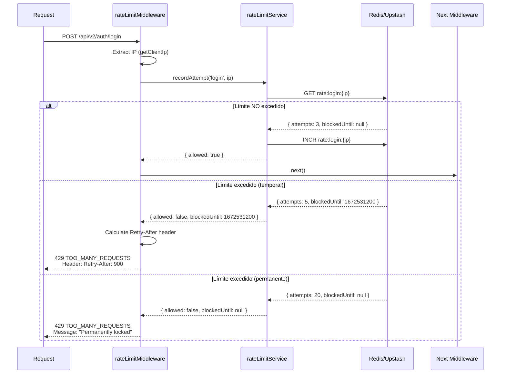
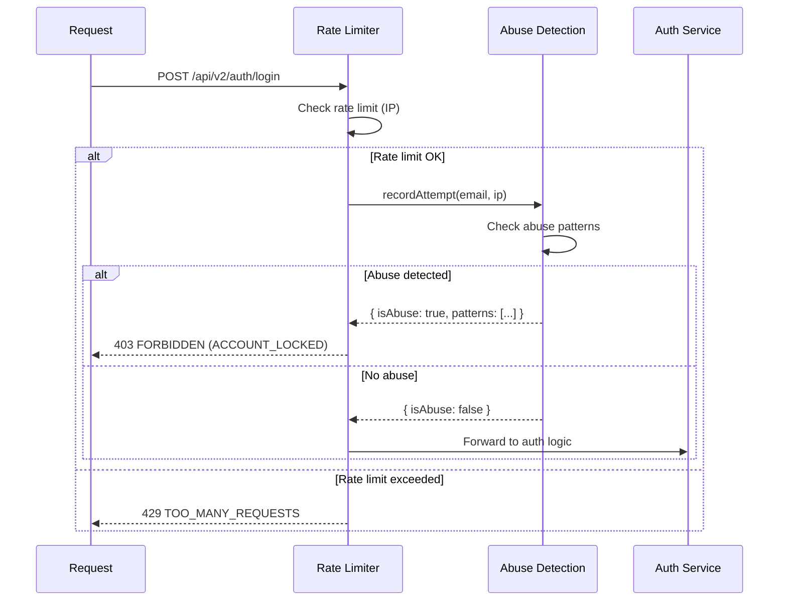

# Auth - Rate Limiting

**Subnodo de:** `auth`  
**Última actualización:** 2026-01-01  
**Owner:** ROA-403 (ROA-359 implementación)

---

## 📋 Propósito

Define la protección contra brute force y abuse patterns en endpoints de autenticación mediante rate limiting v2.

**Strong Concept Owner:** `rateLimitConfig` ⭐

---

## 🛡️ Configuración Oficial (SSOT v2)

**Fuente de verdad:** SSOT v2, sección 12.4

### Límites por Tipo de Endpoint

| Endpoint | Max Attempts | Window | Bloqueo Inicial |
|----------|--------------|--------|-----------------|
| **Password Login** | 5 | 15 min | 15 min |
| **Magic Link** | 3 | 1 hora | 1 hora |
| **OAuth** | 10 | 15 min | 15 min |
| **Password Reset** | 3 | 1 hora | 1 hora |
| **Register/Signup** | 5 | 1 hora | 1 hora |

**⚠️ CRÍTICO:** Estos valores SON la única fuente de verdad. Cualquier cambio DEBE hacerse en SSOT v2.

---

## 🔄 Bloqueo Progresivo

### Escalamiento Automático

```
1ra infracción → Bloqueo 15 minutos
2da infracción → Bloqueo 1 hora
3ra infracción → Bloqueo 24 horas
4ta+ infracción → Bloqueo permanente (requiere intervención manual)
```

**Tracking:** Por combinación IP + endpoint type.

**Ejemplo:**
```
Usuario intenta login 5 veces → Bloqueado 15 min (1ra infracción)
Usuario intenta de nuevo después de 15 min → Bloqueado 1 hora (2da infracción)
Usuario intenta de nuevo después de 1 hora → Bloqueado 24 horas (3ra infracción)
Usuario intenta de nuevo después de 24 horas → Bloqueado permanente (4ta infracción)
```

**Reseteo:** Counter de infracciones NO se resetea (persistente en Redis).

---

## 🏗️ Arquitectura

### rateLimitService

**Ubicación:** `apps/backend-v2/src/services/rateLimitService.ts`

**Storage:**
- **Producción:** Redis/Upstash (persistente, multi-instance)
- **Development:** In-memory Map (solo single instance)

**Método principal:**

```typescript
recordAttempt(
  authType: AuthType, 
  ip: string
): { allowed: boolean; blockedUntil: number | null }
```

**AuthType:**
```typescript
type AuthType = 
  | 'login'
  | 'signup'
  | 'magic_link'
  | 'password_recovery'
  | 'oauth';
```

**Retorno:**
- `allowed: true` → Puede proceder
- `allowed: false` → Bloqueado
  - `blockedUntil: number` → Unix timestamp cuando se desbloquea (temporal)
  - `blockedUntil: null` → Bloqueo permanente

### rateLimitMiddleware

**Ubicación:** `apps/backend-v2/src/middleware/rateLimit.ts`

**Uso en rutas:**

```typescript
router.post('/login', rateLimitByType('login'), loginHandler);
router.post('/magic-link', rateLimitByType('magic_link'), magicLinkHandler);
router.post('/password-recovery', rateLimitByType('password_recovery'), passwordRecoveryHandler);
```

**Flujo:**



---

## 🔑 Identificación de Clientes

### IP Extraction

**Helper:** `getClientIp(req)` (apps/backend-v2/src/utils/request.ts)

**Prioridad:**
1. `X-Forwarded-For` header (primer IP)
2. `X-Real-IP` header
3. `req.connection.remoteAddress`
4. `req.socket.remoteAddress`

**Edge cases:**
- Proxies: Usa primer IP de `X-Forwarded-For`
- IPv6: Normaliza a formato estándar
- Localhost: Tracking normal (útil para dev)

**Security:**
- ⚠️ `X-Forwarded-For` puede ser spoofed
- ✅ Usar solo si hay proxy confiable (Vercel, Cloudflare)

### Rate Limit Key

**Formato:** `rate:{authType}:{ip}`

**Ejemplos:**
- `rate:login:192.168.1.1`
- `rate:magic_link:203.0.113.45`
- `rate:password_recovery:2001:db8::8a2e:370:7334`

**TTL (Redis):**
- `login`: 15 minutos
- `magic_link`: 1 hora
- `password_recovery`: 1 hora
- `oauth`: 15 minutos
- `signup`: 1 hora

---

## 📊 Respuestas HTTP

### 429 Too Many Requests

**Headers:**
```
HTTP/1.1 429 Too Many Requests
Content-Type: application/json
Retry-After: 900
X-Request-ID: uuid-v4
```

**Body (temporal block):**
```json
{
  "success": false,
  "error": {
    "slug": "POLICY_RATE_LIMITED",
    "retryable": true
  },
  "request_id": "uuid-v4"
}
```

**Body (permanent block):**
```json
{
  "success": false,
  "error": {
    "slug": "POLICY_RATE_LIMITED",
    "retryable": false
  },
  "request_id": "uuid-v4"
}
```

**Retry-After header:**
- Valor en **segundos** hasta desbloqueo
- Omitido si bloqueo permanente

**Frontend handling:**
```typescript
if (response.status === 429) {
  const retryAfter = response.headers.get('Retry-After');
  if (retryAfter) {
    const seconds = parseInt(retryAfter, 10);
    showMessage(`Intenta de nuevo en ${Math.ceil(seconds / 60)} minutos`);
  } else {
    showMessage('Cuenta bloqueada permanentemente. Contacta soporte.');
  }
}
```

---

## 🛡️ Abuse Detection Integration

### abuseDetectionService

**Ubicación:** `apps/backend-v2/src/services/abuseDetectionService.ts`

**Propósito:** Detectar patrones sospechosos ANTES de rate limiting.

**Patterns detectados:**

#### 1. Multi-IP Attack
- Mismo email desde múltiples IPs en ventana corta
- **Threshold (SSOT v2, 12.5):** 5+ IPs en 15 min

#### 2. Multi-Email Attack
- Múltiples emails desde misma IP en ventana corta
- **Threshold:** 10+ emails en 15 min

#### 3. Burst Attack
- Múltiples intentos desde misma IP en segundos
- **Threshold:** 10+ intentos en 60 segundos

#### 4. Slow Attack
- Intentos espaciados para evitar rate limit
- **Threshold:** 50+ intentos en 24 horas (bajo threshold individual)

### Integration Flow



**Error mapping:**
- Abuse detected → `AUTH_ACCOUNT_LOCKED` (403)
- Rate limit → `POLICY_RATE_LIMITED` (429)

**Logging:**
```typescript
// PII anonymized (GDPR compliance)
logger.error('Abuse detected', {
  emailHash: sha256(email).substring(0, 12),
  ipPrefix: ip.split('.').slice(0, 2).join('.') + '.x.x',
  patterns: ['multi_ip', 'burst']
});
```

---

## 🔄 Rate Limit Bypass (Admin)

### ⚠️ NO IMPLEMENTADO

**Caso de uso:** Permitir admins/superadmins bypass rate limiting.

**Implementación propuesta:**

```typescript
export function rateLimitByType(authType: AuthType, options?: { allowBypass?: boolean }) {
  return async (req: Request, res: Response, next: NextFunction): Promise<void> => {
    // Si bypass habilitado Y usuario es admin → skip rate limit
    if (options?.allowBypass && req.user?.role === 'admin') {
      return next();
    }
    
    // Rate limit normal
    const ip = getClientIp(req);
    const result = rateLimitService.recordAttempt(authType, ip);
    
    if (!result.allowed) {
      return sendAuthError(req, res, new AuthError(AUTH_ERROR_CODES.RATE_LIMITED));
    }
    
    next();
  };
}
```

**Uso:**
```typescript
router.post('/admin/impersonate', 
  rateLimitByType('login', { allowBypass: true }), 
  impersonateHandler
);
```

**Prioridad:** 🟢 P3 (low priority)

---

## 📈 Observability

### Métricas Prometheus

**Counter: `auth_rate_limits_total`**
```
Labels:
  - auth_type (login, magic_link, etc.)
  - blocked (true/false)
  - block_type (temporary, permanent)
```

**Histogram: `auth_rate_limit_check_duration_seconds`**
```
Labels:
  - auth_type
Buckets: [0.001, 0.005, 0.01, 0.05, 0.1, 0.5, 1]
```

### Logs Estructurados

**Rate limit blocked:**
```json
{
  "timestamp": "2026-01-01T10:30:00Z",
  "level": "warn",
  "event": "auth_rate_limit_blocked",
  "ip": "192.168.1.1",
  "auth_type": "login",
  "blocked_until": 1672531200,
  "block_type": "temporary",
  "attempts": 5,
  "request_id": "uuid-v4"
}
```

**Permanent block:**
```json
{
  "timestamp": "2026-01-01T10:35:00Z",
  "level": "error",
  "event": "auth_rate_limit_permanent",
  "ip": "192.168.1.1",
  "auth_type": "login",
  "total_infractions": 4,
  "request_id": "uuid-v4"
}
```

### Amplitude Events

**Event: `auth_rate_limit_triggered`**
```typescript
{
  event: 'auth_rate_limit_triggered',
  properties: {
    auth_type: 'login',
    block_type: 'temporary',
    retry_after_seconds: 900
  },
  context: {
    flow: 'auth',
    request_id: 'uuid-v4'
  }
}
```

---

## 🧪 Testing

### Unit Tests

**Ubicación:** `apps/backend-v2/tests/unit/services/rateLimitService.test.ts`

**Test cases:**
- ✅ First attempt allowed
- ✅ 5th attempt blocked (login)
- ✅ 6th attempt still blocked (within window)
- ✅ Attempt after window → counter reset
- ✅ Escalating blocks (15min → 1h → 24h → permanent)
- ✅ Different IPs isolated
- ✅ Redis failure fallback to memory

**Middleware tests:** `apps/backend-v2/tests/unit/middleware/rateLimitMiddleware.test.ts`

### Flow Tests

**Ubicación:** `apps/backend-v2/tests/flow/auth-login.flow.test.ts`

**Scenario: Rate limit during login**
```typescript
it('should block after 5 failed login attempts', async () => {
  // Attempt 1-4: Should fail with 401 (invalid credentials)
  for (let i = 0; i < 4; i++) {
    const res = await request(app)
      .post('/api/v2/auth/login')
      .send({ email: 'test@example.com', password: 'wrong' });
    expect(res.status).toBe(401);
  }
  
  // Attempt 5: Should still fail with 401
  const res5 = await request(app)
    .post('/api/v2/auth/login')
    .send({ email: 'test@example.com', password: 'wrong' });
  expect(res5.status).toBe(401);
  
  // Attempt 6: Should be rate limited (429)
  const res6 = await request(app)
    .post('/api/v2/auth/login')
    .send({ email: 'test@example.com', password: 'wrong' });
  expect(res6.status).toBe(429);
  expect(res6.headers['retry-after']).toBeDefined();
});
```

---

## 🛠️ Configuration

### Environment Variables

```bash
# Redis/Upstash (rate limiting storage)
REDIS_URL=redis://localhost:6379
UPSTASH_REDIS_REST_URL=https://your-upstash.upstash.io
UPSTASH_REDIS_REST_TOKEN=your-token

# Feature flags
ENABLE_RATE_LIMIT=true
ENABLE_AUTH_RATE_LIMIT_V2=true
```

### Feature Flags Dinámicos

**Flag (SSOT v2, sección 3):**
- `ENABLE_RATE_LIMIT` (global rate limit master switch)
- `ENABLE_AUTH_RATE_LIMIT_V2` (auth-specific rate limit v2)

**Behavior si OFF:**
- Rate limiting completamente deshabilitado
- Útil para debugging o emergencias

---

## 📚 Referencias

- **SSOT v2 (Rate Limiting):** Sección 12.4 ⭐
- **SSOT v2 (Abuse Detection):** Sección 12.5
- **Implementación (Service):** `apps/backend-v2/src/services/rateLimitService.ts`
- **Implementación (Middleware):** `apps/backend-v2/src/middleware/rateLimit.ts`
- **Tests:** `apps/backend-v2/tests/unit/services/rateLimitService.test.ts`

---

**Última actualización:** 2026-01-01  
**Owner:** ROA-403 (ROA-359 implementación)  
**Status:** ✅ Active
