# Auth - Rate Limiting v2

**Subnodo:** `auth/rate-limiting`  
**Última actualización:** 2025-12-26  
**Owner:** ROA-364 (documenta ROA-359)

---

## 📋 Propósito

Este subnodo documenta el sistema de **rate limiting v2** para endpoints de autenticación, implementado en ROA-359.

**Objetivos:**

1. **Prevenir brute force attacks:** Limitar intentos de login
2. **Detectar abuse patterns:** multi-ip, multi-email, burst attacks
3. **Bloqueo progresivo:** Escalación de castigos por reincidencia
4. **Performance:** Redis en producción, memoria en dev/test

---

## ⚙️ Configuración Oficial (Strong Concept)

Este nodo es el **dueño único** de `rateLimitConfig`.

**Fuente de verdad:** SSOT v2, sección 12.4

### Rate Limits por Método de Autenticación

```typescript
type AuthRateLimitConfig = {
  password: {
    windowMs: 900000;        // 15 minutos
    maxAttempts: 5;
    blockDurationMs: 900000; // 15 minutos
  };
  magic_link: {
    windowMs: 3600000;       // 1 hora
    maxAttempts: 3;
    blockDurationMs: 3600000; // 1 hora
  };
  oauth: {
    windowMs: 900000;        // 15 minutos
    maxAttempts: 10;
    blockDurationMs: 900000; // 15 minutos
  };
  password_reset: {
    windowMs: 3600000;       // 1 hora
    maxAttempts: 3;
    blockDurationMs: 3600000; // 1 hora
  };
};
```

### Bloqueo Progresivo (Escalación)

```typescript
type ProgressiveBlockDurations = [
  900000,      // 15 minutos (1ra infracción)
  3600000,     // 1 hora      (2da infracción)
  86400000,    // 24 horas    (3ra infracción)
  null         // Permanente  (4ta+ infracción, requiere intervención manual)
];
```

**Cómo funciona:**

- **1ra vez:** Bloqueo 15 minutos
- **2da vez (dentro de 24h):** Bloqueo 1 hora
- **3ra vez (dentro de 24h):** Bloqueo 24 horas
- **4ta+ vez:** Bloqueo permanente (admin debe desbloquear)

---

## 🎯 Abuse Detection Thresholds

**Fuente de verdad:** SSOT v2, sección 12.5

```typescript
type AbuseDetectionThresholds = {
  multi_ip: number;        // Número de IPs diferentes para mismo email (default: 3)
  multi_email: number;     // Número de emails diferentes para misma IP (default: 5)
  burst: number;           // Intentos en ventana corta (1 min) para trigger burst attack (default: 10)
  slow_attack: number;     // Intentos en ventana larga (1 hora) para trigger slow attack (default: 20)
};
```

### Valores por Defecto (Fallback)

Si SSOT no disponible o configuración corrupta:

```typescript
const DEFAULT_THRESHOLDS = {
  multi_ip: 3,
  multi_email: 5,
  burst: 10,
  slow_attack: 20
};
```

**⚠️ Fail-Safe:** Sistema siempre tiene fallback seguro (fail-closed).

---

## 🗄️ Storage

### Producción: Redis/Upstash

**Preferido para producción:**

```typescript
// Key patterns
auth:ratelimit:ip:${authType}:${ip}          // Track por IP
auth:ratelimit:email:${authType}:${emailHash} // Track por email (hasheado)
auth:ratelimit:block:${identifier}            // Track bloqueos
auth:ratelimit:infractions:${identifier}      // Track infracciones (escalación)
```

**Ventajas:**
- Persistencia entre restarts
- Distribuido (múltiples instancias backend)
- TTL automático (limpieza sin cron jobs)
- Performance óptimo

**Configuración:**

```bash
# Environment Variables
REDIS_URL=redis://localhost:6379
# O para Upstash (producción):
UPSTASH_REDIS_REST_URL=https://your-instance.upstash.io
UPSTASH_REDIS_REST_TOKEN=your-token
```

### Fallback: Memoria (Dev/Test)

**Solo para desarrollo y testing:**

```typescript
// In-memory store
const rateLimitStore = new Map<string, RateLimitData>();
```

**Limitaciones:**
- No persiste entre restarts
- No funciona con múltiples instancias
- No es production-ready

**⚠️ Warning:** Si Redis falla en producción, sistema usa memoria temporalmente pero logea error crítico.

---

## 🔑 Key Generation (Privacy-Preserving)

### IP + Email Hash

```typescript
function generateRateLimitKey(
  authType: 'password' | 'magic_link' | 'oauth' | 'password_reset',
  ip: string,
  email: string
): string {
  // Hash email para no almacenar emails en plain text
  const emailHash = crypto
    .createHash('sha256')
    .update(email.toLowerCase().trim())
    .digest('hex')
    .substring(0, 8); // Solo primeros 8 chars
  
  return `auth:ratelimit:ip:${authType}:${ip}:${emailHash}`;
}
```

**Ejemplo:**

```
Input:  authType='password', ip='192.168.1.1', email='user@example.com'
Output: auth:ratelimit:ip:password:192.168.1.1:a1b2c3d4
```

### Por qué Hash el Email

- **Privacy:** No almacenar emails en Redis plain text
- **GDPR:** Minimización de datos sensibles
- **Suficiente:** 8 chars SHA-256 proveen colisión negligible para rate limiting

---

## 🛡️ Feature Flags

```bash
# Enable rate limiting v2 (reemplaza v1)
ENABLE_AUTH_RATE_LIMIT_V2=true

# Enable rate limiting general (requerido para v2)
ENABLE_RATE_LIMIT=true
```

**Precedencia:**
- Si `ENABLE_AUTH_RATE_LIMIT_V2=false` → No rate limiting en auth endpoints
- Si `ENABLE_RATE_LIMIT=false` → No rate limiting en toda la app

**⚠️ Producción:** Ambos DEBEN estar en `true`.

---

## 🔄 Workflow Completo

```mermaid
sequenceDiagram
    participant Client
    participant RateLimiter
    participant Redis
    participant AuthService
    participant AbuseDetector

    Client->>RateLimiter: POST /api/v2/auth/login
    RateLimiter->>Redis: GET auth:ratelimit:ip:password:192.168.1.1:a1b2c3d4
    
    alt Key existe en Redis
        Redis-->>RateLimiter: { attempts: 4, firstAttempt: ..., blocked: false }
        
        alt attempts >= maxAttempts (5)
            RateLimiter->>Redis: SET ...blocked = true (TTL 15min)
            RateLimiter-->>Client: 429 RATE_LIMIT_EXCEEDED
        else attempts < maxAttempts
            RateLimiter->>AuthService: Forward request
            AuthService->>AuthService: Attempt login
            
            alt Login fail
                AuthService->>RateLimiter: Increment attempts
                RateLimiter->>Redis: INCR attempts
                RateLimiter->>AbuseDetector: Check patterns
                
                alt Abuse pattern detected (burst, multi-ip, etc.)
                    AbuseDetector->>Redis: INCR infractions
                    AbuseDetector->>Redis: SET block (progressive duration)
                    AbuseDetector-->>Client: 429 + escalated block
                else Normal behavior
                    AuthService-->>Client: 401 INVALID_CREDENTIALS
                end
            else Login success
                AuthService->>RateLimiter: Reset attempts
                RateLimiter->>Redis: DEL key
                AuthService-->>Client: 200 + session
            end
        end
    else Key no existe (primer intento)
        RateLimiter->>Redis: SET { attempts: 1, firstAttempt: now }
        RateLimiter->>AuthService: Forward request
        AuthService-->>Client: 401/200 según resultado
    end
```



---

## 📊 Response Formats

### Request Allowed (Dentro del Límite)

```json
// Header añadido (opcional, para debugging)
X-RateLimit-Limit: 5
X-RateLimit-Remaining: 2
X-RateLimit-Reset: 1703000000
```

### Request Blocked (429)

```json
{
  "success": false,
  "error": {
    "code": "AUTH_RATE_LIMIT_EXCEEDED",
    "message": "Too many login attempts. Please try again later.",
    "statusCode": 429,
    "retryAfter": 12,  // Minutos hasta desbloqueo
    "details": {
      "attempts": 5,
      "maxAttempts": 5,
      "windowMs": 900000,
      "blockExpiresAt": 1703000000
    }
  }
}
```

### Abuse Pattern Detected

```json
{
  "success": false,
  "error": {
    "code": "AUTH_RATE_LIMIT_EXCEEDED",
    "message": "Suspicious activity detected. Account temporarily locked.",
    "statusCode": 429,
    "retryAfter": 60,  // Minutos (depende de escalación)
    "details": {
      "pattern": "burst_attack",
      "infractions": 2,
      "blockDuration": 3600000,  // 1 hora (2da infracción)
      "permanent": false
    }
  }
}
```

### Permanent Block (4ta+ Infracción)

```json
{
  "success": false,
  "error": {
    "code": "AUTH_ACCOUNT_LOCKED",
    "message": "Your account has been locked due to suspicious activity. Contact support.",
    "statusCode": 403,
    "details": {
      "infractions": 4,
      "permanent": true,
      "supportEmail": "support@roastr.ai"
    }
  }
}
```

---

## 🚨 Abuse Pattern Detection

### 1. Multi-IP Attack

**Definición:** Mismo email intentado desde múltiples IPs en corto tiempo.

**Threshold:** 3 IPs diferentes en 1 hora (SSOT 12.5: `multi_ip`)

**Detección:**

```typescript
async function detectMultiIP(email: string, ip: string): Promise<boolean> {
  const key = `auth:abuse:multi_ip:${emailHash}`;
  const ips = await redis.smembers(key);
  
  // Añadir IP actual
  await redis.sadd(key, ip);
  await redis.expire(key, 3600); // TTL 1 hora
  
  if (ips.length >= THRESHOLDS.multi_ip) {
    // Trigger escalación
    await escalateInfraction(email);
    return true;
  }
  
  return false;
}
```

**Acción:** Bloqueo escalado (1ra → 15min, 2da → 1h, etc.)

### 2. Multi-Email Attack

**Definición:** Múltiples emails diferentes desde misma IP.

**Threshold:** 5 emails diferentes en 1 hora (SSOT 12.5: `multi_email`)

**Detección:**

```typescript
async function detectMultiEmail(email: string, ip: string): Promise<boolean> {
  const key = `auth:abuse:multi_email:${ip}`;
  const emails = await redis.smembers(key);
  
  // Añadir email actual (hasheado)
  const emailHash = hash(email);
  await redis.sadd(key, emailHash);
  await redis.expire(key, 3600); // TTL 1 hora
  
  if (emails.length >= THRESHOLDS.multi_email) {
    // Trigger escalación
    await escalateInfraction(ip);
    return true;
  }
  
  return false;
}
```

**Acción:** Bloquear IP completamente por 1 hora (mínimo)

### 3. Burst Attack

**Definición:** Muchos intentos en ventana MUY corta (bot).

**Threshold:** 10 intentos en 1 minuto (SSOT 12.5: `burst`)

**Detección:**

```typescript
async function detectBurst(identifier: string): Promise<boolean> {
  const key = `auth:abuse:burst:${identifier}`;
  const attempts = await redis.incr(key);
  
  // Primera vez, establecer TTL
  if (attempts === 1) {
    await redis.expire(key, 60); // TTL 1 minuto
  }
  
  if (attempts >= THRESHOLDS.burst) {
    // Trigger escalación inmediata
    await escalateInfraction(identifier);
    return true;
  }
  
  return false;
}
```

**Acción:** Bloqueo escalado + log de seguridad crítico

### 4. Slow Attack

**Definición:** Muchos intentos distribuidos en tiempo largo (evade rate limit).

**Threshold:** 20 intentos en 1 hora (SSOT 12.5: `slow_attack`)

**Detección:**

```typescript
async function detectSlowAttack(identifier: string): Promise<boolean> {
  const key = `auth:abuse:slow:${identifier}`;
  const attempts = await redis.incr(key);
  
  // Primera vez, establecer TTL
  if (attempts === 1) {
    await redis.expire(key, 3600); // TTL 1 hora
  }
  
  if (attempts >= THRESHOLDS.slow_attack) {
    // Trigger escalación
    await escalateInfraction(identifier);
    return true;
  }
  
  return false;
}
```

**Acción:** Bloqueo escalado + revisar manualmente

---

## 📈 Escalación de Infracciones

### Tracking de Infracciones

```typescript
async function escalateInfraction(identifier: string): Promise<BlockDuration> {
  const key = `auth:ratelimit:infractions:${identifier}`;
  const infractions = await redis.incr(key);
  
  // TTL 24 horas (después de 24h sin infracciones, se resetea)
  await redis.expire(key, 86400);
  
  // Determinar duración de bloqueo
  const blockDuration = PROGRESSIVE_BLOCK_DURATIONS[infractions - 1] || null;
  
  if (blockDuration === null) {
    // Permanente (4ta+ infracción)
    await redis.set(`auth:ratelimit:block:permanent:${identifier}`, '1');
    // No TTL → requiere admin para desbloquear
    
    // Log crítico
    logger.critical('[RateLimit] Permanent block', {
      identifier,
      infractions,
      timestamp: Date.now()
    });
  } else {
    // Temporal (1ra, 2da, 3ra infracción)
    await redis.setex(
      `auth:ratelimit:block:${identifier}`,
      blockDuration / 1000, // Redis usa segundos
      infractions.toString()
    );
  }
  
  return blockDuration;
}
```

### Reseteo de Infracciones

- **Automático:** 24 horas sin nuevas infracciones → counter resetea a 0
- **Manual (Admin):** Endpoint para limpiar infracciones

```bash
# Admin endpoint (requiere auth admin)
POST /api/v2/admin/rate-limit/reset
{
  "identifier": "192.168.1.1:a1b2c3d4"
}
```

---

## 🛠️ Admin Tools

### Métricas de Rate Limiting

```bash
GET /api/v2/admin/rate-limit/metrics
Authorization: Bearer {admin-token}

# Response:
{
  "success": true,
  "data": {
    "totalAttempts": 1250,
    "blockedAttempts": 45,
    "uniqueIPs": 320,
    "activeBlocks": 12,
    "permanentBlocks": 2,
    "abusePatternsDetected": {
      "multi_ip": 5,
      "multi_email": 3,
      "burst": 8,
      "slow_attack": 1
    },
    "timestamp": "2025-12-26T10:30:00Z"
  }
}
```

### Desbloqueo Manual

```bash
POST /api/v2/admin/rate-limit/unblock
Authorization: Bearer {admin-token}
Content-Type: application/json

{
  "identifier": "192.168.1.1:a1b2c3d4",
  "reason": "False positive, usuario legítimo"
}

# Response:
{
  "success": true,
  "message": "Identifier unblocked successfully"
}
```

---

## 📊 Logs y Observabilidad

### Logs Mínimos (Por Evento de Rate Limit)

```typescript
{
  timestamp: ISO8601,
  event: 'rate_limit_check' | 'rate_limit_block' | 'abuse_detected',
  authType: 'password' | 'magic_link' | 'oauth' | 'password_reset',
  ip: string,
  emailHash: string,      // Solo hash, no email completo
  attempts: number,
  maxAttempts: number,
  blocked: boolean,
  blockDuration?: number, // ms
  abusePattern?: 'multi_ip' | 'multi_email' | 'burst' | 'slow_attack',
  infractions?: number,
  permanent?: boolean
}
```

### Alertas Críticas

**Trigger alerta si:**

1. **Permanent block activado** (4ta+ infracción)
2. **Burst attack detectado** (10+ intentos en 1 min)
3. **Más de 100 blocked attempts en 1 hora** (posible ataque coordinado)

---

## 🔗 Integración con Otros Nodos

### login-flows

Rate limiting se aplica ANTES de llamar a Supabase:

```typescript
// En cada endpoint de login
app.post('/api/v2/auth/login', 
  rateLimiterMiddleware('password'), // PRIMERO
  async (req, res) => {
    // Solo llega aquí si pasa rate limit
    const session = await authService.loginWithPassword(...);
    res.json(session);
  }
);
```

### error-taxonomy

Rate limit usa `AUTH_RATE_LIMIT_EXCEEDED` del taxonomy:

```typescript
import { AuthError, AUTH_ERROR_CODES } from '@/utils/authErrorTaxonomy';

if (isBlocked) {
  throw new AuthError(
    AUTH_ERROR_CODES.RATE_LIMIT_EXCEEDED,
    'Too many attempts. Please try again later.',
    { retryAfter }
  );
}
```

---

## 📚 Referencias

### SSOT v2

- **Sección 12.4:** Rate Limiting Configuration ⭐ (Strong Concept owner)
- **Sección 12.5:** Abuse Detection Thresholds ⭐ (Strong Concept owner)
- **Sección 11.2:** Environment Variables (Redis config)

### Related Subnodos

- [login-flows.md](./login-flows.md) - Donde se aplica rate limiting
- [error-taxonomy.md](./error-taxonomy.md) - AUTH_RATE_LIMIT_EXCEEDED
- [security.md](./security.md) - Prevención de brute force

### Implementación

- **Rate Limiter Middleware:** `apps/backend-v2/src/middleware/rateLimiter.ts` (TBD)
- **Abuse Detector:** `apps/backend-v2/src/services/abuseDetector.ts` (TBD)
- **Redis Client:** `apps/backend-v2/src/config/redis.ts` (TBD)

---

**Última actualización:** 2025-12-26  
**Owner:** ROA-364 (documenta ROA-359)  
**Status:** ✅ Active

