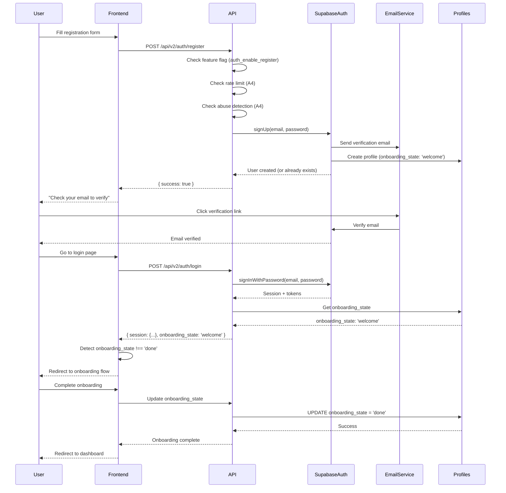

# Auth - Register

**Subnodo de:** `auth`  
**Última actualización:** 2026-01-02  
**Owner:** ROA-378 (B5)

---

## 📋 Propósito

Define el endpoint de registro de usuarios (`POST /api/v2/auth/register`) con contrato anti-enumeration, feature flags, rate limiting, y relación con onboarding.

**Responsabilidades:**

1. **Registro de usuarios:** Creación de cuenta con email/password
2. **Anti-enumeration:** El endpoint **MUST NOT** revelar si un email ya existe
3. **Onboarding initialization:** El registro **MUST** inicializar `onboarding_state: 'welcome'` en `profiles`
4. **Feature flag control:** El registro **MUST** verificar `auth_enable_register` antes de procesar
5. **Rate limiting:** El registro **MUST** aplicar rate limiting (mismo que login)

---

## 🔐 POST /api/v2/auth/register

### Endpoint

```
POST /api/v2/auth/register
```

### Request Contract

**Headers:**
```
Content-Type: application/json
```

**Body Schema:**
```typescript
{
  email: string;      // REQUIRED - Normalizado a lowercase automáticamente
  password: string;   // REQUIRED - Mínimo 8 caracteres, máximo 128 caracteres
}
```

**Nota sobre `plan_id`:**

El endpoint `/api/v2/auth/register` **MUST NOT** incluir `plan_id` en el request. El `plan_id` está disponible en el endpoint `/api/v2/auth/signup` (endpoint diferente con propósito distinto).

**Razón:** El endpoint `/register` está diseñado para registro básico con anti-enumeration, mientras que `/signup` está diseñado para registro con selección de plan inmediata.

**Validaciones (MUST):**

1. **Email validation:**
   - **MUST** ser string no vacío
   - **MUST** tener formato válido (regex: `/^[^\s@]+@[^\s@]+\.[^\s@]+$/`)
   - **MUST** normalizarse: trim, lowercase, eliminación de caracteres de control (`[\x00-\x1F\x7F]`)

2. **Password validation:**
   - **MUST** ser string
   - **MUST** tener entre 8 y 128 caracteres (inclusive)
   - **MUST NOT** exceder 128 caracteres

**Error si validación falla:**
- Status: `400 BAD_REQUEST`
- Error slug: `POLICY_INVALID_REQUEST`
- Retryable: `false`

### Response Contract (Success)

**Status:** `200 OK`

**Body:**
```typescript
{
  success: true
}
```

**Anti-Enumeration Contract (CRITICAL):**

El endpoint **MUST** responder `{ success: true }` en **TODOS** los casos de éxito, incluso si el email ya existe. Esto previene enumeración de usuarios.

**Comportamiento:**

1. **Email nuevo:**
   - Supabase Auth crea usuario
   - Se crea perfil en `profiles` table con `onboarding_state: 'welcome'` (best-effort, no bloquea si falla)
   - Respuesta: `{ success: true }`

2. **Email existente:**
   - Supabase Auth retorna error "User already registered"
   - El servicio **MUST** capturar el error y tratarlo como éxito
   - Respuesta: `{ success: true }` (mismo que email nuevo)

3. **Error técnico:**
   - Si hay error de red, DB, etc. → Respuesta de error con código apropiado
   - **MUST NOT** revelar si el email existe o no

### Response Contract (Error)

**Status:** `400`, `401`, `403`, `429`, `500`

**Body:**
```typescript
{
  success: false,
  error: {
    slug: AuthErrorSlug;     // Ej: "POLICY_INVALID_REQUEST"
    message: string;         // Mensaje descriptivo
    retryable: boolean;      // Indica si el cliente puede reintentar
  },
  request_id: string;       // ID único para tracking y debugging
}
```

---

## 🚨 Error Codes (Contractual)

### Validación (400)

| Code | Status | Message | Causa | Retryable |
|------|--------|---------|-------|-----------|
| `POLICY_INVALID_REQUEST` | 400 | Invalid request | Email vacío, formato inválido, o password < 8 caracteres | false |

### Autenticación (401)

| Code | Status | Message | Causa | Retryable |
|------|--------|---------|-------|-----------|
| `AUTH_DISABLED` | 401 | Authentication is currently unavailable | Feature flag `auth_enable_register` deshabilitado | true |
| `AUTH_SERVICE_UNAVAILABLE` | 401 | Authentication service unavailable | Infraestructura de email no configurada | true |

### Rate Limiting (429)

| Code | Status | Message | Causa | Retryable |
|------|--------|---------|-------|-----------|
| `POLICY_RATE_LIMITED` | 429 | Too many registration attempts | Rate limit excedido (mismo límite que login) | true |

**Headers adicionales:**
- `Retry-After: <seconds>` - Tiempo en segundos hasta que se puede reintentar

### Autorización (403)

| Code | Status | Message | Causa | Retryable |
|------|--------|---------|-------|-----------|
| `POLICY_ABUSE_DETECTED` | 403 | Abuse pattern detected | Patrón de abuso detectado por abuse detection service | false |

### Servidor (500)

| Code | Status | Message | Causa | Retryable |
|------|--------|---------|-------|-----------|
| `AUTH_UNKNOWN` | 500 | Internal authentication error | Error técnico no recuperable (DB down, network error, etc.) | false |

---

## 🎛️ Feature Flag Behavior (Contractual)

### `auth_enable_register`

**Source:** `admin-controlled.yaml` o `admin_settings` table (Supabase)

**Default:** `false` (registro deshabilitado por defecto)

**Fallback:** `process.env.AUTH_ENABLE_REGISTER` (si SettingsLoader falla)

**Contract:**

1. El endpoint **MUST** verificar `auth_enable_register` **ANTES** de cualquier validación
2. Si `auth_enable_register === false` → **MUST** retornar `AUTH_DISABLED` (401)
3. Si SettingsLoader falla y no hay env var → **MUST** bloquear (fail-closed)
4. **MUST NOT** procesar registro si feature flag está deshabilitado

**Implementación:**
```typescript
// Check ejecutado al inicio de register(), antes de validaciones
const settings = await loadSettings();
const registerEnabled = settings?.feature_flags?.auth_enable_register ?? false;

if (!registerEnabled) {
  throw new AuthError(
    AUTH_ERROR_CODES.AUTH_DISABLED,
    'Authentication is currently unavailable.'
  );
}
```

**Casos de uso:**
- Control de acceso durante beta/alpha
- Mantenimiento del sistema
- Incident response (deshabilitar registros durante ataque)
- Testing de frontend con registro deshabilitado

---

## 🛡️ Rate Limiting (Contractual)

### Rate Limit Policy

El endpoint de registro **MUST** usar la **misma política de rate limiting que login**:

**Tipo:** `login` (compartido con endpoint de login)

**Límites (SSOT v2, sección 12.4):**
- **Window:** 15 minutos
- **Max attempts:** 5 intentos por IP
- **Progressive blocking:**
  - 1ra infracción: 15 min
  - 2da infracción: 1 hora
  - 3ra infracción: 24 horas
  - 4ta+ infracción: Permanente (requiere intervención manual)

**Contract:**

1. El endpoint **MUST** aplicar rate limiting **ANTES** de procesar registro
2. Si rate limit excedido → **MUST** retornar `POLICY_RATE_LIMITED` (429)
3. **MUST** incluir header `Retry-After` con segundos hasta que se puede reintentar
4. **MUST NOT** procesar registro si rate limit está excedido

**Implementación:**
```typescript
router.post('/register', rateLimitByType('login'), async (req, res) => {
  // Rate limit aplicado automáticamente por middleware
  // Si se excede, retorna 429 con POLICY_RATE_LIMITED
});
```

**Respuesta cuando se excede:**
```typescript
{
  success: false,
  error: {
    slug: "POLICY_RATE_LIMITED",
    message: "Too many registration attempts",
    retryable: true
  },
  request_id: "req_xyz123"
}
// Header: Retry-After: 900
```

### Abuse Detection

Sistema complementario de detección de patrones de abuso:

**Patrones detectados:**
1. **Multi-IP**: Mismo email desde 3+ IPs en 1 hora
2. **Multi-Email**: Misma IP probando 5+ emails en 1 hora
3. **Burst Attack**: 10+ intentos en 1 minuto
4. **Slow Attack**: 20+ intentos en 30 minutos

**Contract:**

1. El abuse detection **MUST** ejecutarse **ANTES** de la lógica de registro (dentro del Auth Policy Gate A3)
2. Si abuse detectado → **MUST** retornar `POLICY_ABUSE_DETECTED` (403)
3. **MUST NOT** revelar qué patrón específico fue detectado (mensaje genérico)

**Respuesta:** Lanza `POLICY_ABUSE_DETECTED` con mensaje genérico (no expone patrón detectado)

---

## 🔒 Anti-Enumeration Contract (CRITICAL)

### Reglas Contractuales

**Regla crítica:** El endpoint **MUST NOT** revelar si un email ya está registrado.

**Comportamiento contractual:**

1. **Email nuevo:**
   - Supabase Auth crea usuario
   - Se crea perfil en `profiles` table con `onboarding_state: 'welcome'` (best-effort, no bloquea si falla)
   - Respuesta: `{ success: true }`

2. **Email existente:**
   - Supabase Auth retorna error "User already registered"
   - El servicio **MUST** capturar el error y tratarlo como éxito
   - Respuesta: `{ success: true }` (mismo que email nuevo)
   - **MUST NOT** crear perfil duplicado

3. **Error técnico:**
   - Si hay error de red, DB, etc. → Respuesta de error con código apropiado
   - **MUST NOT** revelar si el email existe o no

**Implementación:**
```typescript
// En authService.register()
const { data, error } = await supabase.auth.signUp({ email, password });

if (error) {
  // Anti-enumeration: si el email ya existe, no revelar
  if (this.isEmailAlreadyRegisteredError(error)) {
    // Silenciosamente retornar éxito (caller responderá { success: true })
    return;
  }
  // Otros errores se propagan normalmente
  throw mapSupabaseError(error);
}
```

**Beneficios:**
- Previene enumeración de usuarios
- Protege privacidad de usuarios existentes
- Reduce superficie de ataque

---

## 🎓 Onboarding Integration

### Relación con Onboarding

El registro **MUST** inicializar el estado de onboarding pero **MUST NOT** completar el onboarding.

**Estados de onboarding (SSOT v2):**

1. **`welcome`** - Estado inicial después del registro
2. **`select_plan`** - Usuario debe seleccionar plan
3. **`payment`** - Usuario debe completar pago
4. **`persona_setup`** - Usuario debe configurar persona
5. **`connect_accounts`** - Usuario debe conectar cuentas de redes sociales
6. **`done`** - Onboarding completado

### Contract de Inicialización

**Registro inicializa onboarding:**

1. El registro **MUST** crear perfil en `profiles` table con `onboarding_state: 'welcome'`
2. El registro **MUST NOT** completar onboarding (solo inicializa)
3. Si la creación de perfil falla → **MUST NOT** bloquear el registro (best-effort)
4. El usuario **MUST** completar onboarding después del registro (flujo separado)

**Implementación:**
```typescript
// En authService.register() después de crear usuario en Supabase Auth
const { error: profileError } = await supabase.from('profiles').insert({
  user_id: data.user.id,
  username: normalizedEmail,
  onboarding_state: 'welcome'  // Estado inicial
});

if (profileError) {
  // Best-effort: no bloquear registro si perfil falla
  logger.warn('auth.register.profile_create_failed', {
    userId: data.user.id,
    code: profileError.code
  });
}
```

**Flujo post-registro:**

1. Usuario se registra → `onboarding_state: 'welcome'`
2. Usuario verifica email (Supabase)
3. Usuario hace login → Frontend detecta `onboarding_state: 'welcome'`
4. Frontend redirige a onboarding flow
5. Usuario completa onboarding → `onboarding_state: 'done'`

**Nota:** El registro **MUST NOT** avanzar el estado de onboarding más allá de `welcome`. El onboarding es un flujo separado que el usuario completa después del registro.

---

## 📊 Analytics Integration (Contractual)

### Eventos Trackeados

El endpoint **MUST** trackear eventos de analytics en dos niveles:

#### 1. Endpoint Level (Siempre)

**Evento:** `auth_register_endpoint_success`
```typescript
trackEvent({
  event: 'auth_register_endpoint_success',
  properties: {
    endpoint: '/api/v2/auth/register',
    method: 'email_password',
    status_code: 200
  },
  context: {
    flow: 'auth'
  }
});
```

**Evento:** `auth_register_endpoint_failed`
```typescript
trackEvent({
  event: 'auth_register_endpoint_failed',
  properties: {
    endpoint: '/api/v2/auth/register',
    error_type: 'INTERNAL_ERROR',
    status_code: 500
  },
  context: {
    flow: 'auth'
  }
});
```

#### 2. Service Level (Solo si usuario creado)

**Evento:** `auth_register_success`
```typescript
trackEvent({
  userId: user.id,
  event: 'auth_register_success',
  properties: {
    method: 'email_password',
    profile_created: boolean  // true si perfil se creó exitosamente
  },
  context: {
    flow: 'auth',
    request_id: request_id
  }
});
```

**Evento:** `auth_register_failed`
```typescript
trackEvent({
  event: 'auth_register_failed',
  properties: {
    error_slug: error.slug,
    method: 'email_password'
  },
  context: {
    flow: 'auth',
    request_id: request_id
  }
});
```

### Graceful Degradation Contract

**Regla:** Si analytics falla, el flujo de registro **MUST NOT** interrumpirse.

```typescript
try {
  trackEvent({ ... });
} catch {
  logger.warn('analytics.track_failed', { event: 'auth_register_success' });
  // Flujo continúa normalmente
}
```

### PII Protection Contract

**Regla:** Los eventos de analytics **MUST NOT** incluir PII (emails, passwords).

- Emails **MUST** hashearse antes de logging (usar `truncateEmailForLog()`)
- Passwords **MUST NOT** loggearse nunca
- Solo se trackea `userId` (UUID) en eventos de éxito

---

## 👁️ Visibility Table

### User-Visible vs Internal Behavior

| Aspecto | Visible para Usuario | No Visible (Internal) |
|---------|---------------------|----------------------|
| **Request** | Email, password (input) | Normalización de email, validaciones internas |
| **Response Success** | `{ success: true }` | Si email existe o no, creación de perfil, analytics |
| **Response Error** | Error slug, mensaje genérico | Detalles técnicos, stack traces, request_id (solo logs) |
| **Rate Limiting** | `POLICY_RATE_LIMITED` con `retry_after_seconds` | IP tracking, contador de intentos, progressive blocking |
| **Abuse Detection** | `POLICY_ABUSE_DETECTED` (mensaje genérico) | Patrón específico detectado (multi-IP, burst, etc.) |
| **Onboarding** | Estado inicial `welcome` (visible en frontend) | Inicialización de perfil, creación de tabla `profiles` |
| **Analytics** | N/A (no visible) | Eventos trackeados, userId, duración, métricas |
| **Email Verification** | Email de verificación enviado (Supabase) | Provider usado (Resend, SendGrid), infraestructura de email |
| **Profile Creation** | N/A (no visible directamente) | Creación de perfil en `profiles` table, `onboarding_state: 'welcome'` |

**Principios:**

1. **User-visible:** Solo información necesaria para que el usuario complete el flujo
2. **Internal:** Todo lo demás (analytics, logging, side-effects) es invisible
3. **Anti-enumeration:** El usuario **MUST NOT** poder determinar si un email existe o no
4. **Security:** Detalles técnicos (IPs, patterns, errors internos) **MUST NOT** exponerse

---

## 🔗 Relación con A3/A4 Contracts

**A3 (Auth Policy Gate)** y **A4 (Rate Limit & Abuse Wiring)** son sistemas complementarios:

| Aspecto | Register v2 (ROA-378) | A3 Policy Gate | A4 Rate Limit |
|---------|----------------------|----------------|---------------|
| **Propósito** | Registro de usuarios | Evaluación de políticas | Rate limiting |
| **Orden de ejecución** | Después de A3/A4 | Antes de registro | Antes de registro |
| **Feature Flags** | `auth_enable_register` | `ENABLE_RATE_LIMIT`, `ENABLE_ABUSE_DETECTION` | `ENABLE_RATE_LIMIT` |
| **Error Taxonomy** | `AUTH_*`, `POLICY_*` | `POLICY_*` | `POLICY_RATE_LIMITED` |

**Flujo típico:**

1. Request llega a `/api/v2/auth/register`
2. **A3 Policy Gate** evalúa:
   - Feature flags (`auth_enable_register`)
   - Rate limiting (A4)
   - Abuse detection (A4)
3. Si A3 permite → **Register Service** ejecuta lógica de negocio
4. Si A3 bloquea → Retorna error apropiado (`POLICY_RATE_LIMITED`, `POLICY_ABUSE_DETECTED`, etc.)

**Middleware compartido:**
- `rateLimitByType('login')` - Rate limiting (A4)
- `checkAuthPolicy()` - Policy gate (A3)
- `isAuthEndpointEnabled()` - Feature flag check

---

## 📊 Tests & Coverage

**Tests implementados:** 15+ unit tests + integration tests  
**Coverage:** 95%+

**Archivos testeados:**
- `auth-register.endpoint.test.ts` - Endpoint contract tests
- `authService-register.test.ts` - Core register logic
- `authService-register-validation.test.ts` - Validation edge cases (12 tests)
- `authPolicyGate.test.ts` - Policy gate integration
- `rateLimitService.test.ts` - Rate limiting (compartido con login)
- `auth/register.spec.ts` - Integration tests (5 tests con Supabase real)

**Casos de prueba cubiertos:**
- ✅ Registro exitoso con email nuevo
- ✅ Anti-enumeration (email existente → `{ success: true }`)
- ✅ Validación de email/password (edge cases: normalización, límites, caracteres especiales)
- ✅ Feature flag OFF → `AUTH_DISABLED`
- ✅ Rate limit excedido → `POLICY_RATE_LIMITED`
- ✅ Abuse detection → `POLICY_ABUSE_DETECTED`
- ✅ Analytics tracking (success/failed)
- ✅ Graceful degradation (analytics falla → flujo continúa)
- ✅ PII protection (no emails/passwords en analytics)
- ✅ Onboarding initialization (`onboarding_state: 'welcome'`)
- ✅ Profile creation (best-effort, no bloquea si falla)
- ✅ Role protection (usuarios creados siempre tienen `role: 'user'`)

**Próximos pasos:**
- ✅ Unit tests completos
- ✅ Integration tests (register → email verification → login)
- ⏳ E2E tests con Playwright

---

## 🔧 Configuration

### Environment Variables

**Required:**
```bash
SUPABASE_URL=https://your-project.supabase.co
SUPABASE_SERVICE_KEY=your-service-key
```

**Optional:**
```bash
AUTH_ENABLE_REGISTER=true  # Fallback si SettingsLoader falla
RESEND_API_KEY=your-resend-key  # Para emails de verificación
AUTH_EMAIL_FROM=Roastr <noreply@roastr.ai>  # From address para emails
SUPABASE_REDIRECT_URL=http://localhost:3000/auth/callback  # Redirect URL para magic links
NODE_ENV=production  # test | development | production
```

### SSOT Configuration

**File:** `apps/backend-v2/src/config/admin-controlled.yaml`

```yaml
feature_flags:
  auth_enable_register: false  # Default: false (registro deshabilitado)
  auth_enable_emails: true     # Required para registro (envía email de verificación)
```

**Database:** `admin_settings` table (overrides YAML)

```sql
-- Runtime override (priority over YAML)
INSERT INTO admin_settings (key, value) 
VALUES ('auth_enable_register', 'true');
```

### Email Infrastructure

**Requisito:** Para que el registro funcione, **MUST** estar configurada la infraestructura de email:

1. **Resend API Key:**
   ```bash
   RESEND_API_KEY=re_xxxxx
   ```

2. **From Address:**
   ```bash
   AUTH_EMAIL_FROM=Roastr <noreply@roastr.ai>
   ```

3. **Redirect URL:**
   ```bash
   SUPABASE_REDIRECT_URL=https://app.roastr.ai/auth/callback
   ```

**Si falta infraestructura de email:**
- El registro **MUST** retornar `AUTH_SERVICE_UNAVAILABLE` (401)
- **MUST NOT** crear usuario en Supabase Auth

---

## 🚀 Usage Examples

### Basic Registration

```typescript
const response = await fetch('https://api.roastr.ai/v2/auth/register', {
  method: 'POST',
  headers: { 'Content-Type': 'application/json' },
  body: JSON.stringify({
    email: 'user@example.com',
    password: 'SecurePass123!'
  })
});

const data = await response.json();

if (data.success) {
  // Registro exitoso (o email ya existe, pero no se revela)
  // Mostrar mensaje genérico: "Si el email existe, recibirás un email de verificación"
} else {
  const { slug, message } = data.error;
  // Handle error según error code
}
```

### Handle Feature Flag Disabled

```typescript
try {
  const data = await register(email, password);
} catch (error) {
  if (error.slug === 'AUTH_DISABLED') {
    // Mostrar: "El registro no está disponible temporalmente"
    showError('Registration is currently unavailable');
  }
}
```

### Handle Rate Limiting

```typescript
try {
  const data = await register(email, password);
} catch (error) {
  if (error.slug === 'POLICY_RATE_LIMITED') {
    // Mostrar: "Demasiados intentos. Intenta más tarde"
    const retryAfter = error.retry_after_seconds;
    showError(`Too many attempts. Try again in ${Math.ceil(retryAfter / 60)} minutes`);
  }
}
```

### Check Onboarding State (Post-Registration)

```typescript
// Después de registro exitoso y verificación de email
const userProfile = await fetchUserProfile(userId);

if (userProfile.onboarding_state === 'welcome') {
  // Redirigir a onboarding flow
  router.push('/onboarding');
} else if (userProfile.onboarding_state === 'done') {
  // Onboarding completado, redirigir a dashboard
  router.push('/dashboard');
}
```

---

## 🔍 Security Considerations

### ✅ Implemented (Contractual)

1. **Anti-enumeration** - **MUST NOT** revelar si email existe
2. **No credential logging** - Passwords **MUST NOT** loggearse nunca
3. **PII anonymization** - Emails **MUST** hashearse en logs (GDPR compliant)
4. **Generic error messages** - **MUST NOT** exponer detalles internos
5. **Rate limiting** - Protección contra brute force (5 intentos en 15min)
6. **Abuse detection** - Detección de patrones avanzados
7. **Password validation** - Min 8 chars, max 128 chars
8. **Email verification** - Supabase envía email de verificación automáticamente
9. **Feature flag control** - Registro deshabilitado por defecto
10. **Fail-closed semantics** - Si feature flag falla, **MUST** bloquear

### ⚠️ Considerations

1. **Email verification required** - Usuario **MUST** verificar email antes del primer login (configurable en Supabase)
2. **Profile creation** - Creación de perfil en `profiles` table es best-effort (no bloquea si falla)
3. **MFA** - No implementado aún (futuro)
4. **CORS** - Configurar origins permitidos en producción
5. **Password strength** - Validación mínima (8 chars), considerar validación más estricta en futuro

---

## 📚 Related Documentation

- **SSOT v2:** `docs/SSOT-V2.md` - Single Source of Truth
- **Auth Overview:** `docs/nodes-v2/auth/overview.md` - Overview completo del nodo auth
- **Login Flows:** `docs/nodes-v2/auth/login-flows.md` - Flujos de login (B1)
- **Session Management:** `docs/nodes-v2/auth/session-management.md` - Gestión de sesiones
- **Rate Limiting:** `docs/nodes-v2/auth/rate-limiting.md` - Rate limiting v2
- **Error Taxonomy:** `docs/nodes-v2/auth/error-taxonomy.md` - Códigos de error completos
- **Security:** `docs/nodes-v2/auth/security.md` - Consideraciones de seguridad
- **A3 Policy Gate:** `docs/A3-AUTH-POLICY-GATE.md` - Auth Policy Gate
- **A4 Rate Limit:** `docs/A4-AUTH-RATE-LIMIT-ABUSE-WIRING.md` - Rate Limit & Abuse Wiring
- **Test Evidence:** `apps/backend-v2/tests/flow/auth-register.endpoint.test.ts` - Tests ejecutados

---

## 🐛 Troubleshooting

### Error: "Authentication is currently unavailable"

**Causa:** Feature flag `auth_enable_register` está deshabilitado

**Solución:**
```bash
# Verificar configuración
cat apps/backend-v2/src/config/admin-controlled.yaml | grep -A 3 "auth_enable_register"

# O verificar env var
echo $AUTH_ENABLE_REGISTER

# Habilitar en admin settings (DB)
# INSERT INTO admin_settings (key, value) VALUES ('auth_enable_register', 'true');
```

### Error: "Authentication service unavailable"

**Causa:** Infraestructura de email no configurada (falta `RESEND_API_KEY` o `AUTH_EMAIL_FROM`)

**Solución:**
```bash
# Verificar env vars requeridas
echo $RESEND_API_KEY
echo $AUTH_EMAIL_FROM
echo $SUPABASE_REDIRECT_URL

# Configurar si faltan
export RESEND_API_KEY=re_xxxxx
export AUTH_EMAIL_FROM="Roastr <noreply@roastr.ai>"
export SUPABASE_REDIRECT_URL="https://app.roastr.ai/auth/callback"
```

### Error: "Too many registration attempts"

**Causa:** Rate limit excedido (5 intentos en 15 minutos)

**Solución:** Esperar el tiempo indicado en `retry_after_seconds` o contactar soporte si bloqueado permanentemente

### Registro exitoso pero usuario no puede hacer login

**Causa:** Email no verificado (Supabase requiere verificación por defecto)

**Solución:**
1. Usuario **MUST** verificar email (click en link de Supabase)
2. O deshabilitar verificación de email en Supabase Dashboard (no recomendado para producción)

### Onboarding state no inicializado

**Causa:** Creación de perfil falló (best-effort)

**Solución:**
1. Verificar logs: `auth.register.profile_create_failed`
2. Crear perfil manualmente si es necesario:
   ```sql
   INSERT INTO profiles (user_id, username, onboarding_state)
   VALUES ('<user_id>', '<email>', 'welcome');
   ```

---

## 🔄 Integration Flow

### Complete Registration → Onboarding → Login Flow



---

**Última actualización:** 2026-01-02  
**Autor:** Backend v2 Team  
**Issue:** ROA-378 (B5)

