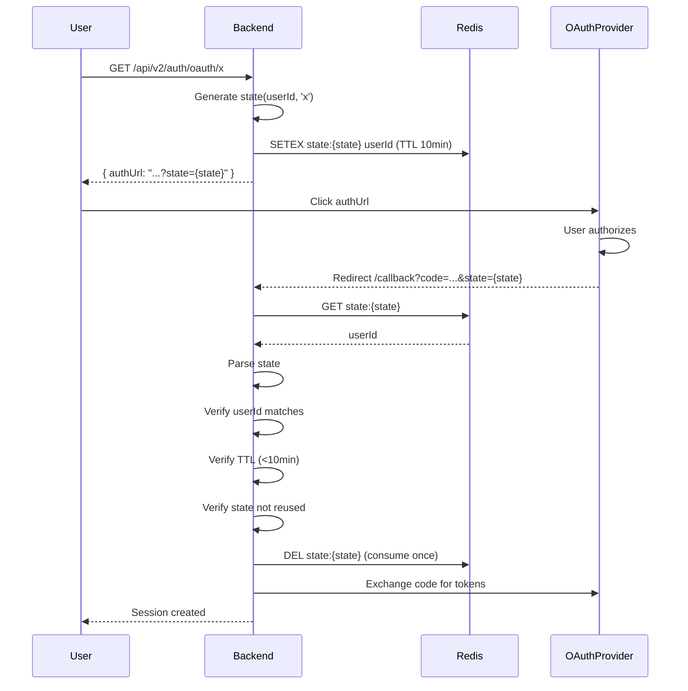

# Auth - Security

**Subnodo:** `auth/security`  
**Última actualización:** 2025-12-26  
**Owner:** ROA-364

---

## 📋 Propósito

Este subnodo documenta las características de seguridad del sistema de autenticación de Roastr v2.

**Áreas cubiertas:**

1. **JWT Validation:** Verificación de tokens en endpoints protegidos
2. **State Parameter Security:** OAuth flow protection
3. **Request Sanitization:** Prevención de injection attacks
4. **Error Message Security:** User enumeration prevention
5. **RLS Enforcement:** Database-level access control
6. **Token Rotation:** Refresh token best practices

---

## 🔐 1. JWT Validation

### Middleware: authenticateToken

**Ubicación:** Aplicado a TODOS los endpoints protegidos

**Workflow:**

```typescript
function authenticateToken(req, res, next) {
  const token = extractToken(req); // From Authorization header
  
  if (!token) {
    return res.status(401).json({
      success: false,
      error: {
        code: 'TOKEN_MISSING',
        message: 'Access token required',
        statusCode: 401
      }
    });
  }
  
  try {
    // Verificar firma + expiration
    const decoded = jwt.verify(token, process.env.JWT_SECRET);
    
    // Validar claims requeridos
    if (!decoded.sub || !decoded.email) {
      throw new Error('Invalid token structure');
    }
    
    // Añadir user a request para uso en endpoints
    req.user = {
      id: decoded.sub,
      email: decoded.email,
      name: decoded.name,
      plan: decoded.plan,
      is_admin: decoded.is_admin || false
    };
    
    next();
  } catch (error) {
    if (error.name === 'TokenExpiredError') {
      return res.status(401).json({
        success: false,
        error: {
          code: 'TOKEN_EXPIRED',
          message: 'Your session has expired. Please log in again.',
          statusCode: 401
        }
      });
    }
    
    if (error.name === 'JsonWebTokenError') {
      return res.status(403).json({
        success: false,
        error: {
          code: 'TOKEN_INVALID',
          message: 'Invalid authentication token',
          statusCode: 403
        }
      });
    }
    
    // Error genérico
    return res.status(500).json({
      success: false,
      error: {
        code: 'INTERNAL_ERROR',
        message: 'Authentication error',
        statusCode: 500
      }
    });
  }
}
```

### Token Extraction

```typescript
function extractToken(req: Request): string | null {
  const authHeader = req.headers.authorization;
  
  if (!authHeader) {
    return null;
  }
  
  // Formato esperado: "Bearer <token>"
  const parts = authHeader.split(' ');
  
  if (parts.length !== 2 || parts[0] !== 'Bearer') {
    return null;
  }
  
  return parts[1];
}
```

### JWT Claims Validation

**Claims obligatorios:**

```typescript
interface RequiredJWTClaims {
  sub: string;              // userId (UUID)
  email: string;
  iat: number;              // Issued at
  exp: number;              // Expiration
  aud: 'authenticated';
  iss: 'https://roastr.ai';
}
```

**Validación adicional:**

```typescript
function validateClaims(decoded: any): boolean {
  // Verificar audience
  if (decoded.aud !== 'authenticated') {
    throw new Error('Invalid audience');
  }
  
  // Verificar issuer
  if (decoded.iss !== 'https://roastr.ai') {
    throw new Error('Invalid issuer');
  }
  
  // Verificar expiration (jwt.verify ya lo hace, pero doble check)
  if (decoded.exp * 1000 < Date.now()) {
    throw new Error('Token expired');
  }
  
  return true;
}
```

---

## 🔗 2. OAuth State Parameter Security

### Propósito

El **state parameter** previene:

- **CSRF attacks:** Atacante no puede iniciar OAuth sin conocer state
- **Replay attacks:** State tiene TTL de 10 minutos
- **Session fixation:** State vinculado a userId específico

### Generación de State

```typescript
function generateState(userId: string, platform: 'x' | 'youtube'): string {
  const timestamp = Date.now().toString();
  const random = crypto.randomBytes(16).toString('hex'); // 128 bits entropy
  const payload = `${userId}:${platform}:${timestamp}:${random}`;
  
  // Base64url encoding (safe para URLs)
  return Buffer.from(payload).toString('base64url');
}
```

**Ejemplo output:**

```
dXNlci0xMjM6eDoxNzAzMDAwMDAwOmFiY2RlZjEyMzQ1Njc4OTA=
```

### Validación de State

```typescript
function parseState(state: string): StatePayload {
  try {
    // Decode base64url
    const payload = Buffer.from(state, 'base64url').toString('utf8');
    const [userId, platform, timestamp, random] = payload.split(':');
    
    // Validar formato
    if (!userId || !platform || !timestamp || !random) {
      throw new AuthError('STATE_INVALID', 'Malformed state parameter');
    }
    
    // Validar TTL (10 minutos)
    const age = Date.now() - parseInt(timestamp);
    const maxAge = 10 * 60 * 1000; // 10 minutos
    
    if (age > maxAge) {
      throw new AuthError('STATE_EXPIRED', 'State parameter expired');
    }
    
    if (age < 0) {
      throw new AuthError('STATE_INVALID', 'Future timestamp not allowed');
    }
    
    return {
      userId,
      platform: platform as 'x' | 'youtube',
      timestamp: parseInt(timestamp),
      random
    };
  } catch (error) {
    if (error instanceof AuthError) {
      throw error;
    }
    throw new AuthError('STATE_INVALID', 'Invalid state parameter');
  }
}
```

### Flujo Completo con State



### State Storage (Redis)

```typescript
// Almacenar state temporalmente
await redis.setex(
  `oauth:state:${state}`,
  600, // 10 minutos TTL
  userId
);

// Validar y consumir (una sola vez)
const storedUserId = await redis.get(`oauth:state:${state}`);

if (!storedUserId) {
  throw new AuthError('STATE_INVALID', 'State parameter not found or already used');
}

// Eliminar inmediatamente (no reusar)
await redis.del(`oauth:state:${state}`);
```

---

## 🛡️ 3. Request Sanitization

### Platform Parameter (OAuth)

```typescript
function sanitizePlatform(platform: string): 'x' | 'youtube' {
  if (!platform || typeof platform !== 'string') {
    throw new Error('Platform parameter is required');
  }

  // Solo caracteres alfanuméricos y guiones
  const sanitized = platform.toLowerCase().replace(/[^a-z0-9_-]/g, '');

  // Whitelist de platforms soportados
  const SUPPORTED_PLATFORMS = ['x', 'youtube'];
  
  if (!SUPPORTED_PLATFORMS.includes(sanitized)) {
    throw new Error(`Unsupported platform: ${sanitized}`);
  }

  return sanitized as 'x' | 'youtube';
}
```

### Email Sanitization

```typescript
function sanitizeEmail(email: string): string {
  if (!email || typeof email !== 'string') {
    throw new Error('Email is required');
  }

  // Trim whitespace
  let sanitized = email.trim().toLowerCase();

  // Remove control characters
  sanitized = sanitized.replace(/[\x00-\x1F\x7F]/g, '');

  // Validar formato básico
  const emailRegex = /^[^\s@]+@[^\s@]+\.[^\s@]+$/;
  if (!emailRegex.test(sanitized)) {
    throw new Error('Invalid email format');
  }

  // Length check (RFC 5321: max 254 chars)
  if (sanitized.length > 254) {
    throw new Error('Email too long');
  }

  return sanitized;
}
```

### Password Sanitization

```typescript
function validatePassword(password: string): void {
  if (!password || typeof password !== 'string') {
    throw new Error('Password is required');
  }

  // Min length (enforced por Supabase también)
  if (password.length < 8) {
    throw new Error('Password must be at least 8 characters');
  }

  // Max length (prevenir DoS con passwords gigantes)
  if (password.length > 128) {
    throw new Error('Password too long (max 128 characters)');
  }

  // NO sanitizar password (preservar caracteres especiales)
  // Supabase hace bcrypt, no hay riesgo de injection
}
```

### SQL Injection Prevention

**✅ CORRECTO:** Usar parameterized queries

```typescript
// Supabase client automáticamente parametriza
const { data } = await supabase
  .from('users')
  .select('*')
  .eq('email', userEmail); // Parámetro, no concatenación

// Prisma también parametriza automáticamente
const user = await prisma.user.findUnique({
  where: { email: userEmail }
});
```

**❌ INCORRECTO:** Concatenación directa

```typescript
// NUNCA hacer esto
const query = `SELECT * FROM users WHERE email = '${userEmail}'`;
```

---

## 🚫 4. Error Message Security (User Enumeration Prevention)

### Problema

Atacante puede determinar si un email existe basándose en mensajes de error diferentes.

### Solución: Mensajes Genéricos

#### Login

```typescript
// ✅ CORRECTO: Mismo mensaje para ambos casos
try {
  const user = await findUserByEmail(email);
  
  if (!user) {
    throw new AuthError('AUTH_INVALID_CREDENTIALS', 'Invalid email or password');
  }
  
  const passwordMatch = await bcrypt.compare(password, user.hashedPassword);
  
  if (!passwordMatch) {
    throw new AuthError('AUTH_INVALID_CREDENTIALS', 'Invalid email or password');
  }
  
  return createSession(user);
} catch (error) {
  // Mismo error, sin revelar qué falló
  throw new AuthError('AUTH_INVALID_CREDENTIALS', 'Invalid email or password');
}

// ❌ INCORRECTO: Mensajes diferentes
if (!user) {
  throw new Error('Email not found'); // Revela que email no existe
}
if (!passwordMatch) {
  throw new Error('Wrong password'); // Revela que email SÍ existe
}
```

#### Password Reset

```typescript
// ✅ CORRECTO: Siempre responde con éxito
async function sendPasswordReset(email: string): Promise<void> {
  const user = await findUserByEmail(email);
  
  if (user) {
    // Usuario existe → enviar email
    await sendResetEmail(user.email);
  }
  
  // NO revelar si usuario existe o no
  // Siempre retornar éxito
}

// Response al cliente (siempre):
{
  "success": true,
  "message": "If an account exists, we sent a password reset link to your email."
}

// ❌ INCORRECTO: Respuesta diferente según existencia
if (!user) {
  return { success: false, error: 'Email not found' }; // Revela que no existe
}
```

#### Signup

```typescript
// ✅ ACEPTABLE: Revelar email duplicado en signup
try {
  await createUser(email, password);
} catch (error) {
  if (error.code === 'EMAIL_ALREADY_EXISTS') {
    throw new AuthError(
      'ACCOUNT_EMAIL_ALREADY_EXISTS',
      'An account with this email already exists'
    );
  }
}

// Es aceptable porque:
// 1. Necesario para UX (usuario debe saber que ya tiene cuenta)
// 2. Atacante puede verificar existencia intentando signup de cualquier forma
```

### Timing Attacks Mitigation

```typescript
async function validateCredentials(email: string, password: string): Promise<boolean> {
  const startTime = Date.now();
  let valid = false;
  
  try {
    const user = await findUserByEmail(email);
    
    if (user) {
      valid = await bcrypt.compare(password, user.hashedPassword);
    } else {
      // Ejecutar bcrypt con hash dummy para mantener timing constante
      await bcrypt.compare(password, '$2b$10$dummyhashXXXXXXXXXXXXXXXX');
    }
    
    return valid;
  } finally {
    // Asegurar tiempo mínimo constante (100ms)
    const elapsed = Date.now() - startTime;
    const minTime = 100;
    
    if (elapsed < minTime) {
      await sleep(minTime - elapsed);
    }
  }
}
```

---

## 🗃️ 5. RLS (Row Level Security) Enforcement

### Propósito

**Row Level Security (RLS)** asegura que:

- Usuarios solo pueden acceder a SUS propios datos
- Organizaciones solo pueden acceder a SUS propias cuentas
- Admins tienen acceso completo (pero auditado)

### RLS Policies (Supabase/PostgreSQL)

#### Users Table

```sql
-- Política: Usuarios solo ven su propia fila
CREATE POLICY user_isolation ON users
FOR ALL
USING (id = auth.uid());

-- Admins pueden ver todos los usuarios
CREATE POLICY admin_access ON users
FOR ALL
TO authenticated
USING (
  EXISTS (
    SELECT 1 FROM users
    WHERE id = auth.uid()
    AND is_admin = true
  )
);
```

#### Organizations Table

```sql
-- Política: Solo el owner ve su organización
CREATE POLICY org_owner_access ON organizations
FOR ALL
USING (owner_id = auth.uid());

-- Admins pueden ver todas las organizaciones
CREATE POLICY org_admin_access ON organizations
FOR ALL
TO authenticated
USING (
  EXISTS (
    SELECT 1 FROM users
    WHERE id = auth.uid()
    AND is_admin = true
  )
);
```

#### Integration Configs Table

```sql
-- Política: Solo usuarios de la org acceden a configs
CREATE POLICY integration_org_access ON integration_configs
FOR ALL
USING (
  organization_id IN (
    SELECT id FROM organizations
    WHERE owner_id = auth.uid()
  )
);
```

### Backend Enforcement

```typescript
// El userId viene del JWT verificado
app.get('/api/v2/accounts', authenticateToken, async (req, res) => {
  const userId = req.user.id; // Extraído del JWT
  
  // Supabase automáticamente aplica RLS policies
  const { data: accounts } = await supabase
    .from('organizations')
    .select('*')
    .eq('owner_id', userId); // RLS ya filtra, pero explicit es mejor
  
  res.json({ accounts });
});

// ❌ INCORRECTO: Confiar en parámetro del cliente
app.get('/api/v2/accounts', async (req, res) => {
  const userId = req.query.userId; // ⚠️ Peligroso! Cliente controla esto
  
  const { data: accounts } = await supabase
    .from('organizations')
    .select('*')
    .eq('owner_id', userId); // Atacante puede cambiar userId en query
  
  res.json({ accounts });
});
```

### Admin Bypass (Auditado)

```typescript
// Admins pueden bypass RLS, pero se audita
app.get('/api/v2/admin/accounts', authenticateToken, requireAdmin, async (req, res) => {
  const adminId = req.user.id;
  
  // Log de acceso admin
  await logAdminAction({
    adminId,
    action: 'LIST_ALL_ACCOUNTS',
    timestamp: Date.now(),
    ip: req.ip
  });
  
  // Usar service role key para bypass RLS
  const { data: accounts } = await supabaseAdmin
    .from('organizations')
    .select('*'); // Sin filtros, RLS no aplica con service role
  
  res.json({ accounts });
});
```

---

## 🔄 6. Token Rotation Best Practices

### Automatic Refresh Token Rotation

**Supabase automáticamente rota refresh tokens:**

```typescript
// Cada refresh devuelve NUEVO refresh_token
const { data, error } = await supabase.auth.refreshSession({ refreshToken });

// data.session contiene:
// - access_token (nuevo)
// - refresh_token (NUEVO, el viejo ya no es válido)
```

**Frontend debe actualizar ambos tokens:**

```typescript
api.interceptors.response.use((response) => {
  const newAccessToken = response.headers['x-new-access-token'];
  const newRefreshToken = response.headers['x-new-refresh-token'];
  
  if (newAccessToken && newRefreshToken) {
    // Actualizar AMBOS tokens
    localStorage.setItem('access_token', newAccessToken);
    localStorage.setItem('refresh_token', newRefreshToken);
    
    // ⚠️ NO reusar refresh_token viejo
  }
  
  return response;
});
```

### Refresh Token Revocation

**Cuándo revocar refresh tokens:**

1. **User logout:** Revocar inmediatamente
2. **Password change:** Revocar todos los tokens existentes
3. **Suspicious activity:** Revocar + forzar relogin
4. **Admin suspension:** Revocar todos los tokens

```typescript
// Logout: Revocar refresh token
async function logout(userId: string): Promise<void> {
  await supabase.auth.admin.signOut(userId);
  
  // Supabase automáticamente revoca refresh_token
  // Access tokens siguen válidos hasta expiration (1h max)
}

// Password reset: Revocar TODO
async function resetPassword(userId: string, newPassword: string): Promise<void> {
  // Cambiar password
  await supabase.auth.admin.updateUserById(userId, { password: newPassword });
  
  // Revocar TODAS las sesiones
  await supabase.auth.admin.signOut(userId);
  
  // Usuario debe relogin con nuevo password
}
```

---

## 🔒 7. Additional Security Measures

### CORS Configuration

```typescript
import cors from 'cors';

app.use(cors({
  origin: process.env.FRONTEND_URL, // Solo frontend autorizado
  credentials: true,                // Permitir cookies/auth headers
  exposedHeaders: [
    'X-New-Access-Token',
    'X-New-Refresh-Token',
    'X-Token-Refreshed'
  ],
  methods: ['GET', 'POST', 'PUT', 'DELETE'],
  allowedHeaders: [
    'Content-Type',
    'Authorization',
    'X-Refresh-Token'
  ]
}));
```

### CSP (Content Security Policy)

```typescript
import helmet from 'helmet';

app.use(helmet({
  contentSecurityPolicy: {
    directives: {
      defaultSrc: ["'self'"],
      scriptSrc: ["'self'", "'unsafe-inline'"], // Solo si necesario
      styleSrc: ["'self'", "'unsafe-inline'"],
      imgSrc: ["'self'", 'data:', 'https:'],
      connectSrc: ["'self'", process.env.API_URL],
      fontSrc: ["'self'"],
      objectSrc: ["'none'"],
      mediaSrc: ["'self'"],
      frameSrc: ["'none'"]
    }
  }
}));
```

### HTTPS Only (Producción)

```typescript
// Force HTTPS in production
if (process.env.NODE_ENV === 'production') {
  app.use((req, res, next) => {
    if (req.header('x-forwarded-proto') !== 'https') {
      res.redirect(`https://${req.header('host')}${req.url}`);
    } else {
      next();
    }
  });
}
```

### Secure Headers

```typescript
app.use(helmet({
  hsts: {
    maxAge: 31536000, // 1 año
    includeSubDomains: true,
    preload: true
  },
  frameguard: { action: 'deny' },
  xssFilter: true,
  noSniff: true,
  ieNoOpen: true
}));
```

---

## 📊 Security Monitoring

### Logs de Seguridad

```typescript
interface SecurityLog {
  timestamp: ISO8601;
  event: 'login_success' | 'login_failure' | 'rate_limit_block' | 'token_expired' | 'suspicious_activity';
  userId?: string;
  ip: string;
  userAgent: string;
  errorCode?: AuthErrorCode;
  details?: any;
}
```

### Alertas Críticas

**Trigger alerta inmediata si:**

1. **Permanent block activado** (4ta+ infracción rate limit)
2. **Admin account compromised** (sospecha de acceso no autorizado)
3. **Burst attack detectado** (10+ intentos en 1 min)
4. **Mass token revocation** (múltiples usuarios afectados)

---

## 📚 Referencias

### SSOT v2

- **Sección 10.1:** GDPR Retention (datos a borrar al eliminar cuenta)
- **Sección 11.2:** Environment Variables (JWT_SECRET, CORS config)
- **Sección 12.4:** Rate Limiting (prevención de brute force)

### Related Subnodos

- [login-flows.md](./login-flows.md) - Donde se aplican estas medidas
- [session-management.md](./session-management.md) - JWT validation, token rotation
- [rate-limiting.md](./rate-limiting.md) - Brute force prevention
- [error-taxonomy.md](./error-taxonomy.md) - User enumeration prevention

### Implementación

- **authenticateToken:** `apps/backend-v2/src/middleware/auth.ts` (TBD)
- **OAuth State:** `apps/backend-v2/src/services/oauthService.ts` (TBD)
- **Sanitization:** `apps/backend-v2/src/utils/sanitize.ts` (TBD)

---

**Última actualización:** 2025-12-26  
**Owner:** ROA-364  
**Status:** ✅ Active

