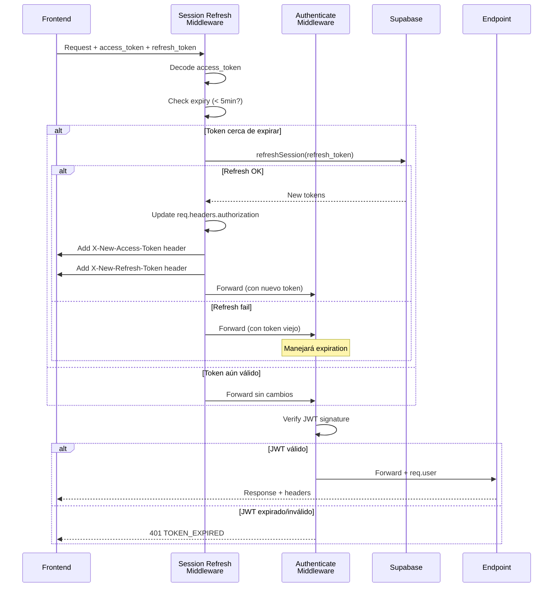
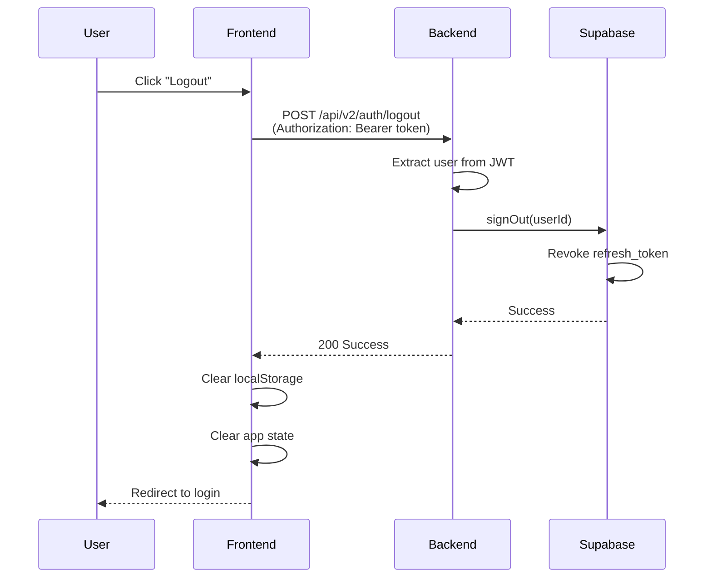

# Auth - Session Management

**Subnodo:** `auth/session-management`  
**Última actualización:** 2025-12-26  
**Owner:** ROA-364

---

## 📋 Propósito

Este subnodo documenta la gestión completa de sesiones en Roastr v2:

1. **Estructura de tokens:** access_token + refresh_token
2. **Expiration policies:** 1h access, 7d refresh
3. **Automatic refresh:** Middleware transparente
4. **Sliding expiration:** Usuarios activos mantienen sesión
5. **Session revocation:** Logout y limpieza

---

## 🎫 Estructura de Tokens

### Access Token (JWT)

**TTL:** 1 hora

**Payload:**

```typescript
interface AccessTokenPayload {
  sub: string;              // userId (UUID)
  email: string;
  name?: string;
  plan: 'starter' | 'pro' | 'plus';
  is_admin: boolean;
  iat: number;              // Issued at (Unix timestamp)
  exp: number;              // Expiration (Unix timestamp)
  aud: 'authenticated';
  iss: 'https://roastr.ai';
}
```

**Uso:**
- Enviado en **todas** las requests a endpoints protegidos
- Header: `Authorization: Bearer {access_token}`
- Verificado por middleware `authenticateToken`

### Refresh Token (Opaque)

**TTL:** 7 días (configurable en Supabase)

**Características:**
- Opaque token (no JWT, manejado por Supabase)
- Solo válido para endpoint `/auth/refresh`
- Revocado automáticamente al hacer logout
- Rotación automática: cada refresh genera nuevo refresh_token

**Uso:**
- Enviado solo cuando access_token está próximo a expirar
- Header: `X-Refresh-Token: {refresh_token}`
- Manejado por middleware `sessionRefreshMiddleware`

---

## 🔄 Automatic Refresh Flow

### Middleware: sessionRefreshMiddleware

**Ubicación:** Antes de todos los endpoints protegidos

**Lógica:**

```typescript
async function sessionRefreshMiddleware(req, res, next) {
  const accessToken = extractToken(req); // From Authorization header
  const refreshToken = req.headers['x-refresh-token'];
  
  if (!accessToken) {
    return next(); // Sin token, dejar que authenticateToken maneje
  }
  
  try {
    const decoded = jwt.decode(accessToken, { complete: true });
    const expiresAt = decoded.payload.exp * 1000; // Convert to ms
    const now = Date.now();
    const timeUntilExpiry = expiresAt - now;
    const threshold = 5 * 60 * 1000; // 5 minutos
    
    if (timeUntilExpiry < threshold && refreshToken) {
      // Token cerca de expirar, intentar refresh
      const newSession = await refreshSession(refreshToken);
      
      // Enviar nuevos tokens via headers
      res.set({
        'X-New-Access-Token': newSession.access_token,
        'X-New-Refresh-Token': newSession.refresh_token,
        'X-Token-Refreshed': 'true'
      });
      
      // Actualizar req para usar nuevo token
      req.headers.authorization = `Bearer ${newSession.access_token}`;
    }
    
    next();
  } catch (error) {
    // Si falla, dejar que authenticateToken maneje
    next();
  }
}
```

### Secuencia Completa



### Frontend Handling

```typescript
// Interceptor de respuestas
api.interceptors.response.use((response) => {
  // Detectar nuevos tokens en headers
  const newAccessToken = response.headers['x-new-access-token'];
  const newRefreshToken = response.headers['x-new-refresh-token'];
  
  if (newAccessToken && newRefreshToken) {
    // Actualizar localStorage
    localStorage.setItem('access_token', newAccessToken);
    localStorage.setItem('refresh_token', newRefreshToken);
    
    console.log('[Session] Tokens refreshed automatically');
  }
  
  return response;
});
```

---

## ⏱️ Sliding Expiration

### Concepto

**Sliding expiration:** Usuarios activos mantienen su sesión sin relogin.

- Cada request API resetea el "countdown" de expiration
- Access token se renueva automáticamente mientras usuario esté activo
- Refresh token también se renueva (rotación automática)

### Comportamiento por Actividad

| Escenario                      | access_token | refresh_token | Resultado                         |
| ------------------------------ | ------------ | ------------- | --------------------------------- |
| Usuario activo (< 5min expiry)| Renovado     | Renovado      | Sesión continúa sin interrupción  |
| Usuario inactivo (> 1h)        | Expirado     | Válido        | Próximo request renueva tokens    |
| Usuario inactivo (> 7d)        | Expirado     | Expirado      | Requiere relogin                  |

### Inactivity Timeout

**Configuración:**

```typescript
const INACTIVITY_TIMEOUT = 7 * 24 * 60 * 60 * 1000; // 7 días
```

- Después de 7 días sin actividad → refresh_token expira
- Usuario debe hacer login nuevamente
- No hay prolongación automática del refresh_token

---

## 🔐 Session Security

### Token Storage

#### Frontend (localStorage)

```typescript
// Almacenar tokens
localStorage.setItem('access_token', session.access_token);
localStorage.setItem('refresh_token', session.refresh_token);

// Leer tokens
const accessToken = localStorage.getItem('access_token');
const refreshToken = localStorage.getItem('refresh_token');

// Limpiar tokens (logout)
localStorage.removeItem('access_token');
localStorage.removeItem('refresh_token');
```

**⚠️ Security Considerations:**

- localStorage vulnerable a XSS
- Mitigación: CSP headers, sanitización de inputs
- Alternativa futura: httpOnly cookies (requiere cambio arquitectónico)

#### Backend (Supabase)

- Refresh tokens almacenados en Supabase Auth
- Hasheados y asociados a user_id
- Revocados automáticamente al logout
- Limpieza automática de tokens expirados

### JWT Validation Middleware

```typescript
function authenticateToken(req, res, next) {
  const token = extractToken(req); // From Authorization header
  
  if (!token) {
    return res.status(401).json({
      success: false,
      error: {
        code: 'TOKEN_MISSING',
        message: 'Access token required',
        statusCode: 401
      }
    });
  }
  
  try {
    const decoded = jwt.verify(token, process.env.JWT_SECRET);
    req.user = decoded; // Add user to request
    next();
  } catch (error) {
    if (error.name === 'TokenExpiredError') {
      return res.status(401).json({
        success: false,
        error: {
          code: 'TOKEN_EXPIRED',
          message: 'Your session has expired. Please log in again.',
          statusCode: 401
        }
      });
    }
    
    return res.status(403).json({
      success: false,
      error: {
        code: 'TOKEN_INVALID',
        message: 'Invalid authentication token',
        statusCode: 403
      }
    });
  }
}
```

---

## 🚪 Logout & Session Revocation

### Endpoint

```http
POST /api/v2/auth/logout
Authorization: Bearer {access_token}
```

### Request

```typescript
// No body required, user extracted from JWT
```

### Response (Success)

```json
{
  "success": true,
  "message": "Logged out successfully"
}
```

### Flujo Completo



### Frontend Cleanup

```typescript
async function logout() {
  try {
    // Call backend logout endpoint
    await fetch('/api/v2/auth/logout', {
      method: 'POST',
      headers: {
        'Authorization': `Bearer ${localStorage.getItem('access_token')}`
      }
    });
  } catch (error) {
    console.error('[Session] Logout error:', error);
    // Continue cleanup anyway
  } finally {
    // Always clear local state
    localStorage.removeItem('access_token');
    localStorage.removeItem('refresh_token');
    
    // Clear app state
    setUser(null);
    setSession(null);
    
    // Redirect to login
    navigate('/login');
  }
}
```

### Session Revocation Scenarios

| Escenario                   | Trigger                      | Comportamiento                            |
| --------------------------- | ---------------------------- | ----------------------------------------- |
| **User logout**             | User clicks logout           | Revoke refresh_token, clear localStorage  |
| **Admin suspension**        | Admin suspends account       | Revoke all tokens, block new logins       |
| **Password reset**          | User resets password         | Revoke all existing sessions              |
| **Security breach**         | Suspicious activity detected | Revoke all tokens, force reauth           |
| **Token expiration**        | refresh_token expires (7d)   | Require relogin                           |

---

## 🔄 Manual Refresh Endpoint

### Endpoint

```http
POST /api/v2/auth/session/refresh
Content-Type: application/json

{
  "refresh_token": "user-refresh-token"
}
```

### Request Schema

```typescript
interface RefreshRequest {
  refresh_token: string;  // Valid refresh token
}
```

### Response (Success)

```json
{
  "success": true,
  "data": {
    "access_token": "new-jwt-token",
    "refresh_token": "new-refresh-token",
    "expires_at": 1703000000,
    "expires_in": 3600,
    "user": {
      "id": "uuid-v4",
      "email": "user@example.com",
      "name": "John Doe",
      "plan": "starter"
    }
  }
}
```

### Response (Error)

```json
{
  "success": false,
  "error": {
    "code": "TOKEN_INVALID",
    "message": "Invalid or expired refresh token",
    "statusCode": 401
  }
}
```

### Use Case

**Manual refresh es útil para:**

- Frontend detect token expiration antes de request
- Recovery de sesión al recargar página
- Testing y debugging

**⚠️ Middleware automático es preferido:**
- Transparente para el usuario
- Menos llamadas API explícitas
- Mejor UX (sin interrupciones)

---

## 📊 Session Monitoring

### Logs Mínimos (Por Evento de Sesión)

```typescript
{
  timestamp: ISO8601,
  event: 'session_created' | 'session_refreshed' | 'session_revoked',
  userId: string,
  ip: string,
  user_agent: string,
  access_token_exp: number,   // Unix timestamp
  refresh_token_exp: number,  // Unix timestamp
  auto_refresh: boolean       // true si fue por middleware
}
```

**⚠️ Datos sensibles NO se loguean:**
- Tokens completos (solo últimos 4 caracteres)
- Passwords
- Refresh tokens completos

### Health Check

```bash
# Verificar estado de sesión
GET /api/v2/auth/me
Authorization: Bearer {access_token}

# Response esperado:
{
  "success": true,
  "data": {
    "user": {
      "id": "uuid-v4",
      "email": "user@example.com",
      "name": "John Doe",
      "plan": "starter",
      "is_admin": false
    },
    "session": {
      "expires_at": 1703000000,
      "expires_in": 2400,
      "near_expiry": false
    }
  }
}
```

---

## 🛠️ Configuración

### Environment Variables

```bash
# JWT Configuration
JWT_SECRET=your-jwt-secret-here

# Session Settings
SESSION_EXPIRY_HOURS=1            # Access token TTL (default: 1h)
SESSION_REFRESH_DAYS=7            # Refresh token TTL (default: 7d)
SESSION_REFRESH_THRESHOLD_MIN=5   # Auto-refresh threshold (default: 5min)

# Feature Flags
ENABLE_SESSION_REFRESH=true       # Enable automatic refresh
DEBUG_SESSION=false               # Debug logging
```

### Frontend Configuration

```bash
# React Environment Variables
REACT_APP_ENABLE_SESSION_REFRESH=true
REACT_APP_SESSION_CHECK_INTERVAL=60000  # Check every 60s
REACT_APP_DEBUG_SESSION=false
```

---

## 🔗 Integración con Otros Nodos

### billing-engine

**Verificación de suscripción en cada request:**

```typescript
async function checkSubscriptionStatus(userId: string): Promise<SubscriptionStatus> {
  const subscription = await billingEngine.getSubscription(userId);
  
  if (subscription.status === 'paused') {
    throw new AuthError(
      'SUBSCRIPTION_REQUIRED',
      'Your subscription is paused. Please reactivate to continue.'
    );
  }
  
  return subscription;
}
```

**Estados que bloquean sesión:**
- `paused`: Plan pausado, requiere reactivación
- `expired_trial_pending_payment`: Trial expirado, esperando pago

Ver [billing-engine node](../billing-engine/overview.md) para detalles.

### workers

**AccountDeletion worker (GDPR):**

```typescript
// Cuando usuario solicita eliminar cuenta
await queueWorker('AccountDeletion', {
  userId,
  scheduledFor: Date.now() + (90 * 24 * 60 * 60 * 1000) // 90 días
});

// Worker revoca todas las sesiones inmediatamente
await supabase.auth.admin.signOut(userId);
```

Ver [workers node](../workers/overview.md) para detalles.

---

## 📚 Referencias

### SSOT v2

- **Sección 2.1:** Billing v2 - Estados de suscripción
- **Sección 10.1:** GDPR Retention (90 días antes de purga)
- **Sección 11.2:** Environment Variables

### Related Subnodos

- [login-flows.md](./login-flows.md) - Cómo se crean las sesiones
- [rate-limiting.md](./rate-limiting.md) - Rate limiting no aplica a refresh automático
- [error-taxonomy.md](./error-taxonomy.md) - SESSION_*, TOKEN_* error codes
- [security.md](./security.md) - JWT validation, token rotation

### Implementación

- **Session Middleware:** `apps/backend-v2/src/middleware/sessionRefresh.ts` (TBD)
- **Auth Service:** `apps/backend-v2/src/services/authService.ts` (TBD)
- **Frontend Hook:** `apps/frontend/src/hooks/useAuth.ts` (TBD)

### Documentación Legacy (Referencia)

- `AUTH_GUIDE.md` - Secciones "Session Management", "Token Refresh"

---

**Última actualización:** 2025-12-26  
**Owner:** ROA-364  
**Status:** ✅ Active

