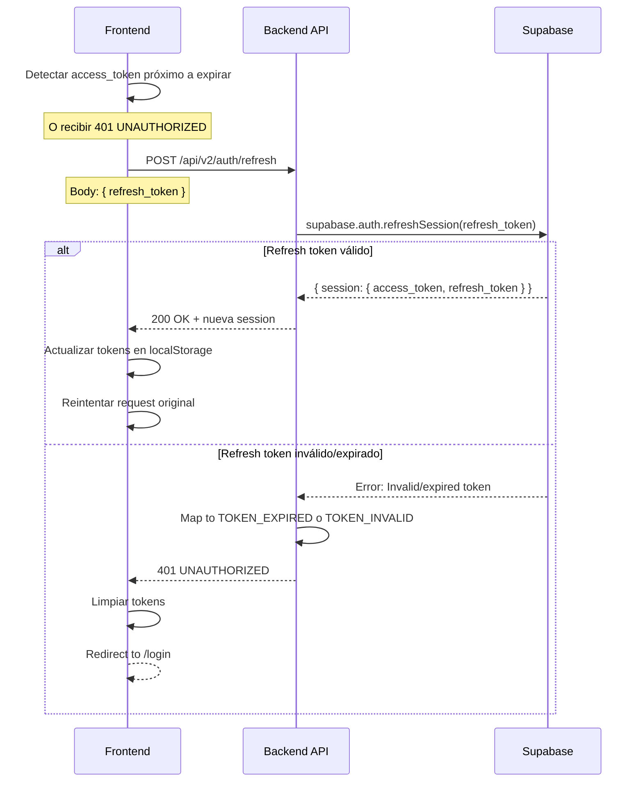
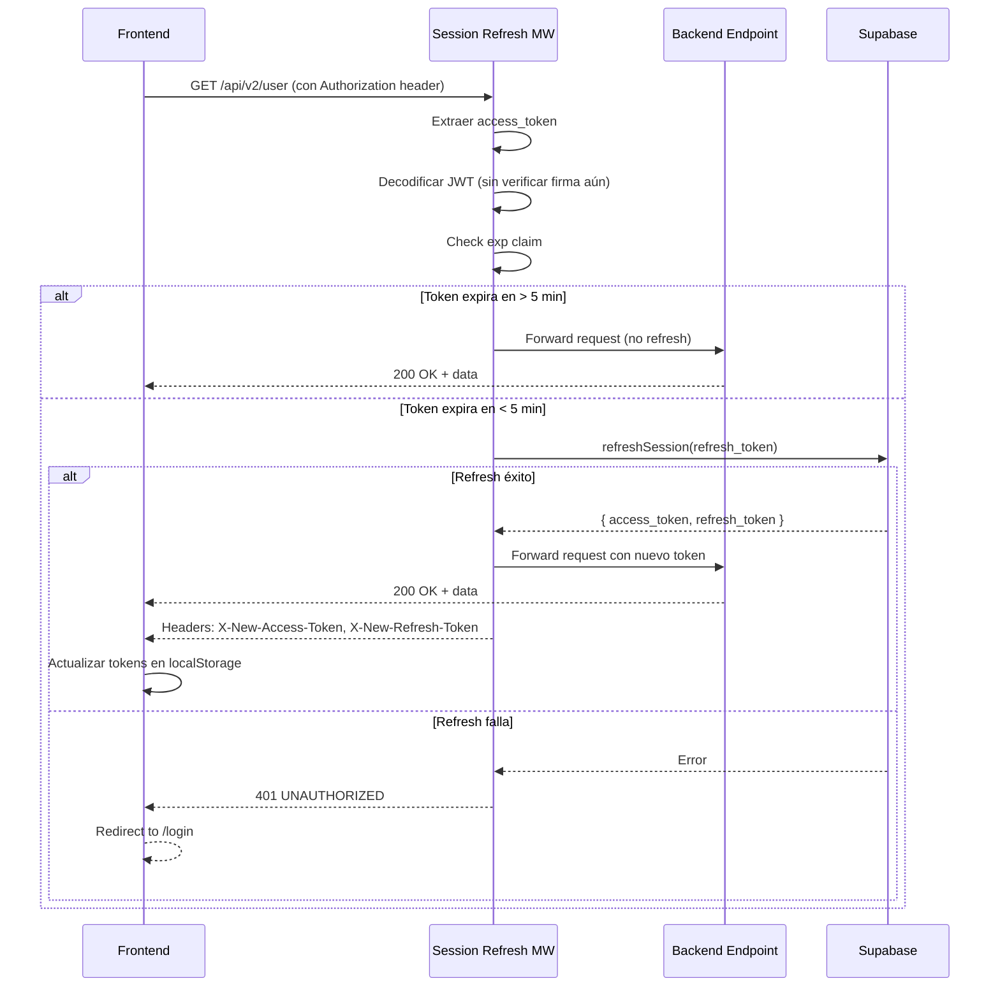
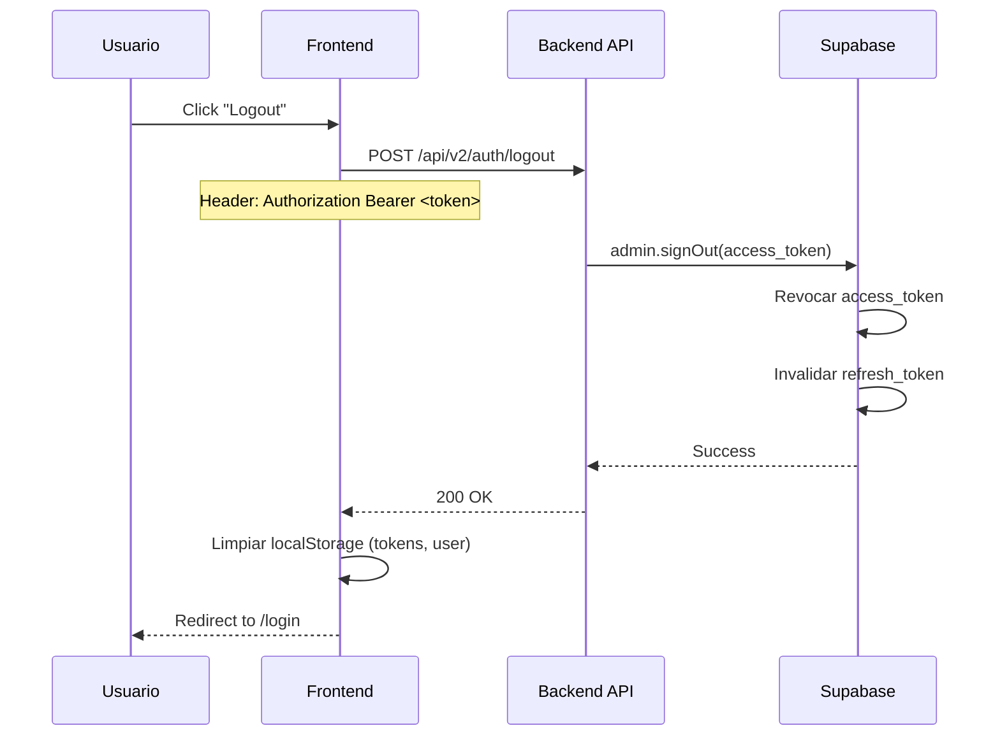

# Auth - Session Management

**Subnodo de:** `auth`  
**Última actualización:** 2026-01-01  
**Owner:** ROA-403

---

## 📋 Propósito

Define la gestión de sesiones JWT en Roastr v2:
- Emisión de tokens (access + refresh)
- Refresh automático (manual vía endpoint)
- Sliding expiration  
- Revocación (logout)

---

## 🎫 Tokens JWT

### Access Token

**Características:**
- **Emisor:** Supabase Auth
- **Duración:** 1 hora (3600 segundos)
- **Storage:** Frontend localStorage
- **Uso:** Header `Authorization: Bearer <access_token>`

**Claims (payload):**
```typescript
{
  sub: string;         // User ID (UUID)
  email: string;
  role: string;        // "user" | "admin" | "superadmin"
  aud: "authenticated";
  exp: number;         // Unix timestamp expiración
  iat: number;         // Unix timestamp emisión
  ...
}
```

**Validación:** Middleware `requireAuth` en backend verifica firma y expiración.

### Refresh Token

**Características:**
- **Emisor:** Supabase Auth
- **Duración:** 7 días (604800 segundos)
- **Storage:** Frontend localStorage (⚠️ seguro solo en dominios HTTPS)
- **Uso:** Endpoint `POST /api/v2/auth/refresh`

**Propósito:** Obtener nuevo access_token sin re-autenticarse.

**⚠️ Security Note:** 
- Refresh token es single-use en Supabase (cada refresh genera nuevo par de tokens)
- Si refresh token expira → usuario debe hacer login nuevamente

---

## 🔄 Token Refresh Flow

### Manual Refresh (Implementado)

**Endpoint:**
```
POST /api/v2/auth/refresh
```

**Request:**
```typescript
{
  refresh_token: string;  // Refresh token actual
}
```

**Response (Success):**
```typescript
{
  session: {
    access_token: string;      // Nuevo JWT
    refresh_token: string;     // Nuevo refresh token
    expires_in: number;        // 3600 (1h)
    expires_at: number;        // Unix timestamp
    token_type: "bearer";
    user: {
      id: string;
      email: string;
      role: "user" | "admin" | "superadmin";
      email_verified: boolean;
      created_at: string;
      metadata: Record<string, any>;
    }
  },
  message: "Token refreshed successfully"
}
```

**Response (Error):**
```typescript
{
  success: false,
  error: {
    slug: "TOKEN_EXPIRED" | "TOKEN_INVALID",
    retryable: false
  },
  request_id: string
}
```

**Flujo:**



**Implementación:**
- **Service:** `authService.refreshSession()` (líneas 491-537)
- **Route:** `POST /api/v2/auth/refresh` (líneas 294-314)

### Automatic Refresh (✅ IMPLEMENTADO)

**✅ Implementación completa:** Middleware `sessionRefresh.ts` implementado.

**Funcionalidad:**
- Detecta tokens expirados automáticamente
- Renueva con `refresh_token` si disponible
- Adjunta nueva sesión al request context
- Fail-open: continúa si falla (deja que requireAuth maneje)

**Flujo propuesto:**



**Ubicación esperada:**
- `apps/backend-v2/src/middleware/sessionRefresh.ts`

**Integración esperada (Express):**
```typescript
app.use('/api/v2', sessionRefresh); // ANTES de rutas protegidas
app.use('/api/v2', requireAuth);     // Después de sessionRefresh
```

**Prioridad:** 🔴 P0 si UX requiere sliding expiration automática

---

## 🛡️ Token Validation

### Middleware `requireAuth`

**Ubicación:** `apps/backend-v2/src/middleware/auth.ts`

**Flujo:**

```typescript
export async function requireAuth(req: Request, res: Response, next: NextFunction) {
  try {
    // 1. Extraer token del header Authorization
    const authHeader = req.headers.authorization;
    
    if (!authHeader || !authHeader.startsWith('Bearer ')) {
      throw new AuthError(AUTH_ERROR_CODES.TOKEN_MISSING);
    }
    
    const token = authHeader.substring(7); // Remove 'Bearer '
    
    // 2. Verificar token con Supabase
    const user = await authService.getCurrentUser(token);
    
    // 3. Adjuntar usuario a request
    req.user = {
      id: user.id,
      email: user.email,
      role: user.role,
      email_verified: user.email_verified
    };
    
    next();
  } catch (error) {
    return sendAuthError(req, res, error, { log: { policy: 'require_auth' } });
  }
}
```

**Validaciones internas (Supabase):**
- ✅ Firma JWT válida
- ✅ Token no expirado (exp claim)
- ✅ Token no revocado
- ✅ Usuario existe y está activo

**Errores posibles:**
- `TOKEN_MISSING` (401) - No header Authorization
- `TOKEN_INVALID` (401) - Firma inválida o formato incorrecto
- `TOKEN_EXPIRED` (401) - Token expirado
- `TOKEN_REVOKED` (401) - Token revocado (logout)

### Middleware `requireRole`

**Uso:** RBAC (Role-Based Access Control)

**Ejemplo:**
```typescript
router.get('/admin/users', 
  requireAuth, 
  requireRole('admin', 'superadmin'), 
  getUsersHandler
);
```

**Flujo:**
```typescript
export function requireRole(...allowedRoles: Array<'user' | 'admin' | 'superadmin'>) {
  return (req: Request, res: Response, next: NextFunction): void => {
    if (!req.user) {
      return sendAuthError(req, res, new AuthError(AUTH_ERROR_CODES.TOKEN_MISSING));
    }
    
    if (!allowedRoles.includes(req.user.role)) {
      return sendAuthError(req, res, new AuthError(AUTH_ERROR_CODES.ROLE_NOT_ALLOWED));
    }
    
    next();
  };
}
```

**Errores posibles:**
- `TOKEN_MISSING` (401) - No autenticado
- `AUTHZ_ROLE_NOT_ALLOWED` (403) - Role no permitido
- `AUTHZ_INSUFFICIENT_PERMISSIONS` (403) - Permisos insuficientes

---

## 🔐 Logout (Revocación)

### Endpoint

```
POST /api/v2/auth/logout
```

**Autenticación requerida:** ✅ (middleware `requireAuth`)

**Request:**
```
Headers:
  Authorization: Bearer <access_token>
```

**Response (Success):**
```typescript
{
  message: "Logout successful"
}
```

### Flujo Completo



**Implementación:**
- **Service:** `authService.logout()` (líneas 469-486)
- **Route:** `POST /api/v2/auth/logout` (líneas 274-288)

**Comportamiento:**
- ✅ Revoca access_token en Supabase (invalida JWT)
- ✅ Invalida refresh_token (no se puede usar para refresh)
- ✅ Frontend limpia localStorage
- ⚠️ Sessions existentes en otros dispositivos NO se revocan (limitación Supabase)

---

## 📊 Session Lifecycle

### Timeline

```
┌───────────────────────────────────────────────────────────┐
│ Session Lifecycle (1 sesión activa)                       │
└───────────────────────────────────────────────────────────┘

Login/Register (t=0)
│
├─ Access Token emitido (válido 1h)
├─ Refresh Token emitido (válido 7 días)
│
└─► Usuario activo (t=0 → t=55min)
    │
    ├─ Access Token próximo a expirar (t=55min)
    │  └─► Frontend detecta → POST /api/v2/auth/refresh
    │      ├─ Nuevo Access Token (válido 1h)
    │      └─ Nuevo Refresh Token (válido 7 días)
    │
    └─► Usuario activo (t=55min → t=1h50min)
        │
        └─ Repite refresh cada ~55min
            └─► Sliding expiration: sesión se mantiene activa

Usuario inactivo > 7 días
│
└─► Refresh Token expira
    └─► Próximo intento → TOKEN_EXPIRED
        └─► Redirect to /login
```

### Estados de Token

| Estado | Access Token | Refresh Token | Acción Frontend |
|--------|--------------|---------------|-----------------|
| **Activo** | Válido | Válido | Usar access_token normalmente |
| **Próximo a expirar** | Expira < 5min | Válido | Refrescar tokens |
| **Access expirado** | Expirado | Válido | Refrescar tokens |
| **Ambos expirados** | Expirado | Expirado | Redirect to /login |
| **Revocado** | Revocado | Revocado | Redirect to /login |

---

## 🔄 Sliding Expiration

**Concepto:** Usuarios activos mantienen su sesión indefinidamente (sin re-login).

**Implementación actual:** ⚠️ **MANUAL**
- Frontend debe detectar token próximo a expirar
- Frontend llama manualmente a `/api/v2/auth/refresh`
- Frontend actualiza tokens en localStorage

**Implementación ideal:** ✅ **AUTOMÁTICA** (con sessionRefresh middleware)
- Middleware detecta token próximo a expirar
- Middleware refresca automáticamente
- Frontend recibe nuevos tokens vía headers transparentes
- **Ventaja:** UX mejorada, menos lógica en frontend

**Gap:** Middleware `sessionRefresh.ts` NO existe (ver [Gap 1 en análisis](#)).

---

## 🛡️ Security Considerations

### Storage

**✅ Recomendado:**
- **localStorage** (Frontend) - Solo en HTTPS
- **httpOnly cookies** (alternativa más segura) - ⚠️ No implementado

**❌ Evitar:**
- sessionStorage (se pierde al cerrar pestaña)
- Cookies sin httpOnly (vulnerable a XSS)

### Token Rotation

**Supabase behavior:**
- Cada refresh genera **nuevo par de tokens**
- Refresh token anterior se invalida (single-use)
- **Ventaja:** Mitiga robo de refresh token

### Revocation

**Limitación Supabase:**
- `admin.signOut(access_token)` revoca tokens del servidor
- **NO revoca sesiones en otros dispositivos** (limitación de Supabase Auth)
- Para revocación multi-device → implementar session tracking custom

**Workaround (futuro):**
- Tabla `active_sessions` en DB
- Middleware verifica si session_id está activa
- Logout revoca todas las sessions del usuario

---

## 📚 Referencias

- **Implementación (Service):** `apps/backend-v2/src/services/authService.ts`
- **Middleware:** `apps/backend-v2/src/middleware/auth.ts`
- **Routes:** `apps/backend-v2/src/routes/auth.ts`
- **Supabase Auth:** [Docs oficiales](https://supabase.com/docs/guides/auth/server-side/oauth)
- **JWT:** [RFC 7519](https://datatracker.ietf.org/doc/html/rfc7519)

---

**Última actualización:** 2026-01-01  
**Owner:** ROA-403  
**Status:** ⚠️ Active (sessionRefresh middleware pending)
