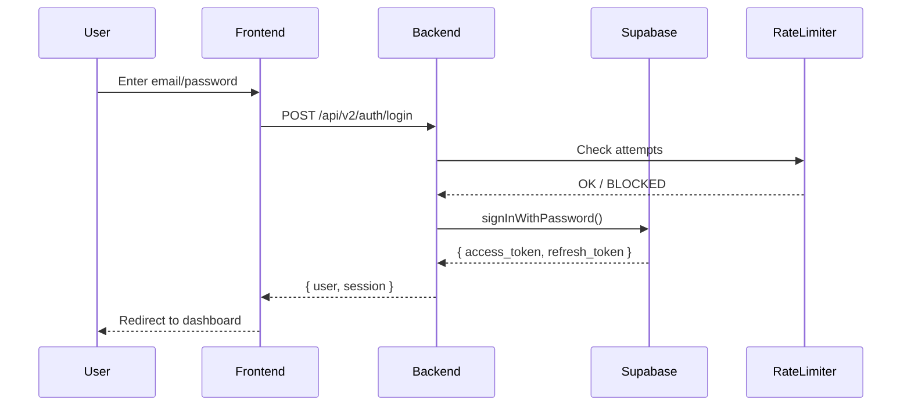
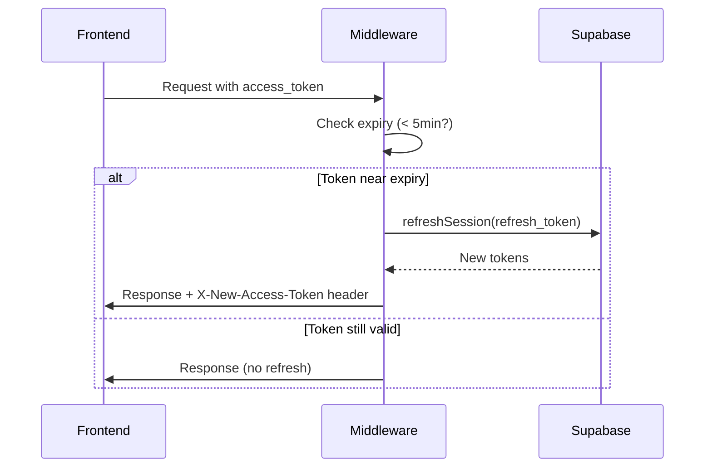

# Plan de Implementación: ROA-364 - B5: Login Documentation v2

**Issue:** ROA-364  
**Título:** B5: Login Documentation v2  
**Prioridad:** P2  
**Tipo:** Documentación  
**Fecha:** 2025-12-26

---

## Estado Actual

### Documentación Existente

Actualmente tenemos la siguiente documentación legacy sobre autenticación:

1. **AUTH_GUIDE.md** - Guía completa pero legacy (menciona features no v2, estructura v1)
2. **AUTH_SYSTEM.md** - Descripción del sistema pero formato legacy
3. **AUTH.md** - Información mixta
4. **authErrorTaxonomy.ts** - Taxonomía de errores actualizada a v2 (ROA-372)

### Gaps Detectados

❌ **Falta documentación v2 estructurada** que:
- Siga el patrón de `docs/nodes-v2/` y `system-map-v2.yaml`
- Esté alineada con SSOT-V2.md (sección 12.4 - Rate Limiting ROA-359)
- Integre la taxonomía de errores v2 (ROA-372)
- Documente el flujo completo de autenticación multi-método
- Incluya diagramas de flujo y secuencia

❌ **Documentación legacy mezclada con v2:**
- Referencias a planes legacy (free, basic, creator_plus)
- Endpoints y estructura no alineados con backend-v2
- Falta integración con Polar (billing v2)
- No documenta rate limiting v2 (ROA-359)

---

## Objetivos

### 1. Crear Documentación v2 Estructurada

**Archivos a crear:**

```
docs/nodes-v2/auth/
├── overview.md           # Arquitectura general, componentes, decisiones
├── login-flows.md        # Flujos de login (password, magic-link, OAuth)
├── session-management.md # Gestión de sesiones, refresh, expiration
├── rate-limiting.md      # Rate limiting v2 (ROA-359)
├── error-taxonomy.md     # Taxonomía de errores (ROA-372)
└── security.md           # Security features, best practices
```

### 2. Actualizar system-map-v2.yaml

Añadir nodo `auth` con subnodos y dependencias:

```yaml
nodes:
  auth:
    id: auth
    description: Sistema de autenticación multi-método con Supabase
    subnodes:
      - overview
      - login-flows
      - session-management
      - rate-limiting
      - error-taxonomy
      - security
    depends_on:
      - billing-engine  # Para verificar estado de suscripción
      - workers         # Para AccountDeletion (GDPR)
    required_by:
      - admin-dashboard
      - frontend-dashboard
```

### 3. Alinear con SSOT-V2

Asegurar que toda la documentación referencia valores de SSOT v2:

- **Sección 12.4:** Rate Limiting Configuration (ROA-359)
- **Sección 12.5:** Abuse Detection Thresholds
- **Sección 2.1:** Billing v2 - Polar (para validación de planes)
- **Sección 10.1:** GDPR Retention (para AccountDeletion worker)

### 4. Diagramas y Flujos

Crear diagramas mermaid para:

- Flujo de login password
- Flujo de magic link
- Flujo de OAuth
- Flujo de session refresh
- Rate limiting workflow
- Error handling workflow

---

## Pasos de Implementación

### Paso 1: Crear Estructura de Nodo v2

1. Crear directorio `docs/nodes-v2/auth/`
2. Crear `overview.md` con:
   - Arquitectura general (Supabase + Express + Redis)
   - Decisiones clave (JWT, sliding expiration, multi-tenant RLS)
   - Componentes del sistema
   - Referencias a SSOT v2

### Paso 2: Documentar Flujos de Login

Crear `login-flows.md` con:

- **Password Login:**
  - Endpoint: `POST /api/v2/auth/login`
  - Request/Response schemas
  - Rate limiting aplicado (referencia a SSOT 12.4)
  - Error codes (referencia a authErrorTaxonomy.ts)
  
- **Magic Link:**
  - Endpoint: `POST /api/v2/auth/magic-link`
  - Flujo completo (envío → click → validación)
  - Rate limiting (3 intentos/hora según SSOT 12.4)
  
- **OAuth (X, YouTube):**
  - Endpoints de inicio y callback
  - State parameter validation
  - Rate limiting (10 intentos/15min según SSOT 12.4)

### Paso 3: Session Management

Crear `session-management.md` con:

- Token structure (access + refresh)
- Expiration policies (1h access, 7d refresh)
- Automatic refresh middleware
- Sliding expiration logic
- Session revocation
- Referencias a security.md

### Paso 4: Rate Limiting v2

Crear `rate-limiting.md` con:

- **Configuración oficial** (copiada de SSOT 12.4):
  - Password: 5 attempts / 15min
  - Magic Link: 3 attempts / 1h
  - OAuth: 10 attempts / 15min
  - Password Reset: 3 attempts / 1h
  
- **Bloqueo progresivo:**
  - 1ra infracción: 15min
  - 2da infracción: 1h
  - 3ra infracción: 24h
  - 4ta+ infracción: Permanente (manual)

- **Abuse Detection Thresholds** (SSOT 12.5):
  - multi_ip: 3
  - multi_email: 5
  - burst: 10
  - slow_attack: 20

- **Storage:**
  - Producción: Redis/Upstash
  - Fallback: Memoria (dev/test)

- **Feature Flags:**
  - ENABLE_AUTH_RATE_LIMIT_V2
  - ENABLE_RATE_LIMIT

### Paso 5: Error Taxonomy

Crear `error-taxonomy.md` con:

- Categorías completas (AUTH_*, AUTHZ_*, SESSION_*, TOKEN_*, ACCOUNT_*)
- Mapeo de errores Supabase → AuthError
- Códigos HTTP asociados
- Retryability logic
- User-facing messages (sin enumeration)

### Paso 6: Security Documentation

Crear `security.md` con:

- JWT validation
- State parameter security (OAuth)
- Request sanitization
- Error message security (no user enumeration)
- CORS policies
- RLS enforcement
- Token rotation policies

### Paso 7: Actualizar system-map-v2.yaml

Añadir nodo `auth` con:

```yaml
nodes:
  auth:
    id: auth
    description: Authentication system (Supabase-based, multi-method)
    subnodes:
      - overview
      - login-flows
      - session-management
      - rate-limiting
      - error-taxonomy
      - security
    depends_on:
      - billing-engine  # Verifica estado de plan/suscripción
      - workers         # AccountDeletion worker (GDPR)
    required_by:
      - admin-dashboard    # Usa auth para proteger rutas admin
      - frontend-dashboard # Usa auth para login/session
      - roasting-engine    # Necesita userId para multi-tenancy
      - shield-engine      # Necesita userId para multi-tenancy
    strong_concepts:
      - authErrorTaxonomy  # Dueño único de la taxonomía de errores
      - rateLimitConfig    # Dueño único de configuración rate limiting
    soft_concepts:
      - session-management # Compartido con frontend
      - jwt-validation     # Usado por todos los servicios backend
```

### Paso 8: Migrar Contenido Legacy

Extraer contenido relevante de:

- AUTH_GUIDE.md → login-flows.md, session-management.md
- AUTH_SYSTEM.md → overview.md, security.md
- authErrorTaxonomy.ts → error-taxonomy.md (ya en código, documentar uso)

**NO copiar:**
- Planes legacy (free, basic, creator_plus)
- Endpoints v1
- Configuraciones deprecated

### Paso 9: Crear Diagramas

En cada archivo `.md`, añadir diagramas mermaid:

**login-flows.md:**


**session-management.md:**


### Paso 10: Validaciones

Ejecutar:

```bash
# Validar estructura v2
node scripts/validate-v2-doc-paths.js --ci

# Validar alineación con SSOT
node scripts/validate-ssot-health.js --ci

# Validar no hay drift
node scripts/check-system-map-drift.js --ci

# Validar Strong Concepts no duplicados
node scripts/validate-strong-concepts.js --ci
```

---

## Agentes Involucrados

### Primary: DocumentationAgent (Manual - Cursor Composer)

**Triggers:**
- type:docs
- Cambios en `docs/nodes-v2/auth/`

**Workflow:**
1. Usar Composer → @docs/SSOT-V2.md @apps/backend-v2/src/utils/authErrorTaxonomy.ts
2. Crear archivos siguiendo estructura v2
3. Añadir diagramas mermaid
4. Validar con scripts

### Guardian (Validación)

**Triggers:**
- Cambios en `docs/nodes-v2/` (área crítica)
- Actualización de `system-map-v2.yaml`

**Workflow:**
```bash
node scripts/guardian-gdd.js --full
```

### Validation (Pre-Commit)

**Scripts obligatorios:**
- `validate-v2-doc-paths.js --ci`
- `validate-ssot-health.js --ci`
- `check-system-map-drift.js --ci`
- `validate-strong-concepts.js --ci`

---

## Archivos Afectados

### Nuevos Archivos

```
docs/nodes-v2/auth/overview.md
docs/nodes-v2/auth/login-flows.md
docs/nodes-v2/auth/session-management.md
docs/nodes-v2/auth/rate-limiting.md
docs/nodes-v2/auth/error-taxonomy.md
docs/nodes-v2/auth/security.md
```

### Archivos Modificados

```
docs/system-map-v2.yaml   # Añadir nodo auth
```

### Archivos Legacy (NO TOCAR)

```
AUTH_GUIDE.md        # Mantener como referencia histórica
AUTH_SYSTEM.md       # Mantener como referencia histórica
AUTH.md              # Mantener como referencia histórica
```

---

## Validación

### Checklist Pre-Commit

- [ ] Todos los archivos en `docs/nodes-v2/auth/` existen
- [ ] `system-map-v2.yaml` tiene nodo `auth` con subnodos
- [ ] Ninguna referencia a planes legacy (free, basic, creator_plus)
- [ ] Todos los valores de rate limiting vienen de SSOT v2 (sección 12.4)
- [ ] Diagramas mermaid renderizan correctamente
- [ ] Strong Concepts listados correctamente (authErrorTaxonomy, rateLimitConfig)
- [ ] Dependencias correctas: billing-engine, workers
- [ ] `validate-v2-doc-paths.js --ci` pasa
- [ ] `validate-ssot-health.js --ci` pasa
- [ ] `check-system-map-drift.js --ci` pasa
- [ ] `validate-strong-concepts.js --ci` pasa

### Criterios de Éxito

✅ **Documentación v2 completa** - 6 archivos en `docs/nodes-v2/auth/`  
✅ **Alineación con SSOT** - Valores de rate limiting (12.4), billing (2.1), GDPR (10.1)  
✅ **System-map actualizado** - Nodo auth con dependencias correctas  
✅ **Diagramas claros** - Flujos de login, session, rate limiting  
✅ **No contenido legacy** - Sin referencias a v1  
✅ **Strong Concepts respetados** - authErrorTaxonomy, rateLimitConfig  
✅ **Validaciones pasando** - Todos los scripts CI en verde  

---

## Notas Adicionales

### Dependencia con Otras Issues

- **ROA-359:** Rate Limiting v2 (ya implementado, documentar aquí)
- **ROA-372:** Auth Error Taxonomy (ya implementado, documentar aquí)

### Scope Out (NO incluir)

❌ OAuth providers adicionales (Google, GitHub) - No en v2 MVP  
❌ 2FA - No en v2 MVP  
❌ Account recovery avanzado - Solo password reset básico  
❌ Advanced user roles - Solo admin/user  

### Referencias Obligatorias

- **SSOT v2:** Sección 12.4 (Rate Limiting), 12.5 (Abuse Detection)
- **authErrorTaxonomy.ts:** `apps/backend-v2/src/utils/authErrorTaxonomy.ts`
- **system-map-v2.yaml:** Nodo auth con subnodos
- **AUTH_GUIDE.md:** Referencia histórica (NO copiar todo)

---

**Última actualización:** 2025-12-26  
**Estado:** Planning completo - Listo para implementación

