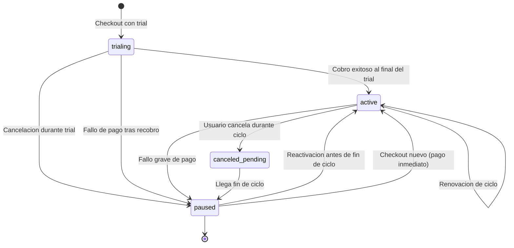
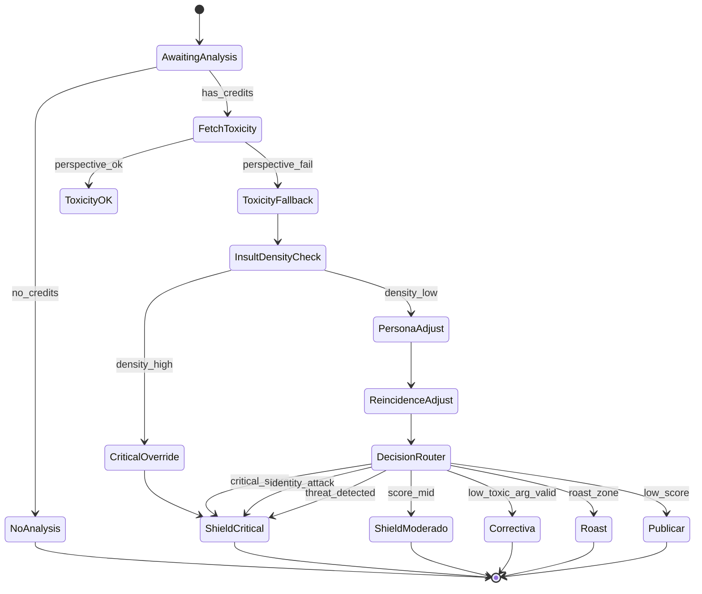
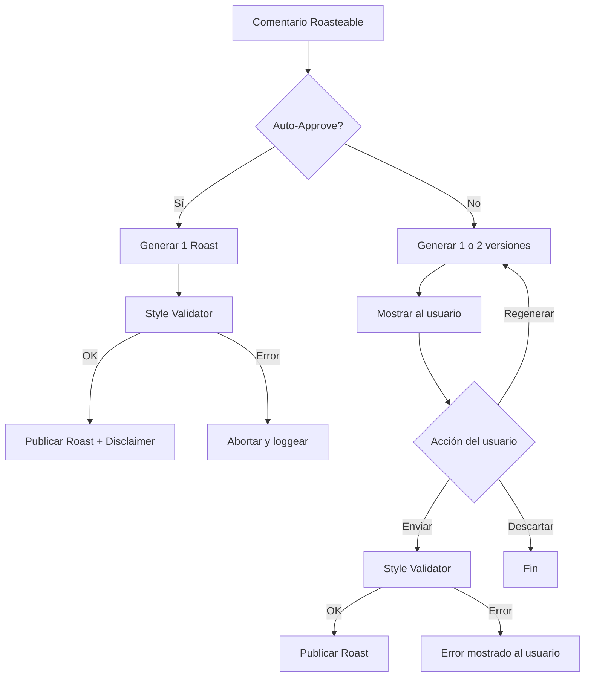
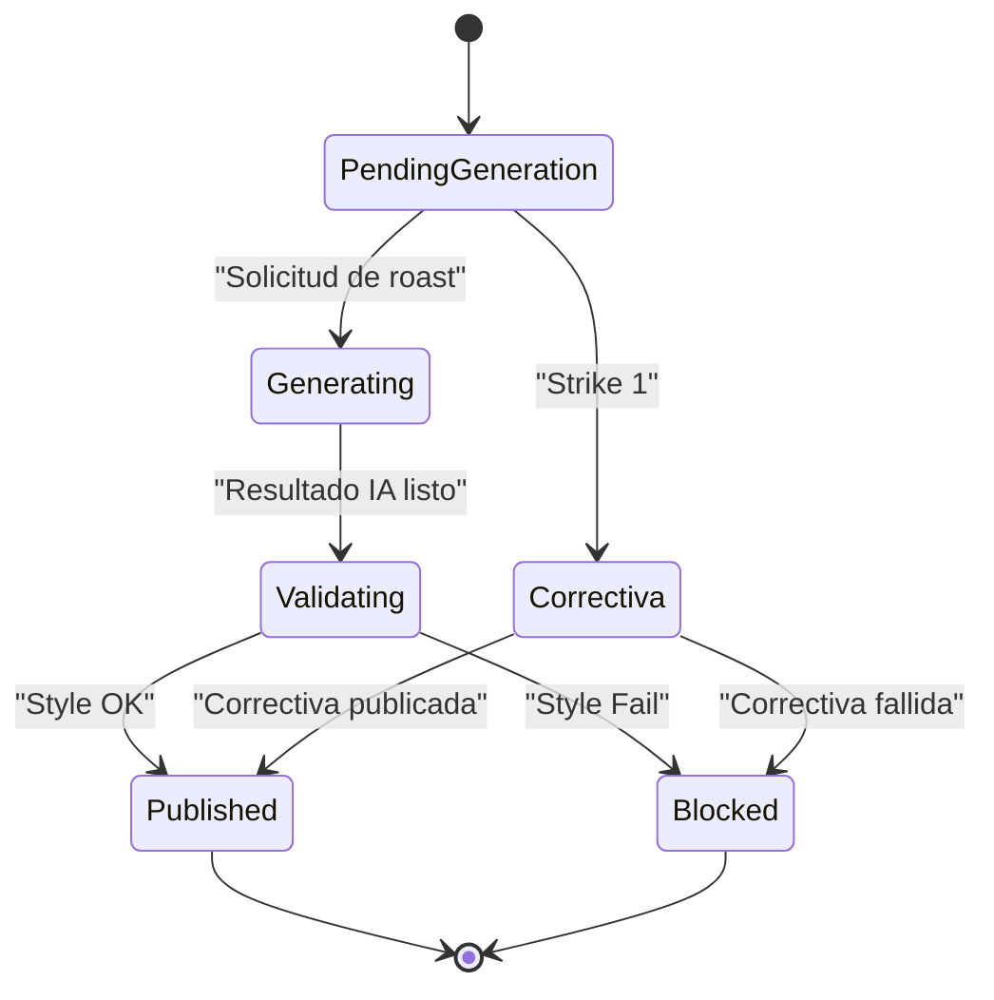
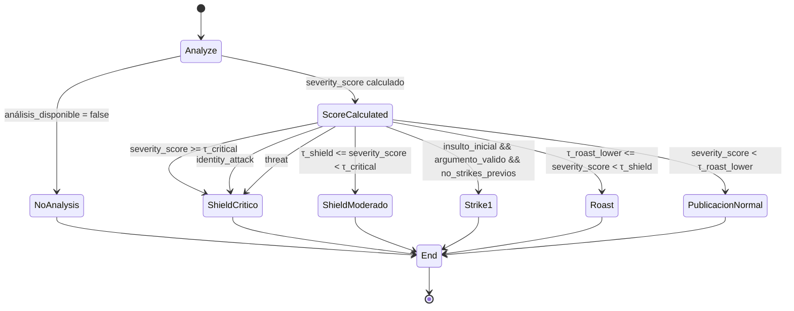
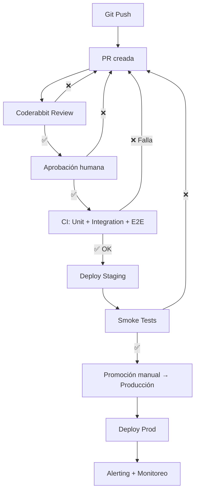

# Single doc

**0. Introducción — Spec File v2 de Roastr**

# **0. Introducción — Spec File v2 de Roastr**

---

# **0.1 Propósito del documento**

Este documento define **el comportamiento funcional, técnico, de seguridad y de infraestructura de Roastr v2**.

Es la **fuente de verdad narrativa**, desde la que se derivan:

- los **GDD Nodes** para Cursor,
- las **issues de desarrollo**,
- los **tests**,
- la **arquitectura hexagonal** de backend,
- la **arquitectura modular** de frontend,
- los **pipelines de workers**,
- todos los límites, flujos, estados y edge cases del sistema.

**Este documento NO es el SSOT.**

El SSOT vive en:

- admin_settings
- plan_settings
- shield_settings
- tone_settings
- loaders del backend

Aquí se describe **qué hace**, no **dónde viven los valores exactos**.

---

# **0.2 Filosofía de Roastr v2**

Roastr v2 se construye sobre cuatro principios esenciales:

---

## **1. Protección real**

El sistema protege contra:

- abuso
- ataques personales
- amenazas
- difamación
- sarcasmo malicioso
- acoso continuado (reincidencia)

Los mecanismos son:

- explicables
- auditables
- proporcionados
- configurables por usuario
- sin efectos ocultos

---

## **2. Humor seguro, afilado y configurable**

Los roasts:

- son ingeniosos
- respetan la legalidad
- nunca cruzan ataques identitarios
- respetan el tono seleccionado
- respetan el estilo personal del usuario
- se someten al **Style Validator**
- adaptan longitud, contexto y emojis

---

## **3. Arquitectura clara, modular y escalable**

- backend hexagonal
- frontend con jerarquía clara (UI → App → Domain → Infra)
- workers desacoplados
- configuración desde SSOT
- prompts cacheados en bloques A/B/C
- tests realistas (sin mock hell)
- dominio puro independiente de IO

---

## **4. Sostenibilidad económica**

Cada acción:

- tiene coste medible
- queda trazada
- está limitada por plan y por SSOT
- usa caching
- minimiza llamadas a IA
- respeta cuotas externas (X/YouTube/Perspective)

---

# **0.3 Alcance del Spec File v2**

Este Spec incluye:

- autenticación
- billing v2 (Polar)
- UI v2 completa
- motor de análisis
- motor de roasting
- Shield
- workers
- infraestructura
- GDPR/legal
- testing
- feature flags
- admin panel

Quedan fuera del MVP (documentado pero no implementado ahora):

- integraciones adicionales (Instagram, Facebook, TikTok…)
- shop
- embedded judge
- enterprise/teams
- modo NSFW
- A/B testing interno
- reentrenamientos automáticos avanzados

---

# **0.4 Diferencias clave respecto a v1**

---

## **1. V1 era opaco → V2 es explicable**

V1 mezclaba:

- lógica
- prompts
- workers
- settings
- hooks
- side-effects

V2 separa completamente dominios y flujos.

---

## **2. V1 era hardcoded → V2 usa SSOT**

Todos los valores configurables están en:

- admin_settings
- plan_settings
- shield_settings
- tone_settings

Sin valores mágicos en código.

---

## **3. V1 generaba prompts caóticos → V2 usa bloques A/B/C cacheados**

- 50–70% ahorro
- coherencia
- eliminamos fuga de datos sensibles

---

## **4. V1 no tenía análisis serio → V2 sí**

Incluye:

- ataque a identidad
- amenazas
- densidad de insultos
- líneas rojas
- reincidencia
- thresholds configurables
- tono personal separado de tonos predefinidos

---

## **5. V1 tenía tests zombies → V2 testea solo lo importante**

- dominios
- integración real con DB
- workers
- E2E con Playwright
- behaviors, no mocks sin sentido

---

# **0.5 Términos importantes**

- **Roastr Persona:** sensibilidades encriptadas.
- **Shield:** sistema antitroll.
- **Reincidencia:** strikes ≤90 días.
- **Roast:** respuesta generada por IA.
- **Correctiva:** mensaje institucional, no humorístico.
- **Tono personal:** estilo derivado del usuario (solo Pro/Plus).
- **SSOT:** configuración única del sistema.
- **Worker:** proceso asíncrono que ejecuta ingestión, análisis, roasts y posting.
- **Auto-approve:** publicación automática.
- **Style Validator:** reglas para asegurar que un roast no cruza líneas.

---

# **0.6 Qué NO es este documento**

- No es un manual de implementación.
- No contiene código ni prompts exactos.
- No contiene valores concretos.
- No describe infra sensible.
- No contiene env vars.
- No sustituye el SSOT.

Es **la narrativa única e inmutable de cómo funciona Roastr v2**.

---

# **0.7 Agents & Skills (v2) — Versión Extendida e Integrada**

> Objetivo:

> Establecer claramente cómo Agents y Skills de Cursor
>
> **pueden**
>
> **no pueden**

---

# **0.7.1 Propósito del sistema de Agents**

Los Agents actúan como:

- automatizadores
- asistentes inteligentes
- revisores de calidad
- generadores de código o tests
- ejecutores de workflows repetitivos

NO sustituyen:

- decisiones arquitectónicas
- seguridad
- aprobaciones humanas
- gobernanza del SSOT
- diseño funcional

Son **delegados**, no **dueños** del proceso.

---

# **0.7.2 Clasificación de Agents**

## **A) Built-in Agents (7)**

### **1.**

### **Orchestrator**

- Planifica workflows.
- Despacha agents.
- Hace FASE 0 assessment obligatorio.
- Nunca mergea sin aprobación humana.

### **2.**

### **Explore**

- Investiga el codebase.
- Lee dependencias.
- Localiza archivos relacionados.

### **3.**

### **TaskAssessor**

- Desglosa tareas.
- Prioriza.
- Verifica criterios de aceptación.

### **4.**

### **TestEngineer**

- Genera tests.
- Verifica cobertura.
- Exige evidencia antes del merge.

### **5.**

### **FrontendDev**

- Crea componentes.
- Aplica shadcn/ui.
- Respeta accesibilidad.

### **6.**

### **UIDesigner**

- Proporciona diseños UI.
- Lineamientos responsivos.

### **7.**

### **WhimsyInjector**

- Añade microcopy
- **Prohibido** en módulos legales/billing/shield/admin.

---

## **B) Custom Agents**

### **1.**

### **Guardian**

- Valida Spec v2.
- Bloquea cambios ilegales.
- Aplica reglas anti-slop.
- Exige consistencia con SSOT.

### **2.**

### **general-purpose**

- Investigación multi-step compleja.

---

# **0.7.3 Reglas de Autonomía**

Los Agents:

### **Pueden:**

- refactorizar
- crear componentes
- generar tests
- ejecutar skills
- proponer cambios en nodos

### **No pueden:**

- tocar SSOT
- tocar env vars
- crear o modificar settings sensibles
- desactivar RLS
- saltarse Guardian
- aprobar PRs sin evidencia
- ignorar tests críticos

---

# **0.7.4 Skills (versión completa)**

20 skills agrupadas en:

### **1. Skills Core**

- test-generation
- gdd-sync
- security-audit
- visual-validation
- writing-plans
- completion-verification

### **2. Skills Avanzadas**

- systematic-debugging
- root-cause-tracing
- tdd-enforcement
- parallel-dispatch
- git-worktrees
- finishing-branch
- request-review
- receive-review

### **3. Skills Especializadas**

- api-integration-debugging
- code-review
- cost-control-validation
- multi-tenant-context
- prompt-injection-defense
- spec-update

---

# **0.7.5 Triggers automáticos**

- cambios en src/
- cambios en tests/
- palabras clave (“GDD”, “test”, “security”)
- etiquetas de issue
- commits que modifican UI → visual validation
- commits que modifican billing → cost-control-validation
- commits que modifican SSOT → Guardian obligatorio

---

# **0.7.6 Guardrails críticos**

### **FASE 0 obligatorio**

Antes de tocar código.

### **Anti-AI-Slop**

Basado en las reglas que compartiste:

Los Agents deben eliminar:

- comentarios innecesarios
- defensas redundantes
- casts a any
- bloques try/catch inútiles
- incoherencias de estilo

### **Evidencia antes del merge**

Nada se considera “completo” sin:

- tests
- capturas (UI)
- diffs explicados
- logs de agents
- recibos del Orchestrator

### **Guardian**

Es la autoridad final para cumplir este Spec.

### **TestEngineer**

No permite code sin tests adecuados.

---

# **0.7.7 Roles y límites por área de Roastr**

| **Módulo**        | **Puede**                             | **No puede**                      |
| ----------------- | ------------------------------------- | --------------------------------- |
| Backend hexagonal | Orchestrator + Explore + TestEngineer | saltar SSOT                       |
| Frontend shadcn   | FrontendDev + UIDesigner              | cambiar billing logic             |
| Workers           | Orchestrator + TestEngineer           | generar prompts                   |
| Billing           | Guardian + TestEngineer               | que FrontendDev modifique billing |
| Prompting         | Explore + FrontendDev                 | tocar datos encriptados           |
| SSOT              | Guardian                              | nadie más modifica                |

---

# **0.7.8 Integración con servicios externos**

Agents pueden **interactuar con código** que usa:

- Supabase
- Redis
- OpenAI
- Perspective
- Polar
- Resend
- X API
- YouTube API

Pero **nunca** manipular credenciales ni .env.

---

# **0.7.9 Flujos Multi-Agents recomendados**

### **1. Frontend task**

Orchestrator → TaskAssessor → UIDesigner → FrontendDev → WhimsyInjector → TestEngineer → Guardian

### **2. Backend task**

Orchestrator → Explore → TaskAssessor → BackendImpl → TestEngineer → Guardian

### **3. Worker update**

Orchestrator → Explore → TestEngineer (unit+integration) → Guardian

### **4. Spec update**

Orchestrator → spec-update-skill → Guardian

---

# **0.7.10 Riesgos y mitigaciones**

### **Riesgo: slop repetido**

→ mitigado por guardian + anti-slop rules

### **Riesgo: agents generen prompts incorrectos**

→ mitigado por no permitir que escriban SSOT

### **Riesgo: tareas sin tests**

→ mitigado por TestEngineer + CI

### **Riesgo: cambios no documentados**

→ mitigado por receipts automáticos

---

# **0.7.11 Estado final**

El sistema de Agents + Skills queda:

- formalmente definido
- integrado en estructura Roastr v2
- con límites claros
- gobernado por el Guardian
- alineado con CI/CD
- seguro frente a slop y drift

---

---

**1. Arquitectura General del Sistema**

# **1. Arquitectura General del Sistema**

La arquitectura de Roastr v2 está diseñada para ser **modular, limpia, segura, escalable y completamente aislada de v1**, usando:

- Backend hexagonal
- Frontend modular
- Workers idempotentes
- Supabase como capa única de persistencia
- Polar como único sistema de billing
- Resend para email
- Un único sistema de **Single Sources of Truth (SSOT)**
- Un Panel de Administración maduro como orquestador del sistema

Esta sección describe la base estructural del producto, referenciando las secciones específicas donde se amplían los detalles técnicos.

---

## **1.1 Arquitectura de Plataforma**

Roastr v2 se implementa como un **monorepo** con tres aplicaciones:

### **A) Frontend — /apps/frontend-v2**

- React 19
- Vite
- TypeScript estricto
- shadcn/ui + Tailwind
- React Query
- Arquitectura modular por capas (ver sección _1.3_)
- Tema claro, oscuro y automático
- Totalmente responsive (móvil es caso prioritario)

Consume únicamente:

- la API del backend v2
- Supabase Auth

---

### **B) Backend — /apps/backend-v2**

- Node + TypeScript
- Express 5 (solo capa de rutas)
- **Arquitectura hexagonal estricta** (ver _1.2_)
- Workers asíncronos desacoplados
- Supabase como DB
- Polar para suscripciones
- Resend para email
- Integraciones encapsuladas (X, YouTube)

El dominio vive exclusivamente en /services/.

---

### **C) Shared — /apps/shared**

- Tipos
- Contratos API (frontend ↔ backend / backend ↔ workers)
- Schemas
- Zero lógica.

---

## **1.2 Arquitectura Hexagonal del Backend**

El backend sigue estrictamente puertos y adaptadores:

### **🔹 Adaptadores de Entrada (Primary ports)**

/routes/\*

- Validación
- Coordinación de casos de uso
- Serialización

No contienen lógica de negocio.

---

### **🔹 Dominio (Núcleo del sistema)**

/services/\*

El dominio implementa:

- Motor de análisis → _ver sección 5_
- Motor de Shield → _ver sección 7_
- Motor de Roasting → _ver sección 6_
- Billing / límites de plan → _ver sección 3_
- Sponsors (plan Plus) → _ver sección 9.6_
- Impersonación segura → _ver sección 10.2_
- Fórmulas y reglas cargadas desde SSOT → _ver sección 1.12_

**Prohibiciones absolutas dentro del dominio:**

- No llamadas HTTP
- No acceso directo a DB
- No lógica de Express
- No lógica de workers
- No lógica de serialización
- No tocar integraciones externas

---

### **🔹 Adaptadores de Salida (Secondary ports)**

/integrations/_ y /lib/db/_

Encapsulan proveedores externos:

- Twitter/X
- YouTube
- Polar
- Resend
- Supabase client

El dominio solo conoce interfaces.

---

### **🔹 Workers Asíncronos**

/workers/\*

Cada worker implementa un único caso de uso:

- FetchComments
- AnalyzeToxicity
- GenerateRoast
- ShieldAction
- BillingUpdate
- SocialPosting

Los workers son **idempotentes**, registran métricas, y nunca contienen decisiones del dominio (solo ejecutan la acción resultante).

Ver sección **8**.

---

## **1.3 Arquitectura Frontend Modular**

El frontend v2 replica la filosofía hexagonal:

### **1. UI Layer**

/components, /pages

- UI pura
- shadcn/ui
- Cero lógica de negocio

---

### **2. Application Layer**

/hooks, /state, /routes

- React Query
- Coordinación de flujos
- Estado global mínimo
- Reglas de navegación
- Impersonación segura

---

### **3. Infrastructure**

/lib

- Clientes de API
- Supabase client
- Gateways de errores
- Transformadores de datos

---

### **4. Domain**

/types, /utils

- Tipos
- Validaciones puras
- Transformaciones determinísticas
- Contratos FE

---

## **1.4 Workers, Colas y Flujos Asíncronos**

Workers v2 procesan acciones críticas de forma asíncrona:

- ingestión programada de comentarios
- análisis de toxicidad + Persona → _ver sección 5_
- clasificación del Shield → _ver sección 7_
- generación de roasts → _ver sección 6_
- acciones automáticas en redes
- actualizaciones de billing
- envío de emails

Características:

- Un worker = un caso de uso
- Idempotentes
- Retries con backoff
- Métricas en cada ejecución
- Colas prefijadas v2\_\*
- Ninguna lógica del dominio dentro

---

## **1.5 Supabase como Capa de Persistencia**

Roastr v2 utiliza Supabase exclusivamente para:

- Autenticación
- Persistencia de usuarios
- Perfiles
- Cuentas de redes sociales
- Roastr Persona (encriptado)
- Roasts
- Shield events
- Métricas
- Billing events
- Feature flags
- Settings administrativos (SSOT)

**Todas las tablas legacy quedan congeladas.**

RLS está activado por defecto y auditado.

Ver sección _5_, _7_, _9_, _10_, _11_, _14_ para subsistemas dependientes.

---

## **1.6 Integraciones Soportadas en v2**

Las únicas integraciones implementadas en v2 son:

### **✔ Twitter / X**

- OAuth2 PKCE
- Lectura de comentarios
- Publicación de respuestas
- Block / Report (según API)

### **✔ YouTube**

- OAuth2
- Lectura de comentarios
- Publicación de respuestas
- Block / Report cuando lo permita

Integraciones futuras (Instagram, TikTok, Twitch, etc.) **no existen en v2** y se documentarán en nodos GDD específicos.

---

## **1.7 Limitaciones y Decisiones Arquitectónicas**

- Sin Stripe → Polar es el único sistema de billing (ver sección 3).
- Sin SendGrid → Resend como único email provider.
- Sin plan Free.
- Sin integraciones zombies.
- Sin lógica en rutas.
- Sin I/O en dominio.
- Workers idempotentes.
- Dos UIs independientes en el frontend: Admin y User App.
- Impersonación está en backend, nunca en frontend.

---

## **1.8 Admin Panel y User App (Doble Aplicación)**

Roastr tiene dos aplicaciones frontales completas:

---

### **1.8.1 Login y Acceso**

Basado en Supabase Auth.

- Email + Password
- Magic link opcional
- Role en DB: admin o user

Flujo:

- admin → Admin Panel
- user → User App
- admin puede impersonar de forma segura (ver sección 10.2)

---

# **1.8.2 Panel de Administración (Admin Panel)**

Incluye:

- Panel de usuarios
- Impersonación segura
- Feature flags
- Configuración de planes y límites
- Configuración de tonos
- Control de SSOT (ver 1.12 y 1.13)
- Métricas globales
- Auditorías
- Logs administrativos
- Kill switches

Ver sección **10**.

---

# **1.8.3 Aplicación de Usuario (User App)**

Incluye:

- Dashboard con widgets
- Gestión de cuentas sociales
- Detalle de cuenta
- Roasts + edición + transparencia (ver 6)
- Shield (ver 7)
- Roastr Persona (ver 5)
- Sponsors en plan Plus
- Billing (ver 3)
- Settings
- Descarga de datos / GDPR (ver 12)

Ver sección **9**.

---

## **1.9 Sistema de Trials v2**

Roastr v2 elimina el plan Free y adopta trials directos por plan.

### **Starter → 30 días**

### **Pro → 7 días**

### **Plus → sin trial**

**Y MUY IMPORTANTE:**

➡️ _Si un usuario cancela durante el trial, el trial termina inmediatamente_.

La cuenta pasa a **paused**, y Roastr deja de operar.

Todo el sistema se detalla en la sección **3.2 / 3.4 / 3.6**.

---

## **1.10 Sistema de Feature Flags v2**

Totalmente unificado en la tabla feature_flags.

Sin flags en variables de entorno.

Sin flags legacy.

Sin flags automáticos basados en credenciales.

Ver sección **11** para lista completa.

---

## **1.11 Roadmap de Feature Promotion (Futuro)**

v2 está preparado para un futuro sistema Kanban:

- development → staging → production
- activación por porcentaje
- activación por plan
- activación por usuarios concretos
- canary releases

Pero **no se implementa en v2 inicial**.

---

# **1.12 Single Sources of Truth (SSOT)**

El corazón de v2.

Todos los valores críticos se leen de una única fuente de verdad.

### **Valores SSOT:**

- límites por plan
- fórmulas del Gatekeeper (ver 5)
- thresholds del Shield (ver 7)
- tonos y prompts (ver 6)
- cadencia de ingestión (ver 4)
- feature flags (ver 11)
- integraciones activas
- disclaimers IA (ver 12)
- retention policy (ver 12)

Todo se carga desde:

- admin_settings (DB)
- archivos YAML versionados (solo si aplica)

Ver sección **1.13** para cómo se editan.

---

**1.13 Panel de Administración como Controlador SSOT**

El Admin Panel permite ajustar absolutamente todo el comportamiento del sistema sin PRs:

- Fórmula de score
- Pesos de Persona
- Multiplicadores
- Umbrales τ
- Límite de análisis y roasts
- Cuentas por red
- Tones y prompts
- Modelos usados
- Flags por plan
- Cadencias de ingestión
- Shield settings
- Acciones automáticas por red
- Sponsors
- Kill switches
- Versionado y rollback de configuraciones

Todo el sistema operativo de Roastr vive aquí.

---

**2. Autenticación y Gestión de Usuarios (v2)**

# **2. Autenticación y Gestión de Usuarios (v2)**

Roastr v2 utiliza **Supabase Auth** como sistema único de autenticación, identidad y seguridad.

La autenticación determina:

- qué panel ve el usuario (Admin Panel o User App)
- qué límites aplica su plan
- qué redes puede conectar
- qué features puede usar
- el flujo de onboarding
- su nivel de acceso a datos y configuraciones

El objetivo es mantener un sistema **seguro, simple, moderno y coherente**, evitando la complejidad y duplicación heredada de v1.

---

# **2.1 Signup / Login con Supabase Auth**

## **Signup (registro)**

Flujo completo:

1. El usuario proporciona:
   - email
   - contraseña
   - plan seleccionado (Starter, Pro o Plus)
2. Antes de activar el trial:
   - Se valida método de pago
   - Si la tarjeta falla → se crea la cuenta igualmente,
     pero el onboarding queda bloqueado en el paso “Configura tu método de pago”.
3. Una vez el método de pago es válido:
   - Se crea el usuario en users
   - Se crea el perfil en profiles
   - Se activa el trial correspondiente (ver sección 1.9)
   - Se inicia el onboarding wizard

### **Tablas relacionadas**

```
users:
  id
  email
  role = 'user' | 'admin' | 'superadmin'
  created_at

profiles:
  user_id
  username                // normalmente = email
  roastr_persona_config   // JSON encriptado
  onboarding_state        // ver lista completa abajo
  language_preference
  created_at
  updated_at

```

---

## **Login**

Métodos permitidos:

- Email + password
- Magic link (si está habilitado — flag de sistema enable_magic_links_user)

Tras login:

- role = admin → Admin Panel
- role = superadmin → Admin Panel (con más permisos)
- role = user → User App

### **Validaciones**

- Email case-insensitive
- Contraseña ≥ 8 chars
- Anti enumeration: mensaje genérico
- Rate limit por IP / user
- Cuenta pausada → redirige a Billing

---

# **2.2 Magic Links**

Magic Links están controlados por **flag de sistema**:

```
enable_magic_links_user   // default: OFF

```

### **Reglas**

- Solo usuarios estándar pueden usar magic link (si está ON)
- Admin y superadmin → **no pueden usar magic link**
- Expiran a los **5 minutos**
- Requieren email verificado

---

# **2.3 Roles: user, admin, superadmin**

Roastr v2 define tres niveles explícitos:

---

## **user**

Acceso a la User App:

- conectar redes
- generar roasts
- usar Shield
- gestionar su plan
- editar su configuración
- usar Sponsor (si plan lo permite)

---

## **admin**

Acceso al Admin Panel:

- gestión de usuarios
- edición de planes
- edición de tonos
- feature flags
- métricas globales
- impersonación segura

### **Restricciones especiales:**

- **No magic link**
- Sesión: 24h
- Inactividad > **4 horas** → logout automático

---

## **superadmin**

Es el propietario absoluto del sistema.

Permisos extra:

- puede degradar o suspender admins
- puede modificar flags críticos (kill-switch, nsfw_tone_enabled, autopost global…)
- puede modificar comportamiento de billing
- puede activar integraciones nuevas
- puede activar acceso a entornos beta

### **Seguridad:**

- Mismas reglas de sesión que admin:
  - Sesión: 24h
  - Logout tras **4 horas** de inactividad
- Acciones críticas → requieren password + confirmación adicional
- No tiene acceso a magic link

---

# **2.4 Perfil de Usuario**

El perfil contiene configuraciones personales, incluyendo:

### **Campos del perfil:**

```
username                // email o identificador público
roastr_persona_config   // JSON encriptado
onboarding_state
language_preference

```

---

# **2.5 Roastr Persona (configuración personal)**

El _Roastr Persona_ permite personalizar la sensibilidad y estilo del análisis. Consta de tres elementos:

- **Lo que me define**
  Identidades personales relevantes del usuario.
- **Lo que no tolero**
  Tópicos o ataques que siempre deben escalar a Shield.
- **Lo que me da igual**
  Temas que podrían ser ofensivos para otros, pero para él no.

El contenido se almacena siempre **cifrado**.

Su impacto en el análisis está detallado en el Motor de Análisis (sección 5).

---

# **2.6 Security & Session Management**

Supabase aporta:

- JWT firmados y rotados automáticamente
- Refresh tokens
- Detección de anomalías
- Rate limiting configurable
- Passwords hasheadas con bcrypt

### **Reglas internas añadidas:**

- Sin password = sin acceso (para admin/superadmin)
- Admin y superadmin:
  - No magic link
  - No sesión persistente
- Logout en cascada cuando:
  - el email cambia
  - la contraseña cambia
  - se degrada el rol
  - se reactiva cuenta pausada

### **Usos de tokens especiales:**

- Los **workers** utilizan únicamente el **Service Role JWT**, nunca el frontend.
- El **Admin Panel no utiliza el service role**, sino el token de admin normal.

---

# **2.7 Política de expiración de sesión**

### **Usuarios (role = user)**

- Sesión persistente: 7 días
- Inactividad > 14 días → login requerido
- Cambio de contraseña → invalida todas las sesiones

---

### **Admin**

- Sesión: 24h
- Inactividad > 4h → logout automático
- No persistencia
- Operaciones críticas → pedir contraseña nuevamente

---

### **Superadmin**

- Igual que admin (24h / 4h)
- Acciones de alto riesgo → require password + confirmación doble

---

# **2.8 Estados del Onboarding**

El onboarding es un **wizard multi-paso** que se presenta automáticamente en la primera sesión de un usuario.

Los estados permitidos del campo onboarding_state son:

```
welcome
select_plan
payment
persona_setup
connect_accounts
done

```

### **Flujo esperado:**

1. **welcome** → Introducción breve
2. **select_plan** → Elección Starter/Pro/Plus
3. **payment** → Añadir método de pago
4. **persona_setup** → Configura Roastr Persona (obligatorio)
5. **connect_accounts** → Conecta X o YouTube
6. **done** → Termina onboarding, entra al dashboard

El wizard se reanuda exactamente donde se quedó si el usuario abandona.

---

# **2.9 Cancelación del Trial**

Regla oficial (v2):

### **❗ Si un usuario cancela durante el trial → el trial termina INMEDIATAMENTE.**

- No se sigue dando servicio durante los días restantes
- La cuenta pasa a **estado pausado**
- El usuario puede reactivarse aportando método de pago válido

Esto evita gasto computacional innecesario en usuarios que rechazan explícitamente el producto.

---

# **2.10 Reglas de Acceso según Estado de Suscripción**

| **Estado**   | **Acceso permitido**   | **Acceso restringido**      |
| ------------ | ---------------------- | --------------------------- |
| **trialing** | Full acceso del plan   | —                           |
| **active**   | Full acceso según plan | —                           |
| **paused**   | Solo login + billing   | Shield/Roasts/Integraciones |
| **canceled** | Solo login + billing   | Toda funcionalidad          |
| **past_due** | Igual que paused       | Igual que paused            |

---

# **2.11 Seguridad Adicional (Workers y Backend v2)**

- Los workers operan con permisos elevados pero controlados
- El backend valida el rol de cada token en todas las rutas sensibles
- Los tokens caducados son rechazados automáticamente por Supabase
- No se permite ninguna llamada al backend sin JWT válido
- El Admin Panel se protege con:
  - rutas separadas
  - protección por rol
  - validación adicional en acciones críticas

---

# **2.12 Síntesis visual (para incluir en el documento)**

```
Usuario
 ├─ Login / Signup
 │    ├─ Validar email/pass
 │    ├─ Validar método de pago
 │    └─ Crear usuario + profile
 ├─ Onboarding wizard
 │    ├─ Persona
 │    ├─ Conectar redes
 │    └─ Done → Dashboard
 └─ User App

Admin
 ├─ Login (pass obligatorio)
 ├─ Admin Panel
 ├─ Feature Flags
 ├─ Planes
 ├─ Tonos
 └─ Impersonar usuario

Superadmin
 ├─ Todo lo anterior
 └─ Flags críticos + kill switches

```

---

---

**3. Sistema de Billing (Polar)**

---

# **3. Sistema de Billing (Polar) — v2**

Roastr v2 usa **Polar** como única plataforma de billing:

checkout, cobros, renovación, trials, cancelaciones y webhooks.

No hay Stripe en v2.

No hay plan Free.

Todos los ingresos y estados vienen exclusivamente de Polar.

---

# **3.1 Modelos de Suscripción (v2)**

Roastr ofrece **tres** planes:

---

## **Starter**

- **Trial:** 30 días
- **Límites / mes:**
  - 1.000 análisis
  - 5 roasts
  - 1 cuenta por red social
- **Incluye:** Shield básico, tonos estándar, Roastr Persona
- **No incluye:** tono personal, sponsors

---

## **Pro**

- **Trial:** **7 días**
- **Límites / mes:**
  - 10.000 análisis
  - 1.000 roasts
  - 2 cuentas por red social
- **Incluye:** Shield completo, tono personal, multi-cuenta, Roastr Persona
- **No incluye:** sponsors

---

## **Plus**

- **Sin trial**
- **Límites / mes:**
  - 100.000 análisis
  - 5.000 roasts
  - 2 cuentas por red social
- **Incluye:** todo Pro + Sponsors + prioridad en colas (opcional)

---

# **3.2 Lógica de Trial (v2)**

## **Trial por plan**

| **Plan** | **Trial** | **Duración** |
| -------- | --------- | ------------ |
| Starter  | Sí        | 30 días      |
| Pro      | Sí        | **7 días**   |
| Plus     | ❌ No     | —            |

---

## **Inicio del trial**

1. El usuario elige plan.
2. Se exige **método de pago válido**.
3. Trial comienza inmediatamente.
4. Se crea suscripción en estado **trialing**.

---

## **Cancelación del trial**

**Regla oficial (tuya):**

### **❗ Si cancela durante el trial → el trial se corta de inmediato.**

- el usuario **pierde acceso al instante**
- la cuenta pasa a **paused**
- no se cobra nada
- no continúa hasta el final del trial
- workers se detienen

---

## **Fin del trial**

- Cobro OK → suscripción pasa a **active**
- Cobro falla → flujo de recobro → si no se resuelve → **paused**

---

# **3.3 Checkout y Upgrade**

## **A) Checkout inicial**

- Polar genera la URL
- Tras pago → suscripción creada
- Si tiene trial → empieza en trialing
- Si es Plus → active inmediatamente

---

## **B) Upgrade**

### **Starter → Pro**

- Si está en trial Starter → se convierte a trial Pro (resto de días)
- Si está activo → upgrade inmediato
- Límites actualizados al momento

### **Pro → Plus**

- Sin trial
- Pago inmediato
- Límites de Plus activados al instante

_(Polar gestiona prorrateos.)_

---

## **C) Downgrade**

- En trial → inmediato
- En active → programado para siguiente ciclo
- Sponsors se desactivan si baja desde Plus

---

# **3.4 Cancelación (v2)**

## **1. Cancelación durante trial**

- Cancelación inmediata
- Sin servicio desde el instante
- Estado → **paused**
- No cobramos
- No se permite continuar usando Roastr

---

## **2. Cancelación durante un ciclo pagado**

### **Mientras el ciclo está activo:**

El usuario **mantiene servicio hasta el fin del ciclo**.

- Shield sigue
- Roasts siguen
- Integraciones siguen
- Workers siguen
- Límites siguen aplicando
- Nada se interrumpe

La suscripción queda como **canceled_pending**.

---

## **En el current_period_end:**

- La suscripción pasa a **canceled**
- La cuenta pasa a **paused**
- Todo Roastr queda desactivado:
  - ❌ Shield
  - ❌ Roasts
  - ❌ Ingestión
  - ❌ Workers
  - ❌ Integraciones

---

## **3. Reactivación**

### **Caso A: reactivación antes del fin de ciclo**

- NO se cobra
- El ciclo continúa
- Límites no se reinician

### **Caso B: después del fin de ciclo**

- La cuenta ya está **paused**
- Se hace checkout
- Se cobra inmediatamente
- Empieza un ciclo nuevo con límites reseteados

---

# **3.5 Webhooks (Polar)**

### **subscription_created**

- Inicio de trial
- Inicio de ciclo activo (Plus)
- Inicializa límites mensuales

### **subscription_active**

- Termina trial → cobro OK
- Upgrade → cobro OK

### **subscription_canceled**

- Marca la suscripción como canceled_pending
- Cuando llega end_of_period → se ejecuta pausa

### **invoice_payment_failed**

- Email de aviso
- Reintentos durante 5 días
- Si no se paga → **paused**

### **invoice_payment_succeeded**

- Renueva ciclo
- Reinicia límites
- Si estaba paused → se reactiva

### **subscription_updated**

- Upgrades / downgrades
- Cambios de plan programados

Todos los webhooks deben ser **idempotentes**.

---

# **3.6 Errores y Edge Cases**

---

## **A) Usuario agota los análisis (0 remaining)**

Cuando el usuario llega a 0 análisis:

- ❌ Gatekeeper apagado
- ❌ Shield apagado
- ❌ Roasts apagados
- ❌ Workers no procesan nuevas ingestiones
- ❌ No hay autopost
- ❌ No hay decisiones inteligentes

Lo único que ocurre:

- La UI SEGUIRÁ MOSTRANDO comentarios desde la API de las redes sociales.
  - Es decir: **seguimos listando comentarios**,
    pero **no los procesamos**.

El usuario puede:

- cambiar de plan
- actualizar tarjeta
- ver historial
- seguir en la app

---

## **B) Usuario agota los roasts (0 remaining)**

- Shield sigue funcionando mientras haya análisis
- No se generan respuestas
- Se muestra badge “Límite alcanzado”

---

## **C) Upgrade durante trial del Starter al Pro**

- Se cambia el trial restante a **trial Pro**
- Corrige límites automáticamente

---

## **D) Intento de trial en Plus**

➡️ Error 400:

**“Plus no incluye periodo de prueba.”**

---

## **E) Tarjeta caducada / robada**

- invoice_payment_failed
- Emails
- Reintentos
- Si no se resuelve → **paused**

---

## **F) Pausado manualmente por usuario**

- Workers se detienen
- Shield OFF
- Roasts OFF
- Ingestión OFF
- El usuario puede reactivar desde Billing

---

## **G) Reactivación después de cancelación**

- Pago inmediato
- Nuevo ciclo
- Límites reseteados

---

**Mermaid — Billing System v2 (Polar)**

```mermaid
flowchart TD

%% START CHECKOUT FLOW

A[Inicio de Checkout] --> B[Usuario elige plan]

B --> C{Plan tiene trial?}

C -->|Si| D[Checkout Polar con metodo de pago]
C -->|No (Plus)| E[Pago inmediato]

D --> F[Estado inicial: trialing]
E --> G[Estado inicial: active]

%% TRIAL FLOW

F --> H{Cancela durante trial?}

H -->|Si| I[Cancelacion inmediata. Estado: paused. Sin servicio]
H -->|No| J[Trial continua]

J --> K[Fin del trial]

K --> L{Cobro exitoso?}

L -->|Si| M[Estado: active. Limites reiniciados]
L -->|No| N[Recobro 5 dias. Email de aviso]

N --> O{Pago resuelto?}

O -->|Si| M
O -->|No| P[Estado: paused. Sin servicio]

%% ACTIVE CYCLE FLOW

M --> Q{Cancela plan?}

Q -->|Si| R[Estado: canceled_pending. Acceso hasta fin de ciclo]
Q -->|No| S[Uso normal: Shield, Roasts, Ingestion]

R --> T[Fin de ciclo]
T --> U[Estado final: paused. Workers off]

%% REACTIVATION

U --> V{Reactivacion antes fin de ciclo?}

V -->|Si| W[No se cobra. Estado: active. Limites NO reiniciados]
V -->|No| X[Checkout nuevo. Cobro inmediato. Nuevo ciclo]

%% LIMITS

S --> Y{Analisis = 0?}

Y -->|Si| Z[Gatekeeper Off. Shield Off. Roasts Off. UI aun funciona]
Y -->|No| S

S --> AA{Roasts = 0?}

AA -->|Si| AB[Roasts Off. Shield sigue mientras haya analisis]
AA -->|No| S

```

**🔵 STATE MACHINE COMPLETA — BILLING v2**



---

---

### **📘Explicación completa para el SPEC — Billing State Machine v2**

Esta es la redacción limpia para meter en el Spec File, sección **3.6 Estado de suscripciones**.

---

### **3.X State Machine de Suscripciones (v2)**

_(Versión precisa, alineada con Polar y reglas del producto)_

El sistema de billing de Roastr v2 se modela como una **máquina de estados determinista**, que representa exactamente cómo evoluciona una suscripción en función de:

- tipo de plan
- estado del trial
- pagos exitosos o fallidos
- upgrades / downgrades
- cancelaciones
- reactivaciones
- recobros de Polar

Los estados representan **comportamientos funcionales** que afectan a:

- ingestiones
- análisis
- límite mensual
- funcionamiento del Shield
- generación de Roasts
- billing UI
- workers

---

## **Estados**

### **1. trialing**

El usuario está en un periodo de prueba de un plan:

- Starter → 30 días
- Pro → 7 días
- Plus → ❌ no tiene trial

El sistema permite:

- análisis
- roasts
- shield
- límites del plan correspondiente
- upgrades instantáneos sin entrar en nuevos trials
  (Starter → Pro no reinicia un trial)

---

### **2. expired_trial_pending_payment**

El trial ha finalizado y Polar debe efectuar el **primer cobro**.

Posibles transiciones:

- Pago exitoso → **active**
- Pago fallido → **payment_retry**

---

### **3. payment_retry**

Periodo de recobro de hasta **5 días**, gestionado automáticamente por Polar.

Durante este tiempo:

- el usuario mantiene acceso normal
- se muestran banners de “Actualiza método de pago”

Transiciones:

- Pago recuperado → **active**
- Fallo definitivo → **paused**

---

### **4. active**

Usuario con suscripción activa y pagada.

Incluye:

- límites de análisis y roasts
- ingestiones activas
- Shield
- Roasting
- sponsors (si aplica)

Transiciones:

- cancelación → **canceled_pending**
- fallo de pago en renovación → **payment_retry**
- upgrade a Plus → **active** (nuevo ciclo + cobro inmediato)

---

### **5. canceled_pending**

Estado en el que el usuario ha cancelado, pero **ha pagado el mes actual**.

Hasta el current_period_end:

- Roastr sigue funcionando
- Workers ON
- Shield ON
- Roasts ON

Transiciones:

- Reactivación antes del fin de ciclo → **active** (sin nuevo cargo)
- Llegada del fin de ciclo → **paused**

---

### **6. paused**

Estado sin servicio.

En paused:

- ingestiones OFF
- Shield OFF
- Roasts OFF
- workers OFF
- panel accesible
- puede reactivar o cambiar método de pago

Transiciones:

- actualización de tarjeta (si estaba canceled_pending) → **active**
- checkout nuevo → **active** (cobro inmediato + nuevo ciclo)

---

### **7. active (Plus sin trial)**

El plan Plus entra **directamente** aquí:

- pago inmediato en checkout
- ciclo nuevo
- límites activos desde minuto 0

---

# **Transiciones clave**

### **Upgrade durante trial**

- Starter → Pro:
  → NO inicia trial Pro.
  → Sale del trial y pasa a active Pro.

### **Upgrade a Plus**

- Cobro inmediato
- Nuevo ciclo
- Suma análisis y roasts restantes a los nuevos límites
- Estado sigue siendo **active**

---

### **Cancelación durante trial**

- Pasa a **paused** inmediatamente
- El resto del trial se corta
- No hay servicio
- No hay cobro futuro

_(Esta es tu decisión explícita → “no regalamos días si cancela”.)_

---

### **Cancelación durante ciclo pagado**

- Estado = **canceled_pending**
- Servicio continúa hasta current_period_end

---

### **Reactivación**

Caso 1: Antes del fin de ciclo

→ vuelve a active sin cobrar

→ límites NO se reinician

Caso 2: Después del fin de ciclo

→ checkout nuevo

→ cobro inmediato

→ se inicia ciclo nuevo

---

# **📦 Notas de implementación (para ingeniería)**

### **backend / billingService.ts**

- La máquina de estados debe implementarse con un reducer puro
- Todos los webhooks solo llaman a billingStateMachine(currentState, event)

### **workers**

- suspended states = no se procesan colas
  (fetching, shield, roasting)

### **Polar webhooks**

Mapeo directo:

| **Polar Webhook**         | **Transición**        |
| ------------------------- | --------------------- |
| subscription_created      | → trialing o → active |
| subscription_active       | → active              |
| subscription_canceled     | → canceled_pending    |
| invoice_payment_failed    | → payment_retry       |
| invoice_payment_succeeded | → active              |
| subscription_updated      | upgrade/downgrade     |

---

---

**4. Conexión con Redes Sociales (v2)**

---

# **4. Conexión con Redes Sociales (v2)**

_(Versión final — alineada con arquitectura, billing, workers y GDPR)_

Roastr v2 soporta inicialmente **dos plataformas**:

- **X (Twitter)**
- **YouTube**

Las integraciones siguen arquitectura hexagonal, con adaptadores desacoplados:

```
/integrations/x/
/integrations/youtube/
/services/commentIngestionService.ts
/services/analysisPipeline.ts
/workers/ingestionWorker.ts
/workers/shieldWorker.ts
/workers/roastWorker.ts

```

Cada plataforma opera con workers independientes, cursors propios, health checks y lógicas de error específicas.

---

# **4.1 Límite de cuentas por plan**

| **Plan** | **Cuentas por plataforma** | **Plataformas v2** | **Total** |
| -------- | -------------------------- | ------------------ | --------- |
| Starter  | 1                          | X + YouTube        | 2         |
| Pro      | 2                          | X + YouTube        | 4         |
| Plus     | 2                          | X + YouTube        | 4         |

### **Reglas:**

- “Cuentas por plataforma” significa **por red**, no en total.
- Si se alcanza el máximo → botón _Añadir cuenta_ queda deshabilitado.
- El backend valida igualmente (hard limit).
- Si billing está **paused**, todas las cuentas pasan a **paused**.

---

# **4.2 Estado de las Cuentas**

### **4.2.1 Campo formal en DB**

```
status ENUM('active', 'paused', 'inactive')
status_reason:
  'user_paused'
  | 'billing_paused'
  | 'oauth_revoked'
  | 'rate_limit_exceeded'
  | 'token_expired'
  | 'too_many_errors'
  | 'network_failures'
  | null

integration_health:
  'ok'
  | 'degraded'
  | 'frozen'
  | 'needs_reconnect'

last_successful_ingestion: timestamp
retention_until: timestamp | null

```

---

# **4.2.2 Estados funcionales**

## **1. active**

- ingestión activa
- shield activo (si hay análisis)
- roasts activos (si hay roasts)
- tokens válidos
- workers funcionando
- integration_health = “ok”

**Al entrar en active:**

- reinicio de cursor
- reinicio workers
- limpia backoffs
- health check inmediato

---

## **2. paused**

Causas:

- usuario pausa manualmente
- billing paused
- análisis = 0
- límite de roasts = 0
- freeze temporal por demasiados errores

Efectos:

- workers detenidos
- no ingestión
- no shield
- no roasts
- UI muestra “Cuenta pausada”

---

## **3. inactive**

Causas:

- tokens caducados
- OAuth revocado (403/401 persistente)
- refresh token inválido
- plataforma congelada > límite seguro
- error crítico continuado

Efectos:

- workers detenidos
- UI → botón “Reconectar”
- se conserva retention_until

---

# **4.3 Flujo de Autenticación por Red**

---

## **4.3.1 Conexión con X (Twitter)**

### **Proceso**

1. Usuario pulsa **Conectar cuenta de X**
2. Frontend → backend: solicitar URL de OAuth2 PKCE
3. Backend genera:
   - state
   - code_verifier
4. Usuario autoriza
5. Callback → /oauth/callback/x
6. Backend intercambia code por:
   - access_token
   - refresh_token
   - expires_in
7. Se crea la cuenta:

```
accounts:
  id
  user_id
  platform: 'x'
  username
  status: 'active'
  status_reason: null
  integration_health: 'ok'
  access_token
  refresh_token
  access_token_expires_at
  auto_approve (default=false)
  tone (default = "balanceado")
  shield_aggressiveness (default = 0.95)
  last_successful_ingestion
  retention_until
  created_at
  updated_at

```

1. Workers inicializados (ingestión, análisis, shield, roast)

### **Scopes requeridos**

- lectura de menciones, respuestas, tweets
- publicar respuestas
- bloquear usuarios ofensores

Si se requieren permisos adicionales → UI pide reconectar.

---

## **4.3.2 Conexión con YouTube**

### **Proceso**

1. Usuario pulsa **Conectar YouTube**
2. OAuth2 estándar con Google
3. Scopes:
   - leer comentarios
   - publicar respuestas
4. Backend guarda la cuenta
5. Workers se inicializan

### **Importante**

Google revoca refresh tokens si pasan ~6 meses sin uso.

→ status = inactive

→ status_reason = oauth_revoked

→ UI solicita reconexión

---

# **4.4 Desconectar Cuentas**

Al desconectar:

- tokens OAuth eliminados
- status → inactive
- workers detenidos
- ingestion OFF
- shield/autopost OFF
- retention_until = now + 90 días

### **Retención 90 días (GDPR)**

Durante ese periodo se conservan:

- metadatos de roasts
- metadatos del shield
- strikes
- logs de decisiones

Pasado ese tiempo → purga total.

UI:

“Cuenta desconectada — datos retenidos hasta DD/MM/AAAA”.

Nueva conexión = nueva cuenta.

---

# **4.5 Ingestión de Comentarios (Workers)**

## **4.5.1 Cadencia por plan**

| **Plan** | **Cadencia** | **Ingestiones/día por cuenta** |
| -------- | ------------ | ------------------------------ |
| Starter  | 15 min       | 96                             |
| Pro      | 10 min       | 144                            |
| Plus     | 5 min        | 288                            |

**Cada cuenta → su propio worker con cadencia independiente.**

---

## **4.5.2 Pipeline de ingestión**

### **Step 1 — worker programado**

Consulta cada X minutos según plan.

### **Step 2 — fetch incremental**

- since_id (X)
- nextPageToken (YouTube)
- retry on fail
- guarda last_successful_ingestion

### **Step 3 — normalización**

Formato estándar:

```
{
  id,
  platform,
  account_id,
  text,
  author,
  timestamp,
  metadata: {...}
}

```

### **Step 4 — análisis gatekeeper**

Si tiene **análisis disponibles**:

- Perspective + Persona + score
- decisión: NORMAL | ROAST | SHIELD
- pasa al worker correspondiente

Si **no quedan análisis**:

- se muestra en UI
- no hay shield
- no hay roasts
- no hay acciones automáticas
- log: analysis_limit_exceeded

---

# **4.6 Manejo de Errores por Plataforma**

---

## **4.6.1 X (Twitter)**

Errores comunes:

- 429 (rate limit)
- 503 (downstream)
- 401 (token inválido)
- 403 (bloqueado por usuario o permisos cambiados)

Manejo:

- backoff exponencial (1m → 5m → 15m)
- freezer temporal tras 3 fallos graves:
  - integration_health = “frozen”
  - ingestion OFF 30 min
- detección de token revocado
- logging de severidad alta
- si persiste → status=inactive

---

## **4.6.2 YouTube**

Errores comunes:

- 429 (quota)
- 403 (daily quota exceeded)
- 401 (token)

Manejo:

- retry + backoff
- manejar nextPageToken correctamente
- si 401 persistente → inactive
- si cuota agotada → frozen hasta midnight-UTC

---

# **4.7 Estados con Health Interno**

Cada estado ahora incorpora un _health overlay_:

| **health**      | **Significado**                 |
| --------------- | ------------------------------- |
| ok              | todo funciona                   |
| degraded        | errores ocasionales             |
| frozen          | demasiados errores → 30 min OFF |
| needs_reconnect | OAuth roto                      |

Esto permite UI y workers más inteligentes.

---

# **4.8 Reglas de Pausa**

### **Pausa por el usuario**

→ status=paused, reason=user_paused

→ ingest/shield/roasts OFF

### **Pausa por billing**

→ status=paused, reason=billing_paused

→ todos los workers OFF

### **Pausa por límites 0 análisis**

→ status=paused, reason=billing_paused

### **Pausa temporal por freeze**

→ 30 minutos OFF

→ workers sin ejecutar

---

# **4.9 Reconexión y Reactivación**

Cuando una cuenta pasa a **active** desde paused/inactive:

- reset de cursor
- reset de pipeline interno
- revalidación de límites
- health = ok
- primer fetch de prueba
- reactivación de workers

---

# **4.10 Seguridad**

- tokens almacenados cifrados
- refresh tokens renovados automáticamente
- sensitive logging OFF
- tokens no se exponen nunca al frontend
- workers usan service role JWT aislado

---

# **4.11 Resumen**

- Integración X + YouTube completamente formalizada
- Estados definidos a nivel técnico y de producto
- Errores controlados con health model
- Cadencias oficiales integradas
- Billing vinculado al estado funcional
- Retención GDPR incluida
- Workers 100% deterministas e idempotentes

---

---

**5. Motor de Análisis (v2)**

---

# **✅ BLOQUE 5 — Motor de Análisis (v2)**

---

# **5. Motor de Análisis (Roastr Persona + Toxicidad + Reincidencia)**

El motor de análisis de Roastr v2 determina qué hacer con cada **comentario de texto** que llega a una cuenta protegida:

- publicación normal
- respuesta correctiva (Strike 1)
- roast
- shield moderado
- shield crítico

Es un sistema:

- **determinista y auditable**
- **barato de ejecutar**
- **seguro contra prompt injection**
- **personalizable** mediante Roastr Persona

---

# **5.1 Entrada de comentarios**

Los comentarios llegan desde los workers de ingestión (cuando hay análisis disponibles) con esta estructura:

```
{
  id,
  platform: "x" | "youtube",
  account_id,
  user_id,
  author_id,
  text,
  timestamp,
  metadata: {…}
}

```

### **Alcance**

Roastr **solo analiza texto**:

- comentarios en **contenido propio** (posts del usuario)
- menciones directas usando @handle

Quedan fuera del MVP:

- imágenes
- vídeos
- audios
- menciones sin @ (búsqueda proactiva)

---

# **5.2 Pre-condición: créditos de análisis**

Roastr funciona **igual que un coche con gasolina**:

- **Si el usuario tiene análisis disponibles → ingestion ON → pipeline completo ON**
- **Si el usuario NO tiene análisis → ingestion OFF**

### **Cuando**

### **analysis_remaining = 0**

### **:**

- ❌ NO se hace ingestion
- ❌ NO se llama a Perspective
- ❌ NO actúa el Gatekeeper
- ❌ NO hay Shield
- ❌ NO hay Roasts
- ❌ NO corre ningún worker de análisis para ese usuario

La UI **solo** muestra:

- el aviso “Se han agotado los análisis”
- opciones de upgrade
- datos históricos existentes

---

# **5.3 Toxicidad — Perspective API**

Perspective API es la capa principal.

Es gratis y soporta la mayoría de idiomas relevantes.

Salida:

```
score_base ∈ [0,1]
flags_perspective = {
  has_identity_attack,
  has_threat,
  has_insult,
  ...
}

```

Si Perspective falla o no soporta el idioma:

→ **Clasificador IA barato (GPT-4o-mini)** produce:

- toxicity_level: low | medium | high | critical
- has_identity_attack
- has_threat
- insults_count
- has_initial_insult_with_argument

Y mapeamos:

```
low      → 0.20
medium   → 0.45
high     → 0.75
critical → 0.95

```

Si ambos (Perspective + IA) fallan:

→ score_base = τ_shield (conservador).

---

# **5.4 Insult Density (seguridad extra)**

Conteo aproximado de insultos (classifier + heurística):

Si insults_count >= N_DENSIDAD (por defecto 3):

```
score_base = 1.0   // Fuerza Shield Crítico

```

---

# **5.5 Ajuste por Roastr Persona**

El Roastr Persona tiene 3 campos (máx. 200 caracteres):

- **Identidades que me definen**
- **Líneas rojas**
- **Lo que me da igual**

Se procesan como listas de keywords **cifradas**.

Pesos (SSOT):

```
linea_roja: 1.15
identidad:  1.10
tolerancia: 0.95   // solo si score_base < τ_shield

```

Regla de tolerancias (tuya):

> Tolerancias solo reducen score
>
> **si aún no estamos en zona de shield**

Aplicación:

```
score_persona = score_base * persona_factor

```

---

# **5.6 Reincidencia (Strike System 90 días)**

Cada ofensor tiene:

```
strike_level: 0 | 1 | 2 | "critical"
last_strike_date

```

- Strike 1 → insulto inicial + argumento válido
- Strike 2 → reincidencia
- Critical → reincidencia con insultos fuertes / amenazas / identidad attack

Factores:

```
none:     1.00
strike1:  1.10
strike2:  1.25
critical: 1.50

```

Regla acordada:

> Si strike_level ≥ 2
>
> **y**

---

# **5.7 Score final**

```
score_final = min(score_persona * recurrence_factor, 1.0)

```

---

# **5.8 Árbol de decisión**

Prioridad fija:

---

## **1️⃣ Shield crítico (máxima prioridad)**

Se activa si:

- identity attack
- threat
- score_final ≥ τ_critical
- insults_count ≥ N_DENSIDAD
- strike_level ≥ 2 + insultos fuertes

Acciones:

- ocultar siempre
- reportar si aplica
- bloquear si la red lo permite
- strike = “critical”
- nunca roast

---

## **2️⃣ Shield moderado**

Si:

```
τ_shield ≤ score_final < τ_critical

```

Acciones:

- ocultar si la red lo permite
- strike 1 → strike 2
- strike 2 → puede reportar
- sin roast

---

## **3️⃣ Zona Correctiva (Strike 1)**

_(tu solución preferida, ahora formalizada)_

Condición:

```
(score_final < τ_shield)
AND has_initial_insult_with_argument

```

Ejemplo de patrón:

> “Mira imbécil, pero tienes razón…”

Acción:

- Se genera **Respuesta Correctiva** (no usa tonos configurados)
- El contenido es estándar, serio y firme:
  > “Apreciamos el debate sin insultos.
  > Si quieres continuar hablando, hazlo con respeto.
  > Roastr.ai usa un sistema de strikes para este tipo de comentarios; avisamos antes de silenciar.
  > Este es tu Strike 1.
- strike_level = 1
- No usa el motor de Roasts

---

## **4️⃣ Zona Roasteable**

Si:

```
τ_roast_lower ≤ score_final < τ_shield

```

Acciones:

- roast
- respeta ventana de 30 min en X
- cancelación del roast si la cuenta se pausa/cancela antes del envío
- con auto-approve OFF → el usuario puede regenerar/descartar/enviar

---

## **5️⃣ Publicación normal**

Si:

```
score_final < τ_roast_lower
Y NO es caso correctivo
Y NO flags de identidad / amenaza

```

Acción:

- publicar tal cual

---

# **5.9 Edge Cases**

### **1. Language fallback**

Sin detección adicional: solo Perspective → IA si falla Perspective.

### **2. Ediciones en X**

Roast retrasado 30 min, Shield inmediato.

### **3. Brigading**

Marcado automático + shield más agresivo + alerta en dashboard.

### **4. Sin análisis = sin ingestion**

Roastr se detiene totalmente para ese usuario.

### **5. Tono personal**

Solo afecta roasts, nunca análisis.

### **6. Cancelaciones durante delay de 30 min**

Roasts pendientes en X se cancelan.

---

**BLOQUE 5 — Motor de Análisis (v2)**

```mermaid
flowchart TD

%% ============================
%%   INGESTION Y PRECONDICIONES
%% ============================

A[Comentario recibido] --> B{Analisis disponibles?}

B -->|No| B1[Sin ingestion\\nSin analisis\\nSin Shield\\nSin Roast\\nUI muestra aviso]
B -->|Si| C[Perspective API -> score_base]

C --> D{Perspective OK?}

D -->|Si| E[score_base confirmado]
D -->|No| F[Clasificador IA barato\\nGPT4o mini\\nscore_base aproximado]

E --> G[Insult Density\\nconteo insultos]
F --> G

G --> H{insults_count >= DENSIDAD?}
H -->|Si| HC[score_base = 1.0\\nfuerza Shield Critico]
H -->|No| I[Continuar]

I --> J[Aplicar Roastr Persona\\npersona_factor]
J --> K[Aplicar Reincidencia\\nrecurrence_factor]

K --> L[score_final calculado]

%% ============================
%%   PRIORIDAD 1: SHIELD CRITICO
%% ============================

L --> M{Shield critico? \\n(score_final >= tau_critical\\nOR identity_attack\\nOR threat\\nOR insults_count >= DENSIDAD\\nOR strike2 + insultos fuertes)}

M -->|Si| M1[Acciones Shield Critico:\\n- Ocultar\\n- Reportar\\n- Bloquear\\n- strike = critical\\n- Sin Roast]
M1 --> Z[FIN]

M -->|No| N[Evaluar Shield Moderado]

%% ============================
%%   PRIORIDAD 2: SHIELD MODERADO
%% ============================

N --> O{tau_shield <= score_final < tau_critical?}

O -->|Si| O1[Acciones Shield Moderado:\\n- Ocultar si red permite\\n- Escalar strike\\n- Reincidencia puede reportar\\n- Sin Roast]
O1 --> Z

O -->|No| P[Evaluar Zona Correctiva]

%% ============================
%%   PRIORIDAD 3: ZONA CORRECTIVA (Strike 1)
%% ============================

P --> Q{Insulto inicial + argumento valido?}

Q -->|Si| Q1[Respuesta Correctiva:\\n- Mensaje serio\\n- "Este es tu Strike 1"\\n- Publicado por Roastr\\n- Sin tono configurado\\n- strike = 1]
Q1 --> Z

Q -->|No| R[Evaluar si es Roasteable]

%% ============================
%%   PRIORIDAD 4: ROAST
%% ============================

R --> S{tau_roast_lower <= score_final < tau_shield?}

S -->|Si| S1[Zona Roasteable:\\n- Generar Roast\\n- auto-approve ON: publicar\\n- auto-approve OFF: revisar\\n- delay 30 min en X]
S1 --> Z

S -->|No| T[Publicacion normal]

%% ============================
%%   PRIORIDAD 5: PUBLICACION NORMAL
%% ============================

T --> T1[Accion:\\n- Publicar sin cambios\\n- Registrar para estadisticas]

T1 --> Z

Z[FIN]

```

**State Machine (UML) — Motor de Análisis v2**



---

# **✅ Motor de Análisis v2 — Versión Contractual**

> Objetivo

> Dado un comentario normalizado y un contexto de usuario, producir
>
> **una decisión determinista**

```
"publicar" | "correctiva" | "roast" | "shield_moderado" | "shield_critico"

```

No usa IA salvo:

- Perspective API (o equivalente)
- fallback de insultos densidad (clasificador interno o heurístico dummy)

Nunca usa prompts, nunca evalúa texto libre sin sanitizar.

---

# **📦 5.C — Contratos Formales**

## **5.C.1 Entrada al Motor**

```
type NormalizedComment = {
  id: string;
  platform: "x" | "youtube";
  accountId: string;
  userId: string;
  authorId: string;
  text: string;
  timestamp: string;
  metadata: Record<string, any>;
};

```

```
type UserAnalysisContext = {
  remainingAnalysis: number;        // del billing service
  persona: PersonaProfile | null;   // perfil cifrado normalizado
  offender: OffenderProfile | null; // strikes 90d
  thresholds: Thresholds;           // SSOT
  weights: Weights;                 // SSOT
};

```

---

## **5.C.2 Roastr Persona Normalizada**

```
type PersonaProfile = {
  identidades: string[];     // keywords normalizadas
  lineasRojas: string[];     // keywords normalizadas
  tolerancias: string[];     // keywords normalizadas
};

```

---

## **5.C.3 Ofensor (Reincidencia)**

```
type OffenderProfile = {
  strikeLevel: 0 | 1 | 2 | "critical";
  lastStrike: string | null;   // timestamp
};

```

---

## **5.C.4 Thresholds / SSOT**

```
type Thresholds = {
  roastLower: number;   // τ_roast_lower
  shield: number;       // τ_shield
  critical: number;     // τ_critical
};

```

---

## **5.C.5 Pesos Persona / Reincidencia (SSOT)**

```
type Weights = {
  lineaRoja: number;      // 1.15 default
  identidad: number;      // 1.10 default
  tolerancia: number;     // 0.95 default
  strike1: number;        // 1.10
  strike2: number;        // 1.25
  critical: number;       // 1.50
};

```

---

## **5.C.6 Salida del Motor**

```
type AnalysisDecision =
  | "publicar"
  | "correctiva"
  | "roast"
  | "shield_moderado"
  | "shield_critico";

```

---

# **⚙️ 5.C.7 API del motor (hexagonal)**

```
interface AnalysisEngine {
  analyze(
    comment: NormalizedComment,
    ctx: UserAnalysisContext
  ): Promise<AnalysisDecision>;
}

```

---

# **🧩 5.C.8 Reducer Puro (sin IO)**

El motor se implementa como un **reducer determinista**:

```
function analysisReducer(
  input: {
    text: string;
    persona: PersonaProfile | null;
    offender: OffenderProfile | null;
    thresholds: Thresholds;
    weights: Weights;
    remainingAnalysis: number;
    perspectiveScore: number | null;    // null => fallo
    insultDensity: number | null;       // fallback
    hasIdentityAttack: boolean;
    hasThreat: boolean;
  }
): AnalysisDecision

```

---

# **🧠 5.C.9 Reglas deterministas del Reducer**

### **0) Precondición — créditos**

```
if (remainingAnalysis <= 0)
    return "publicar";

```

_(En v2: si no hay análisis → no hay ingestión._

_Pero a nivel de motor: sin análisis, el motor no actúa.)_

---

## **1) Si Perspective falla → fallback de insultos**

```
if (perspectiveScore === null) {
    if (insultDensity === null) return "publicar";
    if (insultDensity > HIGH_DENSITY) return "shield_critico";
    return "publicar";
}

```

---

## **2) Ajuste por Persona**

```
let adjusted = perspectiveScore;

```

### **Línea roja**

```
if (persona.matchesLineaRoja)
    adjusted *= weights.lineaRoja;

```

### **Identidad propia**

```
if (persona.matchesIdentidad)
    adjusted *= weights.identidad;

```

### **Tolerancias**

```
if (persona.matchesTolerancia)
    adjusted *= weights.tolerancia;   // reduce score (<1)

```

---

## **3) Ajuste por Reincidencia**

```
switch (offender.strikeLevel) {
  case 1: adjusted *= weights.strike1; break;
  case 2: adjusted *= weights.strike2; break;
  case "critical": adjusted *= weights.critical; break;
}

```

---

## **4) Overrides duros**

Ataque de identidad:

```
if (hasIdentityAttack) return "shield_critico";

```

Amenaza:

```
if (hasThreat) return "shield_critico";

```

---

## **5) Threshold routing**

### **Crítico**

```
if (adjusted >= thresholds.critical)
    return "shield_critico";

```

### **Moderado**

```
if (adjusted >= thresholds.shield)
    return "shield_moderado";

```

### **Correctiva (strike 1)**

Condición:

```
if (
  adjusted < thresholds.shield &&
  adjusted >= thresholds.roastLower &&
  insultLevePeroArgumentoValido
)
    return "correctiva";

```

La lógica insultLevePeroArgumentoValido es **heurística**, definida en SSOT como:

```
function insultLevePeroArgumentoValido(text: string): boolean;

```

---

### **Roast**

```
if (adjusted >= thresholds.roastLower)
    return "roast";

```

---

### **Publicar**

```
return "publicar";

```

---

# **📁 5.C.10 Responsabilidades por Capa (Hexagonal)**

## **Dominio (pure)**

- analysisReducer
- PersonaMatcher
- RecurrenceCalculator
- ThresholdRouter
- CorrectiveHeuristic

Sin IO, sin HTTP, sin DB.

---

## **Adaptadores (infra)**

- Perspective API client
- Fallback insult-density classifier (GPT-4o-mini opcional)
- OfenderRepository (Supabase)
- PersonaRepository (Supabase)

---

## **Aplicación (services)**

- commentAnalysisService:
  - llama a Perspective
  - extrae match persona
  - carga offender
  - ejecuta reducer
  - devuelve decisión
  - despacha a pipeline adecuado

---

# **🔐 5.C.11 Reglas de Seguridad**

- Nunca pasamos texto de usuario sin sanitizar a un modelo grande.
- Nunca incluimos Roastr Persona en prompts.
- Nunca permitimos override del motor en frontend.
- Reducer siempre es determinista (sin fechas, sin random).

---

# **🧪 5.C.12 Tests Unitarios Requeridos**

**Test 1 — Persona aumenta toxicidad**

**Test 2 — Tolerancias reducen score**

**Test 3 — Reincidencia escala a crítico**

**Test 4 — Ataque identidad fuerza crítico**

**Test 5 — Amenaza fuerza crítico**

**Test 6 — Correctiva se aplica solo en casos mixtos**

**Test 7 — Roast se elige correctamente**

**Test 8 — Score bajo → publicar**

**Test 9 — Perspective fallback → density crítica**

**Test 10 — Perspective fallback → publicar**

---

---

**6. Motor de Roasting (v2)**

---

# **6. Motor de Roasting (v2)**

_(Versión Final para Spec v2 – Contratual, implementable, completa)_

El **Motor de Roasting** genera respuestas inteligentes y seguras cuando un comentario entra en la **zona roasteable** (ver Motor de Análisis).

Opera bajo tres principios:

1. **Seguridad**

   Nunca cruza líneas rojas, no insulta, respeta reglas de plataforma y legislación.

2. **Consistencia**

   Misma calidad en todos los tonos y plataformas.

3. **Auditoría**

   Cada decisión, score y acción son trazables y reproducibles.

El motor incluye:

- generación multiversión (si feature flag ON)
- sistema de tonos configurables desde Admin Panel
- tono personal rule-based (Pro/Plus)
- style validator sin IA
- disclaimers obligatorios según región
- delays y límites específicos por plataforma
- integración con billing y créditos

---

# **6.1 Flujos Principales**

El Motor de Roasting opera en **tres flujos oficiales**.

---

## **6.1.1 Flujo Normal (Manual Review)**

Se usa cuando:

- el usuario tiene **auto-approve OFF**, o
- el comentario está marcado como **borderline**, o
- el usuario quiere **control total** de sus respuestas.

**Secuencia:**

1. Worker recibe solicitud de generación.
2. Genera **1 o 2 versiones** según SSOT:
   - multi_version_enabled = true → 2 versiones
   - false → 1 versión
3. Manda las versiones al usuario.
4. El usuario puede:
   - **Enviar roast**
   - **Regenerar** (consume 1 crédito)
   - **Descartar**
5. Antes de publicar:
   - pasa por **Style Validator**
6. Si OK → se publica.

---

## **6.1.2 Auto-Approve ON (Publicación Automática)**

Se usa cuando:

- el usuario activó autopost
- el comentario está en zona roasteable
- no hay líneas rojas ni riesgo de plataforma

Flujo:

1. Se genera un roast
2. Valida Style Validator
3. Publicación automática
4. **Disclaimer obligatorio** (regiones con DSA/AI Act)

---

## **6.1.3 Respuesta Correctiva (Strike 1)**

_(Este flujo NO es un roast. Es un mensaje correctivo.)_

Condiciones:

- insulto leve + argumento válido
- score_final < τ_shield
- ofensor sin reincidencia previa grave

Reglas:

- Usa **estilo Roastr Correctivo**, NO tono del usuario
- Debe incluir **disclaimer IA**
- Debe explicar el strike (“Este es un aviso, Strike 1”)
- Consume **1 crédito de roast**

Ejemplo estandarizado:

> “Apreciamos el debate, pero evita insultos personales.

> Este es tu Strike 1 según la política de respeto de Roastr.ai.”

---

# **6.2 Tonos Disponibles**

Todos los tonos se definen en **SSOT → Tonos**, editables desde el Admin Panel.

Nunca se hardcodean.

---

## **6.2.1 Tono Flanders**

- amable, simpático
- diminutivos
- humor blanco
- nunca agresivo

Ejemplos:

- “¡Ay vecinillo, qué comentario más traviesillo te salió hoy!”
- “Carambita, eso sí que no lo esperaba.”

---

## **6.2.2 Tono Balanceado**

- tono estándar Roastr
- sarcasmo suave
- elegante
- sin insultos ni ataques

---

## **6.2.3 Tono Canalla**

- humor más afilado
- ironía directa
- límites estrictos de seguridad
- no se permiten degradaciones

---

## **6.2.4 Tono Personal (Solo Pro/Plus)**

Es un tono completo, no un filtro.

Reglas:

- generado rule-based, sin embeddings ni análisis psicológicos
- basado en:
  - longitud típica
  - sarcasmo usual
  - emojis
  - expresiones comunes
  - formalidad
- cifrado
- no visible
- **Badge “Beta”**
- No se puede borrar (solo desactivar seleccionando otro tono)

---

## **6.2.5 Tono NSFW (Bloqueado, post-MVP)**

Requiere:

- opt-in
- check legal
- disclaimers especiales
- modelo dedicado

---

# **6.3 Arquitectura del Prompt (A/B/C + Caching)**

El Motor de Roasting usa tres bloques:

---

## **Block A — Global (cache 24h)**

Incluye:

- reglas de seguridad
- reglas de humor seguro
- anti-inyección
- restricciones por plataforma
- normativa IA/DSA

Cacheado globalmente.

---

## **Block B — Usuario/Cuenta (cache 24h)**

Incluye:

- tono elegido
- tono personal (si aplica)
- preferencias del usuario
- idioma
- modelo LLM asignado
- disclaimers por región

Cacheado por usuario/cuenta.

---

## **Block C — Dinámico (sin caché)**

Incluye:

- comentario original
- contexto del hilo
- reincidencia
- metadata de plataforma

---

# **6.4 Regeneración / Variantes**

Acciones permitidas:

- **Regenerar roast** → consume 1 crédito
- **Variantes** (1 o 2 versiones) según flag
- **Editar manualmente** → Style Validator
- **Descartar**

---

# **6.5 Style Validator (Rule-Based, sin IA)**

Objetivo: **no permitir contenido ilegal, ofensivo o inapropiado**.

### **Checks:**

1. insultos → NO
2. ataques identitarios → NO
3. contenido explícito → NO
4. spam → NO
   - 200+ caracteres repetidos
   - 50+ emojis seguidos
   - 200+ “ja” seguidos
5. longitud > límite de plataforma → NO
6. lenguaje incoherente con tono elegido (excepto Tono Personal Beta)
7. falsos disclaimers → NO
8. mensajes vacíos → NO

### **Resultado:**

- pasa → OK
- falla → error claro
- **el crédito ya consumido no se devuelve**

---

# **6.6 Limitaciones por Plataforma**

Todo configurable vía SSOT.

---

## **6.6.1 X (Twitter)**

- máx 280 chars
- delay obligatorio 10–15s entre respuestas
- ventana de edición → autopost retrasado 30 min
- anti-bot:
  - máx 4 respuestas por hora al mismo usuario
- 429 / 503 → retry con backoff
- bloqueos / reportes → throttling

---

## **6.6.2 YouTube**

- cuota diaria estricta
- delay 2–3s entre respuestas
- refresh tokens caducan → reconexión
- visibilidad de comentarios no inmediata

---

# **6.7 Entidades del dominio (Roasting)**

```
RoastGenerationRequest
  comment_id
  account_id
  user_id
  tone
  style_profile
  auto_approve
  analysis_score_final
  analysis_bucket
  retries

```

```
RoastCandidate
  text
  tone
  disclaimers_applied
  score_confidence
  blocked_by_style_validator

```

```
Roast
  final_text
  published_at
  platform_message_id
  analysis_score_final
  decision_bucket

```

```
UserStyleProfile (cifrado)
  tics_linguisticos[]
  emojis_preferidos[]
  formalidad
  sarcasmo
  longitud

```

```
CreditsCounter
  analysis_credits_remaining
  roast_credits_remaining
  resets_monthly

```

---

# **6.8 Edge Cases (v2)**

1. Edición del comentario original (X):
   - autopost se retrasa 30 min
2. Edición del roast con insultos → bloqueado
3. Spam → bloqueado
4. Tono personal produce resultados irregulares → fallback
5. Cambio de tono mientras hay un roast pendiente → usa el tono inicial
6. Error de API → 3 retries + backoff
7. Mensaje demasiado largo → rechazado antes de IA
8. Límite de roasts = 0 → no se genera roasting
9. Límite de análisis = 0 → no hay roasting ni shield
10. Cuenta pausada/billing paused → workers OFF
11. Sponsor con reglas propias → solo en Plus

---

# **6.9 Disclaimers (v2)**

### **Regla legal:**

- Si el contenido se genera automáticamente → debe incluir disclaimer IA
- Si el usuario realiza revisión manual → se puede omitir

### **Disclaimers por defecto:**

- “Publicado automáticamente con ayuda de IA”
- “Generado automáticamente por IA”

_(pool ampliable en futuro)_

---

# **6.10 Consumo de créditos**

| **Acción**           | **Crédito** |
| -------------------- | ----------- |
| Análisis             | 1 analysis  |
| Roast generado       | 1 roast     |
| Regenerar roast      | 1 roast     |
| Respuesta correctiva | 1 roast     |
| Validación estilo    | 0           |
| Publicación          | 0           |

---

# **6.11 Diagramas Mermaid**

---

## **6.11.1 Flujo del Motor de Roasting**



---

## **6.11.2 State Machine del Motor de Roasting**



---

---

**7. SHIELD — Sistema de Protección Antitrolls (v2)**

---

# **7. SHIELD — Sistema de Protección Antitrolls (v2)**

_(Versión limpia, final y contractual)_

El Shield es el sistema encargado de **proteger al usuario** eliminando comentarios ofensivos, agresivos o peligrosos antes de que lleguen a su experiencia real en redes sociales.

Opera después del Motor de Análisis y nunca genera texto por sí mismo salvo en el flujo de **Respuesta Correctiva (Strike 1)**.

---

# **7.1 Flujo general del Shield**

Para cada comentario recibido:

1. El **Motor de Análisis** calcula:
   - Toxicidad base (Perspective)
   - Ajuste por Roastr Persona
   - Factor de reincidencia (solo Strike 1 → Strike 2)
   - Resultado final **severity_score**
2. El Shield compara ese severity_score con los thresholds definidos en SSOT:
   - **τ_roast_lower**
   - **τ_shield**
   - **τ_critical**
3. Con esa información decide una de cinco acciones:
   - Publicar normal
   - Respuesta correctiva (Strike 1)
   - Generar roast (si es roasteable)
   - Shield Moderado
   - Shield Crítico
4. Registra un **shield_log** (sin texto del comentario).

---

# **7.2 Niveles del Shield**

El Shield aplica **dos niveles reales**:

---

## **7.2.1 Shield Moderado**

Se aplica cuando:

- τ_shield ≤ severity_score < τ_critical
- Hay insultos leves o contenido ofensivo generalista
- No hay amenazas
- No hay ataques directos a identidad
- No hay línea roja personal severa
- O hay Strike 2 (reincidencia dentro de 90 días)

**Acciones:**

- Ocultar comentario (si API lo permite)
- Registrar strike de escalado (si viene de Strike 1 → Strike 2)
- En reincidencia → considerar reporte

No hay roast en este nivel.

---

## **7.2.2 Shield Crítico**

Se aplica cuando:

- severity_score ≥ τ_critical
- O detectamos:
  - amenaza (“te voy a…”)
  - ataque explícito a identidad
  - slurs graves
  - línea roja severa
- O reincidencia agravada (Strike 2 + contenido más ofensivo)

**Acciones:**

- Ocultar siempre (si API lo permite)
- Reportar (cuando corresponda)
- Bloquear (si la red lo soporta y hay amenaza / identidad attack)
- No genera ningún roast
- No contabiliza strikes (porque esto no es aviso, es acción directa)

---

# **7.2.3 Activación por Roastr Persona**

El Roastr Persona define tres componentes:

- **Lo que me define** → identidades del usuario
- **Lo que no tolero** → líneas rojas
- **Lo que me da igual** → tolerancias

**Reglas vinculantes del Shield:**

### **✔ Línea Roja → Escalada directa**

- Si el comentario coincide con una línea roja:
  - Toxicidad baja → Shield Moderado
  - Toxicidad media → Shield Crítico
  - Toxicidad alta → Shield Crítico
    _(independientemente de Perspective)_

### **✔ Identidades → Más sensibilidad**

Baja ligeramente los thresholds del Shield.

_(Implementado en el Motor de Análisis → no hace falta duplicarlo aquí.)_

### **✔ Tolerancias → Menos sensibilidad**

Reduce el severity score…

PERO con límites absolutos:

- Puede convertir un **roasteable** en **publicación normal**
- Puede convertir un **Moderado** en **roasteable**
- ❌ **Nunca** convierte un Crítico en nada más benigno

---

# **7.3 Acciones del Shield**

---

## **7.3.1 Ocultar**

- Acción primaria en Shield Moderado y Crítico.
- Si la red NO lo permite → fallback a **bloquear**.
- Si la API falla (403 / 429 / 500):
  - retry con backoff
  - segundo intento
  - fallback a bloquear
  - registro de error severo

---

## **7.3.2 Reportar**

Aplicable en:

- amenazas
- ataques de identidad
- casos severos de reincidencia

Payload incluye:

- link al comentario
- categoría oficial de reporte
- historial reducido (si permitido por API)

Si la API rechaza → fallback a **ocultar + bloquear**.

---

## **7.3.3 Bloquear**

Se aplica en:

- amenazas directas
- ataques a identidad
- Shield Crítico en redes que no permiten ocultar
- errores múltiples al intentar ocultar o reportar

Una vez bloqueado → el shield_log refleja la acción.

---

## **7.3.4 Respuesta Correctiva (Strike 1)**

Se activa SOLO cuando:

- hay insulto inicial + argumento válido
- no cruza thresholds de Shield
- el ofensor NO tiene strikes previos
- el usuario tiene análisis y roasts disponibles

**Acciones:**

- Publica un mensaje con **Corrective Tone**
  (un tono institucional fijo, no Flanders/Balanceado/Canalla)
- Incluye un disclaimer IA
- Consume 1 crédito de roast
- Se asigna Strike 1

**Mensaje usado (estructura contractual):**

> “Apreciamos el debate sin insultos.

> Para mantener la conversación en buen tono, aplicamos un sistema de avisos.

> Este es tu Strike 1.

> Puedes seguir conversando con respeto. — Roastr.ai”

---

## **7.3.5 Ignorar (solo UI)**

_(corregido)_

Si el usuario **no tiene análisis disponibles**:

- ❌ no hay ingestión
- ❌ no hay Shield
- ❌ no hay Roasts
- ❌ no llegan comentarios nuevos a la UI
- La UI solo muestra:
  - historial previo
  - métricas
  - cuentas
  - billing

El Shield queda totalmente OFF hasta próximo ciclo.

---

# **7.4 Configuración por cuenta (aggressiveness)**

Cada cuenta tiene:

```
shield_aggressiveness: 0.90 | 0.95 | 0.98 | 1.00
default = 0.95

```

Aplicación:

```
severity_score = severity_score * aggressiveness

```

- 0.90 → más permisivo
- 1.00 → más estricto

Esto es SSOT-editable desde Admin Panel.

---

# **7.5 Shield Logs**

Sin almacenar texto del comentario:

```
shield_logs:
  id
  user_id
  account_id
  platform
  comment_id
  offender_id
  action_taken         # 'hide' | 'report' | 'block' | 'strike1'
  severity_score
  matched_red_line
  using_aggressiveness
  timestamp

```

Estos logs se usan para:

- auditoría
- métricas
- panel admin
- debugging

---

# **7.6 Edge Cases**

---

### **7.6.1 La red no permite ocultar comentarios**

→ fallback: bloqueo + log

---

### **7.6.2 Ofensor borra comentario antes de análisis**

→ strike parcial

→ si es repetido → “evasivo” → más sensibilidad en el futuro

---

### **7.6.3 APIs que piden contexto extra**

→ enlace + categoría + historial permitido

→ si falla, fallback a ocultar/bloquear

---

### **7.6.4 Sarcasmo que toca línea roja**

→ Shield Moderado por defecto

→ manual review (si FF ON)

---

### **7.6.5 Diferencias por idioma**

→ thresholds dinámicos por idioma

→ si idioma no soportado → nivel base conservador

---

### **7.6.6 Brigading (ataque coordinado)**

→ Shield pasa a aggressiveness = 1.00

→ alerta al usuario

→ registro global

---

### **7.6.7 Límite de análisis agotado**

→ Shield OFF

→ comentarios nuevos no llegan

→ log del evento

---

### **7.6.8 Comentario ambiguo**

→ Shield Moderado por defecto

---

### **7.6.9 Edición posterior del comentario**

- Si el comentario se edita **después** de la acción del Shield:
  - no se reevalúa
  - no se modifica acción previa
  - log adicional notifica cambio si la API lo comunica

---

### **7.6.10 Plataformas sin API de reportar**

→ ocultar + bloquear

→ no reportar

→ log

---

### **7.6.11 Sponsors (plan Plus)**

Si el usuario protege sponsors:

- Shield aplica las mismas reglas a ataques dirigidos a los sponsors
- No se generan strikes
- Se actúa con Shield Moderado/Crítico según el caso

---

# **7.7 Auto-Approve no afecta al Shield**

Auto-approve controla SOLO la publicación de roasts.

No altera:

- cuándo actúa el Shield
- qué acción toma
- o los thresholds

Si Shield actúa → **no puede haber roast** aunque auto-approve esté ON.

---

# **7.8 Diagrama Mermaid — Versión Contractual**



---

**8. Workers del Sistema (v2)**

---

## **🧱 8. Workers del Sistema (v2) — VERSIÓN CONTRACTUAL**

### **8.1 Descripción general**

Los **workers v2** ejecutan toda la lógica que **no depende de una request HTTP**:

- ingestión de comentarios,
- análisis,
- ejecución de Shield,
- generación de roasts / respuestas correctivas,
- publicación en redes,
- actualización de contadores de billing,
- mantenimiento periódico (limpieza, cursores, strikes).

Se consideran **adaptadores secundarios** dentro de la arquitectura hexagonal:

```
Backend v2
├── routes/              ← HTTP
├── services/            ← Dominio puro
├── workers/             ← Procesos asíncronos
├── integrations/        ← APIs externas (X, YouTube, Polar, OpenAI)
└── lib/                 ← Utilidades, logging, config

```

Reglas generales de los workers:

- **Una única responsabilidad** por worker.
- Reciben **payloads explícitos** desde colas.
- Llaman a **servicios de dominio**, no a rutas HTTP internas.
- Usan **retries con backoff** y, si fallan demasiado, pasan a **Dead Letter Queue (DLQ)**.
- Registran **logs estructurados y telemetría**.
- Son **tenant-aware**: siempre incluyen userId + accountId y no mezclan tenants.
- Cargan configuraciones desde **SSOT**, no desde constantes hardcoded ni env vars.

---

### **8.1.1 Vista general de Workers (Mermaid)**

```
flowchart TD
    subgraph Workers
        FC[FetchComments]
        AT[AnalyzeToxicity]
        GC[GenerateCorrectiveReply]
        GR[GenerateRoast]
        SA[ShieldAction]
        SP[SocialPosting]
        BU[BillingUpdate]
        CRW[CursorReconciliation]
        CLN[StrikeCleanup]
    end

    subgraph DomainServices
        S_T[ToxicityService]
        S_P[PersonaService]
        S_R[RoastService]
        S_S[ShieldService]
        S_B[BillingService]
    end

    subgraph Integrations
        XAPI[X Adapter]
        YTAPI[YouTube Adapter]
        GPT[LLM Adapter]
        POLAR[Polar Adapter]
    end

    FC --> AT
    AT --> SA
    AT --> GR
    AT --> GC

    GR --> SP
    GC --> SP

    SP --> BU
    SA --> BU

    FC --> XAPI
    FC --> YTAPI

    AT --> GPT
    GR --> GPT
    GC --> GPT

    BU --> S_B

    CRW --> FC
    CLN --> S_S

```

---

### **8.2 Workers v2 (detalle)**

### **8.2.0 Pipeline resumido por comentario (Mermaid)**

```
flowchart TD
    A[FetchComments] --> B[AnalyzeToxicity]
    B -->|Publicación normal| N[No más acciones]
    B -->|Respuesta correctiva| C[GenerateCorrectiveReply]
    B -->|Roasteable| R[GenerateRoast]
    B -->|Shield| S[ShieldAction]

    C --> P[SocialPosting]
    R --> P
    S --> L[Shield Logs]

    P --> U[BillingUpdate]
    S --> U

```

---

### **8.2.1 Worker: FetchComments**

**Responsabilidad:** Traer comentarios nuevos de X/YouTube para una cuenta concreta y encolar su análisis.

**Input (payload):**

```
{
  userId: string,
  accountId: string,
  platform: "x" | "youtube",
  cursor: string | null
}

```

**Reglas:**

- Se programa según el plan del usuario:
  - Starter → cada 15 min
  - Pro → cada 10 min
  - Plus → cada 5 min
- Solo se ejecuta si:
  - la cuenta está status = 'active', y
  - el usuario tiene **créditos de análisis > 0**.
- Si no hay análisis disponibles:
  - el worker **no hace llamadas a la API**,
  - no encola trabajos,
  - registra un log “analysis_exhausted_skip_fetch”.

**Pipeline:**

1. Leer cursor (por cuenta + plataforma).
2. Llamar al adaptador:
   - XAdapter.fetchComments o YouTubeAdapter.fetchComments.
3. Normalizar resultados a NormalizedComment:

   ```
   {
     id,
     platform,
     accountId,
     userId,
     authorId,
     text,
     timestamp,
     metadata
   }

   ```

4. Sanitizar texto (normalizar encoding, limpiar caracteres control, truncar si excede límite).
5. Encolar cada comentario en **AnalyzeToxicity**.
6. Actualizar cursor (nextPageToken / since_id).

No se guarda **en ningún lugar** el texto crudo del comentario excepto en memoria temporal del worker antes del análisis.

---

### **8.2.2 Worker: AnalyzeToxicity**

**Responsabilidad:** Evaluar cada comentario y decidir a qué flujo va:

- publicación normal,
- respuesta correctiva,
- roast,
- Shield.

**Input:**

```
{
  commentId: string,
  userId: string,
  accountId: string,
  platform: "x" | "youtube",
  text: string,
  authorId: string,
  timestamp: string
}

```

> Nota: Este worker únicamente recibe comentarios que ya han pasado la precondición de
>
> **tener análisis disponibles**

**Pipeline:**

1. Detectar idioma (opcional, sin coste extra si viene de la red o de un detector barato).
2. Llamar a **Perspective API** → score_base.
3. Si Perspective falla:
   - reintentar según política de retries,
   - si sigue fallando:
     - usar **clasificador fallback barato (GPT-4o-mini)** para estimar un score_base_approx,
     - registrar evento perspective_degraded,
     - seguir con el pipeline usando el score aproximado.
4. Aplicar **Roastr Persona** (rule-based):
   - incrementar severidad si coincide con “líneas rojas”,
   - ajustar si coincide con “lo que me define”,
   - reducir ligeramente si coincide con “lo que me da igual”.
5. Evaluar **reincidencia (≤ 90 días)**:
   - leer strikes del ofensor,
   - aplicar recurrence_factor según nivel (0, 1, 2).
6. Calcular severity_score_final siguiendo la fórmula del Gatekeeper (definida en SSOT).
7. Aplicar Shield + Zona Correctiva + Zona Roasteable según el árbol del punto 5:
   - Shield crítico → encolar ShieldAction con severity = "critical".
   - Shield moderado → encolar ShieldAction con severity = "moderate".
   - Zona Correctiva → encolar GenerateCorrectiveReply.
   - Zona Roasteable → encolar GenerateRoast.
   - Publicación normal → solo loggear → fin.

**Errores:**

- Si Perspective falla N veces seguidas:
  - registrar alerta en logs + Sentry (“perspective_unstable”).
- Si el clasificador fallback también falla:
  - marcar el comentario como “no analizable”,
  - mostrar solo en UI como comentario normal,
  - log con severidad alta.

---

### **8.2.3 Worker: GenerateRoast**

**Responsabilidad:** Generar uno o varios roasts para un comentario roasteable.

**Input:**

```
{
  commentId: string,
  userId: string,
  accountId: string,
  platform: "x" | "youtube",
  text: string,
  tone: "flanders" | "balanceado" | "canalla" | "personal",
  styleProfileId?: string,       // solo Pro/Plus
  autoApprove: boolean
}

```

**Pipeline:**

1. Cargar configuración desde SSOT:
   - modelo LLM por tono,
   - nº de variantes (1 o 2),
   - límites de longitud por plataforma,
   - reglas de seguridad.
2. Construir prompt usando bloques A/B/C (definidos en el Motor de Roasting).
3. Llamar al LLM (GPT-4.1, GPT-5 mini, etc. según tono).
4. Validar longitud y contenido bruto (antes de Style Validator).
5. Generar:
   - 1 roast si flag multi-version está OFF,
   - 2 roasts si flag multi-version está ON.
6. Guardar RoastCandidate(s) en DB.
7. Pasar cada candidato por **Style Validator**:
   - si falla → marcar como bloqueado + consumir crédito igualmente.
8. Si autoApprove === true y hay al menos un roast válido:
   - encolar SocialPosting.
9. Si autoApprove === false:
   - marcar como “pending_user_review”,
   - exponer en UI para aprobar, regenerar o descartar.

**Créditos:**

- **Cada generación o regeneración** consume **1 crédito de roast**.

---

### **8.2.4 Worker: GenerateCorrectiveReply**

**Responsabilidad:** Generar una **respuesta correctiva (Strike 1)** clara y seria, no humorística.

**Input:**

```
{
  commentId: string,
  userId: string,
  accountId: string,
  platform: "x" | "youtube",
  text: string
}

```

**Reglas:**

- Usa un **tono único de “Respuesta Correctiva”**, no los tonos de humor.
- El mensaje:
  - marca el límite de respeto,
  - explica que Roastr aplica strikes,
  - deja claro que es una intervención de la herramienta, no del usuario improvisando.
- Puede ser regenerado manualmente por el usuario:
  - cada regeneración = 1 crédito de roast.

**Pipeline:**

1. Cargar prompt de “Respuesta Correctiva” desde SSOT.
2. Llamar al modelo LLM configurado para correctivas.
3. Validar longitud.
4. Aplicar Style Validator:
   - no puede convertirse en un roast disfrazado,
   - no puede ridiculizar.
5. Guardar la respuesta como CorrectiveReply.
6. Si auto-approve está ON:
   - encolar SocialPosting.
7. Si auto-approve está OFF:
   - dejar como “Pending approval” en UI.

---

### **8.2.5 Worker: ShieldAction**

**Responsabilidad:** Ejecutar la decisión del Shield en la plataforma (ocultar, reportar, bloquear, strikes).

**Input:**

```
{
  commentId: string,
  userId: string,
  accountId: string,
  platform: "x" | "youtube",
  severity: "moderate" | "critical",
  offenderId: string
}

```

### **Reglas globales**

1. El worker **nunca publica contenido**, solo ejecuta moderación.
2. **No se guarda texto del comentario en ningún log**, solo metadatos permitidos por GDPR.
3. **Si la plataforma está configurada como SHIELD_ONLY en SSOT → los roasts se descartan aguas arriba**, pero si por error llega un job:
   - el worker **ignora cualquier intento de publicación**,
   - registra shield_only_discard,
   - **sin DLQ**, no es un error.

---

### **Acciones posibles:**

- **Ocultar** comentario (si la API lo permite).
- **Reportar** el comentario:
  - categoría (“harassment”, “hate”, “threat”…),
  - enlace y metadatos mínimos permitidos.
- **Bloquear** al ofensor cuando:
  - hay amenaza,
  - hay ataque identitario,
  - hay reincidencia fuerte.
- Registrar:
  - acción tomada,
  - severidad,
  - matched_red_line (si aplica),
  - aggressiveness usada,
  - strike actualizado (solo en moderado).

### **Fallbacks:**

- Red no permite ocultar → **bloquear + (opcional) reportar**.
- Red no permite reportar → **bloquear + loggear**.
- Errores repetidos → retry + backoff → DLQ **sin texto crudo**.

---

### **8.2.6 Worker: SocialPosting**

**Responsabilidad:** Publicar el texto (roast o correctiva) en la red social, respetando límites.

**Input:**

```
{
  userId: string,
  accountId: string,
  platform: "x" | "youtube",
  text: string,
  parentCommentRef: string,
  type: "roast" | "corrective"
}

```

### **Reglas ampliadas (v2):**

1. **Prohibido almacenar texto crudo en ningún log** (GDPR).
2. **Si la plataforma está configurada como SHIELD_ONLY en SSOT:**
   - el worker **no debe publicar nada**,
   - descarta el job silenciosamente,
   - registra post_discarded_shield_only,
   - **no envía a DLQ**.
3. Añadir **disclaimer IA obligatorio** cuando:
   - auto-approve = true,
   - y la región esté bajo DSA / AI Act.
4. Aplicar **smart delay por cuenta** para evitar patrones tipo bot.
5. En X:
   - si el comentario está dentro de la ventana de edición de 30 minutos → retrasar autopost,
   - pero el Shield puede actuar antes.
6. Guardar únicamente:
   - id del mensaje publicado,
   - timestamp,
   - plataforma,
   - NO se guarda el texto completo.

### **Errores:**

- API devuelve 429 / 503:
  - retry con backoff,
  - si persiste → DLQ **sin texto ni prompts**.

---

### **8.2.7 Worker: BillingUpdate**

**Responsabilidad:** Actualizar contadores de uso y estados de suscripción **sin llamar a Polar**.

**Eventos que consumen créditos:**

- 1 análisis completado → 1 crédito de análisis.
- 1 roast generado → 1 crédito de roast.
- 1 roast regenerado → 1 crédito de roast.
- 1 respuesta correctiva → 1 crédito de roast.

**Pipeline:**

1. Recibir evento de uso:
   - type: "analysis" | "roast" | "corrective".
2. Actualizar contadores en subscriptions_usage:
   - analysis_used,
   - roasts_used.
3. Si el límite se ha agotado:
   - marcar estado “analysis_exhausted” o “roasts_exhausted”.
   - emitir evento para que:
     - FetchComments deje de encolar análisis si analysis_exhausted,
     - GenerateRoast/GenerateCorrectiveReply no encolen nuevos jobs de publicación si roasts_exhausted.
4. Reseteo al inicio de cada ciclo:
   - restablecer contadores según plan.
5. Sincronizar estados con webhooks de Polar (procesados por otra capa).

---

### **8.2.8 Worker: CursorReconciliation**

**Responsabilidad:** Mantener cursores sanos (X/YouTube) cuando:

- el cursor expira,
- la API devuelve errores repetidos,
- hay inconsistencias (comentarios fuera de orden, etc).

**Funcionamiento:**

1. Revisión periódica (ej. diaria) de:
   - last_successful_fetch_at,
   - errores recientes de FetchComments.
2. Si detecta:
   - demasiados errores seguidos,
   - o cursores muy antiguos,
   - o huecos visibles en ids de comentarios:
     - puede:
       - resetear parcialmente el cursor a un punto seguro,
       - marcar la cuenta como inactive temporalmente,
       - generar un log para revisión manual.
3. Nunca borra comentarios ni datos: solo reajusta puntos de lectura.

---

### **8.2.9 Worker: StrikeCleanup**

**Responsabilidad:** Mantener el historial de reincidencia 👇

- solo se consideran strikes de los **últimos 90 días**.

**Pipeline:**

1. Ejecución periódica (ej. 1 vez al día).
2. Buscar strikes con created_at < now() - 90 días.
3. Borrar o archivar esos registros.
4. Asegurar que el ofensor no se considera reincidente fuera de ventana legal de 90 días.

---

### **8.3 Retries, Backoff y Dead Letter Queue**

**Política general (por job):**

- Intento 1 → ejecución normal
- Intento 2 → retry con pequeño retraso
- Intento 3 → retry con backoff
- Intento 4 → retry con backoff mayor
- Intento 5 → **DLQ**

### **Dead Letter Queue (DLQ):**

Los jobs que fallan repetidamente se almacenan para revisión **sin contener datos personales sensibles**.

**Cada entrada incluye:**

```
{
  job_type,
  userId,
  accountId,
  platform,
  attempt_count,
  final_error_code,
  sanitized_payload
}

```

### **Reglas GDPR:**

- sanitized_payload **debe eliminar cualquier texto de usuario**:
  - no comment.text
  - no roast.text
  - no prompts
  - no contenido sensible
- Solo se conservan:
  - IDs,
  - timestamps,
  - metadatos técnicos,
  - hashes,
  - tipo de acción.

### **Prohibido:**

❌ Guardar texto crudo

❌ Guardar prompts

❌ Guardar mensajes del modelo IA

❌ Guardar contenido del usuario

---

### **8.4 Logs y Telemetría**

Todos los logs deben ser **JSON estructurado** y cumplir con **GDPR + principio de minimización**.

### **Formato mínimo:**

```
{
  timestamp,
  worker_name,
  userId,
  accountId,
  platform,
  payload_hash,
  duration_ms,
  success: boolean,
  error_code?: string,
  retry_count: number
}

```

### **Reglas de privacidad (v2):**

1. **Prohibido almacenar texto crudo de comentarios**

   (ni en logs, ni en DLQ, ni en Sentry).

2. **Prohibido almacenar contenido generado por IA**:
   - roasts completos,
   - correctivas completas,
   - prompts,
   - respuestas del modelo.
3. El único contenido permitido:
   - IDs,
   - severidad,
   - tipo de acción (shield_moderado, roast, etc.),
   - tokens usados,
   - hashes irreversibles.
4. Cualquier intento de loggear texto:

   → se bloquea automáticamente → log log_blocked_sensitive_content.

### **Telemetría agregada permitida:**

- nº de comentarios ingeridos
- nº de análisis completados
- nº de roasts generados/social posted
- nº de acciones Shield (por severidad)
- nº de jobs en DLQ por worker
- tasa de acierto de prompt caching
- errores por proveedor (X, YouTube, LLM…)

_(Siempre sin texto crudo.)_

---

### **8.5 Tenancy y SSOT en Workers**

**Reglas de Tenancy:**

1. Todo payload incluye **userId + accountId**.
2. Todas las queries a DB filtran **por userId**.
3. Ningún worker puede:
   - tocar datos de otra organización/usuario,
   - actuar sobre cuentas que no le pertenecen.

**Reglas de SSOT en workers:**

- Los workers **nunca** definen valores críticos en el código:
  - thresholds de Shield,
  - límites de plan,
  - cadencias,
  - modelos por tono,
  - comportamiento de correctivas.
- Todo eso viene de:
  - admin_settings (SSOT),
  - o configuraciones versionadas (YAML) leídas por servicios.
- Los settings se pueden:
  - cachear temporalmente (por usuario/plan),
  - pero siempre vienen de SSOT, no de env vars ni constantes mágicas.

---

**9. Panel de Usuario (Frontend v2)**

# **9. Panel de Usuario (Frontend v2)**

_(Versión contractual para SPEC v2 — totalmente coherente con Workers, Analysis Engine, Shield, Billing y SSOT)_

---

# **9.1 Principios Generales del Frontend v2**

Roastr v2 utiliza:

- **Next.js App Router**
- **React 19**
- **shadcn/ui** como base UI
- **TailwindCSS**
- **Radix primitives** (accesibilidad mínima garantizada)
- **Mobile-first design**

### **Normas estructurales**

- Tema por defecto: **Sistema**
- Alternativas: **Claro** / **Oscuro**
- Skeletons, loaders y alerts → componentes nativos shadcn
- Estados vacíos → cards específicas por sección
- Tablas → **accordions en móvil**
- Todo comportamiento dinámico se apoya en:
  - **SSOT (admin_settings)**
  - **Supabase Auth + RLS**
  - **React Query** para sincronización con backend

### **Planes soportados**

- **Starter Trial (30 días)**
- **Pro Trial (7 días)**
- **Starter**
- **Pro**
- **Plus**

El plan determina:

- límites mensuales,
- nº de cuentas conectables por red,
- acceso a Sponsors,
- acceso a Tono Personal.

---

# **9.2 Navegación General y Estructura del Frontend**

Roastr v2 tiene **dos áreas**:

---

## **A) Panel de Administración**

_(solo superadmin / admin)_

### **Rutas:**

```
/admin/users
/admin/users/:id
/admin/settings/feature-flags
/admin/settings/plans
/admin/settings/tones
/admin/metrics/usage
/admin/metrics/business

```

### **1. Panel de usuarios**

Tabla con:

- nombre
- email
- user_id
- plan
- estado (active / paused)
- cuenta creada
- últimos 30 días de uso (mini badge opcional)

Acciones:

- crear usuario
- editar usuario
- suspender/activar
- borrar
- **impersonar (view-only)**
  - puede navegar la UI del usuario
  - puede realizar **acciones operativas**
  - NO puede ver:
    - Roastr Persona
    - sponsors del usuario
    - prompts personalizados
    - datos sensibles

Esta vista sirve para soporte técnico real.

---

### **2. Panel de configuración**

### **Feature Flags**

- Lista de flags definidas en SSOT
- Switch ON/OFF
- Descripción
- Categoría: core / integrations / system
- Cambios → aplican inmediato (cache 5–30s)

### **Planes**

Cada plan editable desde el panel:

- límites de análisis / roasts
- nº de cuentas por red
- features activas por plan:
  - Shield
  - Roastr Persona
  - Tono Personal
  - Sponsors (solo Plus)
  - Prompt personalizado (flag experimental)

### **Tonos**

Tabla con:

- nombre
- modelo asociado
- prompt base
- flag activo
- botón “Editar”
- botón “Borrar”
- botón “Añadir tono”

---

### **3. Métricas**

### **a) Métricas de uso**

- análisis totales este mes
- roasts totales
- promedio de análisis por usuario
- promedio de roasts por plan
- % de usuarios con Roastr Persona activo
- % de cuentas con Shield activo
- sponsors usados / totales
- ratio auto-approve

### **b) Métricas de negocio**

- usuarios activos por plan
- MRR total
- churn
- crecimiento neto diario
- ARPU
- coste medio por usuario
- coste medio por análisis / roast
  _(calculado desde tokens internos)_

---

### **4. Logout**

---

---

## **B) Panel de Usuario (user app)**

### **Rutas:**

```
/dashboard
/accounts
/accounts/:id
/settings/profile
/settings/roastr
/settings/sponsors   (Plus)
/settings/billing

```

---

# **9.3 Dashboard del Usuario (Home)**

### **A) Widgets superiores**

### **1. Widget de Análisis usados**

- Barra de progreso:
  {{used}} / {{limit}} análisis
- Color:
  - normal → azul
  - warning (>80%) → amarillo
  - **limit reached** → rojo
- Badge: **“Análisis agotados”**
- Bloque inferior:
  > “Has alcanzado tus análisis mensuales. Sube a {{plan}} para continuar.”
  - botón “Mejorar Plan”

### **2. Widget de Roasts**

- Igual que análisis
- Badge: **“Roasts agotados”**
- Si roasts agotados pero análisis no:
  → Shield sigue activo
  → Bloque informativo:
  > “Puedes seguir protegido por el Shield aunque ya no puedas generar roasts.”

---

### **B) Tabla de cuentas conectadas**

Columnas:

- icono red
- handle
- estado:
  - 🟢 active
  - 🟡 paused
  - 🔴 inactive
  - ⚫ sin análisis
- nº roasts este mes
- nº intercepciones shield este mes

Toda la fila → enlace a /accounts/:id.

---

### **C) Añadir cuenta nueva**

Cards por red:

- Logo de X
- Logo de YouTube

Botón:

- “Conectar cuenta (1/1)” (Starter)
- “Conectar cuenta (1/2)” (Pro/Plus)

Si límite alcanzado → disabled.

---

# **9.4 Detalle de la Cuenta**

### **Header**

- icono red
- handle
- badge estado
- botón “Settings”

---

### **A) Resumen (widgets)**

- análisis usados por esa cuenta
- roasts generados
- intercepciones Shield
- estado del auto-approve

---

### **B) Tabla de Roasts**

Columnas:

- comentario original (truncado)
- roast generado
- estado:
  - publicado
  - pendiente de aprobación
  - enviado manualmente
- Acciones:
  - regenerar (consume crédito)
  - enviar
  - descartar

Histórico: **máximo 90 días** por GDPR.

---

### **C) Shield (acordeón)**

- estado del shield
- tabla con:
  - id anon.
  - link comentario (si plataforma lo permite)
  - acción (badge)
  - timestamp
  - “Ver en red”

No filtros en MVP.

---

### **D) Settings (modal)**

- Auto-approve ON/OFF
  - Texto legal de transparencia
- Pausar cuenta
- Shield aggressiveness:
  90% / 95% / 98% / 100%
- Selector de tono:
  - flanders
  - balanceado
  - canalla
  - tono personal (Pro/Plus)
- Preview de tono (roast de ejemplo generado en vivo)

---

# **9.5 Configuración del Usuario**

## **9.5.1 Profile**

- email
- cambiar contraseña
- descargar mis datos
- logout

---

## **9.5.2 Ajustes de Roastr**

### **A) Transparencia**

- Explicación:
  > Los roasts autopublicados incluyen un disclaimer visible obligatorio por normativa.
- No editable

---

### **B) Roastr Persona**

Tres campos:

1. Lo que me define
2. Líneas rojas
3. Lo que me da igual

Límites: 200 chars cada uno.

Cifrado, no visible para admins.

Sin reset ni borrado.

---

### **C) Sponsors (solo Plus)**

Tabla editable:

- nombre
- estado (activo / pausado)
- URL
- tags
- tono
- agresividad shield

Botón: “Añadir Sponsor”.

Son independientes del Roastr Persona.

---

## **9.5.3 Billing**

- Método de pago
- Plan activo
- Próximo cobro
- Si cancelado:
  - “Roastr seguirá activo hasta el {{current_period_end}}.”

Botones:

- Upgrade plan
- Cancelar suscripción
- Editar método de pago

---

# **9.6 Estados de UI Definidos**

## **1. Empty states**

- sin cuentas → card “Añadir cuenta”
- sin roasts → “Aún no hay roasts este mes”
- sin shield events → “Sin intercepciones”

## **2. Loading**

- Skeletons shadcn

## **3. Error**

- Alert con “Reintentar”

## **4. Pausado**

- badge + explicación

## **5. Inactivo**

- badge + CTA “Reconectar”

---

# **9.7 Componentes UI Reutilizables**

- **UsageBar**
- **StatusBadge**
- **ShieldActionBadge**
- **RoastPreviewCard**
- **AccountTable** → **AccountAccordion** en móvil
- **Modal / Sheet** según dispositivo
- **WidgetCard** (genérico para KPIs)

---

# **9.8 Diseño Responsive**

### **Escritorio**

- 2–3 columnas
- Tablas normales
- Widgets horizontales

### **Móvil**

- todo en cards apiladas
- tablas → accordions
- modales → sheets
- navegación simplificada

---

# **9.9 Accesibilidad**

- Roles ARIA Radix
- Focus-visible
- Contraste garantizado
- Texto legible en dark/light

Accesibilidad avanzada → post-MVP.

---

# **9.10 Temas (Theme System)**

- claro
- oscuro
- sistema _(default)_

Persistencia vía localStorage.

---

# **9.11 Seguridad de la UI**

- Nunca mostramos prompts internos
- Nunca se exponen datos sensibles ni SSOT
- Roastr Persona: **encriptado**, invisible para admins
- Sponsors: propios del usuario, no heredados
- Style Validator:
  - integrado en el prompt al generar roasts
  - gatekeeper solo en edición manual
  - botón de enviar deshabilitado hasta que pase
- Tabla interna de bloqueos (solo Admin Panel) para análisis futuro

---

# **9.12 Onboarding (wizard inicial)**

_(Nuevo)_

El onboarding se activa automáticamente cuando el usuario entra por primera vez.

Pasos:

1. **Bienvenida**
2. **Elegir tono por defecto**
3. **Configurar Roastr Persona**
4. **Activar auto-approve (opcional)**
5. **Conectar primera cuenta**

Esto se registra en profiles.onboarding_state.

---

# **9.13 Versión Contractual — Diagrama Mermaid**

## **Estructura de navegación (simplificada)**

```
flowchart TD

    subgraph Admin ["Panel de Administración"]
        AU[Usuarios]
        AS[Settings]
        AM[Metrics]
    end

    subgraph UserPanel ["Panel de Usuario"]
        DSH[Dashboard]
        ACC[Accounts]
        ACCD[Account Detail]
        SET[User Settings]
        BILL[Billing]
    end

    AU --> AS
    AS --> AM

    DSH --> ACC
    ACC --> ACCD
    DSH --> SET
    SET --> BILL

```

---

# **9.14 Impactos SSOT detectados**

Este punto añade ajustes futuros:

- límites por plan
- cadencias por plan
- agresividad default del shield
- tono por defecto
- preview text por tono
- flags de acceso (Sponsors, Tono Personal)
- textos legales y disclaimers

(Todos movidos a SSOT administrable desde panel.)

---

**10. Panel de Administración (Admin Console v2)**

---

# **10. Panel de Administración (Admin Console v2)**

El Panel de Administración es accesible únicamente para usuarios con rol **superadmin**.

- El rol se define en Supabase Auth (auth.users.role = 'superadmin').
- El acceso se refuerza con:
  - middleware server-side,
  - RLS en tablas sensibles,
  - checks explícitos en backend.

El panel permite configurar **todo lo que afecta al comportamiento del ecosistema Roastr**, siempre a través de **SSOT** (admin_settings, plan_limits, roast_tones, etc.).

---

## **10.1 Gestión de usuarios**

### **Funcionalidad**

Vista principal de usuarios:

- Tabla:
  - Email
  - user_id
  - Plan actual
  - Estado: active / paused / canceled
  - Fecha de alta
- Búsqueda:
  - por email
  - por user_id

Acciones disponibles:

- Crear usuario manualmente (alta directa sin checkout).
- Editar:
  - plan (Starter / Pro / Plus),
  - estado (active / paused / canceled),
  - flags internos (solo los definidos en SSOT).
- Pausar cuenta (por soporte o fraude).
- Eliminar cuenta:
  - **soft-delete** con retención de 30 días,
  - tras 30 días → purga definitiva según política de datos.

### **Notas de seguridad**

- **Roastr Persona** de cada usuario:
  - no es visible ni editable desde Admin Panel.
- Contenido de **sponsors del usuario**:
  - no visible en administración global (solo estadísticas agregadas).
- Cada cambio genera entrada en admin_logs.

---

## **10.2 Impersonación segura (“Entrar como usuario”)**

Permite al superadmin **entrar en el Panel de Usuario como si fuera el propio usuario**, para:

- reproducir problemas,
- ayudar con configuración,
- realizar cambios que el usuario no puede hacer por sí mismo.

### **Alcance**

En modo impersonación, el superadmin:

- Ve la UI exactamente como el usuario:
  - /dashboard
  - /accounts
  - /settings/\*
- Puede ejecutar **las mismas acciones** que el usuario:
  - conectar / desconectar cuentas de X o YouTube,
  - cambiar ajustes de Shield,
  - cambiar el tono por defecto,
  - activar/desactivar auto-approve,
  - pausar cuentas,
  - gestionar su plan desde la UI de Billing:
    - upgrade / downgrade,
    - cancelar suscripción,
    - actualizar método de pago (vía portal de Polar),
  - borrar cuenta desde el flujo normal de usuario (si existe).
- **No** puede:
  - ver texto en claro de Roastr Persona,
  - ver datos de tarjeta ni credenciales secretas,
  - ver tokens OAuth en claro.

El backend **marca todas las acciones** realizadas en modo impersonación para su auditoría.

### **Reglas técnicas**

- El backend genera un **token temporal de impersonación**:
  - atado a admin_id + user_id,
  - validez máxima: 5 minutos,
  - scope limitado a las rutas de Panel de Usuario,
  - nunca expuesto a front como token de servicio.
- Las acciones se etiquetan así en logs:

```
admin_impersonation_logs: {
  id,
  admin_id,
  user_id,
  action,        // e.g. "impersonation_start" | "click" | "update_setting"
  route,         // ruta visitada
  metadata,      // JSON opcional
  timestamp
}

```

---

## **10.3 Métricas globales**

Dos vistas principales:

### **A) Métricas de uso (producto)**

- Análisis totales / mes.
- Roasts totales / mes.
- Shield activado (moderado / crítico).
- Media por usuario y por plan.
- Uso por plan:
  - distribución Starter / Pro / Plus.
- % de usuarios con:
  - Roastr Persona configurado,
  - Sponsors activos,
  - Auto-approve habilitado,
  - Cuentas pausadas.

Foco: **salud del producto y engagement**.

---

### **B) Métricas de negocio**

- Usuarios activos por plan.
- Nuevos usuarios / día.
- Churn (mensual).
- Ingresos proyectados vs. reales (dato desde Polar).
- ARPU.
- MRR.
- Margen por plan:
  - el backend expone /admin/costs/summary,
  - calcula internamente:
    - análisis usados,
    - roasts usados,
    - tokens IA consumidos,
    - ingestiones por red,
    - coste IA estimado según SSOT.

Foco: **salud económica del negocio**.

---

## **10.4 Feature Flags**

### **Vista**

Tabla de flags:

- Nombre (flag_key)
- Categoría (experimento, seguridad, beta, etc.)
- Descripción
- Estado: ON / OFF
- “Desde cuándo” (timestamp de activación)
- Notas internas

### **Reglas**

- Todos los flags se guardan en **SSOT → admin_settings.feature_flags**.
- Cambios:
  - se aplican en caliente a backend y frontend (siguiente carga),
  - se registran en admin_logs.
- No se pueden borrar flags en producción:
  - solo desactivar (mantener histórico).
- Flags “peligrosos” requieren **doble confirmación**:
  - autopost global,
  - kill switch de Shield,
  - tonos experimentales,
  - fallback IA global.

---

## **10.5 Gestión de tonos**

### **Vista**

Tabla:

- Nombre del tono (ej. “Flanders”, “Balanceado”, “Canalla”)
- Idioma principal
- Prompt base (textarea / editor)
- Modelo asignado (select: GPT-4.x, GPT-5-mini, etc.)
- Estado: Activo / Inactivo

### **Acciones**

- Añadir tono nuevo.
- Editar prompt base.
- Cambiar modelo IA asignado.
- Desactivar tono.
- (Post-MVP) Eliminar tono si no tiene usuarios activos.

### **Lógica**

- Los tonos se definen en **SSOT → admin_settings.roast_tones**.
- El Motor de Roasting **solo** lee de SSOT, nunca de constantes hardcoded.
- Si se desactiva un tono en uso:
  - los usuarios que lo tenían seleccionado hacen fallback a **Tono Balanceado** (regla SSOT).
  - este comportamiento se documenta en la UI para evitar sorpresas.

### **Validación del prompt de tono**

Al guardar:

- No puede contener insultos directos.
- No puede incluir contenido explícito.
- No puede anular los disclaimers IA.
- No puede desactivar reglas de seguridad (Shield, límites, etc).

Si falla → se muestra error y no se persiste.

---

## **10.6 Gestión de límites por plan**

### **Vista**

Sección “Planes”:

- Fila por plan:
  - Starter
  - Pro
  - Plus

Campos editables por plan:

- analysis_per_month
- roasts_per_month
- max_accounts_per_platform
- Features incluidos (checkboxes):
  - Shield
  - Roastr Persona
  - Tono personal
  - Sponsors (solo Plus)
- Duración de trial (días):
  - Starter,
  - Pro,
  - Plus (0 días).
- Precio (solo lectura, traído de Polar como referencia).

### **Reglas**

- Los límites se guardan en **SSOT → plan_limits**.
- Cambios impactan:
  - **solo en ciclos futuros** (no se recalculan ciclos en curso).
- Cada cambio crea log en admin_logs con:
  - plan afectado,
  - campos modificados,
  - valores antes / después.

---

## **10.7 Uso de recursos / costes**

### **Vista “Uso de recursos”**

Muestra:

- nº total de análisis (periodo seleccionable).
- nº total de roasts.
- nº de respuestas correctivas.
- tokens IA consumidos (por modelo).
- ratio de acierto de prompt cache.
- nº de llamadas a:
  - Perspective,
  - Polar,
  - X,
  - YouTube.
- ingestiones por red y por plan.

### **Vista “Costes estimados” (solo lectura)**

- Coste IA estimado:
  - usando logs de usage + precios de SSOT.
- Coste por proyecto / plan:
  - agregado, nunca a nivel usuario individual.
- No editable desde UI.

---

## **10.8 Logs administrativos**

### **Qué se loggea obligatoriamente**

Se registra en admin_logs cada vez que:

- se cambian límites de plan,
- se cambia un tono,
- se activa/desactiva un feature flag,
- se realiza impersonación,
- se modifica el estado de un usuario (active/paused/canceled),
- se realizan acciones manuales sobre colas (DLQ, cursores, etc).

### **Estructura**

```
admin_logs: {
  id: string;
  admin_id: string;
  action_type: string;    // e.g. "plan_limits_update", "feature_flag_toggle"
  payload: Json;          // before/after, ids afectados, etc.
  created_at: string;
}

```

### **DLQ / mantenimiento (acción especial)**

Se añaden tipos de acción específicos:

- dlq_retry_job
- dlq_discard_job
- cursor_reset
- force_resync_polar
- force_recount_usage

Cada uno incluye en payload:

- job_id o account_id,
- estado previo,
- motivo (comentario opcional).

### **Acceso en UI**

- Listado ordenado por fecha desc.
- Filtros:
  - por admin_id,
  - por tipo de acción,
  - por rango de fechas.

---

## **10.9 Herramientas de mantenimiento (DLQ, cursores, sincronizaciones)**

Sección solo para superadmin:

### **10.9.1 Dead Letter Queue (DLQ)**

Permite inspeccionar jobs que han fallado demasiadas veces.

Vista:

- Tabla:
  - job_id
  - worker_name
  - user_id
  - account_id
  - nº de reintentos
  - error_code final
  - timestamp último intento
- Acciones por job:
  - **Ver detalle** (payload simplificado, sin texto sensible).
  - **Reintentar**:
    - reencola el job en la cola original,
    - registra dlq_retry_job en admin_logs.
  - **Descartar**:
    - se marca como descartado,
    - no se vuelve a procesar,
    - registra dlq_discard_job en admin_logs.

### **10.9.2 Cursores de ingestión**

Vista:

- Por cuenta + plataforma:
  - account_id
  - plataforma
  - last_cursor
  - last_successful_fetch_at
  - nº de errores recientes
- Acciones:
  - **Reset parcial de cursor** a un punto seguro (ej. “últimas 24h”).
  - Marcar cuenta como inactive si hay errores persistentes (para que el usuario la reconecte).

Se registra cursor_reset en admin_logs.

### **10.9.3 Sincronización con Polar / uso**

Herramientas (MVP o post-MVP, documentadas ya aquí):

- force_resync_polar(user_id):
  - reconsulta estado de suscripción,
  - corrige discrepancias.
- force_recount_usage(user_id):
  - recalcula usage de análisis / roasts a partir de eventos,
  - reescribe subscriptions_usage.

Ambas acciones:

- requieren confirmación doble,
- se loggean con su payload.

---

## **10.10 Seguridad (acceso solo superadmin)**

### **Reglas formales**

1. Solo usuarios con role = 'superadmin' pueden acceder a /admin/\*.
2. Cada petición admin pasa por:
   - middleware server-side de autenticación,
   - comprobación de rol,
   - filtros RLS en BD.
3. El Panel de Administración **nunca** puede:
   - ver Roastr Persona de ningún usuario en texto claro,
   - ver números completos de tarjeta o credenciales secretas,
   - ver sponsors detallados de un usuario (solo métricas agregadas).
4. En modo impersonación:
   - el superadmin actúa como el usuario,
   - pero sin acceso a datos cifrados/sensibles,
   - todas las acciones quedan etiquetadas como impersonación.
5. Acciones de alto impacto (flags críticos, kill switches, resyncs, DLQ) requieren:
   - doble confirmación UI,
   - log obligatorio.
6. No existe endpoint para “hacer cosas en redes sociales” directamente desde Admin Panel:
   - todo pasa siempre por los mismos workers y servicios de dominio que en el flujo normal.

---

---

**11. Feature Flags (v2)**

---

# **11. Feature Flags (v2) — Versión Contractual Final**

El sistema de **Feature Flags v2** controla qué funcionalidades están activas, para quién, y en qué momento.

Permite despliegues seguros, pruebas progresivas y cambios de comportamiento sin nuevos deploys.

Roastr v2 usa dos tipos:

- **Flags dinámicos (runtime)**
  Guardados en Supabase → admin_settings.feature_flags (SSOT).
  Editables desde el Admin Panel.
- **Flags estáticos (build-time)**
  Definidos como env vars.
  Solo se usan para infraestructura, seguridad crítica o comportamiento NO visible al usuario.

---

# **11.1 Sistema de flags — Arquitectura**

```
               ┌────────────────────┐
               │    Admin Panel     │
               └──────────┬─────────┘
                          │
                writes to │
                          ▼
         ┌──────────────────────────────┐
         │ admin_settings.feature_flags │  ← SSOT oficial
         └──────────────────────────────┘
                          │
                read at   │ (runtime)
                          ▼
      backend/services/featureFlagService.ts
                          │
                          ▼
             frontend/hooks/useFeatureFlags()

```

---

# **11.1.1 Reglas globales del sistema**

1. **SSOT obligatorio**

   Ningún flag puede estar hardcoded en backend o frontend.

2. **Documentación obligatoria**

   Cada flag v2 debe figurar en docs/architecture/sources-of-truth.md.

3. **Cada flag incluye**, como mínimo:
   - key
   - descripción
   - categoría
   - alcance (global / por cuenta / por usuario / admin)
   - tipo (boolean | percent | enum)
   - valor por defecto
   - dependencias (si las hay)
4. **Efecto inmediato**

   Todos los cambios en Admin Panel aplican en tiempo real.

5. **Logs automáticos**

   Toda modificación genera registro en admin_logs.

6. **Reglas de seguridad inviolables**
   - Ningún flag puede:
     - desactivar Shield Crítico
     - permitir publicación de contenido ilegal
     - desactivar Style Validator interno por completo
     - alterar restricciones legales (ej: disclaimers IA)
7. **Fallback seguro**

   Si un flag falla, no carga, o tiene formato incorrecto:

   → el sistema usa el valor por defecto definido en SSOT.

---

# **11.2 Flags oficiales v2 (lista definitiva y coherente)**

A continuación están **solo los flags permitidos en v2**.

Nada innecesario. Nada legacy. Nada duplicado.

---

## **A) Flags Core del Producto**

### **1. autopost_enabled**

- **Tipo:** boolean
- **Actores:** usuario (por cuenta), admin (override global)
- **Función:** controla si el roast se publica automáticamente.
- Si está OFF → el flujo pasa a _Revisión manual_.
- **No afecta al Shield.**

---

### **2. custom_prompt_enabled**

- **Tipo:** boolean
- **Actores:** admin
- **Visible:** solo Plan Plus
- **Función:** activa UI y rutas del “Prompt Personalizado” (post-MVP).

---

### **3. sponsor_feature_enabled**

- **Tipo:** boolean
- **Actores:** admin
- **Función:** activa módulo Sponsors en Ajustes (solo Plan Plus).

---

### **4. personal_tone_enabled**

_(renombrado desde original_tone_enabled)_

- **Tipo:** boolean
- **Actores:** admin
- **Función:** habilita el Tono Personal (solo Pro/Plus).

---

### **5. nsfw_tone_enabled**

- **Tipo:** boolean
- **Actores:** admin
- **Función:** activa el tono NSFW (requiere modelo especializado, post-MVP).

---

## **B) Flags de Shield / Seguridad**

### **6. kill_switch_autopost**

- **Tipo:** boolean
- **Actores:** admin
- **Función:** desactiva **todos los autoposts** del sistema.
- No afecta Shield, ni correctivas.

---

### **7. enable_shield**

- **Tipo:** boolean
- **Actores:** usuario (por cuenta)
- **Función:** activar/desactivar el Shield Moderado y Crítico.
- **Regla legal interna:** Shield Crítico no puede ser desactivado cuando detecta amenazas o ataques de identidad (override del motor).

---

### **8. enable_roast**

- **Tipo:** boolean
- **Actores:** usuario
- **Función:** el usuario puede desactivar roasts humorísticos.
- **Importante:**
  - Esto **no bloquea** las respuestas correctivas (Strike 1).
  - Esto **no afecta** Shield.

---

### **9. enable_perspective_fallback_classifier**

_(nuevo, ya acordado ayer)_

- **Tipo:** boolean
- **Actores:** admin
- **Función:** activa el clasificador backup (GPT-4o-mini) cuando Perspective falla.
- Si está OFF → el fallback usa score conservador por defecto.

---

## **C) Flags de UX/UI**

### **10. show_two_roast_variants**

- **Tipo:** boolean
- **Actores:** admin
- **Función:** activa/desactiva generación de dos variantes de roast.

---

### **11. show_transparency_disclaimer**

- **Tipo:** boolean
- **Actores:** admin
- **Función:** controla si aparece el texto educativo sobre transparencia IA en UI.
- **No afecta al disclaimer obligatorio legal**, que se añade SIEMPRE a los autoposts.

---

## **D) Flags de despliegue / experimentales**

### **12. enable_style_validator**

- **Tipo:** boolean
- **Actores:** admin
- **Función:** activa la UI/UX del Style Validator para ediciones manuales.
- El validador interno del sistema **nunca se puede desactivar** (seguridad).

---

### **13. enable_advanced_tones**

- **Tipo:** boolean
- **Actores:** admin
- **Función:** activa UI para tonos avanzados (no MVP).

---

### **14. enable_beta_sponsor_ui**

- **Tipo:** boolean
- **Actores:** admin
- **Función:** habilita interfaces experimentales para gestión avanzada de sponsors.

---

# **11.3 Flags Legacy Congeladas**

Los siguientes flags existen para compatibilidad, pero NO se usan en v2:

- ENABLE_REAL_X
- ENABLE_REAL_YOUTUBE
- ENABLE_INSTAGRAM_UI
- ENABLE_FACEBOOK_UI
- flags de créditos antiguos
- flags del antiguo Shield UI
- flags del antiguo RQC
- flags de debug/desarrollo

**No aparecen en Admin Panel.**

**No se leen desde frontend.**

---

# **11.4 Flags experimentales (ocultos)**

Preparados para activarse en el futuro, pero **no visibles en MVP**:

### **15. enable_hall_of_fame**

UI experimental para mostrar roasts destacados.

### **16. enable_policy_simulator**

Simulador interno del motor de análisis/Shield.

### **17. enable_bulk_operations**

Moderación masiva manual (UI futura).

### **18. enable_ai_personas**

Prototipo para generación avanzada de estilos.

Todos:

- Están en SSOT
- Están ocultos en Admin Panel
- No documentados en UI de usuario

---

# **11.5 Reglas de seguridad del sistema de flags**

1. Un flag **no puede desactivar**:
   - Shield Crítico
   - Style Validator interno
   - Disclaimers obligatorios
   - Límites legales de plataformas (X/YouTube)
2. Si un flag se corrompe, falta o no se puede leer:

   → Roastr usa valor por defecto del SSOT (fail-safe).

3. Todos los cambios se registran en:

   ```
   admin_logs
   {
     admin_id,
     flag_key,
     old_value,
     new_value,
     timestamp
   }

   ```

4. Flags editados por admin siempre requieren token de sesión con nivel superadmin.

---

**Diagrama Mermaid — Feature Flags v2 (SSOT, Admin Panel, Backend, Frontend)**

```mermaid
flowchart LR

%% ===================
%% ADMIN PANEL
%% ===================
subgraph ADMIN["Admin Panel (superadmin)"]
    UIFF["UI Feature Flags"]
    AP_WRITE["Escritura de Flags"]
    UIFF --> AP_WRITE
end

%% ===================
%% SSOT
%% ===================
subgraph SSOT["Supabase – admin_settings.feature_flags"]
    FLAGS["Tabla de Flags"]
end

AP_WRITE --> FLAGS

%% ===================
%% BACKEND
%% ===================
subgraph BACKEND["Backend v2"]
    FF_SERVICE["featureFlagService"]
    WORKERS["Workers v2"]
    SERVICES["Servicios de Dominio"]
end

FLAGS --> FF_SERVICE
FF_SERVICE --> WORKERS
FF_SERVICE --> SERVICES

%% ===================
%% FRONTEND
%% ===================
subgraph FRONTEND["Frontend v2 (Next.js)"]
    HOOKS["useFeatureFlags()"]
    UI["UI Components"]
end

FF_SERVICE --> HOOKS
HOOKS --> UI

%% ===================
%% LEGAL RULES
%% ===================
subgraph RULES["Legal & Safety"]
    LEGAL["DSA / AI Act"]
    SAFE["Safety Rules"]
end

LEGAL --> FF_SERVICE
SAFE --> FF_SERVICE
LEGAL --> UI
SAFE --> SERVICES

%% ===================
%% NOTAS (💡 con doble salto antes)
%% ===================

note over ADMIN,SSOT
Superadmin escribe flags en SSOT
end

note over SSOT,BACKEND
Backend carga flags en runtime
end

note over BACKEND,FRONTEND
Frontend solo lee flags, nunca los edita
end

note over RULES
Reglas legales limitan qué flags pueden cambiarse
end

```

---

**12. GDPR y Legal (v2)**

---

# **12. GDPR y Legal (v2)**

---

# **12.1 Principios legales**

Roastr opera bajo el marco GDPR europeo y basa su procesamiento en:

1. **Minimización:** almacenamos solo datos necesarios para operar la plataforma.
2. **Limitación de retención:** no guardamos nada más allá del plazo estrictamente necesario.
3. **Cifrado:** cualquier configuración personal sensible se almacena cifrada (AES-256-GCM).
4. **Transparencia:** los mensajes autopublicados llevan señalización IA cuando lo exige la normativa.
5. **Control por el usuario:** puede descargar, modificar o eliminar sus datos.
6. **Prohibición de venta:** no compartimos datos con terceros para publicidad.
7. **Cookieless:** Roastr no usa cookies de tracking.
8. **Ejecución basada en plataforma:** si una red social provee sus propios controles de edad, Roastr se apoya en ellos.

---

# **12.2 Datos que almacenamos**

## **1. Identificación básica del usuario**

- email
- user_id
- idioma preferido
- plan activo y estado de billing
- timestamps (alta / última actividad)

Justificación legal: **contractual necessity** (GDPR Art. 6.1.b)

---

## **2. Cuentas conectadas**

- handle
- id interno de la red social
- tokens OAuth (cifrados)
- configuraciones por cuenta:
  - auto-approve
  - tono por defecto
  - shield aggressiveness

---

## **3. Roastr Persona (estrictamente cifrada)**

- lo que me define
- líneas rojas
- lo que me da igual

Cifrado AES-256-GCM con rotación de claves.

El equipo **no puede leer** estos datos.

---

## **4. Logs mínimos**

Solo metadatos:

- severity score
- bucket (normal / correctiva / roast / shield_moderado / shield_crítico)
- acción ejecutada
- timestamp
- plataforma

**Nunca** texto completo del comentario.

---

## **5. Reincidencia**

- ofensor_id
- strike_level (0, 1, 2, critical)
- timestamps
- auto-purga a los 90 días

---

## **6. Roasts publicados**

Solo si el usuario los publica:

- texto final del roast
- is_ai_generated (booleano)
- enlace a la plataforma
- timestamp

No se guardan versiones descartadas.

---

# **12.3 Datos que NO almacenamos**

Roastr **NO** almacena:

- textos crudos de comentarios ajenos
- imágenes, vídeos o contenido multimedia
- historiales completos de edición
- mensajes privados
- perfiles psicológicos o embeddings del usuario
- identificadores personales no necesarios del ofensor
- contenido completo de prompts

Si cualquier sistema intenta guardar contenido crudo → **bloqueo automático + alerta**.

---

# **12.4 Retención**

```
Reincidencia del ofensor → 90 días
Cuenta eliminada → retención 90 días y purga
Historial operativo → 90 días
Roastr Persona → eliminación inmediata en borrado de cuenta
Datos de facturación → solo lo requerido por Polar/Stripe

```

Si un usuario cancela pero no elimina la cuenta:

- estado pasa a “cuenta congelada”
- retención máxima: 90 días
- si reactiva → recupera todo
- si no → purga completa

---

# **12.5 Analítica y cookies**

Roastr utiliza **analítica cookieless**, sin cookies de tracking:

- Amplitude en modo “identityless”
- No se rastrea comportamiento personal
- No se hace perfilado individual
- No se almacena telemetría identificable en el cliente

➡️ **No se requiere banner de cookies.**

➡️ Cumple GDPR sin fricción.

---

# **12.6 Derecho al olvido**

El usuario puede solicitar **eliminación inmediata**.

Incluye:

- Roastr Persona (borrado permanente)
- Configuración
- Cuentas conectadas
- Tokens OAuth
- Historial de roasts
- Logs relacionados

No reversible una vez finalizado.

Polar/Stripe mantienen lo mínimo requerido por ley fiscal, pero Roastr no ve esos datos.

---

# **12.7 Consentimiento y uso de IA**

El onboarding informa que:

- Roastr analizará comentarios públicos.
- Roastr puede publicar en nombre del usuario si hay auto-approve.
- Se utilizan modelos de IA externos (OpenAI u otros).
- Los roasts generados automáticamente llevan señalización IA.

Los textos legales (consent, ToS, disclaimers) provienen del SSOT.

---

# **12.8 Señalización IA**

### **Obligatoria en la UE cuando:**

- autopost = ON

### **NO obligatoria cuando:**

- el usuario aprueba manualmente (auto-approve OFF)

### **Implementación**

Pool configurable desde SSOT:

- “Moderación automática con un toque de IA 🤖✨”
- “Tu asistente digital te cubrió las espaldas.”
- “IA actuó para mantener la conversación sana.”

Se selecciona aleatoriamente entre 3–5 opciones.

---

# **12.9 Plataformas incompatibles con autopost / disclaimers**

Si una red social **prohíbe mensajes generados por IA**:

Roastr activa automáticamente:

# **🟦 SHIELD-ONLY MODE**

- Roasts desactivados
- Shield sigue funcionando
- UI de roasts oculta
- Banner claro:

> “Esta plataforma no permite publicaciones asistidas por IA.

> Roastr funcionará en modo protección (Shield).”

Configurado en **SSOT → supported_platforms**:

- FULL_SUPPORT
- SHIELD_ONLY
- UNSUPPORTED

---

# **12.10 Menores de edad (compliance sin bloquear víctimas)**

Roastr **no verifica edad**, porque:

- depende del acceso a redes sociales ya reguladas
- no proporciona contenido adulto
- no realiza perfilado
- no maneja datos sensibles de menores

### **Política oficial:**

```
Roastr no está diseñado para menores de 13 años.
Los usuarios entre 13 y 16 años deben cumplir las condiciones de edad de las redes conectadas.
Roastr no verifica edad y se apoya en los controles de las plataformas.
Roastr puede ser usado para proteger a usuarios jóvenes frente al acoso online.

```

Si en un futuro Roastr se conecta a redes específicas para menores:

```
Roastr respetará las restricciones de la plataforma.
Solo procesará comentarios públicos (texto).
No almacenará contenido privado de menores.

```

---

# **12.11 Carta de seguridad interna**

Requisitos técnicos obligatorios:

1. Cifrado AES-256-GCM para Roastr Persona + claves rotatorias.
2. Ningún texto crudo en logs o backups.
3. Validación anti-texto-crudo antes de persistir logs.
4. SSOT para copys legales / disclaimers.
5. AI autopost siempre marcado como is_ai_generated.
6. Retención estricta según reglas GDPR.
7. Auditoría interna automática de DLQ, strikes, shield y logs.
8. Analítica cookieless únicamente.
9. Revocación inmediata de claves al eliminar cuenta.

---

# **12.12 Entidades legales clave**

```
EncryptedPersona {
  identidades[]
  lineas_rojas[]
  tolerancias[]
}

DecisionLog {
  account_id
  action
  severity_score
  timestamp
}

OffenderHistory {
  offender_id
  strikes[]
  expires_at
}

AIFlag {
  is_ai_generated: boolean
}

DisclaimerPool {
  items[] (SSOT)
}

```

---

# **12.13 Diagrama Mermaid**

```mermaid
flowchart TD
    A[Comentario recibido] --> B[Analisis + Persona + Reincidencia]
    B --> C[Decision: Normal / Correctiva / Roast / Shield]
    C --> D["Logs (solo metadatos)"]
    D --> F{Auto-approve ON?}
    F -->|Si| G[Insertar disclaimer IA (SSOT)]
    F -->|No| H[Roast sin disclaimer]
    C --> I{Cuenta eliminada?}
    I -->|Si| J[Retencion 90d -> Purga]
    C --> K[Actualizar reincidencia (<=90d)]
    H --> L[Publicacion manual]
    G --> M[Publicacion automatica]

```

---

---

**13. Tests v2**

---

# **13. Tests v2 (Roastr v2) – Versión Final y Corregida**

---

# **13.1 Filosofía de Testing**

La estrategia de testing en Roastr v2 se basa en **realismo sobre mocks**, priorizando el comportamiento real del sistema:

1. **Unit tests solo para lógica compleja y determinista**
   - Fórmula de análisis (toxicidad + persona + reincidencia).
   - Prompt builders (A/B/C).
   - Style Validator (rule-based).
   - Normalizadores.
   - Capa de dominio pura.
2. **Integration tests con Supabase Test**
   - Todo lo que implique decisiones sobre datos reales.
   - Nada de mocks de Supabase salvo excepciones justificadísimas.
3. **E2E realistas con Playwright**
   - Flujos completos: login → conectar red → ingestión → análisis → roast → shield.
   - UI + backend + workers funcionando juntos.
4. **Workers se testean con “job-by-job execution”**
   - Sin cron real.
   - Cada job se ejecuta contra una DB aislada.
5. **Regla de oro:**

   **No testear ruido. Solo aquello que pueda romper el sistema.**

---

# **13.2 Vitest – Unit Tests**

Ubicación:

```
apps/
  backend-v2/tests/unit/
  frontend-v2/tests/unit/

```

### **Qué se unit-testea en backend**

- Fórmula completa del análisis (score_final).
- Árbol de decisión del Shield.
- Árbol de decisión del Roasting.
- Prompt builders A/B/C.
- Normalizadores (X, YouTube).
- **Style Validator** (incluido ahora).
- Capa de dominio puro (reducers, calculators, mappers).

### **Qué NO se unit-testeará jamás**

- Llamadas a Supabase.
- Llamadas a APIs externas.
- Workers haciendo IO.
- Hooks de UI que solo formatean datos.
- Estilos CSS o cambios visuales.
- Comportamientos que ya se verifican en E2E.

---

# **13.3 Supabase Test Integration**

Todos los tests que impliquen “dato → decisión → efecto” deben utilizar **Supabase Test**, con rollback automático.

Ubicación:

```
apps/backend-v2/tests/integration/

```

### **Se testea aquí:**

- Conexión/desconexión de cuentas.
- Persistencia de strikes y reincidencia.
- Shield actuando sobre comentarios reales.
- Persistencia de roasts y correctivas.
- Auto-approve ON/OFF.
- Límite de análisis → detiene ingestión.
- Límite de roasts → detiene generación.
- SSOT (planes, tonos, thresholds).
- DLQ (fallos persistentes en workers).

### **No se hace mock de Supabase.**

Si un test requiere datos → se insertan directamente en la DB test.

---

# **13.4 Playwright — E2E**

Ubicación:

```
apps/frontend-v2/tests/e2e/

```

### **Flujos obligatorios del MVP v2**

### **1. Autenticación**

- Login con magic link (mock backend).
- Flujos de error.

### **2. Conexión a redes**

- X Provider (simulado).
- YouTube Provider (simulado).
- Chequeo de límite por plan.

### **3. Dashboard**

- Widgets de uso (análisis / roasts).
- Estados de cuentas (active / paused / inactive / no analysis).

### **4. Detalle de cuenta**

- Lista y estados de roasts.
- Lista de shield logs.
- Cambiar ajustes: tono, shield aggressiveness, auto-approve.

### **5. Settings del usuario**

- Cambiar contraseña.
- Descargar datos (mock).
- Editar Roastr Persona.
- Billing (mock Polar).

Playwright debe testear **UI + backend + workers**, no mocks de lógica interna.

---

# **13.5 Tests por módulo (actualizado)**

### **Backend v2**

### **services/**

- shieldService.test.ts (unit + integration)
- roastService.test.ts
- accountService.test.ts
- billingService.test.ts (mock Polar)
- settingsService.test.ts (SSOT)
- **styleValidator.test.ts** ← _nuevo obligatorio_

### **workers/**

- fetchCommentsWorker.test.ts
- analyzeToxicityWorker.test.ts
- generateRoastWorker.test.ts
- shieldActionWorker.test.ts
- billingUpdateWorker.test.ts
- socialPostingWorker.test.ts
- **smartDelay.test.ts** ← _nuevo obligatorio_
- **deadLetterQueue.test.ts** ← _nuevo obligatorio_

### **routes/**

- auth.test.ts
- accounts.test.ts
- settings.test.ts

---

### **Frontend v2**

### **components/**

- Solo tests de lógica interna.

### **hooks/**

- useSettings.test.ts
- useAccounts.test.ts
- useAnalysisUsage.test.ts
- useFeatureFlags.test.ts

### **E2E**

- Todos los flujos críticos documentados en 13.4.

---

# **13.6 Cobertura mínima (actualizada)**

| **Categoría**         | **Cobertura mínima**       |
| --------------------- | -------------------------- |
| Lógica de dominio     | **90%**                    |
| Prompt builders       | **100%**                   |
| Style Validator       | **100%**                   |
| Workers (unit)        | **80%**                    |
| Workers (integration) | **100% del flujo feliz**   |
| DLQ behavior          | **100% de casos críticos** |
| Smart Delay           | **90%**                    |
| API / Routes          | **80%**                    |
| Frontend hooks        | **70%**                    |
| UI E2E                | **Escenarios críticos**    |

Regla fundamental:

**Lo que rompe el producto debe estar 100% cubierto.**

---

# **13.7 CI para Testing (corregido)**

Configuration:

```
name: CI Tests

runs-on: ubuntu-latest

steps:
  - checkout
  - setup Node
  - install deps
  - start Supabase test instance
  - run unit tests (Vitest)
  - run integration tests (Supabase Test)
  - run Playwright E2E (headless)
  - collect coverage
  - upload artifacts

```

### **Validaciones SSOT en CI**

- Si hay valores hardcoded donde debería haber SSOT → ❌ CI bloqueado.
- Si falta SSOT para una feature nueva → ❌ bloqueado.
- Si hay tests sin rollback → ❌ bloqueado.
- Si modifica workers pero no incluye tests → ❌ bloqueado.
- Si Style Validator cambia pero no se actualizan los tests asociados → ❌ bloqueado.

### **Pre-merge obligatorio**

- Todos los tests pasan
- Cobertura por categoría cumple mínimos
- Validación de SSOT OK
- Health-check del repo ≥ 87/100
- Playwright OK en al menos 1 navegador

---

---

**14. Infraestructura v2**

---

# **14. Infraestructura (Staging + Producción)**

---

# **14.1 Principios básicos de infraestructura**

Roastr v2 opera bajo 4 principios:

1. **Aislamiento total** entre Staging y Producción.
2. **Deploys reproducibles, auditables y reversibles.**
3. **Observabilidad obligatoria.**
4. **Nada de magia: toda configuración visible y declarada.**

---

# **14.2 Deploy Pipeline (CI/CD v2)**

Flujo completo:

```
Git push →
PR creada →
Coderabbit review →
Aprobación humana →
Tests CI (unit + integration + E2E) →
Merge →
Deploy automático a Staging →
Smoke tests →
Promoción manual → Producción

```

### **Reglas del pipeline**

- Nada entra en _main_ sin:
  - lint
  - typecheck
  - Vitest
  - Supabase Test
  - Playwright E2E (críticos)
- Staging se despliega siempre automáticamente.
- Producción requiere acción humana.
- Cada deploy queda registrado.

### **Smoke tests automáticos**

- /health
- /auth
- /billing/test
- /workers/ping
- /integrations/x/status

### **Regla inamovible**

> Producción nunca se despliega automáticamente.

---

# **14.3 Aislamiento Staging / Producción**

No comparten:

- backend
- frontend
- base de datos
- storage
- colas
- workers
- claves OAuth
- logs
- IA keys

### **Backend**

- backend-v2-staging ([stg.roastr.ai/api](http://stg.roastr.ai/api))
- backend-v2-prod ([api.roastr.ai](http://api.roastr.ai/))

### **Frontend**

- staging: [stg.roastr.ai](http://stg.roastr.ai/)
- prod: [roastr.ai](http://roastr.ai/)

---

# **14.4 Base de datos – Supabase**

Dos instancias completamente separadas:

### **Staging**

- Mismas migraciones
- Mismo RLS
- Datos ficticios o anonimizados
- Seeds controlados
- Auditoría opcional

### **Producción**

- Datos reales
- Auditoría obligatoria
- Sin seeds NI réplicas de staging

### **Reglas**

- Migración SIEMPRE pasa por staging primero.
- Rollbacks son manuales y obligan revisión.

---

# **14.5 Workers y colas (crucial)**

Para evitar mezclar entornos:

### **Cada entorno tiene sus propias colas**

Ejemplo:

```
queue_roastr_staging_fetch
queue_roastr_staging_roast
queue_roastr_staging_shield

queue_roastr_prod_fetch
queue_roastr_prod_roast
queue_roastr_prod_shield

```

### **Cada entorno tiene sus propias instancias de workers**

Sin compartir proceso, memoria ni colas.

### **Regla de oro**

> Ningún worker puede consumir una cola que no sea de su entorno.

Esto se valida vía:

- variables de entorno obligatorias,
- prefijos de colas,
- health checks específicos.

---

# **14.6 Variables de entorno**

Todas las env vars:

- deben estar prefijadas por entorno,
- deben cargarse desde un settings loader,
- **no pueden estar hardcodeadas** en el código.

Ejemplo:

```
OPENAI_API_KEY_STAGING
OPENAI_API_KEY_PROD
X_CLIENT_ID_STG
X_CLIENT_ID_PROD
SUPABASE_URL_STG
SUPABASE_URL_PROD

```

Cada entorno tiene su .env cifrado.

---

# **14.7 Observabilidad**

### **Logs estructurados (JSON)**

Campos mínimos:

```
timestamp
env
service
user_id
account_id
action
latency_ms
success
error_code

```

### **Destinos**

- Backend → Axiom / Logtail / Datadog
- Workers → logs separados
- Frontend → Sentry

---

# **14.8 Alertas**

### **Alta criticidad**

- caída de workers
- caída de Perspective API
- errores 500 persistentes
- fallos en posting
- billing fallido

### **Media**

- ingestión intermitente
- backoff excesivo
- warnings de API externa

### **Baja**

- errores UI menores
- intentos de login fallidos
- DLQ con pocos elementos

---

# **14.9 Error budget (nuevo)**

Para proteger producción:

| **Tipo**             | **Límite**      | **Consecuencia**    |
| -------------------- | --------------- | ------------------- |
| 500s en backend      | >1% en 10 min   | No promotion a prod |
| Fails E2E en staging | >3 consecutivos | Bloqueo de deploy   |
| DLQ size             | >20 jobs        | Alerta alta         |
| SmartDelay 429       | >5 en 5 min     | Alerta media        |

---

# **14.10 Backups**

### **Supabase**

- Staging → 7 días
- Producción → 30 días

### **Se incluyen**

- usuarios
- cuentas conectadas
- roasts publicados
- SSOT
- feature flags
- reincidencia
- settings

### **NO se incluyen**

- tokens OAuth caducados
- logs más allá de 30 días
- colas DLQ

### **Restauración**

1. Pausar workers
2. Restaurar snapshot
3. Restaurar SSOT
4. Validar migraciones y RLS
5. Smoke tests
6. Reactivar workers

Simulacro cada 90 días.

---

# **14.11 Rate Limits**

### **Internos**

- API → 60 req/min
- Ingestión según plan (15 / 10 / 5 min)
- Smart Delay en posting

### **Externos**

- X → limites estrictos por usuario y app
- YouTube → cuota diaria
- OpenAI → límite por minuto

---

# **14.12 Auditoría entre entornos**

- **Staging NUNCA usa datos reales.**
- Testing con datos sintéticos.
- Producción tiene auditoría completa:
  - admin logs,
  - worker logs,
  - shield logs,
  - DLQ logs.

---

# **14.13 Mermaid: Pipeline v2**



---
